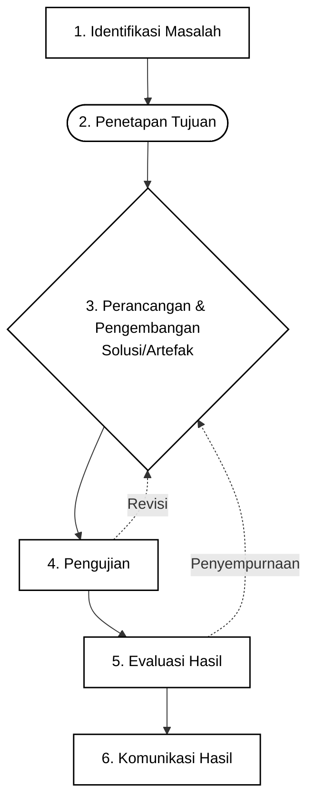

BAB IV
METODOLOGI PENELITIAN

Penelitian ini menggunakan Metode Research and Development (R&D) yang mengadaptasi model yang dikembangkan oleh Ellis dan Levy (2010). Metode ini dipilih karena strukturnya sistematis dan relevan untuk merancang, mengembangkan, serta mengevaluasi solusi berbasis teknologi informasi seperti Sistem Informasi Praktikum berbasis Progressive Web Application (PWA). Dalam pelaksanaan skripsi ini, sistem dikembangkan untuk mendukung pengelolaan praktikum yang mencakup pengelolaan jadwal, materi, penugasan, logbook, penilaian, pengumuman, inventaris, peminjaman alat, serta dukungan akses offline dan sinkronisasi data. Untuk memastikan produk yang dihasilkan sesuai dengan kebutuhan pengguna, tahap perancangan, pengembangan, dan pengujian dilakukan dengan pendekatan model prototipe iteratif serta menerapkan konsep Role-Based Access Control (RBAC) dalam pengelolaan hak akses pengguna.

Model R&D Ellis dan Levy (2010) yang diadaptasi dalam penelitian ini terdiri atas enam tahapan utama, yaitu identifikasi masalah, penetapan tujuan, perancangan dan pengembangan solusi, pengujian, evaluasi hasil, dan komunikasi hasil. Alur tahapan penelitian ini disajikan pada gambar alur metode penelitian berikut.

Gambar 1. Diagram Alir Penelitian Metode R&D Ellis dan Levy

4.1 Studi Literatur
Studi literatur dilakukan secara komprehensif untuk mendalami berbagai teori, konsep, dan penelitian terdahulu yang relevan dengan pengembangan sistem informasi, teknologi Progressive Web Application (PWA), metode Research and Development khususnya model Ellis dan Levy (2010), pendekatan User-Centered Design (UCD), konsep Role-Based Access Control (RBAC), serta teknologi yang digunakan dalam pengembangan sistem. Literatur diperoleh dari sumber-sumber kredibel seperti jurnal ilmiah nasional dan internasional, buku akademik, prosiding konferensi, dan dokumentasi teknis resmi.

Beberapa topik utama yang dikaji dalam studi literatur ini meliputi:
1) pengembangan sistem informasi berbasis PWA di lingkungan pendidikan, khususnya pendidikan vokasi;
2) implementasi User-Centered Design (UCD) dalam siklus pengembangan aplikasi berbasis web progresif;
3) model-model R&D untuk pengembangan produk teknologi dan justifikasi pemilihan model Ellis dan Levy (2010);
4) konsep dan implementasi Role-Based Access Control (RBAC) dalam sistem informasi multi-pengguna;
5) teknologi frontend dan backend yang digunakan dalam pengembangan sistem, termasuk React, TypeScript, Vite, Supabase, dan Tailwind CSS.

4.2 Identifikasi Masalah
Pada tahap ini, peneliti melakukan analisis mendalam terhadap masalah yang terjadi dalam pengelolaan praktikum. Identifikasi masalah dilakukan melalui beberapa teknik pengumpulan data, yaitu:
1) observasi langsung terhadap proses pengelolaan praktikum yang berjalan;
2) wawancara dengan pihak-pihak yang terlibat dalam kegiatan praktikum, khususnya dosen, mahasiswa, dan laboran;
3) studi dokumen terhadap dokumen pelaksanaan praktikum seperti jadwal, form peminjaman alat, logbook, dan format penilaian.

Berdasarkan proses tersebut, masalah utama yang diidentifikasi meliputi:
1) pengelolaan jadwal dan penggunaan sarana praktikum yang masih belum terintegrasi secara optimal, sehingga berpotensi menimbulkan kesalahan pencatatan dan tumpang tindih penggunaan;
2) distribusi materi pembelajaran dan penugasan praktikum yang belum sepenuhnya terpusat dan terdokumentasi dengan baik;
3) proses pencatatan logbook dan penilaian praktikum yang kurang efisien serta rentan terhadap kehilangan data;
4) keterbatasan media informasi terpusat yang dapat digunakan untuk menyampaikan pengumuman, perubahan jadwal, atau informasi penting lainnya;
5) belum optimalnya dukungan sistem terhadap kondisi penggunaan dengan koneksi internet yang tidak stabil.

4.3 Penetapan Tujuan
Berdasarkan hasil identifikasi masalah, tujuan penelitian ini adalah merancang dan mengembangkan Sistem Informasi Praktikum berbasis PWA yang mampu membantu pengelolaan praktikum secara lebih terintegrasi, efektif, dan mudah diakses. Tujuan spesifik yang ingin dicapai melalui pengembangan sistem ini adalah:
1) mendukung pengelolaan jadwal praktikum dan penggunaan sarana secara lebih terintegrasi dan efisien;
2) menyediakan platform untuk distribusi materi pembelajaran dan pengelolaan tugas praktikum yang dapat diakses secara terpusat oleh dosen dan mahasiswa;
3) mengimplementasikan fitur logbook digital untuk pencatatan kegiatan praktikum mahasiswa serta sistem penilaian yang terstruktur;
4) mengimplementasikan Role-Based Access Control (RBAC) untuk mengatur hak akses pengguna sesuai peran masing-masing, yaitu admin, dosen, mahasiswa, dan laboran;
5) mendukung penggunaan offline untuk fungsi-fungsi penting serta menyediakan karakteristik PWA seperti instalasi aplikasi dan sinkronisasi data;
6) menyediakan fitur pengumuman dan notifikasi yang mendukung komunikasi informasi praktikum.

4.4 Perancangan dan Pengembangan
Tahap ini merupakan inti proses penciptaan artefak penelitian berupa sistem informasi praktikum berbasis PWA. Proses perancangan dan pengembangan dilakukan dengan pendekatan berbasis peran dan mengikuti siklus model prototipe secara iteratif agar sistem yang dikembangkan relevan dengan kebutuhan pengguna. Sebelum merinci arsitektur sistem, diagram konteks digunakan untuk memperlihatkan batas sistem dan interaksinya dengan pengguna eksternal. Keberadaan diagram konteks pada bab metodologi tetap dipertahankan karena menjadi jembatan konseptual menuju pembahasan DFD Level 1 pada bab hasil dan pembahasan, sehingga struktur pemodelan sistem tidak muncul secara tiba-tiba tanpa konteks awal.

Selain itu, use case diagram juga dipertahankan sebagai bagian dari analisis awal untuk menunjukkan hubungan antara aktor utama dengan layanan inti sistem. Dalam konteks metodologi, use case diagram tidak diposisikan sebagai hasil implementasi, melainkan sebagai alat bantu analisis kebutuhan fungsional dan identifikasi interaksi pengguna sebelum pembahasan perancangan yang lebih rinci pada bab hasil dan pembahasan.

[Tempat Gambar: Diagram Konteks Sistem / DFD Level 0]
Gambar 2. Diagram Konteks Sistem DFD Level 0

[Tempat Gambar: Use Case Diagram]
Gambar 3. Use Case Diagram

4.4.1 Desain Arsitektur Sistem
Sistem dirancang dengan arsitektur modern yang terdiri atas frontend, backend, dan basis data, dengan PWA sebagai target platform pada sisi klien. Arsitektur sistem informasi praktikum yang dikembangkan ditunjukkan melalui diagram arsitektur sistem PWA yang memuat komponen frontend, backend, layanan Supabase, dan basis data PostgreSQL.

[Tempat Gambar: Diagram Arsitektur Sistem PWA]
Gambar 4. Diagram Arsitektur Sistem PWA

Desain arsitektur sistem meliputi beberapa komponen utama sebagai berikut:
1) Frontend (client-side)
Antarmuka pengguna dan pengalaman pengguna dikembangkan menggunakan React untuk membangun aplikasi yang interaktif dan responsif. Proses bundling dan development server didukung oleh Vite, sedangkan TypeScript digunakan untuk menjaga struktur kode agar lebih teratur dan meminimalkan kesalahan. Desain antarmuka memanfaatkan Tailwind CSS untuk mendukung pengembangan tampilan yang efisien dan responsif.

2) Backend dan basis data (server-side)
Sisi server dan pengelolaan data dibangun menggunakan Supabase sebagai backend-as-a-service. Komponen yang dimanfaatkan meliputi:
a. Supabase Database, untuk menyimpan data terstruktur seperti data pengguna, jadwal, materi, kuis, logbook, nilai, inventaris, peminjaman, pengumuman, dan data pendukung lainnya;
b. Supabase Auth, untuk menangani autentikasi, manajemen sesi, dan otorisasi pengguna sebagai bagian dari implementasi RBAC;
c. Supabase Storage, untuk menyimpan file materi, dokumen, dan berkas pendukung;
d. Supabase Realtime, pada bagian yang memerlukan pembaruan data secara langsung.

3) Penerapan PWA
Karakteristik PWA diterapkan dengan memanfaatkan service worker untuk caching dan dukungan offline, web app manifest untuk instalasi aplikasi, indikator jaringan, serta mekanisme penyimpanan lokal dan sinkronisasi data agar sistem tetap dapat digunakan pada kondisi koneksi yang tidak stabil.

4.4.2 Pengembangan Prototipe Iteratif
Pengembangan sistem mengikuti siklus model prototipe yang bersifat iteratif. Proses ini tidak berlangsung secara linear, melainkan berulang, di mana versi awal sistem dibangun berdasarkan desain yang telah ditetapkan, kemudian diuji, dievaluasi, dan disempurnakan pada iterasi berikutnya. Siklus pengembangan prototipe ini digambarkan pada diagram detail siklus iteratif dalam R&D berikut.

[Tempat Gambar: Diagram Detail Siklus Iteratif dalam R&D]
Gambar 5. Diagram Detail Siklus Iteratif dalam R&D

Dalam pelaksanaannya, prototipe dikembangkan mulai dari fitur-fitur inti, kemudian diperluas sesuai kebutuhan dan hasil evaluasi selama proses pengembangan. Umpan balik yang diperoleh dari pengguna dan hasil pengujian digunakan sebagai dasar revisi untuk penyempurnaan sistem. Dengan demikian, siklus desain, pembangunan prototipe, pengujian, evaluasi, dan revisi dilakukan berulang hingga sistem dianggap cukup matang, fungsional, dan sesuai dengan kebutuhan penelitian.

4.5 Pengujian
Tahap pengujian tidak hanya dilakukan pada akhir pengembangan, tetapi terintegrasi dalam proses pengembangan prototipe dan juga dilakukan pada artefak final yang telah stabil. Pengujian bertujuan untuk menilai fungsionalitas sistem, kesesuaian sistem dengan kebutuhan pengguna, kualitas teknis implementasi, serta dukungan terhadap karakteristik PWA yang menjadi salah satu ciri utama sistem.

Secara umum, pengujian dalam penelitian ini mencakup pengujian fungsional, pengujian logika internal program, serta uji coba penggunaan pada skenario yang relevan dengan proses praktikum. Bukti hasil pengujian tersebut selanjutnya disajikan pada bab hasil penelitian.

4.5.1 Pengujian Black Box
Pengujian black box dilakukan untuk memeriksa apakah fungsi-fungsi utama sistem berjalan sesuai dengan kebutuhan pengguna berdasarkan masukan dan keluaran yang diharapkan, tanpa meninjau struktur kode secara langsung. Pengujian ini diterapkan pada fitur-fitur seperti autentikasi, pengelolaan jadwal, distribusi materi, pengelolaan kuis, logbook, penilaian, inventaris, peminjaman, pengumuman, notifikasi, dan dukungan fitur PWA.

Pengujian black box penting karena memberikan bukti bahwa sistem dapat berfungsi dengan benar dari sudut pandang pengguna. Dalam skripsi ini, hasil pengujian black box disajikan pada bab hasil melalui tabel skenario pengujian dan rekapitulasi hasil uji fungsional.

4.5.2 Pengujian White Box / Unit Test
Selain pengujian black box, penelitian ini juga memanfaatkan pengujian white box dalam bentuk unit test untuk memeriksa logika internal program pada level fungsi, modul, atau komponen tertentu. Pengujian ini dilakukan untuk memastikan bahwa bagian-bagian inti sistem berjalan secara benar, stabil, dan konsisten sesuai logika implementasinya.

Penggunaan unit test mendukung kualitas teknis artefak karena tidak hanya menilai hasil keluaran sistem, tetapi juga memverifikasi keandalan proses internal yang menopang fungsionalitas tersebut. Hasil pelaksanaan pengujian ini dibuktikan pada bab hasil melalui uraian struktur file pengujian, cakupan modul yang diuji, dan ringkasan hasil pengujian white box.

4.5.3 Uji Coba Iteratif Pengguna dan Dukungan Offline
Selama proses pengembangan prototipe, sistem juga melalui uji coba terbatas yang melibatkan pengguna pada skenario penggunaan yang relevan. Uji coba ini dilakukan untuk memperoleh umpan balik mengenai kenyamanan penggunaan, kejelasan alur interaksi, serta kesesuaian fitur dengan kebutuhan praktikum. Pada tahap ini, peneliti memperhatikan interaksi pengguna terhadap fitur-fitur yang berkaitan dengan dukungan offline, sinkronisasi data, dan perilaku sistem ketika kondisi jaringan berubah.

Subbab ini tidak dimaksudkan sebagai metode pengujian yang berdiri sendiri di luar pengujian black box dan white box, melainkan sebagai penegasan bahwa pengembangan sistem memang dilakukan secara iteratif dan mempertimbangkan umpan balik penggunaan selama proses penyempurnaan artefak. Pada hasil penelitian, dukungan offline dan sinkronisasi tersebut ditunjukkan kembali melalui pembahasan implementasi fitur PWA, pengujian black box pada fitur terkait, dan pengujian white box pada modul offline serta sinkronisasi.

4.6 Evaluasi Hasil
Setelah proses pengujian dan pengembangan produk mencapai bentuk final, evaluasi hasil dilakukan untuk menilai efektivitas sistem secara keseluruhan berdasarkan tujuan penelitian dan kesesuaiannya terhadap masalah yang telah diidentifikasi sebelumnya. Evaluasi hasil dalam penelitian ini mencakup beberapa aspek utama sebagai berikut:
1) Kesesuaian fungsional sistem dengan kebutuhan pengguna, yaitu sejauh mana sistem mampu memenuhi kebutuhan pengelolaan praktikum seperti jadwal, materi, tugas, logbook, penilaian, inventaris, peminjaman, pengumuman, dan dukungan akses offline;
2) Kemudahan penggunaan (usability), yaitu menilai sejauh mana sistem mudah dipahami dan digunakan oleh pengguna;
3) Efisiensi proses, yaitu menilai potensi perbaikan proses pengelolaan praktikum dibandingkan cara sebelumnya;
4) Fungsionalitas RBAC, yaitu menilai keberhasilan sistem dalam mengatur hak akses berdasarkan peran;
5) Kinerja fitur PWA, yaitu menilai karakteristik PWA seperti instalasi aplikasi, akses offline, indikator jaringan, antrean offline, dan sinkronisasi data.

4.6.1 Evaluasi Fungsional Sistem
Evaluasi fungsional dilakukan dengan menafsirkan hasil pengujian terhadap fitur-fitur utama yang telah diimplementasikan. Pada tahap ini, peneliti menilai keterpaduan modul, kecukupan fungsi untuk mendukung kegiatan praktikum, kesesuaian perilaku sistem dengan kebutuhan operasional pengguna, serta keterlaksanaan layanan berbasis peran dan dukungan offline yang menjadi karakteristik penting sistem.

Melalui evaluasi fungsional, peneliti dapat menegaskan apakah artefak yang dihasilkan telah benar-benar memenuhi fungsi akademik dan operasional yang menjadi tujuan penelitian.

4.6.2 Evaluasi Usability Menggunakan System Usability Scale (SUS)
Evaluasi usability dilakukan menggunakan instrumen System Usability Scale (SUS). Instrumen ini digunakan untuk memperoleh ukuran kuantitatif mengenai persepsi pengguna terhadap kemudahan penggunaan sistem. SUS dipilih karena sederhana, efisien, dan banyak digunakan dalam evaluasi sistem informasi.

Penilaian dilakukan melalui sepuluh pernyataan menggunakan skala Likert. Untuk pernyataan bernomor ganjil, skor jawaban dikurangi 1, sedangkan untuk pernyataan bernomor genap, nilai 5 dikurangi skor jawaban. Seluruh hasil penyesuaian kemudian dijumlahkan dan dikalikan 2,5 sehingga diperoleh skor akhir dalam rentang 0 sampai 100. Skor tersebut digunakan untuk menginterpretasikan tingkat usability dan keberterimaan sistem.

4.7 Komunikasi Hasil
Setelah evaluasi hasil dilakukan, hasil penelitian dikomunikasikan melalui beberapa bentuk luaran, yaitu:
1) laporan penelitian atau skripsi sebagai dokumentasi ilmiah formal yang memuat seluruh proses dan hasil penelitian;
2) dokumentasi produk, yang mencakup panduan penggunaan dan dokumentasi teknis sistem;
3) presentasi hasil kepada pihak-pihak terkait untuk menjelaskan temuan penelitian dan mendemonstrasikan artefak yang dikembangkan;
4) publikasi ilmiah, apabila hasil penelitian dipandang layak untuk disusun menjadi artikel ilmiah.

Tahap komunikasi hasil ini penting agar kontribusi penelitian tidak berhenti pada pengembangan produk, tetapi juga dapat dipahami, ditelaah, dan dipertanggungjawabkan secara akademik.

4.8 Jadwal Penelitian
Jadwal penelitian disusun sebagai pedoman pelaksanaan seluruh tahapan penelitian mulai dari studi literatur, identifikasi masalah, penetapan tujuan, perancangan dan pengembangan, pengujian, evaluasi hasil, hingga komunikasi hasil dan penyusunan laporan. Penyusunan jadwal penelitian diperlukan agar pelaksanaan kegiatan penelitian berlangsung secara sistematis, terarah, dan sesuai target waktu.

4.9 Teknik Analisis Data
Teknik analisis data dalam penelitian ini menggunakan pendekatan deskriptif kualitatif dan deskriptif kuantitatif. Analisis deskriptif kualitatif digunakan untuk menafsirkan data hasil observasi, wawancara, studi dokumen, serta umpan balik pengguna selama proses pengembangan. Analisis deskriptif kuantitatif digunakan untuk mengolah data hasil pengujian dan evaluasi usability, termasuk perhitungan skor SUS.

Penggabungan dua pendekatan tersebut dilakukan agar hasil penelitian tidak hanya kuat secara deskriptif, tetapi juga memiliki dukungan pengukuran yang terstruktur.

4.10 Instrumen Penelitian
Instrumen yang digunakan dalam penelitian ini meliputi pedoman observasi, pedoman wawancara, lembar studi dokumen, skenario pengujian black box, unit test sebagai representasi pengujian white box, serta kuesioner System Usability Scale (SUS). Instrumen-instrumen tersebut digunakan sesuai dengan kebutuhan pada setiap tahap penelitian.

4.11 Kriteria Keberhasilan Penelitian
Penelitian ini dinyatakan berhasil apabila memenuhi beberapa indikator, yaitu:
1) sistem informasi praktikum berbasis PWA berhasil dikembangkan dan dapat dioperasikan;
2) fitur-fitur utama sistem mampu mendukung proses akademik dan operasional praktikum secara terintegrasi;
3) hasil pengujian menunjukkan bahwa fungsi sistem berjalan sesuai kebutuhan;
4) logika program pada unit-unit penting sistem menunjukkan hasil yang konsisten melalui unit test;
5) fitur PWA seperti cache, dukungan offline, antrean sinkronisasi, dan instalasi aplikasi berjalan sesuai yang direncanakan;
6) hasil evaluasi usability menunjukkan bahwa sistem memiliki tingkat kemudahan penggunaan yang dapat diterima oleh pengguna.

Dengan demikian, keberhasilan penelitian tidak hanya dinilai dari terciptanya produk, tetapi juga dari tingkat fungsi, kualitas teknis, keberterimaan, dan relevansi produk terhadap kebutuhan pengguna.
