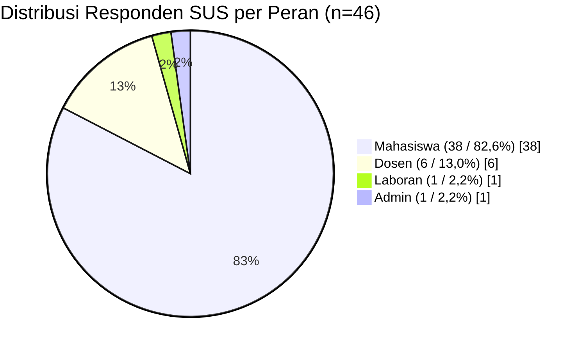

BAB V
HASIL DAN PEMBAHASAN
5.1 Hasil Perancangan Sistem
Tahap perancangan sistem merupakan jembatan kritis yang menerjemahkan elisitasi kebutuhan pengguna menjadi cetak biru teknis yang siap diimplementasikan ke dalam bentuk perangkat lunak. Pada penelitian ini, hasil perancangan sistem disajikan sebagai rancangan final yang telah diselaraskan dengan implementasi aktual aplikasi. Dengan demikian, bagian ini tidak lagi diposisikan sebagai rancangan hipotetis, melainkan sebagai representasi struktur proses dan struktur data yang benar-benar menopang aplikasi sistem informasi praktikum berbasis Progressive Web App (PWA) yang dikembangkan.
Penyusunan hasil perancangan pada bab ini didasarkan pada prinsip dekomposisi hierarkis, keseimbangan aliran data (balancing), dan konsistensi notasi dalam pendekatan structured analysis yang dipopulerkan oleh Yourdon dan DeMarco. Melalui pendekatan ini, rancangan sistem tidak hanya menggambarkan fungsi-fungsi utama aplikasi, tetapi juga menunjukkan bagaimana data bergerak antarpengguna, antarproses, dan antarpenyimpanan data secara logis dan terstruktur.
Secara umum, hasil perancangan sistem dalam penelitian ini disusun melalui tiga lapisan utama, yaitu perancangan proses menggunakan Data Flow Diagram (DFD), perancangan struktur data menggunakan Entity Relationship Diagram (ERD), dan implementasi teknis basis data dalam bentuk skema tabel yang digunakan pada aplikasi. Ketiga lapisan ini saling berhubungan. DFD menjelaskan bagaimana data bergerak antaraktor dan antarmodul, ERD menunjukkan bagaimana data tersebut saling berelasi pada tingkat konseptual, sedangkan skema basis data memperlihatkan bagaimana relasi tersebut diwujudkan ke dalam tabel aktual pada aplikasi.
Penyajian hasil perancangan pada bab ini juga dimaksudkan untuk menegaskan bahwa sistem yang dibangun tidak hanya berfokus pada tampilan antarmuka. Sistem ini dirancang sebagai ekosistem informasi yang mengintegrasikan kebutuhan akademik praktikum, kebutuhan operasional laboratorium, kontrol akses berbasis peran, serta mekanisme sinkronisasi offline untuk menjaga kesinambungan layanan ketika koneksi internet tidak stabil. Oleh karena itu, pembahasan hasil perancangan menjadi landasan penting untuk memahami hasil implementasi pada subbab berikutnya.
5.1.1 DFD Level 1
Berdasarkan hasil perancangan yang telah diselaraskan dengan implementasi aplikasi aktif, DFD Level 1 merupakan dekomposisi langsung dari DFD Level 0 (Diagram Konteks). Pada tingkat ini, sistem secara utuh diuraikan menjadi empat proses utama yang merepresentasikan pilar-pilar fungsi inti dari aplikasi praktikum berbasis PWA. Penyajian ini dipertahankan untuk mematuhi kaidah dekomposisi hierarkis, di mana DFD Level 1 tidak diarahkan untuk menampilkan rincian halaman atau antarmuka secara terpisah, melainkan berfokus pada arsitektur pemrosesan data dalam skala besar.
Penggunaan pendekatan Yourdon dan DeMarco dipertahankan pada tahap ini karena pendekatan tersebut memberi kejelasan dalam memisahkan entitas eksternal, proses, aliran data, dan penyimpanan data. Pada tingkat ini, empat proses utama tersebut adalah manajemen akun dan akses, manajemen akademik praktikum, operasional dan layanan laboratorium, serta layanan PWA dan sinkronisasi offline. Keempat proses ini berinteraksi dengan empat entitas utama pengguna, yaitu mahasiswa, dosen, laboran, dan admin, serta dengan media penyimpanan data dan layanan autentikasi eksternal.
[Tempat Gambar: Data Flow Diagram Level 1 Sistem Praktikum PWA] Gambar 6. Data Flow Diagram Level 1 Sistem Praktikum PWA
Dari sudut pandang hasil penelitian, struktur empat proses yang terlihat pada Gambar 6 menunjukkan bahwa aplikasi tidak dibangun sebagai kumpulan modul yang berdiri sendiri, melainkan sebagai ekosistem informasi yang terintegrasi. Sistem ini menghubungkan kebutuhan akademik praktikum, seperti jadwal, materi, kuis, kehadiran, dan penilaian, dengan kebutuhan operasional laboratorium, seperti logbook, inventaris, peminjaman alat, pengumuman, dan notifikasi. Di atas kedua ranah tersebut, sistem juga menambahkan lapisan PWA yang menjaga keberlanjutan layanan melalui cache, antrean operasi, sinkronisasi ulang, serta penanganan konflik ketika koneksi internet berubah-ubah.
Rincian dari proses-proses utama beserta keterlibatan entitas di dalamnya disajikan secara ringkas pada Tabel 5.1.
Tabel 5.1 Ringkasan Proses Utama pada DFD Level 1
ID	Nama Proses	Dekomposisi Selanjutnya	Entitas Terlibat
1.0	Manajemen Akun dan Akses	1.1 Autentikasi, 1.2 Kelola Pengguna	Admin, Dosen, Laboran, Mahasiswa
2.0	Manajemen Akademik Praktikum	2.1 Kelola Jadwal, 2.2 Kelola Kuis dan Bank Soal, 2.3 Kelola Materi, 2.4 Kelola Kelas, Mata Kuliah, dan Assignment, 2.5 Kehadiran dan Penilaian	Admin, Dosen, Laboran, Mahasiswa
3.0	Operasional dan Layanan Laboratorium	3.1 Logbook Digital, 3.2 Peminjaman Alat dan Inventaris, 3.3 Pengumuman dan Notifikasi	Admin, Dosen, Laboran, Mahasiswa
4.0	Layanan PWA dan Sinkronisasi Offline	4.1 Sinkronisasi Offline PWA	Admin, Dosen, Laboran, Mahasiswa, Supabase/Auth Service
Secara lebih mendalam, logika dan luaran (output) dari setiap proses utama dapat diuraikan sebagai berikut:
a) Proses 1.0 — Manajemen Akun dan Akses
Proses ini difungsikan sebagai lapis pertahanan pertama sistem. Sistem memverifikasi kredensial setiap entitas melalui layanan autentikasi eksternal Supabase/Auth Service. Setelah pengguna terautentikasi, sistem mengambil data akun, peran, dan sesi dari basis data utama untuk menerapkan kontrol akses berbasis peran. Dengan mekanisme tersebut, setiap pengguna hanya memperoleh antarmuka dan data yang relevan dengan kewenangannya.

b) Proses 2.0 — Manajemen Akademik Praktikum
Proses ini merupakan inti layanan pembelajaran praktikum. Ruang lingkupnya mencakup pengelolaan jadwal, kuis dan bank soal, materi, kelas, mata kuliah, assignment, kehadiran, serta penilaian. Dalam alurnya, sistem menerima rancangan jadwal dari dosen, memanfaatkan data master akademik yang dikelola admin, memvalidasi keterkaitannya dengan laboratorium, menyalurkan materi melalui penyimpanan berkas, mengatur pelaksanaan kuis, dan bermuara pada pencatatan presensi serta penilaian.

c) Proses 3.0 — Operasional dan Layanan Laboratorium
Jika Proses 2.0 berfokus pada pembelajaran praktikum, Proses 3.0 berfokus pada layanan operasional laboratorium. Proses ini mendigitalisasi logbook manual menjadi catatan elektronik yang dapat ditelusuri, mengelola inventaris dan peminjaman alat secara terkendali, serta mendukung penyebaran pengumuman dan notifikasi sebagai mekanisme komunikasi antarmodul. Oleh karena itu, Proses 3.0 tidak hanya berkaitan dengan sumber daya fisik laboratorium, tetapi juga dengan koordinasi informasi operasional yang menyertai kegiatan praktikum.

d) Proses 4.0 — Layanan PWA dan Sinkronisasi Offline
Proses ini merupakan salah satu kebaruan utama dari sistem. Bekerja di latar belakang, sistem mendeteksi status jaringan, menyimpan data penting ke cache lokal, menampung operasi tulis ke dalam antrean offline ketika koneksi terputus, lalu menjalankan sinkronisasi, percobaan ulang, dan penanganan konflik secara asinkron setelah koneksi dipulihkan.
Untuk menjamin reliabilitas, sistem mendayagunakan empat jenis penyimpanan data (data store) dengan fungsi spesifik:
•	D1 (Database Utama / Supabase): Bertindak sebagai single source of truth. Seluruh data akun, akademik, operasional, dan konflik sinkronisasi bermuara di sini.
•	D2 (Cache Lokal / IndexedDB): Media penyimpanan internal pada browser klien yang berfungsi menyimpan data penting untuk akses cepat dan dukungan offline.
•	D3 (Offline Queue): Antrean operasi lokal untuk menampung perubahan data ketika perangkat sedang offline sebelum dikirim kembali ke server.
•	D4 (Storage File): Tempat penyimpanan berkas, terutama file materi dan dokumen pendukung pembelajaran.
Aliran data komprehensif pada Level 1 dijabarkan lebih rinci pada Tabel 5.2.
Tabel 5.2 Alur Data DFD Level 1
Proses	Arah Alur	Keterangan Alur Data
1.0	Masuk (→)	Kredensial login dan permintaan akses dari mahasiswa, dosen, dan laboran; data akun baru, perubahan status akun, serta penetapan peran dari admin.
1.0	Keluar (←)	Status autentikasi, hak akses, informasi profil akun, dan sesi aktif untuk setiap pengguna.
1.0	2 Arah (↔)	Validasi data akun, peran, dan sesi dengan D1; permintaan serta pengesahan autentikasi dengan Supabase/Auth Service.
2.0	Masuk (→)	Permintaan akses data pembelajaran dari mahasiswa; input jadwal, materi, kuis, assignment, dan nilai dari dosen; informasi ketersediaan laboratorium dari laboran; serta data master kelas dan mata kuliah dari admin.
2.0	Keluar (←)	Informasi jadwal praktikum, materi, kuis, assignment, hasil presensi, dan rekap penilaian kepada pengguna terkait.
2.0	2 Arah (↔)	Perekaman transaksi akademik dengan D1; penyimpanan dan pembacaan cache pembelajaran dengan D2; penyimpanan serta pengambilan file materi melalui D4.
3.0	Masuk (→)	Entri logbook dari mahasiswa; permohonan peminjaman alat dari dosen; pembaruan data inventaris dari laboran; serta penyusunan pengumuman dari admin.
3.0	Keluar (←)	Umpan balik logbook, status peminjaman, informasi inventaris, pengumuman, dan notifikasi operasional kepada pengguna terkait.
3.0	2 Arah (↔)	Penyimpanan dan pembaruan data logbook, inventaris, peminjaman, serta pengumuman dengan D1; pemanggilan cache informasi tertentu dengan D2.
4.0	Masuk (→)	Pemicu sinkronisasi manual, perubahan status jaringan, dan data perubahan lokal dari seluruh entitas pengguna.
4.0	Keluar (←)	Indikator jaringan, progres sinkronisasi, status percobaan ulang, dan informasi hasil penanganan konflik kepada pengguna.
4.0	2 Arah (↔)	Sinkronisasi data dengan D1; penyegaran cache lokal dengan D2; pembacaan dan pengosongan antrean operasi dengan D3; serta autentikasi koneksi ulang dengan Supabase/Auth Service.
5.1.2 DFD Level 2
DFD Level 2 pada penelitian ini merupakan hasil dekomposisi lanjutan dari empat proses utama pada DFD Level 1. Pada tingkat ini, pembahasan tidak lagi berhenti pada identifikasi fungsi besar sistem, tetapi menelusuri bagaimana data bergerak di dalam setiap proses, siapa aktor yang terlibat, data store apa yang digunakan, serta bagaimana keluaran dari satu proses menjadi masukan bagi proses yang lain. Narasi pada bagian ini diselaraskan dengan struktur pada dokumen perancangan dan diagram yang telah diperbarui, sehingga setiap proses Level 2 dibahas dalam diagram tersendiri dengan fokus alur yang lebih tajam, namun tetap menunjukkan keterhubungan antarmodul secara menyeluruh.
Pemecahan menjadi sebelas diagram mandiri dipilih agar keterbacaan tetap terjaga dan pembahasan lebih sesuai dengan kaidah penyajian ilmiah. Walaupun dipisahkan, seluruh diagram tersebut tidak berdiri sendiri. Proses 1.1 dan 1.2 menjadi fondasi identitas serta hak akses; proses 2.1 hingga 2.5 membentuk rantai utama kegiatan akademik; proses 3.1 hingga 3.3 mendukung operasional laboratorium dan komunikasi; sedangkan proses 4.1 menjadi lapisan pengikat yang menjaga kontinuitas layanan ketika koneksi internet tidak stabil. Dengan demikian, DFD Level 2 pada sistem ini harus dipahami sebagai jaringan proses yang saling berhubungan, bukan sebagai kumpulan fungsi yang terpisah.
Untuk menjaga konsistensi metodologis bahwa model pada penelitian ini berhenti sampai Level 2, rincian di dalam setiap diagram tidak lagi dinyatakan sebagai nomor proses bertingkat seperti 1.1.1 atau 2.3.1. Sebagai gantinya, rincian internal dibaca sebagai aktivitas lokal dalam satu diagram Level 2 dan diberi kode sederhana seperti A1, A2, A3, dan seterusnya. Kode tersebut tidak menunjukkan dekomposisi ke Level 3, melainkan hanya berfungsi sebagai penanda urutan aktivitas agar pembacaan diagram tetap rinci, jelas, dan mudah dipahami oleh penguji maupun pembaca.
Ringkasan dekomposisi proses dari DFD Level 1 ke DFD Level 2 disajikan pada Tabel 5.3.
Tabel 5.3 Dekomposisi Proses DFD Level 1 ke DFD Level 2
Proses Level 1	Dekomposisi Level 2
1.0 Manajemen Akun dan Akses	1.1 Autentikasi, 1.2 Kelola Pengguna
2.0 Manajemen Akademik Praktikum	2.1 Kelola Jadwal, 2.2 Kelola Kuis dan Bank Soal, 2.3 Kelola Materi, 2.4 Kelola Kelas, Mata Kuliah, dan Assignment, 2.5 Kehadiran dan Penilaian
3.0 Operasional dan Layanan Laboratorium	3.1 Logbook Digital, 3.2 Peminjaman Alat dan Inventaris, 3.3 Pengumuman dan Notifikasi
4.0 Layanan PWA dan Sinkronisasi Offline	4.1 Sinkronisasi Offline PWA
Untuk memperjelas urutan pembahasan, rincian diagram DFD Level 2 yang digunakan dalam penelitian ini disajikan pada Tabel 5.4.
Tabel 5.4 Rincian Diagram DFD Level 2
No. Diagram	Proses Level 2	Asal Dekomposisi	Fokus Alur
Level 2.1	1.1 Autentikasi	1.0 Manajemen Akun dan Akses	login, peran, sesi, logout
Level 2.2	1.2 Kelola Pengguna	1.0 Manajemen Akun dan Akses	akun, peran, status pengguna
Level 2.3	2.1 Kelola Jadwal	2.0 Manajemen Akademik Praktikum	usulan, validasi, persetujuan, publikasi jadwal
Level 2.4	2.2 Kelola Kuis dan Bank Soal	2.0 Manajemen Akademik Praktikum	kuis, bank soal, pengerjaan, hasil
Level 2.5	2.3 Kelola Materi	2.0 Manajemen Akademik Praktikum	unggah, metadata, akses materi, cache
Level 2.6	2.4 Kelola Kelas, Mata Kuliah, dan Assignment	2.0 Manajemen Akademik Praktikum	data master akademik dan relasi
Level 2.7	2.5 Kehadiran dan Penilaian	2.0 Manajemen Akademik Praktikum	presensi, nilai, rekap hasil
Level 2.8	3.1 Logbook Digital	3.0 Operasional dan Layanan Laboratorium	entri logbook, review, umpan balik
Level 2.9	3.2 Peminjaman Alat dan Inventaris	3.0 Operasional dan Layanan Laboratorium	inventaris, peminjaman, verifikasi, laporan
Level 2.10	3.3 Pengumuman dan Notifikasi	3.0 Operasional dan Layanan Laboratorium	publikasi informasi dan distribusi berdasarkan peran
Level 2.11	4.1 Sinkronisasi Offline PWA	4.0 Layanan PWA dan Sinkronisasi Offline	cache, antrean, sinkronisasi, konflik
Berdasarkan rincian tersebut, jumlah diagram DFD Level 2 yang digunakan dalam penelitian ini adalah sebelas diagram. Jumlah tersebut menunjukkan bahwa setiap proses turunan dibahas secara proporsional tanpa menimbulkan kepadatan visual berlebihan dalam satu diagram. Namun, yang lebih penting dari jumlah diagram tersebut adalah keterhubungan logika proses yang dibentuknya. Alur kerja sistem selalu dimulai dari validasi identitas pengguna, dilanjutkan dengan pemanfaatan data master akademik, kemudian bergerak ke aktivitas pembelajaran, operasional laboratorium, serta ditopang oleh mekanisme sinkronisasi yang menjaga kesinambungan data. Oleh karena itu, pembahasan DFD Level 2 pada bagian ini tidak hanya mendeskripsikan isi diagram, tetapi juga menafsirkan makna hubungan data antardiagram sebagai cerminan proses bisnis pada aplikasi yang dibangun.
1. Diagram Level 2.1 — Proses 1.1 Autentikasi
Diagram Level 2.1 menjelaskan alur autentikasi pengguna, dimulai dari input kredensial, verifikasi melalui layanan autentikasi, pengambilan data peran, pembentukan sesi login, hingga pengalihan pengguna ke dashboard sesuai hak aksesnya. Pada tahap ini, entitas eksternal berupa pengguna mengirimkan data email dan kata sandi ke sistem. Sistem kemudian meneruskan proses verifikasi ke Supabase/Auth Service, lalu mengambil data identitas dan peran dari basis data utama untuk memastikan bahwa pengguna yang berhasil masuk memang memiliki hak akses yang sah. Keluaran dari proses ini tidak berhenti pada status login, tetapi juga menghasilkan informasi otorisasi yang menentukan menu, halaman, dan data apa saja yang dapat diakses pada proses-proses berikutnya. Secara substantif, diagram ini menunjukkan bahwa autentikasi bukan hanya proses keamanan, melainkan mekanisme awal yang mengendalikan seluruh alur interaksi data pada sistem.
Dari sudut pandang pembahasan hasil, proses 1.1 membuktikan bahwa sistem telah menerapkan pemisahan yang jelas antara verifikasi identitas dan pemberian hak akses. Verifikasi identitas dilakukan melalui layanan autentikasi, sedangkan pengambilan peran dilakukan melalui basis data aplikasi. Pola ini penting karena mencegah penyederhanaan autentikasi menjadi sekadar pemeriksaan login. Dalam implementasinya, keberhasilan proses 1.1 akan menentukan apakah pengguna diarahkan ke modul admin, dosen, laboran, atau mahasiswa. Dengan demikian, diagram ini berkaitan langsung dengan seluruh proses Level 2 lainnya karena setiap aktivitas pada jadwal, materi, kuis, logbook, inventaris, dan sinkronisasi hanya dapat dijalankan setelah proses autentikasi berhasil.

[Tempat Gambar: Diagram Level 2.1 — Proses 1.1 Autentikasi] Gambar 7. Data Flow Diagram Level 2.1 Proses 1.1 Autentikasi
Tabel 5.5 Rincian Aktivitas Internal 1.1 Autentikasi
Kode Aktivitas	Deskripsi
A1 Validasi Kredensial	Sistem memverifikasi email dan kata sandi pengguna melalui layanan autentikasi.
A2 Ambil Data Peran	Sistem mengambil data peran pengguna dari data akun dan data peran.
A3 Bentuk Sesi Login	Sistem membentuk sesi login aktif pada aplikasi.
A4 Pengalihan Berdasarkan Peran	Sistem mengarahkan pengguna ke dashboard sesuai hak akses.
A5 Keluar dari Sistem	Sistem mengakhiri sesi login pengguna.
2. Diagram Level 2.2 — Proses 1.2 Kelola Pengguna
Diagram Level 2.2 menggambarkan proses pengelolaan akun oleh admin, mulai dari pembuatan akun, penetapan peran, pengelolaan profil peran, perubahan status pengguna, hingga penghapusan atau pengarsipan akun. Aliran data pada proses ini memperlihatkan bahwa admin bukan sekadar memasukkan data pengguna baru, tetapi juga mengelola siklus hidup akun agar tetap relevan dengan kondisi operasional sistem. Ketika admin membuat akun, sistem menyimpan identitas dasar pengguna, menghubungkan akun dengan peran tertentu, lalu memperbarui data profil peran sesuai kategori pengguna. Pada tahap lanjutan, admin juga dapat mengubah status akun menjadi aktif atau nonaktif, bahkan mengarsipkan akun ketika tidak lagi digunakan.
Secara analitis, proses 1.2 berfungsi sebagai penghasil data kontrol bagi proses 1.1 Autentikasi dan seluruh proses fungsional lain. Kualitas data pengguna pada proses ini akan sangat memengaruhi konsistensi hak akses dan keterlacakan aktivitas pengguna. Jika data peran keliru, maka seluruh aliran data pada modul akademik dan operasional juga akan terdampak. Oleh karena itu, keberadaan diagram ini penting untuk menegaskan bahwa fondasi sistem informasi tidak hanya terletak pada fitur transaksi, tetapi juga pada tata kelola identitas pengguna yang baik. Dengan kata lain, proses 1.2 menyediakan landasan administrasi yang membuat sistem mampu berjalan secara terstruktur dan aman.

[Tempat Gambar: Diagram Level 2.2 — Proses 1.2 Kelola Pengguna] Gambar 8. Data Flow Diagram Level 2.2 Proses 1.2 Kelola Pengguna
Tabel 5.6 Rincian Aktivitas Internal 1.2 Kelola Pengguna
Kode Aktivitas	Deskripsi
A1 Buat Akun	Admin membuat akun pengguna baru.
A2 Tetapkan Peran	Sistem menetapkan peran pengguna.
A3 Kelola Profil Peran	Data identitas per peran disimpan dan diperbarui.
A4 Ubah Status Pengguna	Admin mengaktifkan atau menonaktifkan status pengguna.
A5 Hapus atau Arsipkan Pengguna	Admin menghapus atau mengarsipkan akun yang tidak digunakan.
3. Diagram Level 2.3 — Proses 2.1 Kelola Jadwal
Diagram Level 2.3 menjelaskan proses pengelolaan jadwal praktikum, mulai dari pengajuan rancangan jadwal oleh dosen, validasi relasi kelas dan laboratorium, proses persetujuan oleh laboran, publikasi jadwal, hingga akses jadwal oleh pengguna terkait. Pada diagram ini, data jadwal tidak langsung diterima sebagai input final, melainkan melalui tahap pemeriksaan terhadap data kelas, mata kuliah, slot waktu, dan ketersediaan laboratorium. Artinya, sistem berperan aktif untuk meminimalkan benturan jadwal dan memastikan bahwa kegiatan praktikum memiliki dasar pelaksanaan yang valid. Setelah lolos validasi dan disetujui, jadwal dipublikasikan sehingga dapat menjadi referensi resmi bagi dosen, mahasiswa, dan laboran.
Dalam pembahasan hasil, proses 2.1 penting karena menjadi simpul yang menghubungkan domain akademik dengan domain operasional laboratorium. Jadwal yang telah dipublikasikan menjadi masukan utama bagi proses kehadiran, logbook, distribusi materi, bahkan kebutuhan peminjaman alat. Hal ini menunjukkan bahwa jadwal bukan sekadar data administratif, tetapi merupakan pemicu awal bagi rangkaian aktivitas praktikum yang lain. Dari sisi perancangan, diagram ini juga memperlihatkan bahwa sistem telah mengadopsi logika pengendalian sebelum eksekusi kegiatan, sehingga setiap aktivitas praktikum berlangsung di atas data waktu, kelas, dan ruang yang telah tervalidasi.
[Tempat Gambar: Diagram Level 2.3 — Proses 2.1 Kelola Jadwal] Gambar 9. Data Flow Diagram Level 2.3 Proses 2.1 Kelola Jadwal
Tabel 5.7 Rincian Aktivitas Internal 2.1 Kelola Jadwal
Kode Aktivitas	Deskripsi
A1 Input atau Ajukan Jadwal	Dosen memasukkan atau mengajukan rancangan jadwal praktikum.
A2 Validasi Kelas dan Laboratorium	Sistem memeriksa relasi kelas, mata kuliah, waktu, dan laboratorium.
A3 Persetujuan Jadwal	Laboran meninjau dan menetapkan status jadwal.
A4 Publikasi Jadwal	Jadwal yang valid dipublikasikan kepada pengguna terkait.
A5 Lihat Jadwal	Pengguna melihat jadwal dari basis data utama atau cache lokal.

4. Diagram Level 2.4 — Proses 2.2 Kelola Kuis dan Bank Soal
Diagram Level 2.4 memodelkan pengelolaan kuis dan bank soal sebagai bagian dari evaluasi pembelajaran. Alur yang ditampilkan meliputi penyusunan kuis, pengelolaan bank soal, distribusi kuis kepada mahasiswa, proses pengerjaan, penyimpanan jawaban sementara saat offline, hingga pengolahan hasil. Pada proses ini, dosen terlebih dahulu menyusun parameter kuis, memilih atau menambahkan soal ke dalam bank soal, lalu sistem mendistribusikannya ke mahasiswa yang terdaftar pada kelas terkait. Ketika mahasiswa mengerjakan kuis, sistem mencatat respons dan, bila jaringan tidak stabil, menyimpan jawaban sementara pada media lokal sebelum dilakukan sinkronisasi ke basis data utama.
Secara lebih mendalam, diagram ini menunjukkan bahwa modul evaluasi dirancang tidak hanya untuk menyajikan soal, tetapi juga untuk menjaga kontinuitas pengerjaan dan integritas hasil. Keterhubungan dengan proses 2.4 Kelola Kelas, Mata Kuliah, dan Assignment tampak dari kebutuhan relasi kelas dan peserta, sedangkan keterhubungan dengan proses 2.5 Kehadiran dan Penilaian tampak dari hasil kuis yang menjadi komponen evaluasi akademik. Selain itu, keberadaan mekanisme simpan otomatis dan sinkronisasi memperlihatkan integrasi langsung dengan proses 4.1 Sinkronisasi Offline PWA. Dengan demikian, proses 2.2 merupakan contoh kuat bahwa sistem menggabungkan fungsi pedagogis, administratif, dan teknis dalam satu alur data yang utuh.
[Tempat Gambar: Diagram Level 2.4 — Proses 2.2 Kelola Kuis dan Bank Soal] Gambar 10. Data Flow Diagram Level 2.4 Proses 2.2 Kelola Kuis dan Bank Soal
Tabel 5.8 Rincian Aktivitas Internal 2.2 Kelola Kuis dan Bank Soal
Kode Aktivitas	Deskripsi
A1 Buat Kuis	Dosen menyusun kuis beserta parameter utamanya.
A2 Kelola Bank Soal	Dosen menambah, memilih, atau memperbarui soal pada bank soal.
A3 Publikasi Kuis	Sistem memublikasikan kuis ke kelas sasaran.
A4 Ambil dan Kerjakan Kuis	Mahasiswa mengambil paket soal lalu mengerjakan kuis.
A5 Simpan Sementara saat Offline	Jawaban sementara disimpan ke cache atau antrean lokal saat koneksi tidak stabil.
A6 Sinkronisasi dan Penilaian	Jawaban disinkronkan, diproses, dan direkap menjadi hasil kuis.

5. Diagram Level 2.5 — Proses 2.3 Kelola Materi
Diagram Level 2.5 menjelaskan proses pengelolaan materi pembelajaran, mulai dari unggah file materi, penyimpanan metadata, penayangan daftar materi, akses atau unduh materi, hingga penyimpanan cache untuk kebutuhan akses offline. Dalam proses ini, dosen berperan sebagai pengunggah konten, sedangkan sistem memisahkan antara penyimpanan berkas dan penyimpanan metadata. Pemisahan tersebut penting agar dokumen materi dapat dikelola secara efisien sekaligus tetap mudah ditelusuri berdasarkan kelas, mata kuliah, atau informasi pendukung lainnya. Mahasiswa kemudian mengakses daftar materi yang telah dipublikasikan, lalu sistem menyediakan jalur untuk membuka, mengunduh, atau menyimpan representasi materi ke cache lokal.
Dari sisi hasil perancangan, proses 2.3 menunjukkan bahwa distribusi materi tidak diperlakukan sebagai unggah berkas biasa. Diagram ini menegaskan adanya keterkaitan antara data akademik, penyimpanan file, dan strategi akses offline. Materi yang diunggah harus terkait dengan kelas atau mata kuliah tertentu, sehingga proses ini memiliki hubungan langsung dengan proses 2.4 Kelola Kelas, Mata Kuliah, dan Assignment. Selanjutnya, penggunaan cache memperlihatkan hubungan erat dengan proses 4.1 Sinkronisasi Offline PWA, terutama dalam menjaga keberlanjutan akses materi ketika koneksi internet tidak stabil. Dengan demikian, modul materi bukan hanya media distribusi konten, tetapi juga bagian dari strategi layanan pembelajaran yang tangguh.
[Tempat Gambar: Diagram Level 2.5 — Proses 2.3 Kelola Materi] Gambar 11. Data Flow Diagram Level 2.5 Proses 2.3 Kelola Materi
Tabel 5.9 Rincian Aktivitas Internal 2.3 Kelola Materi
Kode Aktivitas	Deskripsi
A1 Unggah Materi	Dosen mengunggah file materi.
A2 Simpan Metadata	Sistem menyimpan judul, kelas, dan referensi file.
A3 Lihat Daftar Materi	Dosen dan mahasiswa melihat daftar materi yang tersedia.
A4 Akses atau Unduh Materi	Mahasiswa membuka atau mengunduh materi.
A5 Cache Offline	Sistem menyimpan materi atau referensinya untuk akses offline.

6. Diagram Level 2.6 — Proses 2.4 Kelola Kelas, Mata Kuliah, dan Assignment
Diagram Level 2.6 menunjukkan proses pengelolaan data master akademik. Di dalamnya tercakup pengelolaan mata kuliah, pembentukan kelas praktikum, penetapan relasi dosen dan mahasiswa ke dalam kelas, pengelolaan assignment, pengumpulan submission, serta akses data kelas dan assignment oleh pengguna terkait. Secara struktural, proses ini menghasilkan data induk yang menjadi prasyarat bagi banyak proses lain. Mata kuliah menjadi dasar klasifikasi akademik, kelas menjadi wadah peserta, sedangkan assignment menjadi sarana aktivitas pembelajaran yang melekat pada relasi tersebut. Ketika mahasiswa mengumpulkan submission, sistem merekam hubungan antara pengguna, kelas, tugas, dan status pengumpulan secara konsisten.
Dalam konteks pembahasan skripsi, proses 2.4 layak diposisikan sebagai tulang punggung domain akademik. Jika proses ini tidak dirancang dengan baik, maka jadwal tidak memiliki kelas rujukan, materi tidak memiliki konteks distribusi, kuis tidak memiliki peserta yang sah, dan penilaian kehilangan basis relasionalnya. Oleh karena itu, detail aliran data pada diagram ini memperlihatkan bagaimana sistem dibangun dari struktur data master menuju transaksi pembelajaran. Hal ini juga menunjukkan bahwa pengembangan aplikasi tidak berfokus pada antarmuka semata, tetapi memperhatikan keteraturan relasi data sebagai fondasi layanan akademik yang dapat dipertanggungjawabkan.
[Tempat Gambar: Diagram Level 2.6 — Proses 2.4 Kelola Kelas, Mata Kuliah, dan Assignment] Gambar 12. Data Flow Diagram Level 2.6 Proses 2.4 Kelola Kelas, Mata Kuliah, dan Assignment
Tabel 5.10 Rincian Aktivitas Internal 2.4 Kelola Kelas, Mata Kuliah, dan Assignment
Kode Aktivitas	Deskripsi
A1 Kelola Mata Kuliah	Admin mengelola data master mata kuliah.
A2 Kelola Kelas Praktikum	Admin membentuk kelas praktikum yang aktif.
A3 Enrol Mahasiswa dan Dosen	Admin menetapkan dosen dan mahasiswa ke kelas praktikum.
A4 Kelola Assignment	Dosen membuat dan mengatur assignment pada kelas.
A5 Kumpulkan Submission	Mahasiswa mengirim jawaban atau file tugas.
A6 Lihat Kelas dan Assignment	Dosen dan mahasiswa melihat struktur kelas serta daftar assignment.

7. Diagram Level 2.7 — Proses 2.5 Kehadiran dan Penilaian
Diagram Level 2.7 menjelaskan proses pencatatan kehadiran dan pengolahan nilai, mulai dari input kehadiran, validasi presensi terhadap jadwal dan peserta, input komponen nilai, penyusunan rekap nilai, hingga penayangan hasil presensi dan nilai kepada mahasiswa. Pada alur ini, dosen atau pihak berwenang terlebih dahulu memasukkan data kehadiran mahasiswa, lalu sistem memeriksa kesesuaiannya dengan jadwal dan daftar peserta yang terdaftar. Setelah presensi tervalidasi, sistem menerima data komponen penilaian, mengolahnya menjadi rekap hasil belajar, dan menampilkan keluaran akhir kepada mahasiswa sebagai bentuk umpan balik akademik.
Nilai penting dari diagram ini terletak pada perannya sebagai titik konvergensi data akademik. Kehadiran bergantung pada jadwal dan data kelas, sedangkan penilaian dapat mengakumulasi hasil dari kuis, assignment, dan penilaian manual dosen. Dengan kata lain, proses 2.5 berfungsi sebagai simpul integrasi yang merangkum aktivitas belajar menjadi informasi evaluatif yang formal. Dari perspektif hasil perancangan, hal ini menunjukkan bahwa sistem tidak hanya mampu mencatat transaksi pembelajaran secara terpisah, tetapi juga mampu menyatukannya menjadi hasil akhir yang bermakna bagi mahasiswa maupun dosen.
[Tempat Gambar: Diagram Level 2.7 — Proses 2.5 Kehadiran dan Penilaian] Gambar 13. Data Flow Diagram Level 2.7 Proses 2.5 Kehadiran dan Penilaian
Tabel 5.11 Rincian Aktivitas Internal 2.5 Kehadiran dan Penilaian
Kode Aktivitas	Deskripsi
A1 Input Kehadiran	Dosen mencatat kehadiran mahasiswa.
A2 Validasi Presensi	Sistem memvalidasi kehadiran terhadap jadwal dan peserta.
A3 Input Nilai	Dosen memasukkan komponen penilaian.
A4 Hitung Rekap Nilai	Sistem menyusun rekap atau nilai akhir.
A5 Lihat Hasil Presensi dan Nilai	Mahasiswa melihat hasil presensi dan nilai.
8. Diagram Level 2.8 — Proses 3.1 Logbook Digital
Diagram Level 2.8 menunjukkan proses pencatatan aktivitas praktikum melalui logbook digital, dimulai dari input entri logbook oleh mahasiswa, penyimpanan isi dan lampiran, proses review oleh dosen, pemberian umpan balik, hingga akses riwayat logbook. Secara aliran data, mahasiswa menjadi penghasil data utama berupa catatan kegiatan dan bukti pendukung, sedangkan dosen berperan sebagai penelaah yang memberikan validasi atau umpan balik. Sistem menyimpan seluruh entri dan riwayatnya sehingga perkembangan aktivitas praktikum dapat ditelusuri kembali dari waktu ke waktu.
Pembahasan hasil pada diagram ini menunjukkan transformasi dari logbook manual ke logbook digital yang lebih terdokumentasi dan mudah diaudit. Keterkaitannya dengan proses 2.1 Kelola Jadwal dan proses 2.4 Kelola Kelas, Mata Kuliah, dan Assignment terlihat dari kebutuhan konteks waktu, kelas, dan peserta yang jelas. Selain itu, hasil review logbook dapat menjadi masukan pendukung bagi proses penilaian. Dengan demikian, logbook digital tidak hanya berfungsi sebagai arsip aktivitas mahasiswa, tetapi juga sebagai instrumen pemantauan pembelajaran yang memiliki dampak pada evaluasi akademik.
[Tempat Gambar: Diagram Level 2.8 — Proses 3.1 Logbook Digital] Gambar 14. Data Flow Diagram Level 2.8 Proses 3.1 Logbook Digital
Tabel 5.12 Rincian Aktivitas Internal 3.1 Logbook Digital
Kode Aktivitas	Deskripsi
A1 Input Entri Logbook	Mahasiswa menulis entri kegiatan praktikum.
A2 Simpan Bukti atau Catatan	Sistem menyimpan isi logbook dan lampiran pendukung.
A3 Telaah Logbook	Dosen memeriksa logbook mahasiswa.
A4 Beri Umpan Balik	Dosen memberi catatan atau status telaah.
A5 Lihat Riwayat Logbook	Pengguna melihat riwayat logbook yang tersimpan.

9. Diagram Level 2.9 — Proses 3.2 Peminjaman Alat dan Inventaris
Diagram Level 2.9 menjelaskan proses pengelolaan inventaris dan peminjaman alat laboratorium, mulai dari pengelolaan data inventaris, pengajuan peminjaman, verifikasi dan keputusan, pemantauan peminjaman aktif, hingga penyusunan laporan. Dalam alur ini, laboran mengelola data alat yang tersedia, dosen atau pihak terkait mengajukan peminjaman, kemudian sistem bersama aktor yang berwenang memeriksa ketersediaan dan menetapkan keputusan. Setelah peminjaman disetujui, sistem memantau status transaksi hingga akhirnya dapat menyusun laporan mengenai penggunaan alat dan kondisi inventaris.
Nilai pembahasan dari diagram ini terletak pada kemampuannya menunjukkan bahwa sistem praktikum tidak berhenti pada aktivitas akademik semata. Praktikum di laboratorium sangat dipengaruhi oleh ketersediaan sarana, sehingga proses 3.2 menjadi penghubung nyata antara kebutuhan pembelajaran dengan pengelolaan sumber daya fisik. Keterhubungannya dengan proses 2.1 Kelola Jadwal sangat jelas karena jadwal praktikum yang telah ditetapkan sering memerlukan dukungan alat tertentu. Dengan demikian, diagram ini memperkuat argumen bahwa aplikasi yang dibangun benar-benar mengintegrasikan dimensi akademik dan operasional laboratorium dalam satu sistem informasi.
[Tempat Gambar: Diagram Level 2.9 — Proses 3.2 Peminjaman Alat dan Inventaris] Gambar 15. Data Flow Diagram Level 2.9 Proses 3.2 Peminjaman Alat dan Inventaris
Tabel 5.13 Rincian Aktivitas Internal 3.2 Peminjaman Alat dan Inventaris
Kode Aktivitas	Deskripsi
A1 Kelola Inventaris	Laboran mengelola data inventaris alat.
A2 Ajukan Peminjaman	Dosen mengajukan permohonan peminjaman alat.
A3 Verifikasi dan Keputusan	Laboran dan admin memverifikasi serta menetapkan status peminjaman.
A4 Pantau Peminjaman Aktif	Sistem menampilkan status peminjaman yang sedang berjalan.
A5 Susun Laporan	Sistem menyusun laporan terkait inventaris dan peminjaman.

10. Diagram Level 2.10 — Proses 3.3 Pengumuman dan Notifikasi
Diagram Level 2.10 memodelkan proses pengelolaan pengumuman dan notifikasi mulai dari pembuatan pengumuman oleh admin, penyimpanan dan publikasi informasi, distribusi berdasarkan peran, penayangan daftar dan detail, hingga pengarsipan atau penghapusan informasi yang sudah tidak aktif. Pada alur ini, admin terlebih dahulu menyusun judul, konten, prioritas, dan target peran, kemudian sistem menyimpan data tersebut ke media utama dan menyiapkannya agar dapat diakses oleh pengguna yang menjadi sasaran distribusi. Setelah dipublikasikan, pengumuman tidak hanya muncul sebagai informasi pasif, tetapi juga didorong menjadi notifikasi yang dapat diterima oleh mahasiswa, dosen, maupun laboran sesuai kebutuhan komunikasi sistem.
Dari sudut pandang pembahasan hasil, proses 3.3 menunjukkan bahwa komunikasi data di dalam aplikasi telah dirancang sebagai mekanisme koordinasi antarmodul. Informasi yang dihasilkan dari proses jadwal, materi, kuis, peminjaman, atau layanan operasional lain dapat diteruskan melalui pengumuman dan notifikasi agar setiap aktor memperoleh pembaruan yang relevan dengan perannya. Kehadiran aktivitas internal tampilan daftar dan detail menunjukkan bahwa informasi tidak berhenti pada tahap distribusi, tetapi juga harus dapat dipanggil kembali dari basis data utama maupun cache lokal. Dengan demikian, proses ini memperlihatkan keterhubungan langsung antara modul komunikasi, modul akademik, dan dukungan akses cepat berbasis PWA.
[Tempat Gambar: Diagram Level 2.10 — Proses 3.3 Pengumuman dan Notifikasi] Gambar 16. Data Flow Diagram Level 2.10 Proses 3.3 Pengumuman dan Notifikasi
Tabel 5.14 Rincian Aktivitas Internal 3.3 Pengumuman dan Notifikasi
Kode Aktivitas	Deskripsi
A1 Buat Pengumuman	Admin menyusun judul, konten, prioritas, dan target peran.
A2 Simpan dan Publikasikan	Sistem menyimpan pengumuman lalu memublikasikannya.
A3 Distribusi Berdasarkan Peran	Sistem mendistribusikan pengumuman atau notifikasi kepada peran tujuan.
A4 Tampilkan Daftar dan Detail	Pengguna melihat pengumuman aktif dari basis data atau cache lokal.
A5 Arsipkan atau Hapus	Admin memperbarui, menonaktifkan, atau menghapus pengumuman.

11. Diagram Level 2.11 — Proses 4.1 Sinkronisasi Offline PWA
Diagram Level 2.11 menggambarkan lapisan sinkronisasi offline sebagai karakteristik utama sistem berbasis Progressive Web App. Alur yang ditampilkan meliputi deteksi status jaringan, penyimpanan data ke cache lokal, penyimpanan operasi tulis ke dalam antrean, proses sinkronisasi kembali ke server ketika koneksi tersedia, serta penanganan konflik dan percobaan ulang apabila terjadi kegagalan. Ketika perangkat berada pada kondisi offline, sistem tidak langsung menghentikan aktivitas pengguna, melainkan mengalihkan data penting ke cache dan menahan operasi mutasi pada antrean lokal. Setelah koneksi kembali tersedia, antrean tersebut diproses kembali ke basis data utama dan hasil sinkronisasi dicatat agar status data tetap dapat ditelusuri.
Dalam pembahasan hasil, proses 4.1 dapat dipandang sebagai lapisan integratif yang menghubungkan hampir seluruh modul aplikasi. Masukan dari kuis, logbook, materi, pengumuman, maupun transaksi lain dapat disimpan sementara pada media lokal tanpa menghilangkan kontinuitas kerja pengguna. Keberadaan cache memastikan data tertentu tetap dapat dibaca, sedangkan antrean offline menjaga agar operasi tulis tetap tercatat untuk direkonsiliasi kemudian. Pada saat sinkronisasi berlangsung, sistem juga harus menangani konflik versi data dan percobaan ulang secara terkendali. Hal ini menunjukkan bahwa dukungan PWA pada sistem bukan sekadar fitur tambahan, tetapi mekanisme inti yang menjaga kesinambungan layanan akademik dan operasional pada kondisi jaringan yang berubah-ubah.
[Tempat Gambar: Diagram Level 2.11 — Proses 4.1 Sinkronisasi Offline PWA] Gambar 17. Data Flow Diagram Level 2.11 Proses 4.1 Sinkronisasi Offline PWA
Tabel 5.15 Rincian Aktivitas Internal 4.1 Sinkronisasi Offline PWA
Kode Aktivitas	Deskripsi
A1 Deteksi Status Jaringan	Sistem mendeteksi kondisi online atau offline sebagai dasar penentuan mode layanan.
A2 Simpan Data ke Cache	Data penting disimpan secara lokal untuk mendukung akses offline.
A3 Simpan Operasi ke Antrean	Operasi tulis ditahan sementara pada antrean saat perangkat offline.
A4 Proses Sinkronisasi	Antrean operasi dikirim kembali ke sistem pusat ketika koneksi tersedia.
A5 Tangani Konflik dan Percobaan Ulang	Sistem mengelola konflik data, percobaan ulang, dan status hasil sinkronisasi.
Kesimpulan Hasil Dekomposisi DFD Level 2
Berdasarkan uraian tersebut, dapat disimpulkan bahwa DFD Level 2 pada sistem ini telah mampu menggambarkan hubungan antarmodul secara rinci, berlapis, dan menyeluruh. Proses autentikasi dan pengelolaan pengguna membentuk fondasi kontrol akses; proses jadwal, materi, kuis, kelas, kehadiran, dan penilaian membangun alur inti akademik; proses logbook, peminjaman, serta pengumuman memperluas sistem ke aspek operasional laboratorium; sedangkan sinkronisasi PWA menjadi lapisan penopang yang menjaga kesinambungan pertukaran data pada seluruh modul. Rincian ini menunjukkan bahwa setiap proses tidak bekerja secara terpisah, melainkan saling memberi masukan dan saling bergantung melalui aliran data yang konsisten.
Dengan penyajian dalam sebelas diagram terpisah, setiap proses dapat dijelaskan secara lebih fokus tanpa menghilangkan hubungan logis antarproses. Hal ini membuat pembahasan menjadi lebih kuat sebagai bagian hasil dan pembahasan skripsi, karena tidak hanya menampilkan daftar fungsi, tetapi juga menjelaskan bagaimana fungsi-fungsi tersebut saling terhubung untuk membentuk satu ekosistem informasi praktikum berbasis PWA yang utuh. Selain itu, penyesuaian narasi ini tetap konsisten dengan struktur dokumen perancangan, sehingga pembahasan menjadi lebih formal, lebih detail, dan lebih layak dipertanggungjawabkan secara akademik.
5.1.3 Entity Relationship Diagram (ERD)
ERD sistem terdiri atas entitas-entitas utama yang dikelompokkan berdasarkan domain data. Pada penelitian ini, ERD digunakan untuk merangkum struktur relasi data hasil perancangan dan implementasi basis data sistem secara lebih terorganisasi. Diagram ini disusun berdasarkan kebutuhan data yang telah diuraikan pada tahap analisis, seperti kebutuhan data pengguna, kelas, jadwal, materi, kuis, nilai, inventaris, peminjaman, notifikasi, dan sinkronisasi, kemudian diselaraskan kembali dengan struktur basis data aktual aplikasi yang dibangun. Dengan cara tersebut, ERD pada bab ini berfungsi sebagai jembatan penjelas antara kebutuhan sistem yang telah dirumuskan pada tahap perancangan dengan bentuk implementasi basis data yang digunakan pada aplikasi final. Oleh karena itu, penyajian ERD dalam Bab V penting bukan hanya untuk menampilkan gambar relasi tabel, tetapi juga untuk membantu pembaca memahami bahwa pengelolaan data pada sistem telah dirancang secara logis, terstruktur, dan mendukung integrasi antarfitur.
Pada tahap revisi, visualisasi ERD tidak lagi dipaksakan dalam satu diagram besar, melainkan dipecah berdasarkan domain agar keterbacaan tetap terjaga. Pendekatan ini dipilih karena jumlah entitas pada basis data cukup banyak dan saling terhubung lintas modul, sehingga satu gambar tunggal berisiko menghasilkan tampilan yang padat dan sulit dibaca. Dengan pembagian per domain, pembaca dapat memahami struktur relasi utama secara bertahap, mulai dari identitas pengguna, domain akademik, evaluasi pembelajaran, aktivitas praktikum, operasional laboratorium, komunikasi sistem, hingga mekanisme sinkronisasi offline. Seluruh diagram domain tersebut disusun berdasarkan implementasi basis data aktual dan divisualisasikan menggunakan Mermaid sebagai media pemodelan yang ringkas dan mudah ditelusuri.
Tabel 5.16 Kelompok Entitas Utama pada ERD Sistem
Kategori	Tabel / Entitas Utama
Identitas dan Peran Pengguna	users, admin, dosen, mahasiswa, laboran
Akademik dan Kelas	mata_kuliah, kelas, kelas_mahasiswa, dosen_mata_kuliah, kelas_dosen_assignment
Praktikum dan Pembelajaran	jadwal_praktikum, kehadiran, materi, logbook_entries, nilai, permintaan_perbaikan_nilai
Kuis dan Evaluasi	kuis, soal, bank_soal, attempt_kuis, jawaban
Laboratorium dan Inventaris	laboratorium, inventaris, peminjaman
Komunikasi	pengumuman, notifications
Sinkronisasi dan Audit	offline_queue, sync_history, conflict_log, cache_metadata, audit_logs

Secara umum, relasi utama pada ERD dapat diringkas sebagai berikut:
•	Relasi identitas akun berpusat pada users, kemudian diperluas ke tabel peran seperti admin, dosen, mahasiswa, dan laboran.
•	Relasi akademik dibangun dari mata_kuliah, kelas, kelas_mahasiswa, materi, dan assignment dosen.
•	Relasi praktikum direpresentasikan oleh jadwal_praktikum, kemudian diturunkan ke kehadiran dan logbook_entries.
•	Relasi modul kuis dibangun dari kuis, soal, attempt_kuis, jawaban, dan nilai.
•	Relasi inventaris dibangun dari laboratorium, inventaris, dan peminjaman.
•	Relasi komunikasi dibangun dari users, pengumuman, dan notifications.
•	Relasi sinkronisasi dibangun dari offline_queue, sync_history, cache_metadata, conflict_log, dan audit_logs.
5.1.3.1 ERD Domain Pengguna dan Peran
ERD domain pengguna dan peran memperlihatkan struktur identitas dasar sistem yang menjadi fondasi autentikasi dan otorisasi. Tabel users berfungsi sebagai pusat akun utama, sedangkan tabel admin, dosen, mahasiswa, dan laboran menyimpan profil spesifik berdasarkan peran masing-masing. Relasi tersebut menegaskan bahwa implementasi autentikasi pada sistem tidak berhenti pada verifikasi login, tetapi diteruskan ke proses pengenalan identitas dan hak akses yang berbeda untuk tiap jenis pengguna.
[Tempat Gambar: ERD Domain Pengguna dan Peran pada Sistem Praktikum PWA] Gambar 18. ERD Domain Pengguna dan Peran pada Sistem Praktikum PWA
Berdasarkan Gambar 18, dapat dipahami bahwa seluruh proses sistem bermula dari entitas users sebagai sumber identitas akun. Pemisahan ke tabel peran memberi keuntungan berupa kejelasan struktur data, kemudahan pengelolaan profil, dan ketegasan penerapan kontrol akses berbasis peran. Dalam konteks hasil penelitian, domain ini sangat penting karena menjadi titik awal yang menentukan dashboard, menu, dan data apa saja yang dapat diakses oleh admin, dosen, laboran, maupun mahasiswa.
5.1.3.2 ERD Domain Akademik: Kelas dan Materi
Domain ini memodelkan relasi antara mata kuliah, kelas praktikum, peserta kelas, dan distribusi materi. Tabel kelas berperan sebagai simpul penghubung karena mengaitkan mata kuliah, dosen pengampu, mahasiswa yang terdaftar, dan materi pembelajaran. Dengan struktur tersebut, materi tidak diposisikan sebagai berkas yang berdiri sendiri, tetapi sebagai sumber belajar yang melekat pada konteks akademik yang sah.
[Tempat Gambar: ERD Domain Akademik: Kelas dan Materi pada Sistem Praktikum PWA] Gambar 19. ERD Domain Akademik: Kelas dan Materi pada Sistem Praktikum PWA
Berdasarkan Gambar 19, hubungan data akademik dasar menunjukkan bahwa sistem telah menerapkan pengelolaan kelas secara terstruktur. Data mahasiswa tidak langsung terhubung ke materi, melainkan terlebih dahulu melalui relasi kelas_mahasiswa. Pola ini menunjukkan bahwa distribusi materi, akses peserta, dan pengelolaan aktivitas belajar dibangun di atas struktur kelas yang konsisten dan terkontrol.
5.1.3.3 ERD Domain Praktikum: Jadwal, Kehadiran, dan Logbook
Domain ini memperlihatkan bagaimana aktivitas inti praktikum direpresentasikan ke dalam relasi data. Tabel jadwal_praktikum menjadi dasar pelaksanaan kegiatan karena dari entitas inilah pencatatan kehadiran dan logbook diturunkan. Kehadiran menunjukkan keterlibatan mahasiswa pada sesi praktikum tertentu, sedangkan tabel logbook_entries mencatat aktivitas dan refleksi mahasiswa yang kemudian dapat ditinjau dosen.
[Tempat Gambar: ERD Domain Praktikum: Jadwal, Kehadiran, dan Logbook pada Sistem Praktikum PWA] Gambar 20. ERD Domain Praktikum: Jadwal, Kehadiran, dan Logbook pada Sistem Praktikum PWA
Berdasarkan Gambar 20, dapat dilihat bahwa jadwal tidak hanya berfungsi sebagai data administratif, melainkan sebagai pengikat aktivitas praktikum yang lain. Dengan menghubungkan kehadiran dan logbook ke jadwal yang sah, sistem mampu menjaga konsistensi pencatatan aktivitas belajar. Hal ini menunjukkan bahwa backend sistem tidak hanya menyimpan data, tetapi juga mengendalikan konteks dan validitas proses praktikum yang berlangsung.
5.1.3.4 ERD Domain Penilaian: Kuis dan Nilai
Domain penilaian menggambarkan alur evaluasi akademik mulai dari penyusunan kuis, pembentukan soal, pengerjaan oleh mahasiswa, penyimpanan jawaban, hingga pembentukan nilai. Pada domain ini, kuis menjadi pusat evaluasi yang diuraikan ke tabel soal, dihubungkan ke tabel attempt_kuis saat mahasiswa mengerjakan, dan diteruskan ke tabel jawaban untuk merekam respons secara detail. Selain itu, terdapat entitas bank_soal yang dikelola oleh dosen sebagai sumber rujukan soal yang dapat digunakan ulang (reusable) untuk pembentukan kuis. Tabel nilai berfungsi sebagai keluaran formal dari proses evaluasi pembelajaran.
[Tempat Gambar: ERD Domain Penilaian: Kuis dan Nilai pada Sistem Praktikum PWA] Gambar 21. ERD Domain Penilaian: Kuis dan Nilai pada Sistem Praktikum PWA
Dari Gambar 21 terlihat bahwa sistem evaluasi dirancang tidak hanya untuk menyajikan soal, tetapi juga untuk merekam jejak pengerjaan secara lengkap. Hal ini penting dalam konteks hasil penelitian karena menunjukkan bahwa fitur kuis pada aplikasi telah ditopang oleh struktur data yang mendukung pengelolaan attempt, jawaban, dan hasil evaluasi secara sistematis. Dengan demikian, modul evaluasi yang terlihat pada antarmuka sesungguhnya berjalan di atas relasi data backend yang terstruktur.
5.1.3.5 ERD Domain Laboratorium dan Inventaris
ERD domain laboratorium dan inventaris menunjukkan integrasi antara sarana fisik laboratorium dengan alur akademik praktikum. Tabel laboratorium berelasi dengan inventaris, kemudian inventaris berelasi dengan peminjaman yang diajukan dosen atau pihak terkait. Relasi ini memperlihatkan bahwa pengelolaan peralatan laboratorium telah ditempatkan dalam satu basis data yang sama dengan domain akademik.
[Tempat Gambar: ERD Domain Laboratorium dan Inventaris pada Sistem Praktikum PWA] Gambar 22. ERD Domain Laboratorium dan Inventaris pada Sistem Praktikum PWA
Dari Gambar 22, dapat dipahami bahwa sistem praktikum yang dibangun tidak hanya berorientasi pada distribusi materi atau evaluasi pembelajaran, tetapi juga pada kesiapan sarana laboratorium. Keberadaan domain ini memperkuat argumen bahwa aplikasi benar-benar mengintegrasikan kebutuhan akademik dan operasional laboratorium dalam satu ekosistem data yang terpadu.
5.1.3.6 ERD Domain Komunikasi
Domain komunikasi memodelkan penyampaian informasi melalui pengumuman dan notifikasi yang terhubung dengan pengguna sistem. Tabel pengumuman merepresentasikan informasi yang dibuat dan diarahkan kepada pengguna atau kelas tertentu, sedangkan tabel notifications menyimpan pesan individual yang diterima pengguna. Kehadiran domain ini menunjukkan bahwa komunikasi sistem diperlakukan sebagai bagian dari data aplikasi, bukan sekadar tambahan visual di antarmuka.
[Tempat Gambar: ERD Domain Komunikasi pada Sistem Praktikum PWA] Gambar 23. ERD Domain Komunikasi pada Sistem Praktikum PWA
Berdasarkan Gambar 23, distribusi informasi pada sistem telah dirancang secara terstruktur. Hal ini penting dalam pembahasan hasil karena pengumuman dan notifikasi mendukung keterhubungan antaraktor dalam aktivitas akademik maupun operasional. Dengan demikian, fitur komunikasi dapat dipahami sebagai bagian dari logika layanan sistem yang berjalan di atas struktur basis data yang jelas.
5.1.3.7 Diagram Relasi Sinkronisasi Offline
Selain kelompok tabel umum di atas, penelitian ini juga menempatkan mekanisme sinkronisasi offline sebagai bagian penting dari implementasi basis data. Karena itu, struktur tabel sinkronisasi tidak cukup hanya disebut sebagai pendukung teknis, tetapi perlu dibahas sebagai bagian hasil implementasi backend yang menopang karakter PWA pada sistem.
[Tempat Gambar: Diagram Relasi Data Sinkronisasi Offline pada Sistem Praktikum PWA] Gambar 24. Diagram Relasi Data Sinkronisasi Offline pada Sistem Praktikum PWA
Berdasarkan Gambar 24, mekanisme offline-first pada sistem didukung oleh relasi antara tabel offline_queue, sync_history, cache_metadata, conflict_log, dan users. Struktur ini menunjukkan bahwa operasi yang dilakukan pengguna saat perangkat offline tidak langsung hilang, melainkan dapat dicatat ke antrean lokal, dipantau riwayat sinkronisasinya, dan dikelola konfliknya ketika koneksi dipulihkan. Dalam konteks hasil dan pembahasan, diagram ini penting karena menegaskan bahwa dukungan PWA pada aplikasi bukan sekadar fitur antarmuka, tetapi diimplementasikan melalui rancangan data backend yang nyata dan terukur.
Struktur relasi per domain tersebut menunjukkan bahwa sistem dirancang secara terorganisasi dan mendukung integrasi data antarfitur secara konsisten, baik pada sisi akademik maupun pada sisi operasional aplikasi offline-first. Dengan demikian, ERD tidak hanya berfungsi sebagai pelengkap dokumentasi teknis, tetapi juga sebagai alat bantu analisis untuk memperlihatkan bahwa setiap fitur pada aplikasi memiliki landasan data yang jelas. Penjelasan ini penting dalam konteks skripsi, karena menunjukkan bahwa pengembangan sistem tidak hanya berfokus pada tampilan antarmuka, tetapi juga pada kejelasan rancangan data yang menopang keseluruhan proses bisnis di dalam aplikasi.
5.1.4 Skema Database
Skema database merupakan implementasi teknis dari ERD yang digunakan untuk menyimpan data autentikasi, akademik, inventaris, materi, evaluasi pembelajaran, komunikasi, dan sinkronisasi offline. Skema ini menunjukkan bagaimana kebutuhan sistem diwujudkan ke dalam struktur tabel, kolom, dan relasi yang digunakan pada aplikasi. Jika ERD memperlihatkan hubungan logis antarentitas, maka skema database menjelaskan bentuk implementasinya secara lebih konkret pada level penyimpanan data. Dengan kata lain, bagian ini memperlihatkan bagaimana rancangan data yang bersifat konseptual diterjemahkan menjadi struktur teknis yang benar-benar digunakan oleh sistem. Pada implementasi aktual, struktur basis data tidak lagi memakai satu tabel profiles seperti pada rancangan konseptual sederhana, melainkan dipisahkan ke tabel peran yang terhubung dengan tabel users.
Tabel 5.17 Ringkasan Tabel dan Kolom Utama pada Basis Data
Tabel / Kelompok Tabel	Kolom Utama	Keterangan
users	id, email	identitas akun utama
admin, dosen, mahasiswa, laboran	id, user_id, identitas peran	data profil per peran yang menggantikan konsep profiles
mata_kuliah	id, kode, nama	data master mata kuliah
kelas	id, nama, relasi akademik	data kelas praktikum
kelas_mahasiswa	id, kelas_id, mahasiswa_id	relasi mahasiswa dengan kelas
jadwal_praktikum	id, kelas_id, laboratorium_id, jam_mulai, jam_selesai	jadwal kegiatan praktikum
materi	id, kelas_id, file_url	metadata materi pembelajaran
kuis	id, kelas_id, judul, durasi_menit	data kuis
soal	id, kuis_id	soal pada kuis
bank_soal	id, dosen_id, pertanyaan, tipe_soal	bank soal reusable
attempt_kuis	id, kuis_id, mahasiswa_id, status	data attempt pengerjaan kuis
jawaban	id, attempt_id, soal_id	jawaban detail per soal
kehadiran	id, jadwal_id, mahasiswa_id, status	data presensi
nilai	id, kelas_id, mahasiswa_id, mata_kuliah_id	data nilai akademik
logbook_entries	id, jadwal_id, mahasiswa_id, dosen_id	logbook kegiatan praktikum
inventaris	id, laboratorium_id, nama_barang, jumlah, kondisi	data alat laboratorium
peminjaman	id, inventaris_id, dosen_id, status	transaksi peminjaman alat
pengumuman	id, user_id, kelas_id, judul, konten	pengumuman yang dibuat dan didistribusikan melalui sistem
notifications	id, user_id, is_read	notifikasi pengguna
offline_queue, conflict_log, cache_metadata, sync_history	identitas sinkronisasi	tabel pendukung offline-first
audit_logs	id, user_id, aktivitas	jejak audit aktivitas penting sistem
Skema tersebut memperlihatkan bahwa sistem menggunakan basis data yang mampu menangani kebutuhan multi-role, manajemen kelas, distribusi materi, evaluasi pembelajaran, inventaris, notifikasi, hingga sinkronisasi data offline. Struktur ini juga menunjukkan bahwa implementasi basis data akhir lebih kaya dibanding rancangan konseptual awal, karena telah menyesuaikan kebutuhan operasional aplikasi yang sebenarnya.
Jika ditinjau lebih jauh, uraian ERD dan skema database di atas menegaskan bahwa penelitian ini tidak hanya menghasilkan antarmuka pengguna, tetapi juga menghasilkan rancangan lapisan data dan logika layanan yang menopang seluruh alur sistem. Dengan demikian, pembahasan hasil implementasi pada subbab berikut perlu dipahami secara menyeluruh, yaitu mencakup implementasi antarmuka, implementasi kontrol akses, implementasi pengelolaan data, serta implementasi mekanisme sinkronisasi yang menjaga keberlanjutan layanan pada aplikasi berbasis PWA.
5.2 Hasil Implementasi Sistem
Hasil implementasi sistem pada penelitian ini menunjukkan bahwa aplikasi telah direalisasikan ke dalam beberapa modul utama yang mendukung proses praktikum secara digital. Modul tersebut mencakup autentikasi pengguna, dashboard berbasis peran, pengelolaan jadwal, materi, kuis, logbook, nilai, peminjaman alat, pengumuman, notifikasi, inventaris, serta sinkronisasi offline. Implementasi ini menunjukkan bahwa sistem tidak hanya berhenti pada rancangan konseptual, tetapi telah diwujudkan menjadi aplikasi yang dapat digunakan pada proses operasional praktikum.
Secara umum, hasil implementasi memperlihatkan bahwa sistem telah berhasil mengintegrasikan kebutuhan akademik dan kebutuhan operasional ke dalam satu aplikasi berbasis web progresif. Dari sisi akademik, sistem mendukung distribusi materi, pelaksanaan kuis, pencatatan logbook, pengelolaan kehadiran, dan penilaian. Dari sisi operasional, sistem juga menyediakan pengelolaan inventaris, peminjaman alat, pengumuman, notifikasi, serta pengendalian akses berbasis peran. Dengan adanya integrasi tersebut, proses yang sebelumnya cenderung terpisah dapat dijalankan melalui satu platform yang sama.
Jika ditinjau dari sisi metode penelitian, hasil implementasi ini dapat dipahami sebagai keluaran dari tahapan perancangan dan pengembangan artefak dalam kerangka Research and Development (R&D) yang diadaptasi dari Ellis dan Levy. Dengan demikian, implementasi sistem yang dipaparkan pada bagian ini bukan sekadar daftar halaman atau fitur, melainkan representasi nyata dari artefak penelitian yang dibangun untuk menjawab masalah yang telah diidentifikasi pada tahap awal penelitian. Artefak tersebut dikembangkan untuk mendukung kebutuhan dosen dan mahasiswa dalam pengelolaan praktikum, sambil tetap melibatkan admin dan laboran sebagai peran pendukung agar alur operasional sistem dapat berjalan secara utuh.
Jika dibandingkan dengan rancangan awal pada proposal, implementasi akhir aplikasi memang berkembang lebih luas. Pada proposal, fokus fitur dijelaskan pada pengelolaan jadwal praktikum, peminjaman alat laboratorium, logbook kegiatan mahasiswa, penilaian praktikum, pengumuman, distribusi materi, serta dukungan pengelolaan praktikum pada konteks sembilan ruang laboratorium dan satu ruang depo alat. Pada implementasi aktual, sistem juga dilengkapi fitur tambahan seperti bank soal, kuis online dan offline, manajemen pengguna, manajemen kelas dan mata kuliah, notifikasi, inventaris laboratorium, serta sinkronisasi offline. Penambahan ini merupakan hasil pengembangan bertahap selama proses implementasi dan tetap mendukung tujuan utama sistem informasi praktikum berbasis PWA.
Perluasan fitur tersebut dapat dipahami sebagai konsekuensi logis dari proses pengembangan yang iteratif. Ketika sistem mulai direalisasikan ke dalam bentuk aplikasi, kebutuhan teknis dan kebutuhan penggunaan nyata di lapangan menjadi lebih terlihat. Karena itu, beberapa modul tambahan dikembangkan agar alur praktikum dapat berjalan lebih utuh, mulai dari pengelolaan data master, distribusi informasi, pelaksanaan evaluasi, hingga dukungan penggunaan saat koneksi internet tidak stabil. Dengan kata lain, implementasi akhir bukan menyimpang dari tujuan penelitian, tetapi merupakan penyempurnaan agar sistem lebih siap digunakan.
Dalam perspektif user-centered design, implementasi akhir ini juga menunjukkan bahwa sistem tidak dibangun hanya dari sudut pandang teknis pengembang, melainkan diarahkan untuk menyesuaikan kebutuhan pengguna utama. Hal tersebut terlihat dari adanya pemisahan alur berdasarkan peran, penyederhanaan akses menuju fitur inti, penyediaan halaman khusus untuk aktivitas utama dosen dan mahasiswa, serta dukungan fitur PWA agar sistem tetap dapat digunakan pada kondisi koneksi yang berubah-ubah. Dengan demikian, hasil implementasi bukan hanya membuktikan bahwa sistem berhasil dibangun, tetapi juga menunjukkan bahwa artefak yang dihasilkan telah diarahkan agar layak digunakan dalam konteks penggunaan nyata.
Pada subbab ini, pembahasan difokuskan pada hasil implementasi yang benar-benar tersedia pada aplikasi aktif. Uraian disusun berdasarkan modul dan peran pengguna agar pembaca dapat melihat dengan jelas hubungan antara fitur yang dibangun dan kebutuhan pengguna yang dilayani. Dengan penyajian seperti ini, bagian hasil implementasi menjadi lebih konkret, deskriptif, dan sesuai dengan karakter penulisan skripsi yang menuntut pemaparan sistem secara nyata. Pada saat yang sama, pembahasan tetap menempatkan dosen dan mahasiswa sebagai fokus utama penelitian sesuai proposal, sedangkan admin dan laboran dijelaskan sebagai peran pendukung yang memperkuat kelengkapan operasional sistem.
Namun demikian, hasil implementasi pada penelitian ini tidak cukup dipahami hanya sebagai kumpulan halaman antarmuka. Setiap halaman yang tersedia pada aplikasi aktif sesungguhnya bergantung pada mekanisme backend yang meliputi autentikasi, pengambilan peran, validasi relasi data, penyimpanan basis data, penyimpanan berkas, dan sinkronisasi offline. Oleh karena itu, pembahasan implementasi pada subbab ini juga perlu dibaca sebagai pembuktian bahwa antarmuka yang terlihat oleh pengguna telah ditopang oleh lapisan layanan dan pengelolaan data yang berjalan secara konsisten. Penegasan ini penting agar hasil penelitian tidak terkesan berhenti pada tampilan visual, melainkan menunjukkan implementasi sistem secara utuh sesuai karakter aplikasi praktikum berbasis PWA yang dibangun.
5.2.1 Implementasi Modul Autentikasi
Hasil implementasi pada modul autentikasi mencakup halaman login, registrasi, dan lupa password. Seluruh peran menggunakan halaman login yang sama, kemudian sistem melakukan pengalihan otomatis ke dashboard masing-masing setelah autentikasi berhasil. Hal ini terlihat dari keberadaan halaman autentikasi pada [`src/pages/auth/LoginPage.tsx`](src/pages/auth/LoginPage.tsx), [`src/pages/auth/RegisterPage.tsx`](src/pages/auth/RegisterPage.tsx), dan [`src/pages/auth/ForgotPasswordPage.tsx`](src/pages/auth/ForgotPasswordPage.tsx), serta pengaturan rute pada [`src/routes/index.tsx`](src/routes/index.tsx).
Implementasi autentikasi ini menjadi fondasi utama aplikasi karena seluruh fitur lain hanya dapat diakses setelah identitas pengguna dikenali oleh sistem. Melalui mekanisme ini, sistem dapat menentukan peran pengguna dan menyesuaikan halaman tujuan, menu navigasi, serta hak akses yang diberikan. Dengan demikian, autentikasi tidak hanya berfungsi sebagai pintu masuk aplikasi, tetapi juga sebagai pengendali awal terhadap alur penggunaan sistem secara keseluruhan.
Jika dianalisis dari sisi implementasi backend, modul autentikasi pada penelitian ini tidak berhenti pada penyediaan form login. Di balik antarmuka tersebut, sistem melakukan verifikasi kredensial ke layanan autentikasi, membentuk sesi pengguna, mengambil informasi peran dari basis data aplikasi, lalu mengarahkan pengguna ke area yang sesuai dengan kewenangannya. Dengan arsitektur tersebut, halaman login berfungsi sebagai titik temu antara lapisan antarmuka dengan lapisan keamanan sistem. Hal ini penting untuk ditegaskan dalam bab hasil dan pembahasan karena keberhasilan login pada aplikasi ini tidak hanya ditentukan oleh validitas input pengguna, tetapi juga oleh sinkronisasi antara layanan autentikasi, data peran, dan mekanisme proteksi rute yang mengendalikan akses ke modul admin, dosen, laboran, maupun mahasiswa.
Tabel 5.18 Daftar Halaman Autentikasi Sistem
Halaman	Route	Keterangan
Login	/login	Login semua peran, pengalihan otomatis ke dashboard masing-masing
Register	/register	Registrasi akun baru
Lupa Password	/forgot-password	Reset password melalui email
Unauthorized	/403	Halaman saat pengguna mengakses rute tanpa hak akses
Not Found	/404	Halaman saat rute tidak ditemukan
[Tempat Gambar: Implementasi Halaman Login] Gambar 25. Implementasi Halaman Login
Berdasarkan Gambar 25, halaman login menampilkan komponen utama berupa kolom email, kolom kata sandi, dan tombol masuk ke sistem. Halaman ini berfungsi sebagai gerbang autentikasi bagi seluruh peran pengguna sebelum diarahkan ke dashboard masing-masing. Keberadaan gambar ini penting untuk menunjukkan bahwa proses autentikasi telah diimplementasikan dalam bentuk antarmuka yang nyata dan dapat digunakan langsung oleh pengguna.
[Tempat Gambar: Implementasi Halaman Register] Gambar 26. Implementasi Halaman Register
Berdasarkan Gambar 26, halaman register menampilkan formulir pendaftaran akun baru beserta data identitas yang perlu diisi oleh pengguna. Halaman ini mendukung proses pembuatan akun agar pengguna dapat masuk ke dalam ekosistem sistem praktikum. Gambar ini penting karena menunjukkan bahwa sistem tidak hanya melayani proses login, tetapi juga menyediakan mekanisme registrasi pengguna sebagai bagian dari alur penggunaan awal.
[Tempat Gambar: Implementasi Halaman Lupa Password] Gambar 27. Implementasi Halaman Lupa Password
Berdasarkan Gambar 27, halaman lupa password menampilkan input email dan aksi untuk mengirim permintaan reset password. Fitur ini berfungsi untuk membantu pengguna mendapatkan kembali akses ke akun ketika lupa kata sandi. Gambar ini penting karena memperlihatkan bahwa sistem telah menyediakan dukungan pemulihan akun, yang merupakan bagian penting dari aspek kebergunaan dan keandalan layanan autentikasi.
5.2.2 Implementasi Dashboard dan Fitur Admin
Modul admin berfungsi sebagai pusat kontrol sistem. Admin memiliki hak akses untuk mengelola pengguna, kelas, mata kuliah, laboratorium, peralatan, peminjaman, pengumuman, notifikasi, serta pengelolaan assignment terpadu. Implementasi halaman admin terkonfirmasi dari daftar file pada [`src/pages/admin`](src/pages/admin) dan rute pada [`src/routes/index.tsx`](src/routes/index.tsx). Keberadaan modul admin membuat pengelolaan data master dan operasional sistem dapat dilakukan secara terpusat sehingga aktivitas praktikum pada peran lain berjalan lebih terstruktur.
Secara fungsional, modul admin berperan menjaga konsistensi data yang menjadi dasar bagi modul lain. Data pengguna, kelas, mata kuliah, laboratorium, dan inventaris yang dikelola admin akan memengaruhi kelancaran proses pada sisi dosen, mahasiswa, dan laboran. Oleh karena itu, walaupun admin bukan pengguna utama kegiatan praktikum harian, implementasi modul ini tetap penting karena berfungsi sebagai pengendali struktur data dan administrasi sistem.
Dari sudut pandang implementasi backend, modul admin merupakan representasi paling jelas dari fungsi pengelolaan data master pada sistem. Setiap aksi administratif, seperti pembuatan akun, pengaturan peran, pembentukan kelas, pengelolaan mata kuliah, atau pembaruan data laboratorium, tidak hanya menghasilkan perubahan pada tampilan antarmuka, tetapi juga memicu perubahan pada basis data yang selanjutnya memengaruhi modul lain. Karena itu, pembahasan modul admin perlu dipahami bukan sekadar sebagai uraian halaman kontrol, melainkan sebagai bukti bahwa sistem telah mengimplementasikan tata kelola data inti yang mendukung konsistensi relasi antarfitur. Dalam konteks hasil penelitian, hal ini memperlihatkan bahwa keberhasilan modul dosen, mahasiswa, dan laboran sangat bergantung pada stabilitas data master yang dikelola melalui lapisan administrasi sistem.
Tabel 5.19 Daftar Halaman dan Fitur Admin
Halaman	Route	Fitur
Dashboard	/admin/dashboard	Statistik dan ringkasan sistem
Manajemen Pengguna	/admin/users	CRUD pengguna berbagai peran
Manajemen Kelas	/admin/kelas	Kelola kelas dan anggota kelas
Mata Kuliah	/admin/mata-kuliah	CRUD mata kuliah
Assignment Kelas	/admin/kelas-mata-kuliah	Menghubungkan mata kuliah dengan kelas
Manajemen Assignment	/admin/manajemen-assignment	Kelola assignment dan jadwal terpadu
Laboratorium	/admin/laboratories	CRUD laboratorium
Peralatan	/admin/equipments	Manajemen data inventaris dan alat
Peminjaman	/admin/peminjaman	Persetujuan peminjaman
Pengumuman	/admin/announcements	Membuat dan mengelola pengumuman
Offline Sync	/admin/offline-sync	Melihat status sinkronisasi offline pada admin
Pada implementasi saat ini, halaman analytics dan sync management tersedia sebagai file pengembangan, tetapi tidak dijadikan fokus utama dalam ruang lingkup fitur inti penelitian. Oleh karena itu, pembahasan Bab V difokuskan pada halaman admin yang aktif pada rute utama aplikasi.
[Tempat Gambar: Implementasi Dashboard Admin] Gambar 28. Implementasi Dashboard Admin
Berdasarkan Gambar 28, dashboard admin menampilkan ringkasan informasi sistem, statistik utama, serta akses cepat ke fitur pengelolaan data. Halaman ini berfungsi sebagai pusat kontrol bagi admin untuk memantau kondisi sistem dan mengelola berbagai modul inti. Gambar ini penting karena menunjukkan bagaimana peran admin direpresentasikan dalam antarmuka yang terpusat dan mendukung pengambilan keputusan operasional.
[Tempat Gambar: Implementasi Halaman Manajemen Pengguna Admin] Gambar 29. Implementasi Halaman Manajemen Pengguna Admin
Berdasarkan Gambar 29, halaman manajemen pengguna menampilkan tabel data pengguna beserta aksi pengelolaan seperti tambah, edit, pencarian, atau penyaringan data. Halaman ini digunakan admin untuk mengatur akun dan peran pengguna dalam sistem. Gambar ini penting karena memperlihatkan implementasi kontrol administratif yang menjadi fondasi pengelolaan akses multi-peran pada aplikasi.
5.2.3 Implementasi Dashboard dan Fitur Dosen
Pada sisi dosen, sistem menyediakan fitur yang mendukung proses pembelajaran dan evaluasi, seperti pengelolaan kuis, bank soal, materi, kehadiran, penilaian, telaah logbook mahasiswa, peminjaman alat, notifikasi, pengumuman, profil, dan sinkronisasi offline. Hal ini didukung oleh file-file halaman pada [`src/pages/dosen`](src/pages/dosen), [`src/pages/dosen/kuis`](src/pages/dosen/kuis), serta konfigurasi rute pada [`src/routes/index.tsx`](src/routes/index.tsx). Melalui modul ini, dosen dapat mengelola aktivitas pembelajaran praktikum mulai dari distribusi materi, penyusunan evaluasi, pemantauan aktivitas mahasiswa, hingga pengisian nilai.
Implementasi pada sisi dosen menunjukkan bahwa sistem telah mendukung kebutuhan pengajar secara lebih lengkap. Dosen tidak hanya dapat menyampaikan materi, tetapi juga menyusun penilaian, memantau hasil pengerjaan mahasiswa, memeriksa logbook, serta berinteraksi dengan modul peminjaman dan pengumuman. Dengan demikian, sistem memberi ruang bagi dosen untuk menjalankan fungsi akademik dan evaluatif dalam satu lingkungan kerja yang terintegrasi.
Dari sudut pandang implementasi backend, modul dosen merupakan perwujudan paling langsung dari proses akademik inti yang telah dimodelkan pada DFD. Aktivitas seperti publikasi materi, penyusunan kuis, pengisian kehadiran, dan penilaian tidak hanya menghasilkan tampilan pada antarmuka, tetapi juga memicu pencatatan data transaksional yang berhubungan dengan kelas, jadwal, peserta, serta hasil evaluasi. Karena itu, modul dosen pada bab ini perlu dibaca sebagai bukti bahwa alur pembelajaran praktikum telah diwujudkan ke dalam sistem yang operasional dan terintegrasi.
Tabel 5.20 Daftar Halaman dan Fitur Dosen
Halaman	Route	Fitur
Dashboard	/dosen/dashboard	Ringkasan aktivitas dosen
Jadwal	/dosen/jadwal	Lihat dan kelola jadwal terkait dosen
Kehadiran	/dosen/kehadiran	Input dan rekap absensi
Materi	/dosen/materi	Unggah dan kelola materi
Kuis - Daftar	/dosen/kuis	Daftar semua kuis
Kuis - Buat	/dosen/kuis/create	Membuat kuis baru
Kuis - Hasil	/dosen/kuis/:kuisId/results	Statistik hasil kuis
Penilaian	/dosen/penilaian	Input nilai mahasiswa
Telaah Logbook	/dosen/logbook-review	Meninjau logbook mahasiswa
Peminjaman Alat	/dosen/peminjaman	Ajukan peminjaman alat
[Tempat Gambar: Implementasi Dashboard Dosen] Gambar 30. Implementasi Dashboard Dosen
Berdasarkan Gambar 30, dashboard dosen menampilkan ringkasan aktivitas pembelajaran, informasi terkait kelas, serta akses menuju fitur utama seperti kuis, materi, penilaian, dan telaah logbook. Halaman ini berfungsi sebagai pusat aktivitas dosen dalam mengelola proses pembelajaran praktikum. Gambar ini penting karena menunjukkan bahwa kebutuhan dosen telah diakomodasi dalam antarmuka yang terarah dan sesuai dengan alur kerja akademik.
[Tempat Gambar: Implementasi Fitur Kuis Dosen] Gambar 31. Implementasi Fitur Kuis Dosen
Berdasarkan Gambar 31, halaman fitur kuis dosen menampilkan daftar kuis atau pembangun kuis beserta aksi pembuatan, pengeditan, dan pengelolaan soal. Fitur ini mendukung dosen dalam menyusun evaluasi pembelajaran secara terstruktur. Gambar ini penting karena memperlihatkan implementasi salah satu fitur inti sistem yang berkaitan langsung dengan proses penilaian dan aktivitas praktikum mahasiswa.
5.2.4 Implementasi Dashboard dan Fitur Mahasiswa
Modul mahasiswa difokuskan pada akses kegiatan praktikum, materi pembelajaran, pengerjaan kuis, logbook, nilai, presensi, peminjaman, notifikasi, pengumuman, profil, dan sinkronisasi offline. Keberadaan fitur ini sesuai dengan file halaman pada [`src/pages/mahasiswa`](src/pages/mahasiswa), [`src/pages/mahasiswa/kuis`](src/pages/mahasiswa/kuis), serta konfigurasi rute pada [`src/routes/index.tsx`](src/routes/index.tsx). Melalui modul ini, mahasiswa dapat mengikuti alur praktikum secara lebih terintegrasi, mulai dari melihat jadwal, mengakses materi, mengerjakan kuis, mencatat logbook, memantau nilai, hingga melakukan sinkronisasi data ketika koneksi kembali tersedia.
Implementasi pada sisi mahasiswa memperlihatkan bahwa aplikasi dirancang untuk mendukung aktivitas praktikum dari awal hingga akhir. Mahasiswa dapat memperoleh informasi, mengikuti evaluasi, mengirim catatan kegiatan, melihat hasil belajar, dan tetap mengakses data penting ketika jaringan tidak stabil. Keberadaan modul ini sangat penting karena mahasiswa merupakan pengguna yang paling sering berinteraksi dengan sistem dalam kegiatan praktikum sehari-hari.
Dari perspektif hasil penelitian, modul mahasiswa menjadi indikator utama keberhasilan rancangan sistem karena langsung merepresentasikan pengalaman penggunaan artefak oleh pengguna sasaran. Jika modul ini berjalan baik, maka distribusi materi, pengerjaan kuis, pencatatan logbook, pemantauan nilai, dan dukungan offline-first benar-benar dapat dirasakan manfaatnya oleh mahasiswa. Oleh sebab itu, implementasi pada sisi mahasiswa tidak hanya menunjukkan kelengkapan fitur, tetapi juga membuktikan keterpakaian sistem dalam konteks praktikum yang nyata.
Tabel 5.21 Daftar Halaman dan Fitur Mahasiswa
Halaman	Route	Fitur
Dashboard	/mahasiswa/dashboard	Ringkasan aktivitas mahasiswa
Jadwal	/mahasiswa/jadwal	Jadwal praktikum
Presensi	/mahasiswa/presensi	Rekap kehadiran
Materi	/mahasiswa/materi	Akses dan unduh materi
Kuis - Kerjakan	/mahasiswa/kuis/:id/attempt	Kerjakan kuis online maupun offline
Nilai	/mahasiswa/nilai	Rekap nilai
Logbook	/mahasiswa/logbook	Catat logbook praktikum
Peminjaman	/mahasiswa/peminjaman	Ajukan peminjaman alat laboratorium
Offline Sync	/mahasiswa/offline-sync	Melihat dan mengelola sinkronisasi offline
[Tempat Gambar: Implementasi Dashboard Mahasiswa] Gambar 32. Implementasi Dashboard Mahasiswa
Berdasarkan Gambar 32, dashboard mahasiswa menampilkan ringkasan kegiatan praktikum seperti jadwal, materi, kuis, notifikasi, atau informasi akademik lain yang relevan. Halaman ini berfungsi sebagai titik awal interaksi mahasiswa dengan sistem. Gambar ini penting karena menunjukkan bahwa sistem telah dirancang untuk menyajikan informasi yang paling dibutuhkan pengguna utama secara ringkas dan mudah diakses.
[Tempat Gambar: Implementasi Fitur Kuis Mahasiswa] Gambar 33. Implementasi Fitur Kuis Mahasiswa
Berdasarkan Gambar 33, halaman kuis mahasiswa menampilkan daftar kuis yang tersedia atau tampilan pengerjaan kuis secara langsung. Halaman ini mendukung mahasiswa dalam mengikuti evaluasi pembelajaran melalui sistem digital. Gambar ini penting karena memperlihatkan bahwa proses pengerjaan kuis telah diimplementasikan secara nyata dan menjadi bagian integral dari fungsi akademik sistem.
[Tempat Gambar: Implementasi Halaman Offline Sync Mahasiswa] Gambar 34. Implementasi Halaman Offline Sync Mahasiswa
Berdasarkan Gambar 34, halaman offline sync mahasiswa menampilkan daftar antrean sinkronisasi, status data lokal, serta aksi seperti sinkronisasi ulang atau percobaan ulang. Halaman ini berfungsi untuk membantu pengguna memantau proses pertukaran data antara penyimpanan lokal dan server. Gambar ini penting karena menunjukkan implementasi langsung dari pendekatan offline-first yang menjadi keunggulan utama aplikasi.
5.2.5 Implementasi Dashboard dan Fitur Laboran
Modul laboran difokuskan pada pengelolaan inventaris, persetujuan peminjaman, operasional laboratorium, persetujuan jadwal, pengumuman, profil, pelaporan, dan sinkronisasi offline. Implementasinya terlihat pada file-file di [`src/pages/laboran`](src/pages/laboran) serta rute aktif pada [`src/routes/index.tsx`](src/routes/index.tsx). Melalui modul ini, laboran dapat mengelola sarana laboratorium dan memantau proses peminjaman alat sehingga pelaksanaan praktikum menjadi lebih tertib dan terdokumentasi.
Dari sisi implementasi, modul laboran memperkuat aspek kesiapan fasilitas praktikum. Data inventaris, status alat, persetujuan peminjaman, dan laporan operasional menjadi bagian penting agar kegiatan praktikum tidak hanya berjalan dari sisi akademik, tetapi juga dari sisi ketersediaan sarana. Dengan demikian, sistem mendukung keterhubungan antara aktivitas pembelajaran dan pengelolaan laboratorium.
Jika modul dosen dan mahasiswa merepresentasikan proses akademik utama, maka modul laboran menjadi penopang operasional yang menjaga kesiapan lingkungan praktikum. Kehadiran modul ini penting karena menunjukkan bahwa sistem informasi yang dibangun tidak berhenti pada distribusi materi dan evaluasi, tetapi juga mencakup pengelolaan sarana, persetujuan penggunaan alat, dan pelaporan operasional laboratorium secara terdokumentasi.
Tabel 5.22 Daftar Halaman dan Fitur Laboran
Halaman	Route	Fitur
Dashboard	/laboran/dashboard	Ringkasan inventaris dan aktivitas laboran
Inventaris	/laboran/inventaris	CRUD alat laboratorium
Persetujuan	/laboran/persetujuan	Setujui atau tolak peminjaman
Peminjaman Aktif	/laboran/peminjaman-aktif	Pantau peminjaman berjalan
Laporan	/laboran/laporan	Laporan inventaris dan peminjaman
[Tempat Gambar: Implementasi Dashboard Laboran] Gambar 35. Implementasi Dashboard Laboran
Berdasarkan Gambar 35, dashboard laboran menampilkan ringkasan kondisi inventaris, aktivitas peminjaman, serta informasi operasional laboratorium. Halaman ini berfungsi sebagai pusat informasi bagi laboran dalam memantau pekerjaan hariannya. Gambar ini penting karena menunjukkan bahwa sistem tidak hanya berorientasi pada pembelajaran, tetapi juga mendukung kebutuhan operasional laboratorium secara nyata.
[Tempat Gambar: Implementasi Halaman Inventaris Laboran] Gambar 36. Implementasi Halaman Inventaris Laboran
Berdasarkan Gambar 36, halaman inventaris laboran menampilkan tabel data barang, stok, kondisi alat, dan aksi pengelolaan inventaris. Halaman ini digunakan untuk mencatat, memantau, dan memperbarui data peralatan laboratorium. Gambar ini penting karena memperlihatkan implementasi modul operasional yang mendukung ketertiban administrasi dan pengelolaan aset laboratorium.
5.2.6 Implementasi Fitur PWA (Progressive Web App)
Implementasi PWA menjadi salah satu fitur unggulan aplikasi karena memungkinkan sistem tetap berjalan meskipun koneksi internet tidak stabil. Dari sisi dependensi, dukungan PWA menggunakan [`vite-plugin-pwa`](package.json), sedangkan sisi pengujian dan implementasi offline diperkuat oleh banyak modul pada [`src/lib/offline`](src/lib/offline) dan [`src/lib/pwa`](src/lib/pwa). Fitur ini penting karena kebutuhan akses praktikum tidak selalu berada pada kondisi jaringan yang ideal, sehingga aplikasi perlu tetap dapat digunakan secara andal pada berbagai kondisi konektivitas.
Keunggulan implementasi PWA pada sistem ini tidak hanya terletak pada kemampuan instalasi aplikasi, tetapi juga pada dukungan cache, antrean offline, sinkronisasi latar belakang, resolusi konflik, dan indikator status jaringan. Kombinasi fitur tersebut membuat aplikasi lebih adaptif terhadap kondisi penggunaan nyata. Dalam konteks praktikum, kemampuan ini sangat relevan karena pengguna tetap dapat melanjutkan aktivitas penting seperti membaca materi, mengerjakan kuis, atau menyimpan data sementara tanpa harus sepenuhnya bergantung pada koneksi internet yang stabil.
Dari sudut pandang hasil penelitian, fitur PWA merupakan salah satu pembeda utama artefak yang dibangun dibanding aplikasi web biasa. Dukungan terhadap cache, sinkronisasi, dan penyimpanan lokal menunjukkan bahwa sistem dirancang bukan hanya untuk kondisi ideal, tetapi juga untuk kondisi lapangan yang sering mengalami gangguan konektivitas. Karena itu, implementasi PWA pada bagian ini layak dibahas sebagai kontribusi teknis sekaligus kontribusi praktis dari penelitian.
Tabel 5.23 Ringkasan Implementasi Fitur PWA
Fitur	Implementasi	Keterangan
Installable	Web App Manifest dan aset ikon	Aplikasi dapat dipasang di perangkat
Offline Indicator	Komponen indikator jaringan	Menampilkan status online atau offline
Prompt Install	Komponen prompt PWA	Pengguna diberi opsi memasang aplikasi
Kuis Offline	IndexedDB dan simpan otomatis	Jawaban tersimpan saat koneksi terputus
Background Sync	Service Worker	Data disinkronkan kembali saat online
Cache Strategy	Service Worker dan strategi cache	Mendukung cache-first, network-first, dan stale-while-revalidate
Offline Queue	IndexedDB queue	Operasi tulis disimpan sementara saat offline
Conflict Resolution	Resolver dan aturan konflik	Menangani konflik data ketika sinkronisasi
[Tempat Gambar: Implementasi Indikator Status Jaringan] Gambar 37. Implementasi Indikator Status Jaringan
Berdasarkan Gambar 37, sistem menampilkan indikator status jaringan yang menunjukkan apakah aplikasi sedang berada dalam kondisi online atau offline. Komponen ini membantu pengguna memahami kondisi konektivitas saat menggunakan sistem. Gambar ini penting karena memperlihatkan bahwa aplikasi memberikan umpan balik visual yang jelas terhadap status jaringan, yang sangat relevan pada sistem berbasis PWA dan sinkronisasi offline.
[Tempat Gambar: Implementasi Prompt Install PWA] Gambar 38. Implementasi Prompt Install PWA
Berdasarkan Gambar 38, aplikasi menampilkan prompt atau ajakan untuk memasang sistem sebagai aplikasi pada perangkat pengguna. Fitur ini mendukung karakteristik Progressive Web App yang dapat dipasang layaknya aplikasi native. Gambar ini penting karena menunjukkan bahwa sistem tidak hanya berjalan melalui browser, tetapi juga mendukung pengalaman penggunaan yang lebih praktis dan dekat dengan aplikasi seluler.
[Tempat Gambar: Implementasi Kuis Offline dan Sinkronisasi Data] Gambar 39. Implementasi Kuis Offline dan Sinkronisasi Data
Berdasarkan Gambar 39, terlihat kondisi ketika sistem tetap dapat digunakan saat koneksi terganggu, termasuk penyimpanan jawaban secara lokal dan proses sinkronisasi kembali saat jaringan tersedia. Tampilan ini memperlihatkan respons sistem terhadap skenario penggunaan nyata di lapangan. Gambar ini penting karena menegaskan keunggulan utama aplikasi, yaitu kemampuan menjaga kontinuitas aktivitas pengguna walaupun koneksi internet tidak stabil.
5.3 Hasil Pengujian Black Box
Pengujian black box dilakukan untuk memastikan seluruh fungsi sistem berjalan sesuai kebutuhan pengguna tanpa meninjau struktur kode program. Pengujian dilakukan terhadap modul autentikasi, fitur admin, fitur dosen, fitur mahasiswa, fitur laboran, dan fitur PWA. Walaupun pengujian mencakup seluruh peran yang tersedia pada aplikasi aktual, pembahasan hasilnya tetap difokuskan pada kontribusinya terhadap tujuan penelitian, terutama pada kemudahan pengelolaan praktikum oleh dosen dan mahasiswa.
5.3.1 Autentikasi
Tabel 5.24 Hasil Pengujian Black Box pada Modul Autentikasi
No	Skenario	Input	Diharapkan	Aktual	Status
1	Login Admin valid	Email dan password Admin benar	Masuk /admin/dashboard	Masuk /admin/dashboard	Pass
2	Login Dosen valid	Email dan password Dosen benar	Masuk /dosen/dashboard	Masuk /dosen/dashboard	Pass
3	Login Mahasiswa valid	Email dan password Mahasiswa benar	Masuk /mahasiswa/dashboard	Masuk /mahasiswa/dashboard	Pass
4	Login Laboran valid	Email dan password Laboran benar	Masuk /laboran/dashboard	Masuk /laboran/dashboard	Pass
5	Login password salah	Password tidak cocok	Pesan error muncul	Pesan error muncul	Pass
6	Login email tidak terdaftar	Email belum ada	Pesan error muncul	Pesan error muncul	Pass
7	Akses halaman tanpa login	Akses dashboard langsung	Dialihkan ke /login	Dialihkan ke /login	Pass
8	Akses halaman peran lain	Dosen akses route admin	Dialihkan ke /403	Dialihkan ke /403	Pass
9	Lupa password	Input email terdaftar	Email reset terkirim	Email reset terkirim	Pass
5.3.2 Fitur Admin
Tabel 5.25 Hasil Pengujian Black Box pada Fitur Admin
No	Skenario	Input	Diharapkan	Aktual	Status
10	Tambah pengguna baru	Data lengkap	Pengguna tersimpan dan muncul di daftar	Pengguna tersimpan	Pass
11	Tambah pengguna tanpa email	Email kosong	Validasi error	Validasi error	Pass
12	Edit data pengguna	Ubah nama	Data terbarui	Data terbarui	Pass
13	Buat mata kuliah	Nama dan kode	Mata kuliah tersimpan	Tersimpan	Pass
14	Buat kelas baru	Nama, dosen, mata kuliah	Kelas tersimpan	Tersimpan	Pass
15	Tambah laboratorium	Nama, kapasitas, lokasi	Laboratorium tersimpan	Tersimpan	Pass
16	Buat pengumuman	Judul dan isi	Tampil pada peran terkait	Tampil	Pass
17	Approve peminjaman	Klik setujui	Status menjadi disetujui	Status berubah	Pass

5.3.3 Fitur Dosen
Tabel 5.26 Hasil Pengujian Black Box pada Fitur Dosen
No	Skenario	Input	Diharapkan	Aktual	Status
18	Buat kuis	Judul dan durasi	Kuis tersimpan sebagai draft	Tersimpan	Pass
19	Tambah soal ke kuis	Teks soal dan pilihan	Soal tersimpan	Tersimpan	Pass
20	Tambah soal dari bank soal	Pilih soal dari bank	Soal masuk ke kuis	Tersimpan	Pass
21	Publish kuis	Toggle publish	Kuis tampil di mahasiswa	Tampil	Pass
22	Lihat hasil kuis	Buka halaman results	Statistik dan skor tampil	Tampil	Pass
23	Input kehadiran	Centang mahasiswa hadir	Status kehadiran tersimpan	Tersimpan	Pass
24	Upload materi	File PDF dan judul	Materi tersedia di mahasiswa	Tersedia	Pass
25	Input penilaian	Nilai per mahasiswa	Nilai tersimpan	Tersimpan	Pass
26	Review logbook mahasiswa	Buka halaman logbook	Logbook tampil	Tampil	Pass
27	Ajukan peminjaman alat	Pilih alat dan tanggal	Permohonan terkirim	Terkirim	Pass

5.3.4 Fitur Mahasiswa
Tabel 5.27 Hasil Pengujian Black Box pada Fitur Mahasiswa
No	Skenario	Input	Diharapkan	Aktual	Status
28	Kerjakan kuis online	Pilih jawaban semua soal	Nilai muncul setelah submit	Nilai muncul	Pass
29	Kerjakan kuis offline	Matikan internet, isi jawaban	Jawaban auto-save ke IndexedDB	Tersimpan	Pass
30	Sync jawaban offline	Hidupkan internet kembali	Jawaban tersinkron ke server	Tersinkron	Pass
31	Akses materi offline	Materi pernah dibuka	Materi terbuka dari cache	Terbuka	Pass
32	Lihat nilai	Buka halaman nilai	Rekap nilai tampil	Tampil	Pass
33	Isi logbook	Tambah entri logbook	Entri tersimpan	Tersimpan	Pass
34	Lihat presensi	Buka halaman presensi	Rekap kehadiran tampil	Tampil	Pass
5.3.5 Fitur Laboran
Tabel 5.28 Hasil Pengujian Black Box pada Fitur Laboran
No	Skenario	Input	Diharapkan	Aktual	Status
35	Tambah inventaris	Nama alat, jumlah, kondisi	Alat tersimpan	Tersimpan	Pass
36	Edit inventaris	Ubah jumlah stok	Data ter-update	Ter-update	Pass
37	Approve peminjaman	Klik setujui	Status menjadi disetujui	Berubah	Pass
38	Tolak peminjaman	Klik tolak	Status menjadi ditolak	Berubah	Pass
39	Approve jadwal	Klik approve jadwal dosen	Jadwal aktif	Aktif	Pass
40	Lihat laporan	Buka halaman laporan	Data peminjaman dan inventaris tampil	Tampil	Pass
5.3.6 Fitur PWA
Tabel 5.29 Hasil Pengujian Black Box pada Fitur PWA
No	Skenario	Input	Diharapkan	Aktual	Status
41	Install aplikasi	Klik prompt install	App terinstal di perangkat	Terinstal	Pass
42	Buka app saat offline	Matikan internet lalu buka app	App terbuka dari cache	Terbuka	Pass
43	Indikator offline	Matikan internet	Badge offline muncul	Muncul	Pass
44	Indikator online kembali	Hidupkan internet	Badge kembali normal	Berubah	Pass
45	Auto-save kuis offline	Isi jawaban saat offline	Notifikasi tersimpan offline muncul	Muncul	Pass
5.3.7 Rekapitulasi Pengujian Black Box
Tabel 5.30 Rekapitulasi Hasil Pengujian Black Box
Kelompok	Jumlah Skenario	Pass	Fail
Autentikasi	9	9	0
Fitur Admin	8	8	0
Fitur Dosen	10	10	0
Fitur Mahasiswa	7	7	0
Fitur Laboran	6	6	0
Fitur PWA	5	5	0
Total	45	45	0
Persentase keberhasilan pengujian black box adalah:
45/45 × 100% = 100%
Hasil tersebut menunjukkan bahwa seluruh fungsi utama sistem telah berjalan sesuai keluaran yang diharapkan.
5.4 Hasil Pengujian White Box (Unit Test)
5.4.1 Framework dan Infrastruktur Pengujian
Pengujian white box pada sistem ini dilaksanakan menggunakan pendekatan unit test dan integration test yang bersifat otomatis dan dapat dieksekusi ulang kapan saja. Seluruh pengujian dijalankan sekaligus melalui perintah `npm run test` tanpa memerlukan intervensi manual pada setiap skenario. Penyajian hasil white box pada bab ini tetap mempertahankan ruang lingkup proposal penelitian, yaitu membuktikan bahwa logika internal sistem yang mendukung pengelolaan praktikum telah diverifikasi secara teknis, sambil tetap menampilkan data real terbaru dari keseluruhan aplikasi aktif.

Tabel 5.31 Perangkat Pengujian White Box
| Komponen | Keterangan |
|---|---|
| Framework | Vitest v3.2.4 |
| Testing Library | React Testing Library |
| Assertion Library | @testing-library/jest-dom |
| DOM Environment | happy-dom |
| Runner Mode | Concurrent dengan pool: forks |
| Perintah Eksekusi | `npm run test` |

Konfigurasi pool `forks` memastikan setiap file test dijalankan dalam proses terpisah sehingga tidak terjadi kebocoran state antar file. Seluruh pengujian menggunakan environment happy-dom, sedangkan dependensi eksternal di-mock menggunakan pendekatan mocking agar logika internal aplikasi dapat diuji secara terisolasi.

5.4.2 Struktur dan Distribusi File Test
Pengujian mencakup seluruh lapisan arsitektur sistem sesuai pola Clean Architecture yang diterapkan, mulai dari lapisan core logic seperti API, hooks, offline/PWA, utilitas, validasi, wrapper Supabase, konfigurasi, dan context, hingga lapisan presentation seperti halaman, komponen fitur, komponen bersama, provider, layout, dan services. Selain itu, tersedia pula integration test dan legacy test yang masih dipertahankan sebagai pengaman regresi. Total terdapat 238 file test aktif dengan 5.317 test case pada eksekusi penuh terbaru.

Tabel 5.32 Distribusi File Test dan Test Case per Kelompok Modul
| No | Kelompok Modul | Lapisan | Jumlah File | Jumlah Test Case |
|---:|---|---|---:|---:|
| 1 | API Layer | Core Logic | 34 | 1.471 |
| 2 | Hooks | Core Logic | 21 | 561 |
| 3 | Offline & PWA | Core Logic | 15 | 738 |
| 4 | Utils & Helpers | Core Logic | 21 | 776 |
| 5 | Validasi (Schema) | Core Logic | 8 | 533 |
| 6 | Supabase | Core Logic | 5 | 103 |
| 7 | Config & Context | Core Logic | 11 | 170 |
| 8 | Halaman (Pages) | Presentation | 33 | 169 |
| 9 | Komponen Fitur | Presentation | 32 | 227 |
| 10 | Komponen Bersama | Presentation | 24 | 294 |
| 11 | Provider | Presentation | 6 | 84 |
| 12 | Layout | Presentation | 9 | 30 |
| 13 | Services & Lainnya | Presentation | 4 | 60 |
| 14 | Integration Test | Cross-layer | 8 | 90 |
| 15 | Legacy | — | 7 | 11 |
|  | **Total** |  | **238** | **5.317** |

Pada konteks penelitian ini, legacy test adalah file pengujian generasi sebelumnya yang masih dipertahankan dan tetap dijalankan bersama suite utama sebagai pengaman regresi, meskipun telah dipisahkan dari struktur utama unit test dan integration test.

5.4.3 Rincian Modul yang Diuji
A. API Layer — 34 File, 1.471 Test Case
Seluruh fungsi pemanggilan API ke Supabase diuji pada lapisan ini. Setiap fungsi diuji terhadap skenario sukses dengan data valid, penanganan error dari Supabase, kondisi batas seperti data kosong atau parameter null, serta logika offline-first seperti fallback ke cache ketika API tidak dapat dijangkau.

Tabel 5.33 File Test pada Kelompok API Layer
| Subkelompok | File Test | Fokus Pengujian |
|---|---|---|
| Administrasi dan akun | admin.api.test.ts, auth.api.test.ts, users.api.test.ts, profile.api.test.ts | dashboard admin, autentikasi, manajemen user, profil |
| Akademik inti | dosen.api.test.ts, mahasiswa.api.test.ts, mahasiswa-semester.api.test.ts, kelas.api.test.ts, mata-kuliah.api.test.ts, assignment.api.test.ts, unified-assignment.api.test.ts | data dosen, mahasiswa, semester, kelas, mata kuliah, assignment |
| Praktikum dan pembelajaran | jadwal.api.test.ts, kehadiran.api.test.ts, materi.api.test.ts, nilai.api.test.ts, logbook.api.test.ts, permintaan-perbaikan.api.test.ts | jadwal, presensi, materi, penilaian, logbook, revisi nilai |
| Kuis dan bank soal | bank-soal.api.test.ts, kuis.api.test.ts, kuis-secure.api.test.ts, kuis-versioned.api.test.ts, kuis-versioned-simple.api.test.ts, versioned-update.api.test.ts | bank soal, akses attempt, draft/versioning, update aman |
| Laboratorium dan pelaporan | laboran.api.test.ts, peminjaman-extensions.test.ts, laporan-storage.api.test.ts, reports.api.test.ts | data laboran, peminjaman, penyimpanan laporan, reporting |
| Sinkronisasi dan utilitas API | announcements.api.test.ts, notification.api.test.ts, offline-queue.api.test.ts, sync.api.test.ts, base.api.test.ts, cleanup.api.test.ts | pengumuman, notifikasi, queue offline, sinkronisasi, wrapper dasar, cleanup |

Secara umum, file-file tersebut menguji fungsi pengambilan data, pembuatan data baru, pembaruan, penghapusan, validasi parameter, penanganan error dari Supabase, dan perilaku khusus seperti sinkronisasi, cache lokal, serta versioning. Beberapa contoh skenario pengujian spesifik dari `kuis.api.test.ts` adalah sebagai berikut:
- Menerapkan filter default status `!= archived` dan search.
- Mematikan cache saat `forceRefresh = true`.
- `cacheQuizOffline` melakukan create saat belum ada cache.
- `syncOfflineAnswers` menghapus jawaban lokal setelah sinkronisasi sukses.
- `getKuisByIdOffline` melakukan fallback ke cache saat API gagal.

B. Hooks — 21 File, 561 Test Case
Seluruh custom React hooks diuji menggunakan renderHook dari React Testing Library. Setiap hook diuji terhadap state awal, perubahan state akibat aksi pengguna, side effect seperti pemanggilan API atau pembaruan localStorage, serta pembersihan saat komponen di-unmount.

Tabel 5.34 File Test pada Kelompok Hooks
| Subkelompok | File Test | Fokus Pengujian |
|---|---|---|
| Autentikasi dan peran | useAuth.test.ts, useRole.test.ts, useSupabase.test.ts | autentikasi, peran, akses client Supabase |
| Penyimpanan lokal dan sinkronisasi | useLocalData.test.ts, useLocalStorage.test.ts, useMultiTabSync.test.ts, useSync.test.ts, useOffline.test.ts | local data, localStorage, multi-tab sync, queue, offline mode |
| Notifikasi dan sesi | useNotification.test.ts, useNotificationPolling.test.ts, useNotifications.test.ts, useUnreadNotifications.test.ts, useSessionTimeout.test.ts | notifikasi, polling, unread state, timeout sesi |
| UI, utilitas, dan media | useAutoSave.test.ts, useConflicts.test.ts, useDebounce.test.ts, useNetworkStatus.test.ts, usePdfBlobUrl.test.ts, useSignedUrl.test.ts, useTheme.test.tsx | auto-save, konflik, debounce, status jaringan, PDF blob URL, signed URL, tema |

File-file tersebut menguji hook autentikasi, auto-save, deteksi konflik data, debounce, local storage, multi-tab synchronization, polling notifikasi, status jaringan, sesi pengguna, pemrosesan sinkronisasi, pengelolaan tema, signed URL, hingga akses data Supabase.

C. Offline dan PWA — 15 File, 738 Test Case
Kelompok ini menguji mekanisme kerja aplikasi saat tidak ada koneksi internet serta infrastruktur Progressive Web App.

Tabel 5.35 File Test pada Kelompok Offline dan PWA
| Subkelompok | File Test | Fokus Pengujian |
|---|---|---|
| Offline Core | api-cache.test.ts, conflict-rules.config.test.ts, offline-api-helper.test.ts, offline-auth.test.ts, queue-manager-idempotent.test.ts, smart-conflict-resolver.test.ts, storage-manager.test.ts | cache API, aturan konflik, helper offline, auth offline, queue idempoten, conflict resolver, storage lokal |
| PWA Library | background-sync.test.ts, cache-strategies.test.ts, register-sw.test.ts | background sync, strategi cache, registrasi service worker |
| Pendukung offline | useOffline.test.ts, useNetworkStatus.test.ts, useSync.test.ts, useMultiTabSync.test.ts, network-status.test.ts | hook offline, deteksi status jaringan, sinkronisasi, multi-tab, utilitas network status |

Cakupan pengujian pada kelompok ini meliputi penyimpanan cache, pembentukan antrean offline, percobaan ulang sinkronisasi, sinkronisasi latar belakang, deteksi online/offline, strategi cacheFirst, networkFirst, staleWhileRevalidate, pemrosesan FIFO, manajemen konflik, dan pemulihan data lokal.

D. Utils dan Helpers — 21 File, 776 Test Case
Seluruh fungsi utilitas pendukung sistem diuji secara unit terhadap berbagai input, termasuk nilai batas, tipe data yang salah, dan string kosong.

Tabel 5.36 File Test pada Kelompok Utils dan Helpers
| Subkelompok | File Test | Fokus Pengujian |
|---|---|---|
| Cache dan percobaan ulang | cache-cleaner.test.ts, cache-manager.test.ts, retry.test.ts | pembersihan cache, TTL cache, logika percobaan ulang |
| Error dan logging | error-logger.test.ts, error-messages.test.ts, errors.test.ts, logger.test.ts | pencatatan error, format pesan, class error, logger |
| Format dan pemetaan data | field-mappers.test.ts, format.test.ts, normalize.test.ts, helpers.test.ts, constants.test.ts | pemetaan field, format data, normalisasi, helper umum, konstanta |
| Perizinan dan identitas operasi | permissions.test.ts, idempotency.test.ts | izin berbasis peran, idempotency key |
| Utilitas teknis lain | debounce.test.ts, device-detect.test.ts, fetch-with-timeout.test.ts, pdf-viewer.test.ts, kehadiran-export.test.ts, quiz-scoring.test.ts, network-status.test.ts | debounce, deteksi perangkat, timeout fetch, viewer PDF, ekspor kehadiran, scoring kuis, status jaringan |

Pengujian pada kelompok ini meliputi pemformatan data, penskoran kuis, pembangkitan pesan kesalahan, validasi izin, mekanisme percobaan ulang, pengelolaan cache, ekspor kehadiran, deteksi perangkat, hingga helper pemrosesan data umum.

E. Validasi / Schema — 8 File, 533 Test Case
Seluruh skema validasi input menggunakan Zod diuji dengan data valid dan berbagai variasi data tidak valid untuk memastikan aturan validasi diterapkan secara konsisten di seluruh formulir sistem.

Tabel 5.37 File Test pada Kelompok Validasi / Schema
| File Test | Fokus Pengujian |
|---|---|
| auth.schema.test.ts | validasi email, password, konfirmasi password |
| jadwal.schema.test.ts | format tanggal, rentang waktu, aturan jadwal |
| kuis.schema.test.ts | judul kuis, durasi, UUID kelas, update parsial |
| mata-kuliah.schema.test.ts | kode mata kuliah, SKS, nama mata kuliah |
| nilai.schema.test.ts | rentang nilai, tipe komponen nilai |
| offline-data.schema.test.ts | struktur queue offline dan tipe operasi |
| user.schema.test.ts | NIM, NIDN, peran, field identitas pengguna |
| validations.test.ts | utilitas validasi umum |

File-file tersebut menguji validasi email, password, NIM, NIDN, UUID, rentang nilai, struktur data offline, format jadwal, serta validasi utilitas umum yang dipakai pada formulir aplikasi.

F. Supabase — 5 File, 103 Test Case
Lapisan wrapper Supabase diuji untuk memastikan fungsi autentikasi, query database, dan penyimpanan file bekerja sesuai kontrak.

Tabel 5.38 File Test pada Kelompok Supabase
| File Test | Fokus Pengujian |
|---|---|
| auth.test.ts | wrapper autentikasi Supabase |
| client.test.ts | inisialisasi client |
| database.test.ts | query database dan kontrak data |
| storage.test.ts | upload, akses file, signed URL |
| warmup.test.ts | warmup dan konektivitas awal |

Pengujian pada kelompok ini memastikan client Supabase dapat diinisialisasi dengan benar, wrapper query database berjalan sesuai kontrak, proses autentikasi dapat di-mock secara stabil, dan operasi storage seperti upload atau signed URL terverifikasi secara terisolasi.

G. Config dan Context — 11 File, 170 Test Case
Konfigurasi rute aplikasi, konfigurasi cache, konfigurasi offline, konfigurasi navigasi, dan React Context diuji untuk memastikan nilai default dan logika kondisional berjalan dengan benar.

Tabel 5.39 File Test pada Kelompok Config dan Context
| Subkelompok | File Test | Fokus Pengujian |
|---|---|---|
| Konfigurasi | app.config.test.ts, cache.config.test.ts, navigation.config.test.ts, offline.config.test.ts, routes.config.test.ts | konfigurasi aplikasi, cache, navigasi, offline, routing |
| Context | AuthContext.test.ts, NotificationContext.test.ts, ThemeContext.test.ts | default value dan perubahan state context |
| Permission support | permission.errors.test.ts, permission.middleware.test.ts, utils.test.ts | error permission, middleware akses, helper inti |

Kelompok ini menguji konfigurasi aplikasi, aturan cache dan offline, konfigurasi navigasi dan routing, perilaku context utama, serta mekanisme error dan middleware permission yang mendukung kontrol akses aplikasi.

H. Halaman (Pages) — 33 File, 169 Test Case
Pengujian halaman mencakup kelompok halaman utama yang aktif pada router aplikasi sesuai peran pengguna. Setiap halaman diuji terhadap tampilan loading, rendering judul utama, tampilan data hasil mock API, dan penanganan kondisi error atau data kosong.

Tabel 5.40 File Test pada Kelompok Halaman (Pages)
| Kelompok Halaman | File Test |
|---|---|
| Halaman publik dan umum | AuthPublicPages.test.tsx, HomePage.test.tsx, AnnouncementsPage.test.tsx, ProfilePage.test.tsx |
| Halaman admin | AdminDashboard.test.tsx, EquipmentsPage.test.tsx, InventarisPage.test.tsx, KelasMataKuliahPage.test.tsx, KelasPageEnhanced.test.tsx, LaboratoriesPage.test.tsx, MataKuliahPage.test.tsx, ManajemenAssignmentPage.test.tsx, UsersPage.test.tsx |
| Halaman dosen | DosenDashboard.test.tsx, DosenPages.test.tsx, DosenOtherPages.test.tsx, DosenPengumumanPage.test.tsx, DosenProfilePage.test.tsx, KuisEditPage.test.tsx |
| Halaman mahasiswa | MahasiswaDashboard.test.tsx, MahasiswaKuisPages.test.tsx, MahasiswaLogbookPage.test.tsx, MahasiswaOtherPages.test.tsx, MahasiswaProfilePage.test.tsx, PengumumanPages.test.tsx |
| Halaman laboran | LaboranDashboard.test.tsx, LaboranJadwalApprovalPage.test.tsx, LaboranPeminjamanAktifPage.test.tsx, LaboranProfilePage.test.tsx, LaboratoriumPage.test.tsx, LaporanPage.test.tsx, PeminjamanApprovalPage.test.tsx, PersetujuanPage.test.tsx |

Secara substantif, file-file tersebut menguji halaman publik, halaman admin, halaman dosen, halaman mahasiswa, dan halaman laboran yang aktif pada router aplikasi.

I. Komponen Fitur — 32 File, 227 Test Case
Komponen React yang mengimplementasikan logika bisnis utama diuji secara unit. Komponen ini mencakup fitur kuis, penilaian, kehadiran, logbook, bank soal, peminjaman, sinkronisasi, dan konflik data.

Tabel 5.41 File Test pada Kelompok Komponen Fitur
| Subkelompok | File Test |
|---|---|
| Kuis dan jawaban | AnswerInput.test.tsx, AnswerReview.test.tsx, Essay.test.tsx, MultipleChoice.test.tsx, QuestionDisplay.test.tsx, QuestionList.test.tsx, QuizCard.test.tsx, QuizNavigation.test.tsx, QuizTimer.test.tsx, QuizTypeSelector.test.tsx, KuisFeatureComponents.test.tsx, ScoreCard.test.tsx |
| Materi, nilai, dan akademik | JadwalList.test.tsx, KehadiranHistory.test.tsx, KelolaMahasiswaDialog.test.tsx, MateriCard.test.tsx, MateriUploadForm.test.tsx, MateriViewer.test.tsx, NilaiCard.test.tsx, NilaiChart.test.tsx, TranscriptTable.test.tsx |
| Offline dan konflik | AutoSaveIndicator.test.tsx, ConflictFieldRow.test.tsx, ConflictResolver.test.tsx, ConnectionLostAlert.test.tsx, DownloadForOffline.test.tsx, OfflineMateriList.test.tsx, PendingSyncBadge.test.tsx, QueuedItemsList.test.tsx, SyncHistory.test.tsx, SyncPanel.test.tsx, PlaceholderFeatures.test.tsx |

Pengujian pada kelompok ini menitikberatkan pada komponen fitur kuis, komponen materi, komponen sinkronisasi, komponen resolusi konflik, serta komponen tampilan data pembelajaran.

J. Komponen Bersama — 24 File, 294 Test Case
Komponen yang digunakan bersama di seluruh halaman aplikasi diuji secara unit, seperti komponen tabel, kalender, modal CRUD, komponen notifikasi, indikator jaringan, dan komponen penanganan error.

Tabel 5.42 File Test pada Kelompok Komponen Bersama
| Subkelompok | File Test |
|---|---|
| Data, dialog, dan CRUD | ConfirmDialog.test.tsx, CrudModalAndFileUploadSharedComponents.test.tsx, DataTableSharedComponents.test.tsx, DeleteConfirmDialog.test.tsx, PageHeader.test.tsx, StatusBadge.test.tsx |
| Error dan state tampilan | EmptyState.test.tsx, ErrorBoundary.test.tsx, ErrorFallback.test.tsx, ErrorTest.test.tsx, LoadingSpinner.test.tsx |
| Jaringan, sync, dan PWA | ConnectionTest.test.tsx, NetworkStatus.test.tsx, OfflineIndicator.test.tsx, StorageQuotaAlert.test.tsx, SyncProgress.test.tsx, SyncStatus.test.tsx, UpdatePrompt.test.tsx |
| Navigasi, peran, dan notifikasi | CalendarSharedComponents.test.tsx, ConflictResolutionDialog.test.tsx, NotificationBell.test.tsx, NotificationDropdown.test.tsx, ProtectedRoute.test.tsx, RoleGuard.test.tsx |

Komponen-komponen tersebut dipakai lintas halaman sehingga pengujiannya penting untuk memastikan konsistensi perilaku antarmuka di seluruh aplikasi.

K. Provider — 6 File, 84 Test Case
Provider React yang membungkus seluruh aplikasi diuji untuk memastikan nilai context tersedia dan berubah dengan benar saat terjadi aksi.

Tabel 5.43 File Test pada Kelompok Provider
| File Test | Fokus Pengujian |
|---|---|
| AppProviders.test.tsx | komposisi provider aplikasi |
| AuthProvider.test.tsx | state autentikasi dan sesi |
| NotificationProvider.test.tsx | distribusi state notifikasi |
| OfflineProvider.test.tsx | state offline dan queue |
| SyncProvider.test.tsx | status sinkronisasi |
| ThemeProvider.test.tsx | tema aplikasi |

Penjelasan ini menunjukkan bahwa provider tidak hanya diuji dari sisi render, tetapi juga dari sisi propagasi state dan perubahan context ke komponen anak.

L. Layout — 9 File, 30 Test Case
Komponen layout utama aplikasi diuji untuk memastikan struktur navigasi, sidebar, header, dan wrapper antarmuka berfungsi sesuai peran dan kondisi aplikasi.

Tabel 5.44 File Test pada Kelompok Layout
| File Test | Fokus Pengujian |
|---|---|
| AppLayout.test.tsx | wrapper layout utama |
| AuthLayout.test.tsx | layout autentikasi |
| ConflictNotificationBadge.test.tsx | badge konflik |
| Header.test.tsx | header aplikasi |
| LayoutComponents.test.tsx | kumpulan layout bersama |
| MobileNav.test.tsx | navigasi mobile |
| Navigation.test.tsx | struktur navigasi |
| OfflineBar.test.tsx | bar status offline |
| Sidebar.test.tsx | sidebar dan akses menu |

M. Services dan Lainnya — 4 File, 60 Test Case
Kelompok ini mencakup layanan pada layer presentasi dan helper yang dekat dengan antarmuka pengguna, seperti autentikasi berbasis Supabase dan helper penyimpanan file.

Tabel 5.45 File Test pada Kelompok Services dan Lainnya
| File Test | Fokus Pengujian |
|---|---|
| basic.test.ts | service dasar |
| supabase-auth.test.ts | autentikasi presentasi berbasis Supabase |
| supabase-storage.test.ts | storage presentasi |
| storage-helpers.test.ts | helper penyimpanan file |

N. Integration Test — 8 File, 90 Test Case
Integration test menguji skenario lintas modul yang mencerminkan alur nyata penggunaan sistem oleh pengguna.

Tabel 5.46 File Test pada Kelompok Integration Test
| File Test | Skenario Utama |
|---|---|
| auth-flow.test.tsx | login, registrasi, error autentikasi |
| conflict-resolution.test.tsx | deteksi dan resolusi konflik data |
| kuis-attempt-offline.test.tsx | pengerjaan kuis saat offline |
| kuis-builder-autosave.test.tsx | auto-save builder kuis |
| middleware-rbac.test.ts | pembatasan akses berbasis peran |
| network-reconnect.test.tsx | reconnect dan percobaan ulang operasi |
| offline-sync-flow.test.tsx | pembentukan antrean dan sinkronisasi |
| role-access.test.tsx | akses rute antar-peran |

File-file tersebut menguji login dan registrasi, alur kuis offline, auto-save builder kuis, pemrosesan sinkronisasi saat reconnect, deteksi dan resolusi konflik, serta pembatasan akses berbasis peran.

O. Legacy — 7 File, 11 Test Case
Selain test aktif utama, sistem masih mempertahankan sejumlah legacy test sebagai lapisan keamanan regresi tambahan. File-file tersebut dipisahkan dari struktur utama karena berasal dari fase pengembangan sebelumnya, tetapi tetap dijalankan bersama keseluruhan suite pengujian.

Tabel 5.47 File Test pada Kelompok Legacy
| File Test | Fokus Pengujian |
|---|---|
| simple.test.ts | verifikasi dasar runner test |
| AdminRemainingPages.test.tsx | sisa halaman admin generasi awal |
| DosenKuisBuilderPage.test.tsx | builder kuis dosen versi awal |
| LaboranAdminPages.test.tsx | halaman laboran/admin lama |
| LaboranApprovalPage.test.tsx | approval laboran versi awal |
| MahasiswaConflictsPage.test.tsx | halaman konflik mahasiswa |
| PublicAndOfflinePages.test.tsx | halaman publik dan offline versi lama |

Keberadaan kelompok legacy penting untuk menunjukkan bahwa sebagian pengujian regresi dari fase pengembangan sebelumnya masih dipertahankan agar perubahan baru tidak merusak perilaku yang sebelumnya telah berjalan benar.

5.4.4 Hasil Eksekusi Pengujian
Pengujian dieksekusi secara keseluruhan menggunakan perintah `npm run test`. Hasil eksekusi final adalah sebagai berikut.

Tabel 5.48 Ringkasan Hasil Eksekusi White Box Test
| Metrik | Hasil |
|---|---:|
| Total File Test | 238 |
| Total Test Case | 5.317 |
| Test Case Lulus (Pass) | 5.317 |
| Test Case Gagal (Fail) | 0 |
| Persentase Kelulusan | 100% |
| Durasi Eksekusi | 353,95 detik |

Seluruh 5.317 test case pada 238 file test berhasil dieksekusi dan memberikan hasil lulus tanpa ada satu pun kegagalan.

5.4.5 Pembahasan
Hasil pengujian white box menunjukkan bahwa logika inti sistem telah diverifikasi secara komprehensif. Dalam kaitannya dengan proposal penelitian, hasil ini penting karena mendukung tujuan pengembangan sistem informasi praktikum berbasis PWA yang efektif, fungsional, dan andal untuk digunakan pada proses praktikum.

Pertama, dari sisi kelengkapan cakupan lapisan sistem, pengujian mencakup 15 kelompok modul yang menjangkau core logic maupun presentation layer. Hal ini menunjukkan bahwa pengujian tidak dilakukan secara parsial, tetapi dirancang untuk memverifikasi perilaku sistem pada berbagai tingkat abstraksi.

Kedua, dari sisi fitur offline sebagai keunggulan utama sistem, pengujian pada kelompok Offline dan PWA serta integration test membuktikan bahwa aplikasi memang dirancang untuk tetap andal saat koneksi tidak stabil. Skenario seperti kehilangan koneksi saat mahasiswa mengerjakan kuis, penyimpanan jawaban ke IndexedDB, pembentukan antrean sinkronisasi, dan pemulihan data saat koneksi kembali tersedia telah diuji secara eksplisit.

Ketiga, dari sisi kontrol akses berbasis peran, integration test pada `middleware-rbac.test.ts` dan `role-access.test.tsx` memperlihatkan bahwa pembatasan akses antarperan telah diverifikasi. Hal ini penting karena aplikasi melibatkan beberapa jenis pengguna dengan hak akses berbeda.

Keempat, dari sisi validasi input yang konsisten, kelompok validasi memastikan bahwa data tidak valid dapat ditolak sebelum diproses lebih lanjut. Dengan demikian, integritas data tetap terjaga pada berbagai modul aplikasi.

Kelima, dari sisi keandalan hasil akhir, seluruh 5.317 test case lulus tanpa satu pun kegagalan. Kondisi ini menunjukkan bahwa pada saat evaluasi akhir dilakukan, implementasi sistem berada dalam kondisi stabil pada ruang lingkup modul yang telah diuji secara otomatis.

Namun demikian, hasil pengujian white box tetap harus dipahami dalam ruang lingkup file dan modul yang memang telah dibuatkan test otomatis. Oleh karena itu, kesimpulan white box pada penelitian ini bersifat kuat untuk modul yang diuji, tetapi tetap terbuka untuk pengembangan lanjutan apabila cakupan pengujian ingin diperluas lebih jauh.

5.5 Hasil Pengujian Usability (SUS)
5.5.1 Metode SUS
Pengujian usability dilakukan menggunakan metode System Usability Scale (SUS). Metode ini dipilih karena sederhana, umum digunakan, dan mampu memberikan gambaran kuantitatif mengenai kemudahan penggunaan sistem.

Karakteristik metode SUS adalah sebagai berikut:

• Dikembangkan oleh John Brooke (1996).
• Terdiri dari 10 pernyataan dengan skala Likert 1–5.
• Pernyataan ganjil (1, 3, 5, 7, 9): skor = nilai − 1.
• Pernyataan genap (2, 4, 6, 8, 10): skor = 5 − nilai.
• Skor akhir = jumlah skor × 2,5 dengan rentang 0–100.

5.5.2 Data Responden
Pengujian usability melibatkan 46 responden yang terdiri dari mahasiswa, dosen, laboran, dan admin. Komposisi responden ini menunjukkan bahwa evaluasi dilakukan pada seluruh kelompok pengguna utama yang benar-benar berinteraksi dengan sistem. Dominasi responden mahasiswa juga relevan dengan konteks aplikasi, karena mahasiswa merupakan pengguna terbanyak dalam aktivitas praktikum sehari-hari. Meskipun proposal penelitian menekankan dosen dan mahasiswa sebagai subjek utama evaluasi awal, keterlibatan laboran dan admin pada implementasi akhir memberikan gambaran tambahan mengenai penerimaan sistem pada peran pendukung.

Tabel 5.49 Distribusi Responden SUS Berdasarkan Peran
No	Kategori (Peran)	Jumlah Responden	Persentase
1	Mahasiswa	38	82,6%
2	Dosen	6	13,0%
3	Laboran	1	2,2%
4	Admin	1	2,2%
	Total	46	100%

Distribusi tersebut menunjukkan bahwa hasil evaluasi usability terutama merepresentasikan pengalaman pengguna mahasiswa, namun tetap mencakup pandangan dari peran lain yang terlibat langsung dalam pengelolaan dan operasional sistem.

Gambar 40. Diagram Distribusi Responden SUS per Peran

Berdasarkan Gambar 40, terlihat distribusi responden pengujian usability berdasarkan peran pengguna, yaitu mahasiswa, dosen, laboran, dan admin. Diagram ini menunjukkan bahwa responden didominasi oleh mahasiswa sebagai pengguna utama sistem, namun tetap melibatkan peran lain agar evaluasi bersifat lebih representatif. Gambar ini penting karena membantu pembaca memahami komposisi sampel yang menjadi dasar analisis usability pada penelitian ini.

5.5.3 Ringkasan Hasil Perhitungan Skor SUS
Perhitungan skor SUS dilakukan dengan mentransformasi jawaban asli responden menggunakan aturan standar, yaitu skor item ganjil diperoleh dari nilai asli - 1, sedangkan skor item genap diperoleh dari 5 - nilai asli. Selanjutnya, seluruh skor per responden dijumlahkan dan dikalikan 2,5 untuk memperoleh skor SUS akhir dalam rentang 0–100.

Agar hasil usability terdokumentasi lebih lengkap, pada bagian ini tidak hanya ditampilkan ringkasan skor akhir, tetapi juga data olahan per responden. Penyajian ini penting karena memperlihatkan dasar perhitungan skor SUS secara transparan, sehingga pembaca dapat menelusuri keterkaitan antara data jawaban responden, hasil transformasi skor, dan kesimpulan usability yang diperoleh.

Tabel 5.50 Ringkasan Hasil Perhitungan Skor SUS
Metrik	Nilai
Jumlah responden	46
Total skor kumulatif	1382
Rata-rata skor SUS	75,11
Grade rata-rata	B
Adjective rating	Good
Acceptability	Acceptable
Skor tertinggi	92,5
Skor terendah	55,0
Rentang skor	37,5

Berdasarkan hasil olahan tersebut, total skor kumulatif seluruh responden adalah 1382, sehingga diperoleh rata-rata skor SUS sebesar 75,11. Nilai ini menjadi dasar untuk menilai tingkat usability sistem secara keseluruhan.

Tabel 5.51 Data Olahan Perhitungan Skor SUS per Responden
No	Resp	Q1	Q2	Q3	Q4	Q5	Q6	Q7	Q8	Q9	Q10	Jumlah	Skor Akhir	Grade
1	R1	4	3	3	3	3	3	3	3	3	1	29	72,5	C (OK)
2	R2	4	3	3	3	3	3	3	3	3	1	29	72,5	C (OK)
3	R3	4	3	3	3	3	3	3	3	3	1	29	72,5	C (OK)
4	R4	4	3	4	1	3	1	2	2	1	3	24	60,0	D (Poor)
5	R5	3	3	3	2	3	4	3	4	2	1	28	70,0	C (OK)
6	R6	3	3	3	2	3	4	3	4	2	1	28	70,0	C (OK)
7	R7	3	3	3	2	3	4	3	4	2	1	28	70,0	C (OK)
8	R8	3	3	4	2	4	3	3	4	4	1	31	77,5	B (Good)
9	R9	4	3	4	3	4	4	4	4	4	3	37	92,5	A (Excellent)
10	R10	4	3	4	3	4	4	4	4	4	3	37	92,5	A (Excellent)
11	R11	4	3	4	2	4	4	4	4	4	3	36	90,0	A (Excellent)
12	R12	2	2	2	2	3	2	3	3	3	0	22	55,0	D (Poor)
13	R13	2	2	2	2	4	3	2	3	3	0	23	57,5	D (Poor)
14	R14	2	3	3	2	3	3	3	3	3	2	27	67,5	D (Poor)
15	R15	3	3	4	2	3	4	4	4	4	2	33	82,5	A (Excellent)
16	R16	4	3	4	3	4	3	4	3	4	2	34	85,0	A (Excellent)
17	R17	3	3	3	2	3	3	3	3	3	1	27	67,5	D (Poor)
18	R18	3	3	3	2	3	3	3	3	3	1	27	67,5	D (Poor)
19	R19	4	4	4	2	4	4	4	4	4	2	36	90,0	A (Excellent)
20	R20	3	3	3	2	3	2	2	3	2	1	24	60,0	D (Poor)
21	R21	4	3	4	2	4	3	4	3	3	1	31	77,5	B (Good)
22	R22	3	3	3	2	3	3	3	3	3	1	27	67,5	D (Poor)
23	R23	3	3	3	2	3	3	3	3	3	2	28	70,0	C (OK)
24	R24	4	4	4	4	0	2	3	4	2	4	31	77,5	B (Good)
25	R25	4	3	4	2	3	3	4	3	3	1	30	75,0	B (Good)
26	R26	4	3	4	2	3	3	4	3	3	1	30	75,0	B (Good)
27	R27	4	3	4	2	4	3	4	4	4	3	35	87,5	A (Excellent)
28	R28	4	3	4	2	4	3	4	3	4	0	31	77,5	B (Good)
29	R29	4	3	4	2	4	3	4	4	4	3	35	87,5	A (Excellent)
30	R30	3	3	3	3	4	3	3	4	2	1	29	72,5	C (OK)
31	R31	4	3	3	3	3	3	3	3	3	1	29	72,5	C (OK)
32	R32	4	3	3	3	3	3	3	3	3	1	29	72,5	C (OK)
33	R33	4	3	3	3	3	3	3	3	3	1	29	72,5	C (OK)
34	R34	4	3	3	3	3	3	3	3	3	1	29	72,5	C (OK)
35	R35	4	3	3	3	3	3	3	3	3	1	29	72,5	C (OK)
36	R36	4	3	3	3	3	3	3	3	3	1	29	72,5	C (OK)
37	R37	4	3	3	3	3	3	3	3	3	1	29	72,5	C (OK)
38	R38	4	3	3	3	3	3	3	3	3	1	29	72,5	C (OK)
39	R39	4	3	3	3	3	3	3	3	3	1	29	72,5	C (OK)
40	R40	4	3	3	3	3	3	3	3	3	1	29	72,5	C (OK)
41	R41	4	3	3	3	3	3	3	3	3	2	30	75,0	B (Good)
42	R42	4	3	3	3	3	3	3	3	3	1	29	72,5	C (OK)
43	R43	4	3	3	3	3	3	3	3	3	1	29	72,5	C (OK)
44	R44	3	3	4	3	4	3	4	4	4	1	33	82,5	A (Excellent)
45	R45	4	3	4	1	3	3	3	3	3	1	28	70,0	C (OK)
46	R46	4	1	4	4	3	3	4	3	1	3	30	75,0	B (Good)
	Rata-rata / Total											1382	75,11	B (Good)

Tabel data olahan tersebut menunjukkan bahwa skor akhir responden tersebar dari 55,0 hingga 92,5. Sebaran ini memperlihatkan bahwa sebagian pengguna menilai sistem sangat baik, sementara sebagian lainnya masih merasakan kendala tertentu. Namun secara agregat, nilai rata-rata tetap berada pada kategori Good, sehingga sistem dapat dinilai telah memenuhi tingkat usability yang baik.

Untuk memperkuat pembahasan, distribusi hasil responden juga dapat dikelompokkan berdasarkan kategori skor akhir seperti pada tabel berikut.

Tabel 5.52 Distribusi Kategori Hasil SUS
Kategori Hasil	Rentang Skor	Jumlah Responden	Persentase
Excellent	80–100	9	19,6%
Good	70–79	23	50,0%
OK	60–69	9	19,6%
Poor	< 60	5	10,9%
	Total	46	100%

Tabel tersebut menunjukkan bahwa 32 dari 46 responden atau sekitar 69,6% memberikan penilaian pada kategori Good sampai Excellent. Sementara itu, 9 responden atau 19,6% berada pada kategori OK, dan 5 responden atau 10,9% berada pada kategori Poor. Distribusi ini menunjukkan bahwa mayoritas pengguna menilai aplikasi memiliki usability yang baik, meskipun masih terdapat sebagian kecil responden yang merasakan kendala pada penggunaan sistem.

[TEMPAT GAMBAR 41 — Diagram Distribusi Kategori Skor SUS]

Gambar 41. Diagram Distribusi Kategori Skor SUS

Berdasarkan Gambar 41, terlihat persebaran hasil SUS ke dalam kategori Excellent, Good, OK, dan Poor. Diagram ini memperlihatkan bahwa mayoritas responden berada pada kategori Good, disusul oleh sebagian responden pada kategori Excellent. Gambar ini penting karena memberikan visualisasi yang lebih mudah dipahami mengenai kualitas usability sistem berdasarkan hasil penilaian responden.

5.5.4 Interpretasi Skor
Interpretasi skor SUS mengacu pada kategori berikut.

Tabel 5.53 Interpretasi Skor SUS
Skor	Grade	Adjective
≥ 90	A+	Best Imaginable
80–89	A	Excellent
70–79	B	Good
60–69	C	OK
< 60	D/F	Poor

Berdasarkan hasil perhitungan, skor SUS rata-rata sistem adalah 75,11, sehingga termasuk dalam kategori B (Good). Dari sisi adjective rating, sistem dinilai Good, sedangkan dari sisi acceptability, sistem berada pada kategori Acceptable. Dengan demikian, dapat disimpulkan bahwa aplikasi Sistem Praktikum PWA telah dapat diterima dengan baik oleh pengguna dari berbagai peran, baik mahasiswa, dosen, laboran, maupun admin.

Interpretasi tersebut menunjukkan bahwa sistem telah memenuhi ekspektasi dasar pengguna dalam hal kemudahan belajar, kemudahan digunakan, dan konsistensi interaksi. Skor 75,11 berada di atas ambang umum penerimaan usability, sehingga hasil ini mendukung bahwa aplikasi tidak hanya berfungsi secara teknis, tetapi juga cukup nyaman digunakan dalam konteks operasional nyata.

Jika dilihat dari sebaran nilainya, terdapat responden dengan skor sangat tinggi hingga 92,5, yang menunjukkan bahwa pada sebagian pengguna aplikasi sudah dirasakan sangat baik. Namun, adanya skor terendah 55,0 juga menandakan bahwa pengalaman penggunaan belum sepenuhnya seragam. Kondisi ini wajar pada aplikasi yang memiliki banyak fitur, banyak peran, dan alur interaksi yang berbeda-beda. Oleh karena itu, hasil SUS pada penelitian ini tidak hanya menunjukkan tingkat penerimaan sistem, tetapi juga memberi arah perbaikan pada aspek-aspek pengalaman pengguna yang masih dapat disederhanakan.

5.6 Pembahasan
5.6.1 Pembahasan Perancangan Sistem
Berdasarkan hasil perancangan, sistem dimodelkan ke dalam empat proses utama pada DFD Level 1 yang kemudian dijabarkan lagi ke proses-proses rinci pada Level 2. Makna utama dari hasil ini adalah bahwa kebutuhan praktikum yang pada awalnya tampak tersebar—mulai dari autentikasi, pengelolaan jadwal, distribusi materi, logbook, penilaian, inventaris, hingga sinkronisasi offline—telah berhasil disusun ke dalam struktur proses yang saling berhubungan. Dengan demikian, DFD pada penelitian ini tidak hanya berfungsi sebagai gambar alur kerja, tetapi sebagai bukti bahwa masalah lapangan telah diterjemahkan ke bentuk rancangan proses yang sistematis.

Jika dibandingkan dengan fokus proposal, hasil perancangan ini tetap konsisten dengan kebutuhan inti yang sejak awal dirumuskan, yaitu pengelolaan jadwal praktikum, peminjaman alat, logbook, penilaian, pengumuman, dan dukungan PWA pada konteks 9 ruang laboratorium dan 1 ruang depo alat. Perkembangan model menjadi lebih rinci pada implementasi akhir tidak menunjukkan pergeseran topik, melainkan menunjukkan bahwa kebutuhan yang semula masih umum pada proposal kemudian dipetakan lebih operasional pada tahap desain. Dalam logika penelitian pengembangan, kondisi ini wajar karena artefak yang dirancang memang seharusnya menjadi semakin spesifik setelah melalui analisis kebutuhan dan pemodelan sistem.

Dari sisi metodologis, hasil perancangan ini dapat dimaknai sebagai wujud nyata tahap design and develop solution/artifact dalam model R&D Ellis dan Levy sebagaimana direncanakan pada proposal. DFD, ERD, arsitektur sistem, pemetaan peran, dan struktur modul bukan sekadar pelengkap dokumentasi, tetapi hasil antara yang menjembatani masalah riil dengan bentuk solusi yang siap diimplementasikan. Makna ini penting karena menunjukkan bahwa penelitian tidak berhenti pada identifikasi masalah, tetapi benar-benar menghasilkan artefak rancangan yang dapat ditelusuri hubungannya dengan kebutuhan pengguna.

Keberadaan ERD juga memperkuat kualitas hasil perancangan karena menunjukkan bahwa rancangan sistem tidak hanya dipikirkan dari sudut aliran proses, tetapi juga dari struktur data. Hal ini penting jika dibandingkan dengan praktik pengembangan yang hanya berfokus pada antarmuka, karena sistem praktikum yang melibatkan banyak peran dan banyak transaksi akan sulit berjalan konsisten tanpa relasi data yang jelas. Oleh sebab itu, keterpaduan antara DFD dan ERD pada penelitian ini dapat dimaknai sebagai fondasi yang membuat implementasi lebih terkendali, lebih mudah diuji, dan lebih mudah dipelihara.

Arsitektur offline-first pada hasil perancangan juga memiliki makna implementatif yang kuat. Jika dikaitkan dengan karakteristik PWA pada proposal, keputusan untuk menempatkan cache lokal, offline queue, dan sinkronisasi ulang dalam rancangan menunjukkan bahwa penelitian ini tidak hanya menargetkan digitalisasi proses, tetapi juga keberlanjutan layanan pada kondisi jaringan yang tidak stabil. Dibandingkan aplikasi web konvensional yang sangat bergantung pada koneksi real-time, rancangan seperti ini lebih sesuai dengan konteks penggunaan lapangan karena memungkinkan aktivitas penting tetap berlangsung walaupun akses internet terbatas.

Secara keseluruhan, hasil perancangan pada penelitian ini dapat diinterpretasikan sebagai dasar yang memadai bagi tahap implementasi dan evaluasi. Maknanya bukan hanya bahwa sistem telah berhasil digambarkan, tetapi bahwa struktur proses, struktur data, dan arsitektur teknis telah disusun secara selaras dengan masalah penelitian, arah proposal, dan karakteristik sistem praktikum berbasis PWA yang benar-benar akan digunakan.

5.6.2 Pembahasan Implementasi
Hasil implementasi menunjukkan bahwa rancangan sistem tidak berhenti pada tingkat model, tetapi telah diterjemahkan menjadi aplikasi yang benar-benar menjalankan proses utama praktikum. Makna utama dari hasil ini adalah bahwa artefak yang dirancang pada tahap sebelumnya berhasil diwujudkan ke dalam fitur operasional lintas peran, bukan sekadar prototipe visual. Hal tersebut terlihat dari keberadaan empat kelompok pengguna—admin, dosen, mahasiswa, dan laboran—serta modul-modul yang mendukung alur akademik, operasional laboratorium, dan layanan PWA.

Jika dibandingkan dengan proposal, implementasi akhir memang berkembang lebih luas daripada ruang lingkup fitur yang mula-mula disebutkan secara eksplisit. Namun, perkembangan itu masih dapat dijelaskan secara metodologis karena proposal sendiri menempatkan penelitian ini dalam kerangka R&D yang iteratif, melibatkan pengujian, evaluasi, dan penyempurnaan artefak. Dengan demikian, kemunculan modul tambahan seperti notifikasi, bank soal, manajemen kelas, inventaris yang lebih rinci, dan sinkronisasi offline tidak perlu dibaca sebagai penyimpangan, melainkan sebagai hasil pengembangan lanjutan yang tetap menopang tujuan inti sistem informasi praktikum.

Dari sisi makna hasil, implementasi ini menunjukkan bahwa kebutuhan utama pengguna tidak berdiri sendiri-sendiri. Jadwal membutuhkan data kelas dan laboratorium; materi terkait dengan kelas dan mata kuliah; kuis, kehadiran, dan penilaian saling berhubungan; sedangkan operasional laboratorium berkaitan dengan inventaris dan peminjaman alat. Karena relasi-relasi itu telah diwujudkan dalam aplikasi aktif, maka hasil implementasi dapat diartikan sebagai keberhasilan sistem dalam membangun satu ekosistem layanan, bukan sekadar sekumpulan halaman terpisah.

Jika dikaitkan dengan proposal yang menekankan dosen dan mahasiswa sebagai pengguna utama, hasil implementasi juga menunjukkan bahwa fokus tersebut tetap terjaga. Dosen memperoleh ruang utama pada distribusi materi, evaluasi, dan pengelolaan aktivitas pembelajaran, sedangkan mahasiswa menjadi pengguna utama pada akses jadwal, materi, kuis, logbook, dan nilai. Adapun admin dan laboran lebih tepat dipahami sebagai peran pendukung yang menjaga keberlangsungan operasional. Dengan pembacaan seperti ini, implementasi akhir tetap konsisten dengan fokus penelitian, walaupun ekosistem sistemnya berkembang lebih lengkap.

Dari perspektif user-centered design, implementasi ini juga memiliki makna penting karena memperlihatkan adanya penyesuaian sistem terhadap pola penggunaan nyata. Kehadiran fitur seperti indikator koneksi, penyimpanan lokal, simpan otomatis, dan sinkronisasi ulang menunjukkan bahwa hasil implementasi tidak hanya mengejar kelengkapan fungsi, tetapi juga mencoba menjawab situasi penggunaan riil yang mungkin dihadapi mahasiswa dan dosen. Jika dibandingkan dengan aplikasi web biasa yang hanya optimal saat online, hasil ini menunjukkan tingkat adaptasi yang lebih baik terhadap kebutuhan lapangan.

Secara implementatif, hasil ini mengisyaratkan bahwa sistem telah melewati tahap “bisa dibangun” menuju tahap “bisa digunakan”. Artinya, makna keberhasilan implementasi pada penelitian ini bukan terletak pada banyaknya fitur semata, melainkan pada keterhubungan fungsi, kejelasan pembagian peran, dan kemampuannya mendukung proses praktikum dalam kondisi penggunaan yang beragam. Dengan demikian, hasil implementasi layak diposisikan sebagai bukti bahwa rancangan yang disusun sebelumnya memang operasional dan relevan secara praktis.

5.6.3 Pembahasan Black Box
Hasil pengujian black box menunjukkan bahwa seluruh 45 skenario uji memperoleh status Pass dengan tingkat keberhasilan 100%. Secara interpretatif, hasil ini berarti bahwa dari sudut pandang perilaku eksternal, sistem telah mampu memberikan keluaran yang sesuai dengan fungsi yang diharapkan. Makna pentingnya bukan hanya bahwa setiap tombol atau formulir berjalan, tetapi bahwa alur utama yang langsung berhubungan dengan penggunaan riil—seperti autentikasi, navigasi berbasis peran, pengelolaan data, dan validasi input—dapat dijalankan tanpa penyimpangan pada skenario yang diuji.

Jika dibandingkan dengan tujuan proposal yang menekankan evaluasi fungsionalitas sistem, hasil ini menunjukkan kesesuaian yang kuat. Proposal menargetkan lahirnya sistem yang layak secara fungsi untuk mendukung kegiatan praktikum, dan hasil black box memperlihatkan bahwa target tersebut tercapai pada lingkup skenario yang diuji. Dengan kata lain, pengujian ini memberi bukti bahwa kebutuhan fungsional yang sebelumnya dirumuskan pada tahap analisis dan desain telah benar-benar terimplementasi ke perilaku sistem yang dapat diamati pengguna.

Makna lain dari hasil 100% pass ini menjadi lebih kuat jika dilihat dari kompleksitas sistem. Sistem praktikum yang dikembangkan tidak bersifat satu fungsi, melainkan mencakup banyak peran, banyak halaman, dan banyak bentuk input. Dalam kondisi seperti itu, risiko kesalahan biasanya muncul pada pembatasan akses, perpindahan halaman, maupun proses validasi data. Oleh karena itu, keberhasilan seluruh skenario uji dapat diinterpretasikan sebagai indikator bahwa sistem sudah cukup stabil pada level operasional dasar.

Meskipun demikian, hasil black box tetap perlu dibaca secara proporsional. Pengujian ini membuktikan bahwa fungsi-fungsi yang diuji telah berjalan sesuai harapan, tetapi tidak secara otomatis berarti seluruh kualitas sistem telah selesai dievaluasi. Makna akademik yang lebih tepat adalah bahwa black box berhasil membuktikan kelayakan perilaku fungsional sistem dari perspektif pengguna, sehingga produk yang dikembangkan dapat dinilai layak untuk dipakai sebagai solusi praktikum pada level fungsi utama.

Dengan demikian, implikasi hasil black box pada penelitian ini cukup jelas: sistem bukan hanya selesai dibangun, tetapi juga telah menunjukkan kecocokan perilaku dengan kebutuhan pengguna sebagaimana yang dirancang. Hasil ini menjadi dasar penting sebelum kualitas sistem dibahas lebih lanjut dari sisi logika internal program maupun penerimaan pengguna.

5.6.4 Pembahasan White Box
Pengujian white box menunjukkan hasil yang sangat baik dari sisi kestabilan logika internal. Eksekusi akhir menghasilkan 238 file test dan 5.317 test case dengan seluruh status passed. Makna utama dari hasil ini adalah bahwa kualitas sistem tidak hanya dibuktikan melalui tampilan fungsi dari luar, tetapi juga melalui verifikasi otomatis pada bagian-bagian internal yang menopang perilaku sistem. Dengan demikian, hasil white box memperluas pembacaan kualitas dari sekadar “fitur berjalan” menjadi “logika program yang diuji juga stabil”.

Jika dibandingkan dengan draf sebelumnya yang menggunakan angka pengujian lebih rendah, hasil terbaru menunjukkan peningkatan yang nyata baik pada jumlah file test maupun jumlah test case. Perbandingan ini penting karena mengindikasikan bahwa tingkat keyakinan terhadap kestabilan sistem juga meningkat. Semakin luas cakupan pengujian otomatis, semakin besar pula dasar untuk menyatakan bahwa implementasi program telah diverifikasi secara lebih serius dan sistematis.

Makna hasil white box pada penelitian ini menjadi semakin kuat karena pengujian tidak hanya terkonsentrasi pada fungsi utilitas sederhana, tetapi mencakup berbagai lapisan sistem, seperti API layer, hooks, schema validation, komponen antarmuka, provider, modul offline, dan integration test. Cakupan seperti ini menunjukkan bahwa kestabilan sistem tidak bertumpu pada satu modul saja. Dibanding pengujian internal yang hanya fokus pada unit-unit kecil, hasil ini memberikan gambaran yang lebih utuh tentang ketahanan logika program dalam mendukung aplikasi secara keseluruhan.

Aspek yang sangat penting untuk diinterpretasikan lebih lanjut adalah keberadaan pengujian pada fitur offline dan sinkronisasi. Pada sistem berbasis PWA, bagian ini biasanya merupakan area yang paling rawan karena melibatkan cache, antrean lokal, konflik data, dan sinkronisasi ulang. Karena modul-modul tersebut juga telah masuk dalam cakupan pengujian, maka hasil white box pada penelitian ini memiliki implikasi kuat terhadap reliabilitas fitur yang menjadi karakteristik utama sistem. Artinya, kelebihan sistem pada sisi PWA tidak hanya berhenti pada tataran klaim implementasi, tetapi juga memperoleh dukungan verifikasi logika internal.

Jika dikaitkan dengan proposal, posisi white box memang bukan inti evaluasi yang direncanakan sejak awal, karena proposal lebih menekankan fungsionalitas dan usability. Namun justru di situlah nilai tambahnya. Hasil white box dapat dimaknai sebagai penguatan kualitas implementasi yang melampaui target evaluasi minimal pada proposal. Dengan kata lain, penelitian tidak hanya memenuhi arah evaluasi yang direncanakan, tetapi juga menambahkan verifikasi teknis yang membuat pembahasan kualitas sistem menjadi lebih kaya dan lebih meyakinkan.

Meskipun demikian, interpretasi hasil white box tetap harus proporsional. Tingkat kelulusan 100% tidak berarti seluruh kemungkinan jalur program di semua kondisi telah pasti habis diuji. Makna yang lebih tepat adalah bahwa modul-modul penting yang telah dimasukkan ke dalam cakupan pengujian menunjukkan kestabilan yang sangat baik. Oleh sebab itu, hasil white box pada penelitian ini paling tepat diposisikan sebagai bukti kuat atas kualitas implementasi saat ini, sekaligus membuka ruang pengembangan lebih lanjut pada cakupan pengujian mendatang.

Secara keseluruhan, jika black box memperlihatkan ketepatan perilaku sistem dari sisi keluaran, maka white box memperlihatkan kestabilan struktur logika yang menghasilkan keluaran tersebut. Kombinasi keduanya menunjukkan bahwa sistem telah diuji bukan hanya dari sisi apa yang dilihat pengguna, tetapi juga dari sisi bagaimana mekanisme internalnya bekerja.

5.6.5 Pembahasan SUS
Hasil pengujian usability menggunakan metode SUS menunjukkan skor rata-rata 75,11. Berdasarkan interpretasi SUS yang umum digunakan, skor ini berada pada kategori B dengan penilaian Good, yang berarti sistem telah diterima dengan baik dan secara umum dinilai mudah digunakan. Makna utama dari hasil ini adalah bahwa aplikasi tidak hanya berhasil dari sisi fungsi dan logika teknis, tetapi juga cukup berhasil dalam menghadirkan pengalaman penggunaan yang dapat dipahami dan dijalankan oleh pengguna.

Jika dibandingkan dengan arah proposal, hasil ini konsisten karena proposal memang menempatkan usability sebagai salah satu aspek evaluasi, bahkan secara eksplisit menyebut penggunaan kuesioner seperti System Usability Scale (SUS) pada tahap pengujian. Dengan demikian, skor SUS pada penelitian ini tidak sekadar menjadi pelengkap, tetapi merupakan realisasi langsung dari rencana evaluasi yang telah dirumuskan sebelumnya. Implikasinya, pembahasan usability pada hasil penelitian memiliki dasar metodologis yang jelas dan tidak berdiri di luar proposal.

Makna skor 75,11 menjadi lebih kuat jika dibaca bersama karakter sistem yang diuji. Sistem praktikum berbasis PWA ini tidak sederhana karena melibatkan banyak peran, banyak modul, dan beberapa proses yang secara alami cukup kompleks, seperti kuis, logbook, penilaian, peminjaman alat, serta sinkronisasi offline. Dalam konteks seperti itu, capaian kategori Good menunjukkan bahwa mayoritas pengguna tetap mampu memahami struktur aplikasi dan menyelesaikan tugas utamanya dengan cukup baik. Dibandingkan jika sistem yang sama menghasilkan skor usability rendah, hasil saat ini memperlihatkan bahwa kompleksitas fungsi belum sampai mengorbankan kemudahan penggunaan secara umum.

Distribusi kategori hasil juga memberi makna analitis yang penting. Sebanyak 9 responden berada pada kategori Excellent, 23 responden pada kategori Good, 9 responden pada kategori OK, dan 5 responden pada kategori Poor. Jika kategori Good dan Excellent digabung, maka 32 responden atau 69,6% memberikan penilaian positif. Perbandingan ini menunjukkan bahwa persepsi positif merupakan kecenderungan utama, meskipun belum sepenuhnya merata pada semua pengguna. Artinya, sistem telah diterima dengan baik oleh mayoritas responden, tetapi masih ada sebagian pengguna yang mengalami hambatan tertentu.

Komposisi responden yang didominasi mahasiswa juga memengaruhi cara hasil ini diinterpretasikan. Karena mahasiswa merupakan pengguna dengan intensitas interaksi paling tinggi pada fitur inti seperti jadwal, materi, kuis, logbook, nilai, dan sinkronisasi offline, maka skor SUS yang diperoleh cukup representatif untuk menggambarkan pengalaman penggunaan utama sistem. Hal ini selaras dengan proposal yang memang menempatkan dosen dan mahasiswa sebagai fokus pengguna. Di sisi lain, keterlibatan dosen, admin, dan laboran tetap memberi nilai tambahan karena menunjukkan bahwa usability sistem juga diuji pada peran dengan kebutuhan kerja yang berbeda.

Adanya skor tertinggi 92,5 dan skor terendah 55,0 menunjukkan bahwa pengalaman pengguna belum sepenuhnya homogen. Dari sudut analisis hasil, variasi ini penting karena menunjukkan bahwa meskipun sistem dinilai baik secara umum, masih terdapat pengguna yang memerlukan adaptasi lebih besar. Kemungkinan penyebabnya dapat berkaitan dengan familiaritas teknologi, perbedaan intensitas penggunaan, atau kompleksitas beberapa alur tertentu. Oleh karena itu, makna hasil SUS pada penelitian ini bukan bahwa sistem sudah sempurna, melainkan bahwa sistem telah mencapai tingkat penerimaan yang baik sambil tetap menyisakan ruang perbaikan yang nyata.

Implikasi praktis dari hasil ini cukup jelas. Jika sistem sudah berada pada kategori Good, maka fokus pengembangan berikutnya bukan lagi pada perbaikan mendasar, tetapi pada penyempurnaan pengalaman penggunaan, misalnya melalui konsistensi istilah, penyederhanaan alur yang panjang, optimalisasi tampilan mobile, dan peningkatan kejelasan indikator sinkronisasi. Dengan demikian, hasil SUS tidak hanya memberi label kualitas usability, tetapi juga memberi arah perbaikan yang konkret bagi pengembangan lanjutan.

Secara akademik, hasil SUS melengkapi hasil black box dan white box. Black box menunjukkan bahwa fungsi sistem berjalan sesuai kebutuhan, white box menunjukkan bahwa logika internal telah diverifikasi secara luas, sedangkan SUS menunjukkan bahwa sistem juga dapat diterima dari sisi pengalaman pengguna. Perbandingan ini penting karena menegaskan bahwa keberhasilan sistem pada penelitian ini tidak berdiri pada satu dimensi saja, tetapi didukung oleh kesesuaian fungsi, kestabilan logika, dan penerimaan pengguna secara bersamaan.

Dengan demikian, hasil SUS pada penelitian ini dapat dimaknai sebagai bukti bahwa sistem informasi praktikum berbasis PWA yang dikembangkan telah mencapai tingkat usability yang baik dan relevan untuk penggunaan nyata, sambil tetap menyediakan dasar yang jelas untuk penyempurnaan pada tahap pengembangan berikutnya.

5.6.6 Kelebihan Sistem
Beberapa kelebihan sistem yang berhasil diidentifikasi adalah sebagai berikut:

• offline-first, sehingga aplikasi tetap dapat digunakan saat koneksi internet terbatas;
• mendukung banyak peran dengan hak akses berbeda melalui RBAC;
• logbook digital menggantikan pencatatan manual;
• simpan otomatis mencegah kehilangan data kuis saat koneksi terputus;
• mendukung akses dari laptop maupun perangkat seluler;
• bank soal memungkinkan soal digunakan ulang secara efisien;
• memiliki mekanisme sinkronisasi dan resolusi konflik data untuk penggunaan lintas kondisi jaringan.

5.6.7 Keterbatasan Sistem
Di samping kelebihannya, sistem masih memiliki beberapa keterbatasan, yaitu:

• background sync penuh hanya berjalan optimal pada browser tertentu, sedangkan browser lain menggunakan fallback;
• beberapa fitur lanjutan seperti analytics tidak menjadi fokus utama dalam ruang lingkup penelitian ini;
• terdapat sejumlah fitur implementatif pada aplikasi akhir yang belum dirumuskan secara eksplisit pada proposal awal, sehingga pada penulisan skripsi perlu dijelaskan sebagai hasil pengembangan lanjutan agar tidak menimbulkan kesan ketidakkonsistenan ruang lingkup;
• evaluasi pengguna pada proposal awal lebih menekankan dosen dan mahasiswa, sehingga pembacaan hasil untuk admin dan laboran perlu diposisikan sebagai pelengkap, bukan pusat evaluasi;
• pengujian white box yang sangat baik tetap merepresentasikan modul yang telah dibuatkan test otomatis, sehingga pengembangan berikutnya masih dapat memperluas cakupan pengujian.

5.7 Kesimpulan Bab
Berdasarkan keseluruhan uraian pada bab ini, dapat disimpulkan bahwa penelitian telah menghasilkan sistem informasi praktikum berbasis PWA yang dibangun melalui perancangan proses, perancangan data, implementasi fitur, dan pengujian sistem secara terintegrasi. Hasil perancangan menunjukkan bahwa sistem memiliki struktur proses dan struktur data yang jelas, sedangkan hasil implementasi menunjukkan bahwa sistem telah diwujudkan ke dalam modul-modul yang mendukung kebutuhan akademik, operasional laboratorium, komunikasi, dan sinkronisasi offline.

Penelitian ini juga menawarkan kebaruan dibandingkan kajian terdahulu dengan berhasil mengintegrasikan kompleksitas domain akademik dan manajemen sumber daya laboratorium ke dalam satu aplikasi berbasis offline-first, sebuah skenario yang belum banyak dieksplorasi oleh implementasi PWA sebelumnya yang mayoritas berfokus pada fitur tunggal atau e-commerce.

Lebih lanjut, hasil pengujian memperlihatkan bahwa fungsi utama sistem dapat berjalan tanpa cacat, logika internal terverifikasi stabil, serta antarmuka sistem dapat diterima dengan baik oleh pengguna yang ditunjukkan melalui perolehan skor SUS 75,11 (Good).

Dengan demikian, bab ini menegaskan bahwa hasil penelitian tidak berhenti pada implementasi antarmuka saja, melainkan mencakup keseluruhan artefak sistem, dukungan PWA offline-sync, struktur data, logika layanan, dan evaluasi empiris ketercapaiannya terhadap tujuan penelitian awal.
