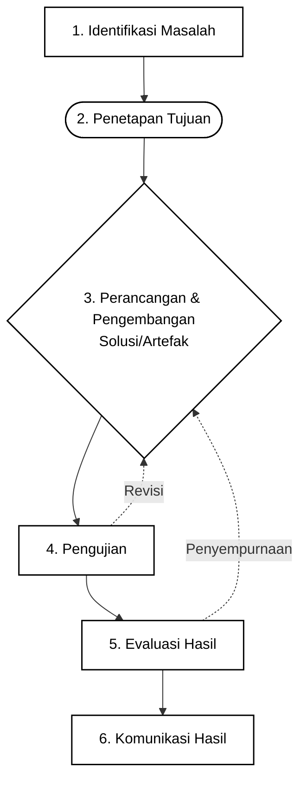

# Gambar 1. Diagram Alir Penelitian Metode R&D Ellis dan Levy

## Keterangan

Diagram ini mengikuti alur contoh yang Anda kirim:

1. Identifikasi Masalah
2. Penetapan Tujuan
3. Perancangan & Pengembangan Solusi/Artefak
4. Pengujian
5. Evaluasi Hasil
6. Komunikasi Hasil

Panah putus-putus dari tahap pengujian dan evaluasi menunjukkan proses iteratif berupa revisi atau penyempurnaan kembali ke tahap perancangan dan pengembangan.

## Catatan penggunaan di draw.io

Jika ingin dipakai di draw.io, salin blok `mermaid` di atas lalu gunakan fitur insert/import Mermaid pada draw.io.