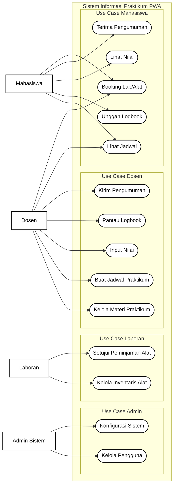

# Gambar 3. Use Case Diagram

## Keterangan

Diagram use case ini menunjukkan interaksi empat aktor utama dengan sistem:

1. Admin Sistem
2. Laboran
3. Dosen
4. Mahasiswa

## Rincian use case per aktor

### 1. Admin Sistem
- Kelola Pengguna
- Konfigurasi Sistem

### 2. Laboran
- Kelola Inventaris Alat
- Setujui Peminjaman Alat

### 3. Dosen
- Kelola Materi Praktikum
- Buat Jadwal Praktikum
- Input Nilai
- Pantau Logbook
- Kirim Pengumuman
- Lihat Jadwal
- Booking Lab/Alat

### 4. Mahasiswa
- Lihat Jadwal
- Booking Lab/Alat
- Unggah Logbook
- Lihat Nilai
- Terima Pengumuman

## Catatan penggunaan di draw.io

Salin blok `mermaid` di atas lalu gunakan fitur insert/import Mermaid pada draw.io.