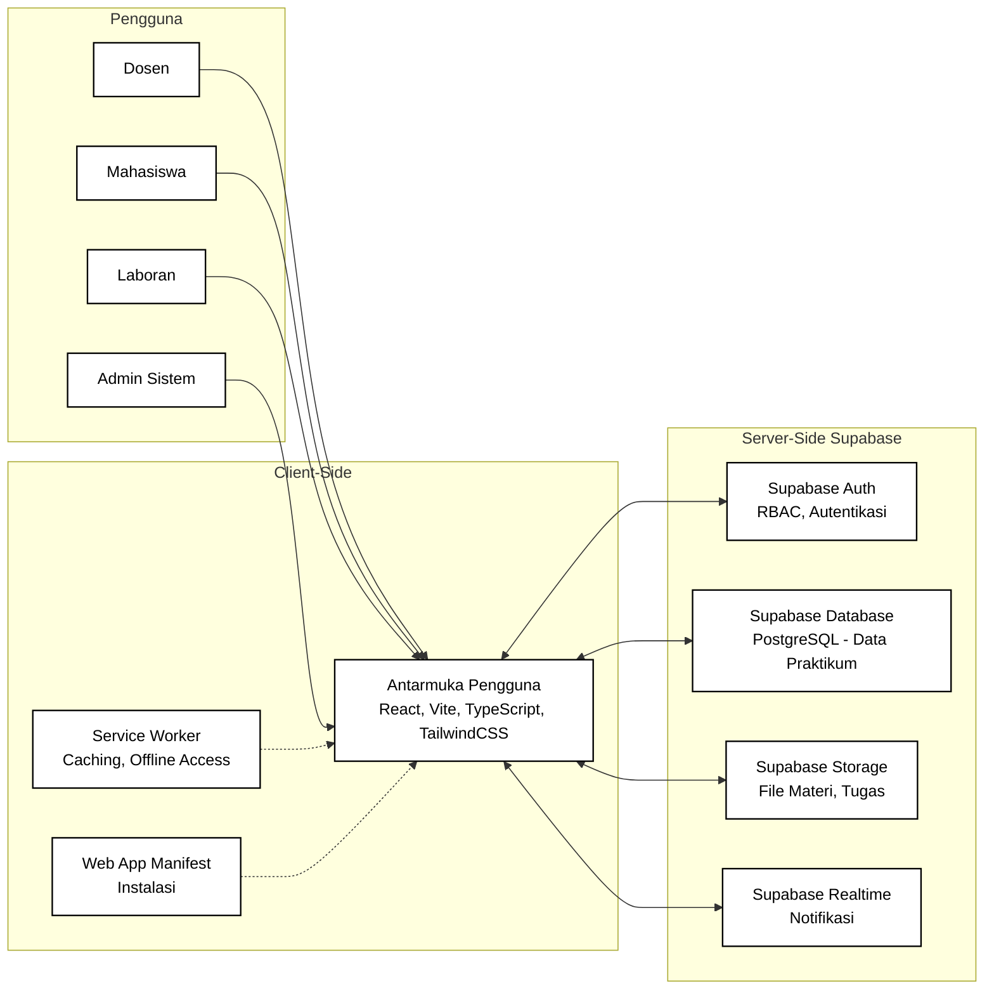

# Gambar 4. Diagram Arsitektur Sistem PWA

## Keterangan

Diagram ini menggambarkan arsitektur sistem informasi praktikum berbasis PWA yang terdiri dari tiga bagian utama:

1. Pengguna
2. Client-Side
3. Server-Side Supabase

## Komponen utama

### 1. Pengguna
- Dosen
- Mahasiswa
- Laboran
- Admin Sistem

Seluruh aktor mengakses sistem melalui antarmuka pengguna pada sisi klien.

### 2. Client-Side
- Antarmuka Pengguna: React, Vite, TypeScript, TailwindCSS
- Service Worker: caching dan akses offline
- Web App Manifest: instalasi aplikasi

Komponen `Service Worker` dan `Web App Manifest` mendukung karakteristik Progressive Web Application.

### 3. Server-Side Supabase
- Supabase Auth: RBAC dan autentikasi
- Supabase Database: PostgreSQL untuk data praktikum
- Supabase Storage: penyimpanan file materi dan tugas
- Supabase Realtime: notifikasi dan pembaruan data langsung

## Relasi antarkomponen

- Pengguna berinteraksi dengan sistem melalui antarmuka pengguna.
- Antarmuka pengguna terhubung dengan layanan autentikasi, basis data, penyimpanan file, dan realtime pada Supabase.
- Service worker dan web app manifest memperkuat dukungan offline dan instalasi aplikasi.

## Catatan penggunaan di draw.io

Salin blok `mermaid` di atas lalu gunakan fitur insert/import Mermaid pada draw.io.