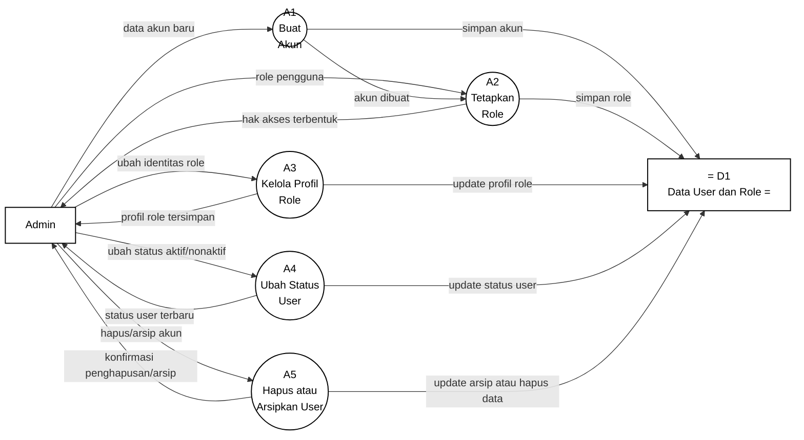

# Gambar 6. DFD Level 2 Proses 1.2 Kelola User dengan Notasi Yourdon/DeMarco

Dokumen ini menjadi panduan menggambar ulang DFD Level 2 proses `1.2 Kelola User` di Microsoft Visio. Fokus gambar adalah notasi DFD Yourdon/DeMarco, bukan flowchart dan bukan swimlane.

## Graph DFD Level 2 Proses 1.2 Kelola User



## Panduan Menggambar di Microsoft Visio

Gunakan stencil **Data Flow Diagram** di Microsoft Visio, lalu pilih simbol berikut:

| Komponen DFD | Simbol Visio | Elemen pada Diagram |
|---|---|---|
| Entitas eksternal | `External Interactor`, `External Interaction`, atau `Entity` | `Admin` |
| Proses | `Data Process` | `A1` sampai `A5` |
| Data store | `Data Store` | `D1 Data User dan Role` |
| Aliran data | `Dynamic Connector` dengan panah | Semua garis berlabel data |

Jangan gunakan simbol flowchart seperti `Start`, `Stop`, `Decision`, `Document`, atau swimlane, karena diagram ini dipertanggungjawabkan sebagai DFD Yourdon/DeMarco.

## Sketsa Posisi Gambar

Gunakan sketsa berikut sebagai acuan tata letak saat menggambar di Visio. Sketsa ini hanya menunjukkan posisi umum; label lengkap setiap panah ada pada bagian daftar aliran data.

```text
[Admin] ---> (A1 Buat Akun) ---> (A2 Tetapkan Role) ---> [Admin]
   |              |                   |                      ^
   |              v                   v                      |
   |          D1 Data User dan Role   D1 Data User dan Role  |
   |                                                         |
   +----> (A3 Kelola Profil Role) ----> D1 ------------------+
   |              |
   |              +-------------------------------> [Admin]
   |
   +----> (A4 Ubah Status User) ----> D1 --------> [Admin]
   |
   +----> (A5 Hapus atau Arsipkan User) -> D1 ---> [Admin]
```

## Layout Visio yang Disarankan

| Posisi | Elemen | Simbol |
|---|---|---|
| Kiri | `Admin` | Entitas eksternal |
| Tengah atas kiri | `A1 Buat Akun` | Data Process |
| Tengah atas | `A2 Tetapkan Role` | Data Process |
| Tengah atas kanan | `A3 Kelola Profil Role` | Data Process |
| Tengah bawah | `A4 Ubah Status User` | Data Process |
| Tengah bawah kanan | `A5 Hapus atau Arsipkan User` | Data Process |
| Kanan | `D1 Data User dan Role` | Data Store |

Letakkan `D1 Data User dan Role` di sisi kanan agar seluruh proses yang menyimpan atau memperbarui data dapat diarahkan ke satu data store yang sama. Jalur output kembali ke `Admin` sebaiknya diarahkan lewat sisi luar agar tidak menabrak jalur input.

## Daftar Aliran Data yang Wajib Digambar

| No | Dari | Ke | Label Aliran Data |
|---|---|---|---|
| 1 | `Admin` | `A1 Buat Akun` | `data akun baru` |
| 2 | `Admin` | `A2 Tetapkan Role` | `role pengguna` |
| 3 | `Admin` | `A3 Kelola Profil Role` | `ubah identitas role` |
| 4 | `Admin` | `A4 Ubah Status User` | `ubah status aktif/nonaktif` |
| 5 | `Admin` | `A5 Hapus atau Arsipkan User` | `hapus/arsip akun` |
| 6 | `A1 Buat Akun` | `A2 Tetapkan Role` | `akun dibuat` |
| 7 | `A1 Buat Akun` | `D1 Data User dan Role` | `simpan akun` |
| 8 | `A2 Tetapkan Role` | `D1 Data User dan Role` | `simpan role` |
| 9 | `A3 Kelola Profil Role` | `D1 Data User dan Role` | `update profil role` |
| 10 | `A4 Ubah Status User` | `D1 Data User dan Role` | `update status user` |
| 11 | `A5 Hapus atau Arsipkan User` | `D1 Data User dan Role` | `update arsip atau hapus data` |
| 12 | `A2 Tetapkan Role` | `Admin` | `hak akses terbentuk` |
| 13 | `A3 Kelola Profil Role` | `Admin` | `profil role tersimpan` |
| 14 | `A4 Ubah Status User` | `Admin` | `status user terbaru` |
| 15 | `A5 Hapus atau Arsipkan User` | `Admin` | `konfirmasi penghapusan/arsip` |

## Keterangan Simbol untuk Skripsi

Diagram ini menggunakan notasi DFD Yourdon/DeMarco. Kotak menunjukkan entitas eksternal, lingkaran menunjukkan proses, data store menunjukkan tempat penyimpanan data, dan panah berlabel menunjukkan aliran data.

Pada diagram ini, `Admin` merupakan entitas eksternal. Proses internal kelola user terdiri dari `A1 Buat Akun`, `A2 Tetapkan Role`, `A3 Kelola Profil Role`, `A4 Ubah Status User`, dan `A5 Hapus atau Arsipkan User`. Data store yang digunakan adalah `D1 Data User dan Role`.

## Ringkasan Alur

Proses `1.2 Kelola User` dimulai ketika `Admin` mengirim `data akun baru` ke `A1 Buat Akun`. Setelah akun dibuat, `A1` mengirim `akun dibuat` ke `A2 Tetapkan Role` dan menyimpan data melalui aliran `simpan akun` ke `D1 Data User dan Role`.

Admin juga dapat mengirim `role pengguna` ke `A2 Tetapkan Role`, lalu sistem menyimpan role ke D1 melalui aliran `simpan role` dan mengembalikan `hak akses terbentuk` kepada Admin. Selain itu, Admin dapat mengirim `ubah identitas role` ke `A3 Kelola Profil Role`, `ubah status aktif/nonaktif` ke `A4 Ubah Status User`, dan `hapus/arsip akun` ke `A5 Hapus atau Arsipkan User`.

Setiap perubahan pada profil role, status user, maupun arsip data dikirim ke `D1 Data User dan Role`. Sistem kemudian memberikan keluaran kepada Admin berupa `profil role tersimpan`, `status user terbaru`, dan `konfirmasi penghapusan/arsip`.
