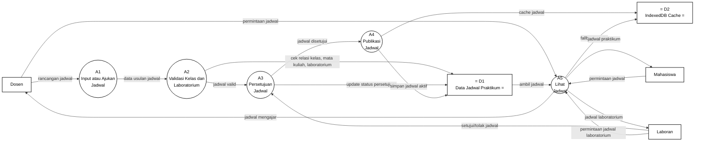

# Gambar 7. DFD Level 2 Proses 2.1 Kelola Jadwal dengan Notasi Yourdon/DeMarco

Dokumen ini menjadi panduan menggambar ulang DFD Level 2 proses `2.1 Kelola Jadwal` di Microsoft Visio. Fokus gambar adalah notasi DFD Yourdon/DeMarco, bukan flowchart dan bukan swimlane.

## Graph DFD Level 2 Proses 2.1 Kelola Jadwal



## Panduan Menggambar di Microsoft Visio

Gunakan stencil **Data Flow Diagram** di Microsoft Visio, lalu pilih simbol berikut:

| Komponen DFD | Simbol Visio | Elemen pada Diagram |
|---|---|---|
| Entitas eksternal | `External Interactor`, `External Interaction`, atau `Entity` | `Dosen`, `Laboran`, `Mahasiswa` |
| Proses | `Data Process` | `A1` sampai `A5` |
| Data store | `Data Store` | `D1 Data Jadwal Praktikum`, `D2 IndexedDB Cache` |
| Aliran data | `Dynamic Connector` dengan panah | Semua garis berlabel data |

Jangan gunakan simbol flowchart seperti `Start`, `Stop`, `Decision`, `Document`, atau swimlane, karena diagram ini dipertanggungjawabkan sebagai DFD Yourdon/DeMarco.

## Sketsa Posisi Gambar

Gunakan sketsa berikut sebagai acuan tata letak saat menggambar di Visio. Sketsa ini hanya menunjukkan posisi umum; label lengkap setiap panah ada pada bagian daftar aliran data.

```text
[Dosen] ---> (A1 Input/Ajukan Jadwal) ---> (A2 Validasi Kelas dan Laboratorium) ---> (A3 Persetujuan Jadwal)
                                             |                                      ^             |
                                             v                                      |             v
                                      D1 Data Jadwal Praktikum <--------------------+       (A4 Publikasi Jadwal)
                                             ^                                                    |
                                             |                                                    v
[Dosen] -------------------------------> (A5 Lihat Jadwal) <------------------- D1 Data Jadwal Praktikum
[Laboran] ----------------------------->        |                  \
[Mahasiswa] --------------------------->        |                   \----> D2 IndexedDB Cache
                                                |
                                                +----> [Mahasiswa]
                                                +----> [Dosen]
                                                +----> [Laboran]

[Laboran] ---> (A3 Persetujuan Jadwal)
```

## Layout Visio yang Disarankan

| Posisi | Elemen | Simbol |
|---|---|---|
| Kiri atas | `Dosen` | Entitas eksternal |
| Kiri tengah | `Laboran` | Entitas eksternal |
| Kiri bawah | `Mahasiswa` | Entitas eksternal |
| Tengah atas kiri | `A1 Input atau Ajukan Jadwal` | Data Process |
| Tengah atas | `A2 Validasi Kelas dan Laboratorium` | Data Process |
| Tengah atas kanan | `A3 Persetujuan Jadwal` | Data Process |
| Tengah bawah | `A4 Publikasi Jadwal` | Data Process |
| Kanan bawah | `A5 Lihat Jadwal` | Data Process |
| Kanan atas | `D1 Data Jadwal Praktikum` | Data Store |
| Kanan tengah/bawah | `D2 IndexedDB Cache` | Data Store |

Pisahkan jalur pengajuan dan validasi jadwal dari jalur permintaan/hasil jadwal. Jalur pengajuan utama dapat dibuat dari kiri ke kanan: `Dosen -> A1 -> A2 -> A3 -> A4`. Jalur akses jadwal dipusatkan pada `A5 Lihat Jadwal`, lalu keluar ke `Mahasiswa`, `Dosen`, dan `Laboran`.

## Daftar Aliran Data yang Wajib Digambar

| No | Dari | Ke | Label Aliran Data |
|---|---|---|---|
| 1 | `Dosen` | `A1 Input atau Ajukan Jadwal` | `rancangan jadwal` |
| 2 | `Laboran` | `A3 Persetujuan Jadwal` | `setujui/tolak jadwal` |
| 3 | `Mahasiswa` | `A5 Lihat Jadwal` | `permintaan jadwal` |
| 4 | `Dosen` | `A5 Lihat Jadwal` | `permintaan jadwal` |
| 5 | `Laboran` | `A5 Lihat Jadwal` | `permintaan jadwal laboratorium` |
| 6 | `A1 Input atau Ajukan Jadwal` | `A2 Validasi Kelas dan Laboratorium` | `data usulan jadwal` |
| 7 | `A2 Validasi Kelas dan Laboratorium` | `A3 Persetujuan Jadwal` | `jadwal valid` |
| 8 | `A3 Persetujuan Jadwal` | `A4 Publikasi Jadwal` | `jadwal disetujui` |
| 9 | `A2 Validasi Kelas dan Laboratorium` | `D1 Data Jadwal Praktikum` | `cek relasi kelas, mata kuliah, laboratorium` |
| 10 | `A3 Persetujuan Jadwal` | `D1 Data Jadwal Praktikum` | `update status persetujuan` |
| 11 | `A4 Publikasi Jadwal` | `D1 Data Jadwal Praktikum` | `simpan jadwal aktif` |
| 12 | `A4 Publikasi Jadwal` | `D2 IndexedDB Cache` | `cache jadwal` |
| 13 | `D1 Data Jadwal Praktikum` | `A5 Lihat Jadwal` | `ambil jadwal` |
| 14 | `A5 Lihat Jadwal` | `D2 IndexedDB Cache` | `fallback cache` |
| 15 | `A5 Lihat Jadwal` | `Mahasiswa` | `jadwal praktikum` |
| 16 | `A5 Lihat Jadwal` | `Dosen` | `jadwal mengajar` |
| 17 | `A5 Lihat Jadwal` | `Laboran` | `jadwal laboratorium` |

Catatan: beberapa aliran ke data store pada file draw.io menggunakan gaya konektor dua arah. Saat menggambar di Visio, boleh digambar sebagai satu konektor dua arah atau sebagai panah satu arah sesuai tabel, selama label data tetap sama dan maknanya tidak berubah.

## Keterangan Simbol untuk Skripsi

Diagram ini menggunakan notasi DFD Yourdon/DeMarco. Kotak menunjukkan entitas eksternal, lingkaran menunjukkan proses, data store menunjukkan tempat penyimpanan data, dan panah berlabel menunjukkan aliran data.

Pada diagram ini, `Dosen`, `Laboran`, dan `Mahasiswa` merupakan entitas eksternal. Proses internal kelola jadwal terdiri dari `A1 Input atau Ajukan Jadwal`, `A2 Validasi Kelas dan Laboratorium`, `A3 Persetujuan Jadwal`, `A4 Publikasi Jadwal`, dan `A5 Lihat Jadwal`. Data store yang digunakan adalah `D1 Data Jadwal Praktikum` dan `D2 IndexedDB Cache`.

## Ringkasan Alur

Proses `2.1 Kelola Jadwal` dimulai ketika `Dosen` mengirim `rancangan jadwal` ke `A1 Input atau Ajukan Jadwal`. Data tersebut diteruskan sebagai `data usulan jadwal` ke `A2 Validasi Kelas dan Laboratorium`. Pada tahap validasi, sistem memeriksa relasi kelas, mata kuliah, dan laboratorium pada `D1 Data Jadwal Praktikum`.

Jika jadwal valid, `A2` mengirim `jadwal valid` ke `A3 Persetujuan Jadwal`. `Laboran` memberikan keputusan melalui aliran `setujui/tolak jadwal`, kemudian `A3` memperbarui status persetujuan pada `D1` dan meneruskan `jadwal disetujui` ke `A4 Publikasi Jadwal`. Proses `A4` menyimpan jadwal aktif ke `D1` dan mengirim `cache jadwal` ke `D2 IndexedDB Cache`.

Untuk akses jadwal, `Mahasiswa`, `Dosen`, dan `Laboran` mengirim permintaan ke `A5 Lihat Jadwal`. Proses `A5` mengambil jadwal dari `D1`, dapat menggunakan `D2 IndexedDB Cache` sebagai fallback cache, lalu mengirim keluaran berupa `jadwal praktikum` kepada Mahasiswa, `jadwal mengajar` kepada Dosen, dan `jadwal laboratorium` kepada Laboran.
