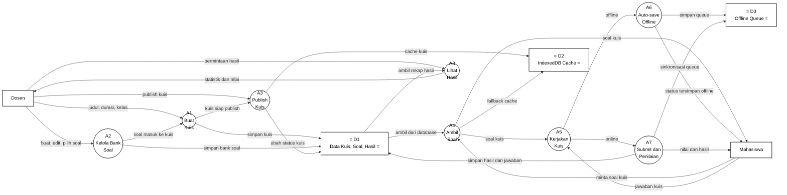

# Gambar 8. DFD Level 2 Proses 2.2 Kelola Kuis dan Bank Soal dengan Notasi Yourdon/DeMarco

Dokumen ini menjadi panduan menggambar ulang DFD Level 2 proses `2.2 Kelola Kuis dan Bank Soal` di Microsoft Visio. Fokus gambar adalah notasi DFD Yourdon/DeMarco, bukan flowchart dan bukan swimlane.

## Graph DFD Level 2 Proses 2.2 Kelola Kuis dan Bank Soal



## Panduan Menggambar di Microsoft Visio

Gunakan stencil **Data Flow Diagram** di Microsoft Visio, lalu pilih simbol berikut:

| Komponen DFD | Simbol Visio | Elemen pada Diagram |
|---|---|---|
| Entitas eksternal | `External Interactor`, `External Interaction`, atau `Entity` | `Dosen`, `Mahasiswa` |
| Proses | `Data Process` | `A1` sampai `A8` |
| Data store | `Data Store` | `D1 Data Kuis, Soal, Hasil`, `D2 IndexedDB Cache`, `D3 Offline Queue` |
| Aliran data | `Dynamic Connector` dengan panah | Semua garis berlabel data |

Jangan gunakan simbol flowchart seperti `Start`, `Stop`, `Decision`, `Document`, atau swimlane, karena diagram ini dipertanggungjawabkan sebagai DFD Yourdon/DeMarco.

## Sketsa Posisi Gambar

Gunakan sketsa berikut sebagai acuan tata letak saat menggambar di Visio. Sketsa ini hanya menunjukkan posisi umum; label lengkap setiap panah ada pada bagian daftar aliran data.

```text
[Dosen] ---> (A1 Buat Kuis) ---> (A3 Publish Kuis)
    |             ^                    |
    |             |                    v
    +------> (A2 Kelola Bank Soal)   D1 Data Kuis, Soal, Hasil
    |
    +-----------------------------------------------> (A8 Lihat Hasil) ---> [Dosen]

[Mahasiswa] ---> (A4 Ambil Soal) ---> (A5 Kerjakan Kuis) ---> (A7 Submit dan Penilaian)
                     ^                    |       \                    |
                     |                    |        \                   v
                     |                    |         \----> (A6 Auto-save Offline) ---> D3 Offline Queue
                     |                    |
                 D1 Data Kuis       [Mahasiswa]
                     |
                     v
                 D2 IndexedDB Cache
```

## Layout Visio yang Disarankan

| Posisi | Elemen | Simbol |
|---|---|---|
| Kiri atas | `Dosen` | Entitas eksternal |
| Kiri bawah | `Mahasiswa` | Entitas eksternal |
| Tengah atas kiri | `A1 Buat Kuis` | Data Process |
| Tengah atas | `A2 Kelola Bank Soal` | Data Process |
| Tengah atas kanan | `A3 Publish Kuis` | Data Process |
| Tengah bawah kiri | `A4 Ambil Soal` | Data Process |
| Tengah bawah | `A5 Kerjakan Kuis` | Data Process |
| Tengah bawah kanan | `A6 Auto-save Offline` dan `A7 Submit dan Penilaian` | Data Process |
| Kanan atas | `A8 Lihat Hasil` | Data Process |
| Kanan | `D1 Data Kuis, Soal, Hasil` | Data Store |
| Kanan tengah/bawah | `D2 IndexedDB Cache`, `D3 Offline Queue` | Data Store |

Pisahkan jalur dosen dan jalur mahasiswa. Jalur dosen mencakup pembuatan kuis, bank soal, publish, dan lihat hasil. Jalur mahasiswa mencakup ambil soal, kerjakan kuis, auto-save offline, submit, dan penerimaan nilai.

## Daftar Aliran Data yang Wajib Digambar

| No | Dari | Ke | Label Aliran Data |
|---|---|---|---|
| 1 | `Dosen` | `A1 Buat Kuis` | `judul, durasi, kelas` |
| 2 | `Dosen` | `A2 Kelola Bank Soal` | `buat, edit, pilih soal` |
| 3 | `Dosen` | `A3 Publish Kuis` | `publish kuis` |
| 4 | `Dosen` | `A8 Lihat Hasil` | `permintaan hasil` |
| 5 | `Mahasiswa` | `A4 Ambil Soal` | `minta soal kuis` |
| 6 | `Mahasiswa` | `A5 Kerjakan Kuis` | `jawaban kuis` |
| 7 | `A2 Kelola Bank Soal` | `A1 Buat Kuis` | `soal masuk ke kuis` |
| 8 | `A1 Buat Kuis` | `A3 Publish Kuis` | `kuis siap publish` |
| 9 | `A4 Ambil Soal` | `A5 Kerjakan Kuis` | `soal kuis` |
| 10 | `A5 Kerjakan Kuis` | `A7 Submit dan Penilaian` | `online` |
| 11 | `A5 Kerjakan Kuis` | `A6 Auto-save Offline` | `offline` |
| 12 | `A1 Buat Kuis` | `D1 Data Kuis, Soal, Hasil` | `simpan kuis` |
| 13 | `A2 Kelola Bank Soal` | `D1 Data Kuis, Soal, Hasil` | `simpan bank soal` |
| 14 | `A3 Publish Kuis` | `D1 Data Kuis, Soal, Hasil` | `ubah status kuis` |
| 15 | `A3 Publish Kuis` | `D2 IndexedDB Cache` | `cache kuis` |
| 16 | `D1 Data Kuis, Soal, Hasil` | `A4 Ambil Soal` | `ambil dari database` |
| 17 | `A4 Ambil Soal` | `D2 IndexedDB Cache` | `fallback cache` |
| 18 | `A6 Auto-save Offline` | `D3 Offline Queue` | `simpan queue` |
| 19 | `A7 Submit dan Penilaian` | `D1 Data Kuis, Soal, Hasil` | `simpan hasil dan jawaban` |
| 20 | `A7 Submit dan Penilaian` | `D3 Offline Queue` | `sinkronisasi queue` |
| 21 | `D1 Data Kuis, Soal, Hasil` | `A8 Lihat Hasil` | `ambil rekap hasil` |
| 22 | `A4 Ambil Soal` | `Mahasiswa` | `soal kuis` |
| 23 | `A6 Auto-save Offline` | `Mahasiswa` | `status tersimpan offline` |
| 24 | `A7 Submit dan Penilaian` | `Mahasiswa` | `nilai dan hasil` |
| 25 | `A8 Lihat Hasil` | `Dosen` | `statistik dan nilai` |

## Keterangan Simbol untuk Skripsi

Diagram ini menggunakan notasi DFD Yourdon/DeMarco. Kotak menunjukkan entitas eksternal, lingkaran menunjukkan proses, data store menunjukkan tempat penyimpanan data, dan panah berlabel menunjukkan aliran data.

Pada diagram ini, `Dosen` dan `Mahasiswa` merupakan entitas eksternal. Proses internal kelola kuis dan bank soal terdiri dari `A1 Buat Kuis`, `A2 Kelola Bank Soal`, `A3 Publish Kuis`, `A4 Ambil Soal`, `A5 Kerjakan Kuis`, `A6 Auto-save Offline`, `A7 Submit dan Penilaian`, dan `A8 Lihat Hasil`. Data store yang digunakan adalah `D1 Data Kuis, Soal, Hasil`, `D2 IndexedDB Cache`, dan `D3 Offline Queue`.

## Ringkasan Alur

Proses `2.2 Kelola Kuis dan Bank Soal` dimulai ketika `Dosen` membuat kuis melalui `A1 Buat Kuis` dan mengelola bank soal melalui `A2 Kelola Bank Soal`. Soal yang dipilih masuk ke kuis, kemudian kuis yang siap diteruskan ke `A3 Publish Kuis`. Data kuis, bank soal, dan status publikasi disimpan pada `D1 Data Kuis, Soal, Hasil`, sedangkan data penting kuis dapat dicache ke `D2 IndexedDB Cache`.

Mahasiswa meminta soal melalui `A4 Ambil Soal`. Proses ini mengambil soal dari `D1` atau menggunakan `D2 IndexedDB Cache` sebagai fallback. Setelah soal diterima, mahasiswa mengirim `jawaban kuis` ke `A5 Kerjakan Kuis`. Jika koneksi tersedia, jawaban diteruskan ke `A7 Submit dan Penilaian`; jika tidak, jawaban diarahkan ke `A6 Auto-save Offline` dan disimpan pada `D3 Offline Queue`.

Pada tahap submit dan penilaian, `A7` menyimpan hasil dan jawaban ke `D1` serta melakukan sinkronisasi queue bila diperlukan. Mahasiswa menerima `nilai dan hasil`, sedangkan dosen dapat mengirim `permintaan hasil` ke `A8 Lihat Hasil` untuk memperoleh `statistik dan nilai`.
