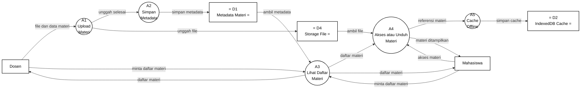

# Gambar 9. DFD Level 2 Proses 2.3 Kelola Materi dengan Notasi Yourdon/DeMarco

Dokumen ini menjadi panduan menggambar ulang DFD Level 2 proses `2.3 Kelola Materi` di Microsoft Visio. Fokus gambar adalah notasi DFD Yourdon/DeMarco, bukan flowchart dan bukan swimlane.

## Graph DFD Level 2 Proses 2.3 Kelola Materi



## Panduan Menggambar di Microsoft Visio

Gunakan stencil **Data Flow Diagram** di Microsoft Visio, lalu pilih simbol berikut:

| Komponen DFD | Simbol Visio | Elemen pada Diagram |
|---|---|---|
| Entitas eksternal | `External Interactor`, `External Interaction`, atau `Entity` | `Dosen`, `Mahasiswa` |
| Proses | `Data Process` | `A1` sampai `A5` |
| Data store | `Data Store` | `D1 Metadata Materi`, `D2 IndexedDB Cache`, `D4 Storage File` |
| Aliran data | `Dynamic Connector` dengan panah | Semua garis berlabel data |

Jangan gunakan simbol flowchart seperti `Start`, `Stop`, `Decision`, `Document`, atau swimlane, karena diagram ini dipertanggungjawabkan sebagai DFD Yourdon/DeMarco.

## Sketsa Posisi Gambar

Gunakan sketsa berikut sebagai acuan tata letak saat menggambar di Visio. Sketsa ini hanya menunjukkan posisi umum; label lengkap setiap panah ada pada bagian daftar aliran data.

```text
[Dosen] ---> (A1 Upload Materi) ---> (A2 Simpan Metadata) ---> D1 Metadata Materi
                 |                                                   |
                 v                                                   v
            D4 Storage File                                  (A3 Lihat Daftar Materi) ---> [Dosen]
                                                                    |              \
[Mahasiswa] ---------------- minta daftar materi -------------------+               \--> [Mahasiswa]
[Mahasiswa] ---------------- akses materi ----------------------> (A4 Akses/Unduh Materi) ---> [Mahasiswa]
                                                                    |
                                                                    v
                                                              (A5 Cache Offline) ---> D2 IndexedDB Cache
```

## Layout Visio yang Disarankan

| Posisi | Elemen | Simbol |
|---|---|---|
| Kiri atas | `Dosen` | Entitas eksternal |
| Kiri bawah | `Mahasiswa` | Entitas eksternal |
| Tengah atas kiri | `A1 Upload Materi` | Data Process |
| Tengah atas | `A2 Simpan Metadata` | Data Process |
| Tengah kanan | `A3 Lihat Daftar Materi` | Data Process |
| Tengah bawah kanan | `A4 Akses atau Unduh Materi` | Data Process |
| Kanan bawah | `A5 Cache Offline` | Data Process |
| Kanan atas | `D1 Metadata Materi` | Data Store |
| Tengah bawah | `D4 Storage File` | Data Store |
| Kanan bawah dekat A5 | `D2 IndexedDB Cache` | Data Store |

Pisahkan jalur pengelolaan materi oleh dosen dan jalur akses materi oleh mahasiswa. Jalur dosen mencakup upload file dan simpan metadata. Jalur mahasiswa mencakup minta daftar materi, akses materi, dan cache offline.

## Daftar Aliran Data yang Wajib Digambar

| No | Dari | Ke | Label Aliran Data |
|---|---|---|---|
| 1 | `Dosen` | `A1 Upload Materi` | `file dan data materi` |
| 2 | `Dosen` | `A3 Lihat Daftar Materi` | `minta daftar materi` |
| 3 | `Mahasiswa` | `A3 Lihat Daftar Materi` | `minta daftar materi` |
| 4 | `Mahasiswa` | `A4 Akses atau Unduh Materi` | `akses materi` |
| 5 | `A1 Upload Materi` | `A2 Simpan Metadata` | `unggah selesai` |
| 6 | `A3 Lihat Daftar Materi` | `A4 Akses atau Unduh Materi` | `daftar materi` |
| 7 | `A4 Akses atau Unduh Materi` | `A5 Cache Offline` | `referensi materi` |
| 8 | `A1 Upload Materi` | `D4 Storage File` | `unggah file` |
| 9 | `A2 Simpan Metadata` | `D1 Metadata Materi` | `simpan metadata` |
| 10 | `D1 Metadata Materi` | `A3 Lihat Daftar Materi` | `ambil metadata` |
| 11 | `D4 Storage File` | `A4 Akses atau Unduh Materi` | `ambil file` |
| 12 | `A5 Cache Offline` | `D2 IndexedDB Cache` | `simpan cache` |
| 13 | `A3 Lihat Daftar Materi` | `Dosen` | `daftar materi` |
| 14 | `A3 Lihat Daftar Materi` | `Mahasiswa` | `daftar materi` |
| 15 | `A4 Akses atau Unduh Materi` | `Mahasiswa` | `materi ditampilkan` |

## Keterangan Simbol untuk Skripsi

Diagram ini menggunakan notasi DFD Yourdon/DeMarco. Kotak menunjukkan entitas eksternal, lingkaran menunjukkan proses, data store menunjukkan tempat penyimpanan data, dan panah berlabel menunjukkan aliran data.

Pada diagram ini, `Dosen` dan `Mahasiswa` merupakan entitas eksternal. Proses internal kelola materi terdiri dari `A1 Upload Materi`, `A2 Simpan Metadata`, `A3 Lihat Daftar Materi`, `A4 Akses atau Unduh Materi`, dan `A5 Cache Offline`. Data store yang digunakan adalah `D1 Metadata Materi`, `D2 IndexedDB Cache`, dan `D4 Storage File`.

## Ringkasan Alur

Proses `2.3 Kelola Materi` dimulai ketika `Dosen` mengirim `file dan data materi` ke `A1 Upload Materi`. File materi diunggah ke `D4 Storage File`, lalu `A1` mengirim `unggah selesai` ke `A2 Simpan Metadata`. Metadata materi kemudian disimpan ke `D1 Metadata Materi`.

`Dosen` dan `Mahasiswa` dapat meminta daftar materi melalui `A3 Lihat Daftar Materi`. Proses ini mengambil metadata dari `D1` dan mengirim `daftar materi` kembali kepada Dosen maupun Mahasiswa. Ketika Mahasiswa memilih atau membuka materi, permintaan `akses materi` masuk ke `A4 Akses atau Unduh Materi`.

Proses `A4` mengambil file dari `D4 Storage File`, menampilkan materi kepada Mahasiswa, lalu meneruskan `referensi materi` ke `A5 Cache Offline`. Proses `A5` menyimpan cache ke `D2 IndexedDB Cache` agar materi tetap dapat diakses saat koneksi terbatas.
