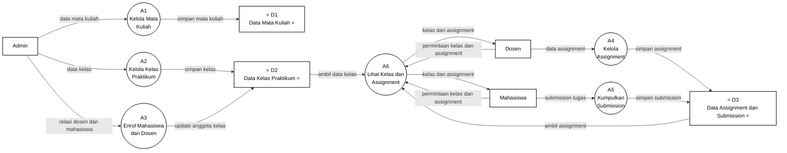

# Gambar 10. DFD Level 2 Proses 2.4 Kelola Kelas, Mata Kuliah, dan Assignment dengan Notasi Yourdon/DeMarco

Dokumen ini menjadi panduan menggambar ulang DFD Level 2 proses `2.4 Kelola Kelas, Mata Kuliah, dan Assignment` di Microsoft Visio. Fokus gambar adalah notasi DFD Yourdon/DeMarco, bukan flowchart dan bukan swimlane.

## Graph DFD Level 2 Proses 2.4 Kelola Kelas, Mata Kuliah, dan Assignment



## Panduan Menggambar di Microsoft Visio

Gunakan stencil **Data Flow Diagram** di Microsoft Visio, lalu pilih simbol berikut:

| Komponen DFD | Simbol Visio | Elemen pada Diagram |
|---|---|---|
| Entitas eksternal | `External Interactor`, `External Interaction`, atau `Entity` | `Admin`, `Dosen`, `Mahasiswa` |
| Proses | `Data Process` | `A1` sampai `A6` |
| Data store | `Data Store` | `D1 Data Mata Kuliah`, `D2 Data Kelas Praktikum`, `D3 Data Assignment dan Submission` |
| Aliran data | `Dynamic Connector` dengan panah | Semua garis berlabel data |

Jangan gunakan simbol flowchart seperti `Start`, `Stop`, `Decision`, `Document`, atau swimlane, karena diagram ini dipertanggungjawabkan sebagai DFD Yourdon/DeMarco.

## Sketsa Posisi Gambar

Gunakan sketsa berikut sebagai acuan tata letak saat menggambar di Visio. Sketsa ini hanya menunjukkan posisi umum; label lengkap setiap panah ada pada bagian daftar aliran data.

```text
[Admin] ---> (A1 Kelola Mata Kuliah) -----------> D1 Data Mata Kuliah
   |
   +------> (A2 Kelola Kelas Praktikum) --------> D2 Data Kelas Praktikum
   |
   +------> (A3 Enrol Mahasiswa dan Dosen) -----> D2 Data Kelas Praktikum

[Dosen] ---> (A4 Kelola Assignment) ------------> D3 Data Assignment dan Submission
[Mahasiswa] -> (A5 Kumpulkan Submission) -------> D3 Data Assignment dan Submission

[Dosen] --------------------------\
                                   v
[Mahasiswa] -----------------> (A6 Lihat Kelas dan Assignment)
                              ^              ^
                              |              |
                    D2 Data Kelas       D3 Data Assignment
                              |
                              +----> [Dosen]
                              +----> [Mahasiswa]
```

## Layout Visio yang Disarankan

| Posisi | Elemen | Simbol |
|---|---|---|
| Kiri atas | `Admin` | Entitas eksternal |
| Kiri tengah | `Dosen` | Entitas eksternal |
| Kiri bawah | `Mahasiswa` | Entitas eksternal |
| Tengah atas | `A1 Kelola Mata Kuliah` | Data Process |
| Tengah atas kanan | `A2 Kelola Kelas Praktikum` | Data Process |
| Tengah tengah | `A3 Enrol Mahasiswa dan Dosen` | Data Process |
| Tengah bawah | `A4 Kelola Assignment` | Data Process |
| Tengah bawah kanan | `A5 Kumpulkan Submission` | Data Process |
| Kanan tengah | `A6 Lihat Kelas dan Assignment` | Data Process |
| Kanan atas | `D1 Data Mata Kuliah` | Data Store |
| Kanan tengah | `D2 Data Kelas Praktikum` | Data Store |
| Kanan bawah | `D3 Data Assignment dan Submission` | Data Store |

Pisahkan jalur data master akademik, assignment, dan akses informasi. Jalur Admin digunakan untuk data mata kuliah, kelas, dan enrol peserta. Jalur Dosen digunakan untuk assignment dan akses kelas. Jalur Mahasiswa digunakan untuk submission dan akses kelas.

## Daftar Aliran Data yang Wajib Digambar

| No | Dari | Ke | Label Aliran Data |
|---|---|---|---|
| 1 | `Admin` | `A1 Kelola Mata Kuliah` | `data mata kuliah` |
| 2 | `Admin` | `A2 Kelola Kelas Praktikum` | `data kelas` |
| 3 | `Admin` | `A3 Enrol Mahasiswa dan Dosen` | `relasi dosen dan mahasiswa` |
| 4 | `Dosen` | `A4 Kelola Assignment` | `data assignment` |
| 5 | `Mahasiswa` | `A5 Kumpulkan Submission` | `submission tugas` |
| 6 | `Dosen` | `A6 Lihat Kelas dan Assignment` | `permintaan kelas dan assignment` |
| 7 | `Mahasiswa` | `A6 Lihat Kelas dan Assignment` | `permintaan kelas dan assignment` |
| 8 | `A1 Kelola Mata Kuliah` | `D1 Data Mata Kuliah` | `simpan mata kuliah` |
| 9 | `A2 Kelola Kelas Praktikum` | `D2 Data Kelas Praktikum` | `simpan kelas` |
| 10 | `A3 Enrol Mahasiswa dan Dosen` | `D2 Data Kelas Praktikum` | `update anggota kelas` |
| 11 | `A4 Kelola Assignment` | `D3 Data Assignment dan Submission` | `simpan assignment` |
| 12 | `A5 Kumpulkan Submission` | `D3 Data Assignment dan Submission` | `simpan submission` |
| 13 | `D2 Data Kelas Praktikum` | `A6 Lihat Kelas dan Assignment` | `ambil data kelas` |
| 14 | `D3 Data Assignment dan Submission` | `A6 Lihat Kelas dan Assignment` | `ambil assignment` |
| 15 | `A6 Lihat Kelas dan Assignment` | `Dosen` | `kelas dan assignment` |
| 16 | `A6 Lihat Kelas dan Assignment` | `Mahasiswa` | `kelas dan assignment` |

## Keterangan Simbol untuk Skripsi

Diagram ini menggunakan notasi DFD Yourdon/DeMarco. Kotak menunjukkan entitas eksternal, lingkaran menunjukkan proses, data store menunjukkan tempat penyimpanan data, dan panah berlabel menunjukkan aliran data.

Pada diagram ini, `Admin`, `Dosen`, dan `Mahasiswa` merupakan entitas eksternal. Proses internal terdiri dari `A1 Kelola Mata Kuliah`, `A2 Kelola Kelas Praktikum`, `A3 Enrol Mahasiswa dan Dosen`, `A4 Kelola Assignment`, `A5 Kumpulkan Submission`, dan `A6 Lihat Kelas dan Assignment`. Data store yang digunakan adalah `D1 Data Mata Kuliah`, `D2 Data Kelas Praktikum`, dan `D3 Data Assignment dan Submission`.

## Ringkasan Alur

Proses `2.4 Kelola Kelas, Mata Kuliah, dan Assignment` dimulai dari pengelolaan data akademik oleh `Admin`. Admin mengirim `data mata kuliah` ke `A1 Kelola Mata Kuliah`, `data kelas` ke `A2 Kelola Kelas Praktikum`, serta `relasi dosen dan mahasiswa` ke `A3 Enrol Mahasiswa dan Dosen`. Data mata kuliah disimpan pada `D1 Data Mata Kuliah`, sedangkan data kelas dan anggota kelas disimpan pada `D2 Data Kelas Praktikum`.

Setelah struktur kelas terbentuk, `Dosen` mengirim `data assignment` ke `A4 Kelola Assignment`, lalu assignment disimpan pada `D3 Data Assignment dan Submission`. `Mahasiswa` mengirim `submission tugas` ke `A5 Kumpulkan Submission`, kemudian submission juga disimpan pada data store yang sama.

Untuk melihat informasi kelas dan assignment, `Dosen` dan `Mahasiswa` mengirim `permintaan kelas dan assignment` ke `A6 Lihat Kelas dan Assignment`. Proses ini mengambil `ambil data kelas` dari `D2` dan `ambil assignment` dari `D3`, kemudian mengirim `kelas dan assignment` kepada Dosen maupun Mahasiswa.
