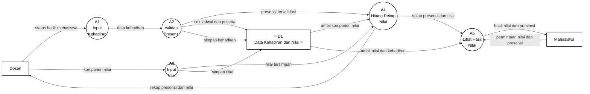

# Gambar 11. DFD Level 2 Proses 2.5 Kehadiran dan Penilaian dengan Notasi Yourdon/DeMarco

Dokumen ini menjadi panduan menggambar ulang DFD Level 2 proses `2.5 Kehadiran dan Penilaian` di Microsoft Visio. Fokus gambar adalah notasi DFD Yourdon/DeMarco, bukan flowchart dan bukan swimlane.

## Graph DFD Level 2 Proses 2.5 Kehadiran dan Penilaian



## Panduan Menggambar di Microsoft Visio

Gunakan stencil **Data Flow Diagram** di Microsoft Visio, lalu pilih simbol berikut:

| Komponen DFD | Simbol Visio | Elemen pada Diagram |
|---|---|---|
| Entitas eksternal | `External Interactor`, `External Interaction`, atau `Entity` | `Dosen`, `Mahasiswa` |
| Proses | `Data Process` | `A1` sampai `A5` |
| Data store | `Data Store` | `D1 Data Kehadiran dan Nilai` |
| Aliran data | `Dynamic Connector` dengan panah | Semua garis berlabel data |

Jangan gunakan simbol flowchart seperti `Start`, `Stop`, `Decision`, `Document`, atau swimlane, karena diagram ini dipertanggungjawabkan sebagai DFD Yourdon/DeMarco.

## Sketsa Posisi Gambar

Gunakan sketsa berikut sebagai acuan tata letak saat menggambar di Visio. Sketsa ini hanya menunjukkan posisi umum; label lengkap setiap panah ada pada bagian daftar aliran data.

```text
[Dosen] ---> (A1 Input Kehadiran) ---> (A2 Validasi Presensi) ----\
   |                                  |                            v
   |                                  v                      (A4 Hitung Rekap Nilai) ---> [Dosen]
   |                          D1 Data Kehadiran dan Nilai          |
   |                                  ^                            v
   +------> (A3 Input Nilai) ---------+                      (A5 Lihat Hasil Nilai) ---> [Mahasiswa]

[Mahasiswa] ---------------- permintaan nilai dan presensi ----------------------^
```

## Layout Visio yang Disarankan

| Posisi | Elemen | Simbol |
|---|---|---|
| Kiri atas | `Dosen` | Entitas eksternal |
| Kiri bawah | `Mahasiswa` | Entitas eksternal |
| Tengah atas kiri | `A1 Input Kehadiran` | Data Process |
| Tengah atas | `A2 Validasi Presensi` | Data Process |
| Tengah bawah kiri | `A3 Input Nilai` | Data Process |
| Tengah kanan | `A4 Hitung Rekap Nilai` | Data Process |
| Kanan bawah | `A5 Lihat Hasil Nilai` | Data Process |
| Bawah/tengah dekat A2 dan A3 | `D1 Data Kehadiran dan Nilai` | Data Store |

Pisahkan jalur presensi dan jalur nilai. Jalur presensi bergerak dari `Dosen -> A1 -> A2 -> A4`, sedangkan jalur nilai bergerak dari `Dosen -> A3 -> A4`. Jalur hasil bergerak dari `A4 -> A5 -> Mahasiswa`.

## Daftar Aliran Data yang Wajib Digambar

| No | Dari | Ke | Label Aliran Data |
|---|---|---|---|
| 1 | `Dosen` | `A1 Input Kehadiran` | `status hadir mahasiswa` |
| 2 | `Dosen` | `A3 Input Nilai` | `komponen nilai` |
| 3 | `Mahasiswa` | `A5 Lihat Hasil Nilai` | `permintaan nilai dan presensi` |
| 4 | `A1 Input Kehadiran` | `A2 Validasi Presensi` | `data kehadiran` |
| 5 | `A3 Input Nilai` | `A4 Hitung Rekap Nilai` | `nilai tersimpan` |
| 6 | `A2 Validasi Presensi` | `A4 Hitung Rekap Nilai` | `presensi tervalidasi` |
| 7 | `A4 Hitung Rekap Nilai` | `A5 Lihat Hasil Nilai` | `rekap presensi dan nilai` |
| 8 | `A2 Validasi Presensi` | `D1 Data Kehadiran dan Nilai` | `cek jadwal dan peserta` |
| 9 | `A2 Validasi Presensi` | `D1 Data Kehadiran dan Nilai` | `simpan kehadiran` |
| 10 | `A3 Input Nilai` | `D1 Data Kehadiran dan Nilai` | `simpan nilai` |
| 11 | `D1 Data Kehadiran dan Nilai` | `A4 Hitung Rekap Nilai` | `ambil komponen nilai` |
| 12 | `D1 Data Kehadiran dan Nilai` | `A5 Lihat Hasil Nilai` | `ambil nilai dan kehadiran` |
| 13 | `A4 Hitung Rekap Nilai` | `Dosen` | `rekap presensi dan nilai` |
| 14 | `A5 Lihat Hasil Nilai` | `Mahasiswa` | `hasil nilai dan presensi` |

## Keterangan Simbol untuk Skripsi

Diagram ini menggunakan notasi DFD Yourdon/DeMarco. Kotak menunjukkan entitas eksternal, lingkaran menunjukkan proses, data store menunjukkan tempat penyimpanan data, dan panah berlabel menunjukkan aliran data.

Pada diagram ini, `Dosen` dan `Mahasiswa` merupakan entitas eksternal. Proses internal kehadiran dan penilaian terdiri dari `A1 Input Kehadiran`, `A2 Validasi Presensi`, `A3 Input Nilai`, `A4 Hitung Rekap Nilai`, dan `A5 Lihat Hasil Nilai`. Data store yang digunakan adalah `D1 Data Kehadiran dan Nilai`.

## Ringkasan Alur

Proses `2.5 Kehadiran dan Penilaian` dimulai ketika `Dosen` mengirim `status hadir mahasiswa` ke `A1 Input Kehadiran`. Data tersebut diteruskan sebagai `data kehadiran` ke `A2 Validasi Presensi`, lalu proses validasi memeriksa `cek jadwal dan peserta` dan menyimpan `simpan kehadiran` ke `D1 Data Kehadiran dan Nilai`.

Selain presensi, `Dosen` mengirim `komponen nilai` ke `A3 Input Nilai`. Nilai disimpan ke `D1` melalui aliran `simpan nilai`, kemudian `A3` mengirim `nilai tersimpan` ke `A4 Hitung Rekap Nilai`. Proses `A4` juga menerima `presensi tervalidasi` dari `A2` dan dapat mengambil `ambil komponen nilai` dari `D1`.

Hasil rekap dikirim dari `A4` ke `A5 Lihat Hasil Nilai` sebagai `rekap presensi dan nilai`. `Mahasiswa` dapat mengirim `permintaan nilai dan presensi` ke `A5`, lalu sistem mengambil `ambil nilai dan kehadiran` dari `D1` dan mengirim `hasil nilai dan presensi` kepada Mahasiswa. Dosen juga menerima `rekap presensi dan nilai` dari proses rekap.
