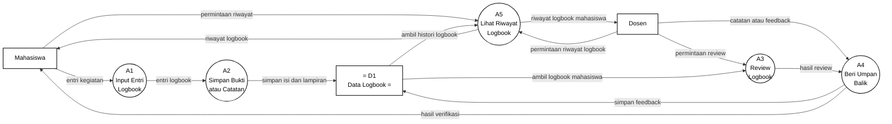

# Gambar 12. DFD Level 2 Proses 3.1 Logbook Digital dengan Notasi Yourdon/DeMarco

Dokumen ini menjadi panduan menggambar ulang DFD Level 2 proses `3.1 Logbook Digital` di Microsoft Visio. Fokus gambar adalah notasi DFD Yourdon/DeMarco, bukan flowchart dan bukan swimlane.

## Graph DFD Level 2 Proses 3.1 Logbook Digital



## Panduan Menggambar di Microsoft Visio

Gunakan stencil **Data Flow Diagram** di Microsoft Visio, lalu pilih simbol berikut:

| Komponen DFD | Simbol Visio | Elemen pada Diagram |
|---|---|---|
| Entitas eksternal | `External Interactor`, `External Interaction`, atau `Entity` | `Mahasiswa`, `Dosen` |
| Proses | `Data Process` | `A1` sampai `A5` |
| Data store | `Data Store` | `D1 Data Logbook` |
| Aliran data | `Dynamic Connector` dengan panah | Semua garis berlabel data |

Jangan gunakan simbol flowchart seperti `Start`, `Stop`, `Decision`, `Document`, atau swimlane, karena diagram ini dipertanggungjawabkan sebagai DFD Yourdon/DeMarco.

## Sketsa Posisi Gambar

Gunakan sketsa berikut sebagai acuan tata letak saat menggambar di Visio. Sketsa ini hanya menunjukkan posisi umum; label lengkap setiap panah ada pada bagian daftar aliran data.

```text
[Mahasiswa] ---> (A1 Input Entri Logbook) ---> (A2 Simpan Bukti atau Catatan) ---> D1 Data Logbook
     ^                                                                    |              |
     |                                                                    v              v
     |                                                            (A5 Lihat Riwayat) <---+
     |                                                                    |
     |                                                                    v
     +---------------------- (A4 Beri Umpan Balik) <--- (A3 Review Logbook) <--- [Dosen]
                                ^                                           ^
                                |                                           |
                           [Dosen] ---------------- permintaan review ------+

[Dosen] ---------------------- permintaan riwayat logbook ----------------> (A5 Lihat Riwayat)
[Mahasiswa] ------------------ permintaan riwayat ------------------------> (A5 Lihat Riwayat)
```

## Layout Visio yang Disarankan

| Posisi | Elemen | Simbol |
|---|---|---|
| Kiri atas | `Mahasiswa` | Entitas eksternal |
| Kanan atas | `Dosen` | Entitas eksternal |
| Tengah kiri atas | `A1 Input Entri Logbook` | Data Process |
| Tengah atas | `A2 Simpan Bukti atau Catatan` | Data Process |
| Tengah kanan | `A3 Review Logbook` | Data Process |
| Tengah bawah | `A4 Beri Umpan Balik` | Data Process |
| Tengah kiri bawah | `A5 Lihat Riwayat Logbook` | Data Process |
| Kanan/tengah dekat A2, A3, dan A5 | `D1 Data Logbook` | Data Store |

Pisahkan jalur pencatatan, review, umpan balik, dan riwayat. Jalur pencatatan bergerak dari `Mahasiswa -> A1 -> A2 -> D1`, jalur review bergerak dari `D1 -> A3 -> A4`, sedangkan jalur riwayat bergerak dari `D1 -> A5` lalu kembali ke Mahasiswa atau Dosen.

## Daftar Aliran Data yang Wajib Digambar

| No | Dari | Ke | Label Aliran Data |
|---|---|---|---|
| 1 | `Mahasiswa` | `A1 Input Entri Logbook` | `entri kegiatan` |
| 2 | `Dosen` | `A3 Review Logbook` | `permintaan review` |
| 3 | `Dosen` | `A4 Beri Umpan Balik` | `catatan atau feedback` |
| 4 | `Mahasiswa` | `A5 Lihat Riwayat Logbook` | `permintaan riwayat` |
| 5 | `Dosen` | `A5 Lihat Riwayat Logbook` | `permintaan riwayat logbook` |
| 6 | `A1 Input Entri Logbook` | `A2 Simpan Bukti atau Catatan` | `entri logbook` |
| 7 | `A3 Review Logbook` | `A4 Beri Umpan Balik` | `hasil review` |
| 8 | `A2 Simpan Bukti atau Catatan` | `D1 Data Logbook` | `simpan isi dan lampiran` |
| 9 | `D1 Data Logbook` | `A3 Review Logbook` | `ambil logbook mahasiswa` |
| 10 | `A4 Beri Umpan Balik` | `D1 Data Logbook` | `simpan feedback` |
| 11 | `D1 Data Logbook` | `A5 Lihat Riwayat Logbook` | `ambil histori logbook` |
| 12 | `A5 Lihat Riwayat Logbook` | `Mahasiswa` | `riwayat logbook` |
| 13 | `A5 Lihat Riwayat Logbook` | `Dosen` | `riwayat logbook mahasiswa` |
| 14 | `A4 Beri Umpan Balik` | `Mahasiswa` | `hasil verifikasi` |

## Keterangan Simbol untuk Skripsi

Diagram ini menggunakan notasi DFD Yourdon/DeMarco. Kotak menunjukkan entitas eksternal, lingkaran menunjukkan proses, data store menunjukkan tempat penyimpanan data, dan panah berlabel menunjukkan aliran data.

Pada diagram ini, `Mahasiswa` dan `Dosen` merupakan entitas eksternal. Proses internal logbook digital terdiri dari `A1 Input Entri Logbook`, `A2 Simpan Bukti atau Catatan`, `A3 Review Logbook`, `A4 Beri Umpan Balik`, dan `A5 Lihat Riwayat Logbook`. Data store yang digunakan adalah `D1 Data Logbook`.

## Ringkasan Alur

Proses `3.1 Logbook Digital` dimulai ketika `Mahasiswa` mengirim `entri kegiatan` ke `A1 Input Entri Logbook`. Entri tersebut diteruskan sebagai `entri logbook` ke `A2 Simpan Bukti atau Catatan`, kemudian disimpan ke `D1 Data Logbook` melalui aliran `simpan isi dan lampiran`.

Untuk proses review, `Dosen` mengirim `permintaan review` ke `A3 Review Logbook`. Proses ini mengambil `ambil logbook mahasiswa` dari `D1 Data Logbook`, lalu mengirim `hasil review` ke `A4 Beri Umpan Balik`. Dosen juga dapat mengirim `catatan atau feedback` ke `A4`, kemudian proses tersebut menyimpan `simpan feedback` ke `D1` dan mengirim `hasil verifikasi` kepada Mahasiswa.

Untuk melihat histori, `Mahasiswa` mengirim `permintaan riwayat` ke `A5 Lihat Riwayat Logbook`, sedangkan `Dosen` mengirim `permintaan riwayat logbook` ke proses yang sama. Proses `A5` mengambil `ambil histori logbook` dari `D1`, lalu mengirim `riwayat logbook` kepada Mahasiswa dan `riwayat logbook mahasiswa` kepada Dosen.
