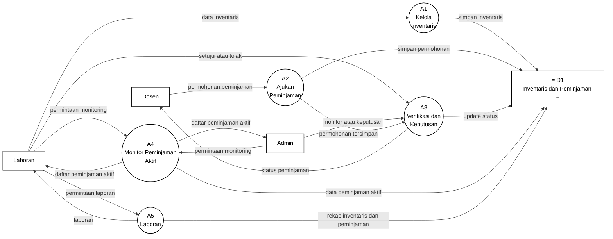

# Gambar 13. DFD Level 2 Proses 3.2 Peminjaman Alat dan Inventaris dengan Notasi Yourdon/DeMarco

Dokumen ini menjadi panduan menggambar ulang DFD Level 2 proses `3.2 Peminjaman Alat dan Inventaris` di Microsoft Visio. Fokus gambar adalah notasi DFD Yourdon/DeMarco, bukan flowchart dan bukan swimlane.

## Graph DFD Level 2 Proses 3.2 Peminjaman Alat dan Inventaris



## Panduan Menggambar di Microsoft Visio

Gunakan stencil **Data Flow Diagram** di Microsoft Visio, lalu pilih simbol berikut:

| Komponen DFD | Simbol Visio | Elemen pada Diagram |
|---|---|---|
| Entitas eksternal | `External Interactor`, `External Interaction`, atau `Entity` | `Dosen`, `Laboran`, `Admin` |
| Proses | `Data Process` | `A1` sampai `A5` |
| Data store | `Data Store` | `D1 Inventaris dan Peminjaman` |
| Aliran data | `Dynamic Connector` dengan panah | Semua garis berlabel data |

Jangan gunakan simbol flowchart seperti `Start`, `Stop`, `Decision`, `Document`, atau swimlane, karena diagram ini dipertanggungjawabkan sebagai DFD Yourdon/DeMarco.

## Sketsa Posisi Gambar

Gunakan sketsa berikut sebagai acuan tata letak saat menggambar di Visio. Sketsa ini hanya menunjukkan posisi umum; label lengkap setiap panah ada pada bagian daftar aliran data.

```text
[Laboran] ---> (A1 Kelola Inventaris) -----------------------> D1 Inventaris dan Peminjaman
     |                                                           ^       ^       ^
     |                                                           |       |       |
     |                                                           |       |       |
     |      [Dosen] ---> (A2 Ajukan Peminjaman) ---> (A3 Verifikasi dan Keputusan) ---> [Dosen]
     |                              |                       ^       |
     |                              +-----------------------+       |
     |                                                              |
     +-----------> (A4 Monitor Peminjaman Aktif) -------------------+
     |                    |                    ^
     |                    v                    |
     |                [Laboran]             [Admin]
     |
     +-----------> (A5 Laporan) -----------------------------------> D1 Inventaris dan Peminjaman
                          |
                          v
                      [Laboran]

[Admin] ---- monitor atau keputusan ----> (A3 Verifikasi dan Keputusan)
[Admin] ---- permintaan monitoring -----> (A4 Monitor Peminjaman Aktif)
```

## Layout Visio yang Disarankan

| Posisi | Elemen | Simbol |
|---|---|---|
| Kiri atas | `Laboran` | Entitas eksternal |
| Kiri tengah | `Dosen` | Entitas eksternal |
| Kiri bawah | `Admin` | Entitas eksternal |
| Tengah atas | `A1 Kelola Inventaris` | Data Process |
| Tengah kiri | `A2 Ajukan Peminjaman` | Data Process |
| Tengah | `A3 Verifikasi dan Keputusan` | Data Process |
| Tengah bawah | `A4 Monitor Peminjaman Aktif` | Data Process |
| Kanan bawah | `A5 Laporan` | Data Process |
| Kanan tengah dekat semua proses | `D1 Inventaris dan Peminjaman` | Data Store |

Pisahkan jalur inventaris, pengajuan, verifikasi, monitoring, dan laporan. Jalur inventaris bergerak dari `Laboran -> A1 -> D1`, jalur pengajuan bergerak dari `Dosen -> A2 -> A3`, jalur keputusan bergerak dari `A3 -> D1` dan `A3 -> Dosen`, sedangkan jalur monitoring dan laporan bergerak dari proses terkait menuju `D1` dan kembali ke entitas yang meminta.

## Daftar Aliran Data yang Wajib Digambar

| No | Dari | Ke | Label Aliran Data |
|---|---|---|---|
| 1 | `Laboran` | `A1 Kelola Inventaris` | `data inventaris` |
| 2 | `Dosen` | `A2 Ajukan Peminjaman` | `permohonan peminjaman` |
| 3 | `Laboran` | `A3 Verifikasi dan Keputusan` | `setujui atau tolak` |
| 4 | `Admin` | `A3 Verifikasi dan Keputusan` | `monitor atau keputusan` |
| 5 | `Laboran` | `A4 Monitor Peminjaman Aktif` | `permintaan monitoring` |
| 6 | `Admin` | `A4 Monitor Peminjaman Aktif` | `permintaan monitoring` |
| 7 | `Laboran` | `A5 Laporan` | `permintaan laporan` |
| 8 | `A2 Ajukan Peminjaman` | `A3 Verifikasi dan Keputusan` | `permohonan tersimpan` |
| 9 | `A1 Kelola Inventaris` | `D1 Inventaris dan Peminjaman` | `simpan inventaris` |
| 10 | `A2 Ajukan Peminjaman` | `D1 Inventaris dan Peminjaman` | `simpan permohonan` |
| 11 | `A3 Verifikasi dan Keputusan` | `D1 Inventaris dan Peminjaman` | `update status` |
| 12 | `A4 Monitor Peminjaman Aktif` | `D1 Inventaris dan Peminjaman` | `data peminjaman aktif` |
| 13 | `A5 Laporan` | `D1 Inventaris dan Peminjaman` | `rekap inventaris dan peminjaman` |
| 14 | `A3 Verifikasi dan Keputusan` | `Dosen` | `status peminjaman` |
| 15 | `A4 Monitor Peminjaman Aktif` | `Laboran` | `daftar peminjaman aktif` |
| 16 | `A4 Monitor Peminjaman Aktif` | `Admin` | `daftar peminjaman aktif` |
| 17 | `A5 Laporan` | `Laboran` | `laporan` |

## Keterangan Simbol untuk Skripsi

Diagram ini menggunakan notasi DFD Yourdon/DeMarco. Kotak menunjukkan entitas eksternal, lingkaran menunjukkan proses, data store menunjukkan tempat penyimpanan data, dan panah berlabel menunjukkan aliran data.

Pada diagram ini, `Dosen`, `Laboran`, dan `Admin` merupakan entitas eksternal. Proses internal peminjaman alat dan inventaris terdiri dari `A1 Kelola Inventaris`, `A2 Ajukan Peminjaman`, `A3 Verifikasi dan Keputusan`, `A4 Monitor Peminjaman Aktif`, dan `A5 Laporan`. Data store yang digunakan adalah `D1 Inventaris dan Peminjaman`.

## Ringkasan Alur

Proses `3.2 Peminjaman Alat dan Inventaris` dimulai ketika `Laboran` mengirim `data inventaris` ke `A1 Kelola Inventaris`. Proses ini menyimpan `simpan inventaris` ke `D1 Inventaris dan Peminjaman` agar data alat laboratorium tetap tercatat.

Pada alur peminjaman, `Dosen` mengirim `permohonan peminjaman` ke `A2 Ajukan Peminjaman`. Proses `A2` menyimpan `simpan permohonan` ke `D1`, lalu meneruskan `permohonan tersimpan` ke `A3 Verifikasi dan Keputusan`. `Laboran` dapat mengirim `setujui atau tolak`, sedangkan `Admin` dapat mengirim `monitor atau keputusan` ke proses verifikasi. Hasil keputusan disimpan sebagai `update status` ke `D1` dan dikirim kepada Dosen sebagai `status peminjaman`.

Untuk monitoring, `Laboran` dan `Admin` mengirim `permintaan monitoring` ke `A4 Monitor Peminjaman Aktif`. Proses ini mengirim `data peminjaman aktif` ke `D1`, lalu menghasilkan `daftar peminjaman aktif` untuk Laboran dan Admin. Untuk pelaporan, `Laboran` mengirim `permintaan laporan` ke `A5 Laporan`; proses ini mengirim `rekap inventaris dan peminjaman` ke `D1` dan menghasilkan `laporan` kepada Laboran.
