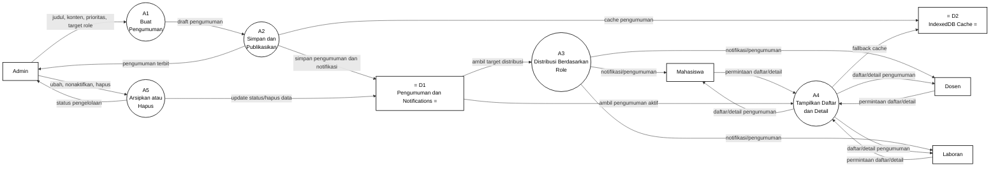

# Gambar 14. DFD Level 2 Proses 3.3 Pengumuman dan Notifikasi dengan Notasi Yourdon/DeMarco

Dokumen ini menjadi panduan menggambar ulang DFD Level 2 proses `3.3 Pengumuman dan Notifikasi` di Microsoft Visio. Fokus gambar adalah notasi DFD Yourdon/DeMarco, bukan flowchart dan bukan swimlane.

## Graph DFD Level 2 Proses 3.3 Pengumuman dan Notifikasi



## Panduan Menggambar di Microsoft Visio

Gunakan stencil **Data Flow Diagram** di Microsoft Visio, lalu pilih simbol berikut:

| Komponen DFD | Simbol Visio | Elemen pada Diagram |
|---|---|---|
| Entitas eksternal | `External Interactor`, `External Interaction`, atau `Entity` | `Admin`, `Dosen`, `Mahasiswa`, `Laboran` |
| Proses | `Data Process` | `A1` sampai `A5` |
| Data store | `Data Store` | `D1 Pengumuman dan Notifications`, `D2 IndexedDB Cache` |
| Aliran data | `Dynamic Connector` dengan panah | Semua garis berlabel data |

Jangan gunakan simbol flowchart seperti `Start`, `Stop`, `Decision`, `Document`, atau swimlane, karena diagram ini dipertanggungjawabkan sebagai DFD Yourdon/DeMarco.

## Sketsa Posisi Gambar

Gunakan sketsa berikut sebagai acuan tata letak saat menggambar di Visio. Sketsa ini hanya menunjukkan posisi umum; label lengkap setiap panah ada pada bagian daftar aliran data.

```text
[Admin] ---> (A1 Buat Pengumuman) ---> (A2 Simpan dan Publikasikan) ---> D1 Pengumuman dan Notifications
   ^                                         |                                 |              |
   |                                         v                                 v              v
   |                                    D2 IndexedDB Cache        (A3 Distribusi Role)   (A4 Tampilkan Daftar)
   |                                                                          |              ^
   |                                                                          |              |
   +--- (A5 Arsipkan atau Hapus) --------------------------------------------+              |
          |                                                                                  |
          v                                                                                  |
   D1 Pengumuman dan Notifications                                                           |
                                                                                              |
[Dosen] ---------------- permintaan daftar/detail ------------------------------------------+
[Mahasiswa] ------------ permintaan daftar/detail ------------------------------------------+
[Laboran] -------------- permintaan daftar/detail ------------------------------------------+

(A3 Distribusi Role) ---> [Mahasiswa]
(A3 Distribusi Role) ---> [Dosen]
(A3 Distribusi Role) ---> [Laboran]
(A4 Tampilkan Daftar) --> [Dosen] / [Mahasiswa] / [Laboran]
```

## Layout Visio yang Disarankan

| Posisi | Elemen | Simbol |
|---|---|---|
| Kiri atas | `Admin` | Entitas eksternal |
| Kiri tengah | `Dosen` | Entitas eksternal |
| Kiri bawah | `Mahasiswa` | Entitas eksternal |
| Bawah kiri | `Laboran` | Entitas eksternal |
| Tengah atas kiri | `A1 Buat Pengumuman` | Data Process |
| Tengah atas | `A2 Simpan dan Publikasikan` | Data Process |
| Tengah kanan atas | `A3 Distribusi Berdasarkan Role` | Data Process |
| Tengah kanan bawah | `A4 Tampilkan Daftar dan Detail` | Data Process |
| Tengah bawah | `A5 Arsipkan atau Hapus` | Data Process |
| Kanan atas | `D1 Pengumuman dan Notifications` | Data Store |
| Kanan bawah dekat A2 dan A4 | `D2 IndexedDB Cache` | Data Store |

Pisahkan jalur pembuatan, publikasi, distribusi, penayangan, dan pengarsipan. Jalur pembuatan bergerak dari `Admin -> A1 -> A2`, jalur distribusi bergerak dari `D1 -> A3` lalu menuju role penerima, jalur penayangan bergerak dari pengguna ke `A4`, sedangkan jalur pengelolaan bergerak dari `Admin -> A5 -> D1`.

## Daftar Aliran Data yang Wajib Digambar

| No | Dari | Ke | Label Aliran Data |
|---|---|---|---|
| 1 | `Admin` | `A1 Buat Pengumuman` | `judul, konten, prioritas, target role` |
| 2 | `Dosen` | `A4 Tampilkan Daftar dan Detail` | `permintaan daftar/detail` |
| 3 | `Mahasiswa` | `A4 Tampilkan Daftar dan Detail` | `permintaan daftar/detail` |
| 4 | `Laboran` | `A4 Tampilkan Daftar dan Detail` | `permintaan daftar/detail` |
| 5 | `Admin` | `A5 Arsipkan atau Hapus` | `ubah, nonaktifkan, hapus` |
| 6 | `A1 Buat Pengumuman` | `A2 Simpan dan Publikasikan` | `draft pengumuman` |
| 7 | `A2 Simpan dan Publikasikan` | `D1 Pengumuman dan Notifications` | `simpan pengumuman dan notifikasi` |
| 8 | `A2 Simpan dan Publikasikan` | `D2 IndexedDB Cache` | `cache pengumuman` |
| 9 | `D1 Pengumuman dan Notifications` | `A3 Distribusi Berdasarkan Role` | `ambil target distribusi` |
| 10 | `D1 Pengumuman dan Notifications` | `A4 Tampilkan Daftar dan Detail` | `ambil pengumuman aktif` |
| 11 | `A4 Tampilkan Daftar dan Detail` | `D2 IndexedDB Cache` | `fallback cache` |
| 12 | `A5 Arsipkan atau Hapus` | `D1 Pengumuman dan Notifications` | `update status/hapus data` |
| 13 | `A2 Simpan dan Publikasikan` | `Admin` | `pengumuman terbit` |
| 14 | `A3 Distribusi Berdasarkan Role` | `Mahasiswa` | `notifikasi/pengumuman` |
| 15 | `A3 Distribusi Berdasarkan Role` | `Dosen` | `notifikasi/pengumuman` |
| 16 | `A3 Distribusi Berdasarkan Role` | `Laboran` | `notifikasi/pengumuman` |
| 17 | `A4 Tampilkan Daftar dan Detail` | `Dosen` | `daftar/detail pengumuman` |
| 18 | `A4 Tampilkan Daftar dan Detail` | `Mahasiswa` | `daftar/detail pengumuman` |
| 19 | `A4 Tampilkan Daftar dan Detail` | `Laboran` | `daftar/detail pengumuman` |
| 20 | `A5 Arsipkan atau Hapus` | `Admin` | `status pengelolaan` |

## Keterangan Simbol untuk Skripsi

Diagram ini menggunakan notasi DFD Yourdon/DeMarco. Kotak menunjukkan entitas eksternal, lingkaran menunjukkan proses, data store menunjukkan tempat penyimpanan data, dan panah berlabel menunjukkan aliran data.

Pada diagram ini, `Admin`, `Dosen`, `Mahasiswa`, dan `Laboran` merupakan entitas eksternal. Proses internal pengumuman dan notifikasi terdiri dari `A1 Buat Pengumuman`, `A2 Simpan dan Publikasikan`, `A3 Distribusi Berdasarkan Role`, `A4 Tampilkan Daftar dan Detail`, dan `A5 Arsipkan atau Hapus`. Data store yang digunakan adalah `D1 Pengumuman dan Notifications` serta `D2 IndexedDB Cache`.

## Ringkasan Alur

Proses `3.3 Pengumuman dan Notifikasi` dimulai ketika `Admin` mengirim `judul, konten, prioritas, target role` ke `A1 Buat Pengumuman`. Data tersebut diteruskan sebagai `draft pengumuman` ke `A2 Simpan dan Publikasikan`, kemudian disimpan ke `D1 Pengumuman dan Notifications` melalui aliran `simpan pengumuman dan notifikasi`. Proses `A2` juga menyimpan `cache pengumuman` ke `D2 IndexedDB Cache` dan mengirim `pengumuman terbit` kepada Admin.

Setelah pengumuman aktif, `D1` mengirim `ambil target distribusi` ke `A3 Distribusi Berdasarkan Role`. Proses ini mendistribusikan `notifikasi/pengumuman` kepada Mahasiswa, Dosen, dan Laboran sesuai target role.

Untuk membaca pengumuman, `Dosen`, `Mahasiswa`, dan `Laboran` mengirim `permintaan daftar/detail` ke `A4 Tampilkan Daftar dan Detail`. Proses `A4` mengambil `ambil pengumuman aktif` dari `D1`, menggunakan `fallback cache` ke `D2` bila diperlukan, lalu mengirim `daftar/detail pengumuman` kepada masing-masing pengguna. Untuk pengelolaan akhir, `Admin` mengirim `ubah, nonaktifkan, hapus` ke `A5 Arsipkan atau Hapus`, lalu proses tersebut memperbarui `update status/hapus data` ke `D1` dan mengirim `status pengelolaan` kepada Admin.
