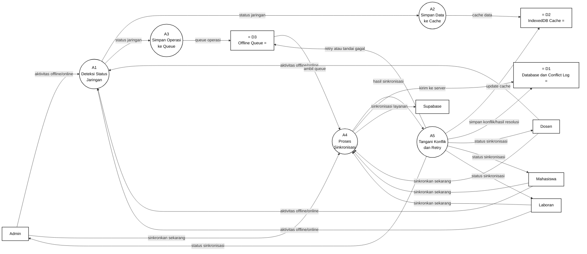

# Gambar 15. DFD Level 2 Proses 4.1 Sinkronisasi Offline PWA dengan Notasi Yourdon/DeMarco

Dokumen ini menjadi panduan menggambar ulang DFD Level 2 proses `4.1 Sinkronisasi Offline PWA` di Microsoft Visio. Fokus gambar adalah notasi DFD Yourdon/DeMarco, bukan flowchart dan bukan swimlane.

## Graph DFD Level 2 Proses 4.1 Sinkronisasi Offline PWA



## Panduan Menggambar di Microsoft Visio

Gunakan stencil **Data Flow Diagram** di Microsoft Visio, lalu pilih simbol berikut:

| Komponen DFD | Simbol Visio | Elemen pada Diagram |
|---|---|---|
| Entitas eksternal | `External Interactor`, `External Interaction`, atau `Entity` | `Admin`, `Dosen`, `Mahasiswa`, `Laboran`, `Supabase` |
| Proses | `Data Process` | `A1` sampai `A5` |
| Data store | `Data Store` | `D1 Database dan Conflict Log`, `D2 IndexedDB Cache`, `D3 Offline Queue` |
| Aliran data | `Dynamic Connector` dengan panah | Semua garis berlabel data |

Jangan gunakan simbol flowchart seperti `Start`, `Stop`, `Decision`, `Document`, atau swimlane, karena diagram ini dipertanggungjawabkan sebagai DFD Yourdon/DeMarco.

## Sketsa Posisi Gambar

Gunakan sketsa berikut sebagai acuan tata letak saat menggambar di Visio. Sketsa ini hanya menunjukkan posisi umum; label lengkap setiap panah ada pada bagian daftar aliran data.

```text
[Admin] -----\
[Dosen] ------\
[Mahasiswa] ----> (A1 Deteksi Status Jaringan) ---> (A2 Simpan Data ke Cache) ---> D2 IndexedDB Cache
[Laboran] ----/             |
                            v
                    (A3 Simpan Operasi ke Queue) ---> D3 Offline Queue
                                                             |
                                                             v
[Admin] -----\                                      (A4 Proses Sinkronisasi) ---> [Supabase]
[Dosen] ------\                                             |
[Mahasiswa] ----> sinkronkan sekarang ----------------------+----> D1 Database dan Conflict Log
[Laboran] ----/                                             |
                                                             v
                                                   (A5 Tangani Konflik dan Retry)
                                                     |           |              |
                                                     v           v              v
                                               D2 IndexedDB   D3 Offline     D1 Database
                                                   Cache        Queue      dan Conflict Log

(A5 Tangani Konflik dan Retry) ---> [Admin] / [Dosen] / [Mahasiswa] / [Laboran]
```

## Layout Visio yang Disarankan

| Posisi | Elemen | Simbol |
|---|---|---|
| Kiri atas | `Admin` | Entitas eksternal |
| Kiri tengah atas | `Dosen` | Entitas eksternal |
| Kiri tengah bawah | `Mahasiswa` | Entitas eksternal |
| Kiri bawah | `Laboran` | Entitas eksternal |
| Kanan atas | `Supabase` | Entitas eksternal |
| Tengah atas kiri | `A1 Deteksi Status Jaringan` | Data Process |
| Tengah atas | `A2 Simpan Data ke Cache` | Data Process |
| Tengah kiri bawah | `A3 Simpan Operasi ke Queue` | Data Process |
| Tengah | `A4 Proses Sinkronisasi` | Data Process |
| Tengah kanan bawah | `A5 Tangani Konflik dan Retry` | Data Process |
| Kanan tengah | `D1 Database dan Conflict Log` | Data Store |
| Kanan bawah kiri | `D2 IndexedDB Cache` | Data Store |
| Kanan bawah | `D3 Offline Queue` | Data Store |

Pisahkan jalur deteksi jaringan, penyimpanan cache, antrean offline, sinkronisasi, dan penanganan konflik. Jalur awal bergerak dari pengguna ke `A1`, lalu bercabang ke `A2` untuk cache dan `A3` untuk queue. Jalur sinkronisasi bergerak dari pengguna ke `A4`, mengambil queue dari `D3`, berhubungan dengan `D1` dan `Supabase`, lalu diteruskan ke `A5` untuk hasil, retry, cache, dan status sinkronisasi.

## Daftar Aliran Data yang Wajib Digambar

| No | Dari | Ke | Label Aliran Data |
|---|---|---|---|
| 1 | `Admin` | `A1 Deteksi Status Jaringan` | `aktivitas offline/online` |
| 2 | `Dosen` | `A1 Deteksi Status Jaringan` | `aktivitas offline/online` |
| 3 | `Mahasiswa` | `A1 Deteksi Status Jaringan` | `aktivitas offline/online` |
| 4 | `Laboran` | `A1 Deteksi Status Jaringan` | `aktivitas offline/online` |
| 5 | `A1 Deteksi Status Jaringan` | `A2 Simpan Data ke Cache` | `status jaringan` |
| 6 | `A1 Deteksi Status Jaringan` | `A3 Simpan Operasi ke Queue` | `status jaringan` |
| 7 | `A4 Proses Sinkronisasi` | `A5 Tangani Konflik dan Retry` | `hasil sinkronisasi` |
| 8 | `A2 Simpan Data ke Cache` | `D2 IndexedDB Cache` | `cache data` |
| 9 | `A3 Simpan Operasi ke Queue` | `D3 Offline Queue` | `queue operasi` |
| 10 | `Admin` | `A4 Proses Sinkronisasi` | `sinkronkan sekarang` |
| 11 | `Dosen` | `A4 Proses Sinkronisasi` | `sinkronkan sekarang` |
| 12 | `Mahasiswa` | `A4 Proses Sinkronisasi` | `sinkronkan sekarang` |
| 13 | `Laboran` | `A4 Proses Sinkronisasi` | `sinkronkan sekarang` |
| 14 | `D3 Offline Queue` | `A4 Proses Sinkronisasi` | `ambil queue` |
| 15 | `A4 Proses Sinkronisasi` | `D1 Database dan Conflict Log` | `kirim ke server` |
| 16 | `A4 Proses Sinkronisasi` | `Supabase` | `sinkronisasi layanan` |
| 17 | `A5 Tangani Konflik dan Retry` | `D2 IndexedDB Cache` | `update cache` |
| 18 | `A5 Tangani Konflik dan Retry` | `D3 Offline Queue` | `retry atau tandai gagal` |
| 19 | `A5 Tangani Konflik dan Retry` | `D1 Database dan Conflict Log` | `simpan konflik/hasil resolusi` |
| 20 | `A5 Tangani Konflik dan Retry` | `Admin` | `status sinkronisasi` |
| 21 | `A5 Tangani Konflik dan Retry` | `Dosen` | `status sinkronisasi` |
| 22 | `A5 Tangani Konflik dan Retry` | `Mahasiswa` | `status sinkronisasi` |
| 23 | `A5 Tangani Konflik dan Retry` | `Laboran` | `status sinkronisasi` |

## Keterangan Simbol untuk Skripsi

Diagram ini menggunakan notasi DFD Yourdon/DeMarco. Kotak menunjukkan entitas eksternal, lingkaran menunjukkan proses, data store menunjukkan tempat penyimpanan data, dan panah berlabel menunjukkan aliran data.

Pada diagram ini, `Admin`, `Dosen`, `Mahasiswa`, `Laboran`, dan `Supabase` merupakan entitas eksternal. Proses internal sinkronisasi offline PWA terdiri dari `A1 Deteksi Status Jaringan`, `A2 Simpan Data ke Cache`, `A3 Simpan Operasi ke Queue`, `A4 Proses Sinkronisasi`, dan `A5 Tangani Konflik dan Retry`. Data store yang digunakan adalah `D1 Database dan Conflict Log`, `D2 IndexedDB Cache`, dan `D3 Offline Queue`.

## Ringkasan Alur

Proses `4.1 Sinkronisasi Offline PWA` dimulai ketika `Admin`, `Dosen`, `Mahasiswa`, atau `Laboran` mengirim `aktivitas offline/online` ke `A1 Deteksi Status Jaringan`. Proses `A1` menghasilkan `status jaringan` yang diteruskan ke `A2 Simpan Data ke Cache` dan `A3 Simpan Operasi ke Queue`. Proses `A2` menyimpan `cache data` ke `D2 IndexedDB Cache`, sedangkan `A3` menyimpan `queue operasi` ke `D3 Offline Queue`.

Ketika sinkronisasi dijalankan, pengguna mengirim `sinkronkan sekarang` ke `A4 Proses Sinkronisasi`. Proses `A4` mengambil `ambil queue` dari `D3 Offline Queue`, mengirim `kirim ke server` ke `D1 Database dan Conflict Log`, serta mengirim `sinkronisasi layanan` ke Supabase. Hasil proses tersebut diteruskan sebagai `hasil sinkronisasi` ke `A5 Tangani Konflik dan Retry`.

Pada tahap akhir, `A5` memperbarui `update cache` ke `D2`, mengirim `retry atau tandai gagal` ke `D3`, dan menyimpan `simpan konflik/hasil resolusi` ke `D1`. Setelah proses selesai, `A5` mengirim `status sinkronisasi` kepada Admin, Dosen, Mahasiswa, dan Laboran.
