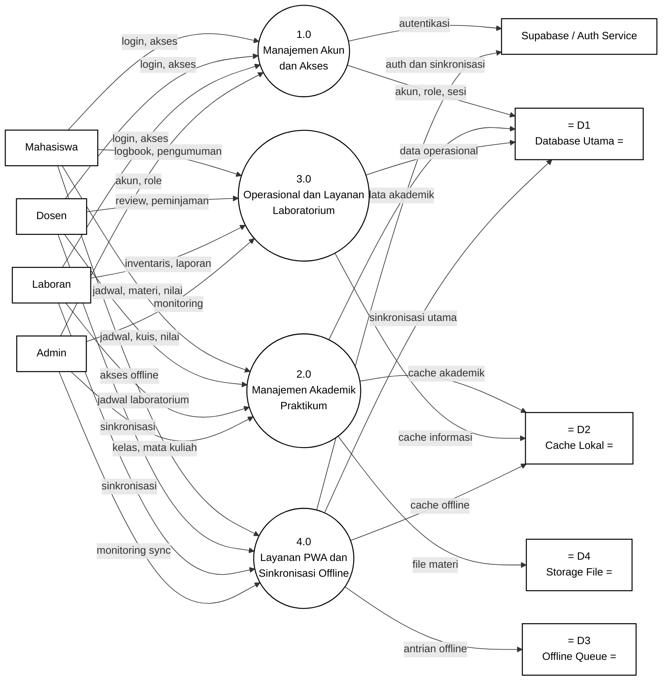

# Gambar 16. DFD Level 1 Sistem Informasi Praktikum PWA dengan Notasi Yourdon/DeMarco

Dokumen ini menjadi panduan menggambar ulang DFD Level 1 sistem informasi praktikum berbasis PWA di Microsoft Visio. Fokus gambar adalah notasi DFD Yourdon/DeMarco, bukan flowchart dan bukan swimlane.

## Graph DFD Level 1 Sistem Informasi Praktikum PWA



## Panduan Menggambar di Microsoft Visio

Gunakan stencil **Data Flow Diagram** di Microsoft Visio, lalu pilih simbol berikut:

| Komponen DFD | Simbol Visio | Elemen pada Diagram |
|---|---|---|
| Entitas eksternal | `External Interactor`, `External Interaction`, atau `Entity` | `Mahasiswa`, `Dosen`, `Laboran`, `Admin`, `Supabase / Auth Service` |
| Proses | `Data Process` | `1.0` sampai `4.0` |
| Data store | `Data Store` | `D1 Database Utama`, `D2 Cache Lokal`, `D3 Offline Queue`, `D4 Storage File` |
| Aliran data | `Dynamic Connector` dengan panah | Semua garis berlabel data |

Jangan gunakan simbol flowchart seperti `Start`, `Stop`, `Decision`, `Document`, atau swimlane, karena diagram ini dipertanggungjawabkan sebagai DFD Yourdon/DeMarco.

## Sketsa Posisi Gambar

Gunakan sketsa berikut sebagai acuan tata letak saat menggambar di Visio. Sketsa ini hanya menunjukkan posisi umum; label lengkap setiap panah ada pada bagian daftar aliran data.

```text
[Mahasiswa] ----\
[Dosen] --------+----> (1.0 Manajemen Akun dan Akses) --------> D1 Database Utama
[Laboran] ------/                         |
[Admin] ---------------- akun, role ------+--------------------> [Supabase / Auth Service]

[Mahasiswa] ----\
[Dosen] --------+----> (2.0 Manajemen Akademik Praktikum) ----> D1 Database Utama
[Laboran] ------/                         |                    D2 Cache Lokal
[Admin] ----------------------------------+                    D4 Storage File

[Mahasiswa] ----\
[Dosen] --------+----> (3.0 Operasional dan Layanan Lab) -----> D1 Database Utama
[Laboran] ------/                         |
[Admin] ----------------------------------+-------------------> D2 Cache Lokal

[Mahasiswa] ----\
[Dosen] --------+----> (4.0 Layanan PWA dan Sinkronisasi) ----> D1 Database Utama
[Laboran] ------/                         |                    D2 Cache Lokal
[Admin] ----------------------------------+                    D3 Offline Queue
                                            \-----------------> [Supabase / Auth Service]
```

## Layout Visio yang Disarankan

| Posisi | Elemen | Simbol |
|---|---|---|
| Kiri atas | `Mahasiswa` | Entitas eksternal |
| Kiri tengah atas | `Dosen` | Entitas eksternal |
| Kiri tengah bawah | `Laboran` | Entitas eksternal |
| Kiri bawah | `Admin` | Entitas eksternal |
| Tengah atas | `1.0 Manajemen Akun dan Akses` | Data Process |
| Tengah atas bawah | `2.0 Manajemen Akademik Praktikum` | Data Process |
| Tengah bawah atas | `3.0 Operasional dan Layanan Laboratorium` | Data Process |
| Tengah bawah | `4.0 Layanan PWA dan Sinkronisasi Offline` | Data Process |
| Kanan atas | `Supabase / Auth Service` | Entitas eksternal |
| Kanan tengah atas | `D1 Database Utama` | Data Store |
| Kanan tengah | `D2 Cache Lokal` | Data Store |
| Kanan tengah bawah | `D3 Offline Queue` | Data Store |
| Kanan bawah | `D4 Storage File` | Data Store |

Letakkan entitas pengguna di sisi kiri, proses utama di tengah, dan data store di sisi kanan. `Supabase / Auth Service` dapat diletakkan di kanan atas karena terhubung dengan proses `1.0` dan `4.0`. Gunakan konektor orthogonal agar label data tetap mudah dibaca.

## Daftar Aliran Data yang Wajib Digambar

| No | Dari | Ke | Label Aliran Data |
|---|---|---|---|
| 1 | `Mahasiswa` | `1.0 Manajemen Akun dan Akses` | `login, akses` |
| 2 | `Dosen` | `1.0 Manajemen Akun dan Akses` | `login, akses` |
| 3 | `Laboran` | `1.0 Manajemen Akun dan Akses` | `login, akses` |
| 4 | `Admin` | `1.0 Manajemen Akun dan Akses` | `akun, role` |
| 5 | `1.0 Manajemen Akun dan Akses` | `Supabase / Auth Service` | `autentikasi` |
| 6 | `1.0 Manajemen Akun dan Akses` | `D1 Database Utama` | `akun, role, sesi` |
| 7 | `Mahasiswa` | `2.0 Manajemen Akademik Praktikum` | `jadwal, materi, nilai` |
| 8 | `Dosen` | `2.0 Manajemen Akademik Praktikum` | `jadwal, kuis, nilai` |
| 9 | `Laboran` | `2.0 Manajemen Akademik Praktikum` | `jadwal laboratorium` |
| 10 | `Admin` | `2.0 Manajemen Akademik Praktikum` | `kelas, mata kuliah` |
| 11 | `2.0 Manajemen Akademik Praktikum` | `D1 Database Utama` | `data akademik` |
| 12 | `2.0 Manajemen Akademik Praktikum` | `D2 Cache Lokal` | `cache akademik` |
| 13 | `2.0 Manajemen Akademik Praktikum` | `D4 Storage File` | `file materi` |
| 14 | `Mahasiswa` | `3.0 Operasional dan Layanan Laboratorium` | `logbook, pengumuman` |
| 15 | `Dosen` | `3.0 Operasional dan Layanan Laboratorium` | `review, peminjaman` |
| 16 | `Laboran` | `3.0 Operasional dan Layanan Laboratorium` | `inventaris, laporan` |
| 17 | `Admin` | `3.0 Operasional dan Layanan Laboratorium` | `monitoring` |
| 18 | `3.0 Operasional dan Layanan Laboratorium` | `D1 Database Utama` | `data operasional` |
| 19 | `3.0 Operasional dan Layanan Laboratorium` | `D2 Cache Lokal` | `cache informasi` |
| 20 | `Mahasiswa` | `4.0 Layanan PWA dan Sinkronisasi Offline` | `akses offline` |
| 21 | `Dosen` | `4.0 Layanan PWA dan Sinkronisasi Offline` | `sinkronisasi` |
| 22 | `Laboran` | `4.0 Layanan PWA dan Sinkronisasi Offline` | `sinkronisasi` |
| 23 | `Admin` | `4.0 Layanan PWA dan Sinkronisasi Offline` | `monitoring sync` |
| 24 | `4.0 Layanan PWA dan Sinkronisasi Offline` | `D1 Database Utama` | `sinkronisasi utama` |
| 25 | `4.0 Layanan PWA dan Sinkronisasi Offline` | `D2 Cache Lokal` | `cache offline` |
| 26 | `4.0 Layanan PWA dan Sinkronisasi Offline` | `D3 Offline Queue` | `antrian offline` |
| 27 | `4.0 Layanan PWA dan Sinkronisasi Offline` | `Supabase / Auth Service` | `auth dan sinkronisasi` |

## Keterangan Simbol untuk Skripsi

Diagram ini menggunakan notasi DFD Yourdon/DeMarco. Kotak menunjukkan entitas eksternal, lingkaran menunjukkan proses, data store menunjukkan tempat penyimpanan data, dan panah berlabel menunjukkan aliran data.

Pada diagram ini, `Mahasiswa`, `Dosen`, `Laboran`, `Admin`, dan `Supabase / Auth Service` merupakan entitas eksternal. Proses utama sistem terdiri dari `1.0 Manajemen Akun dan Akses`, `2.0 Manajemen Akademik Praktikum`, `3.0 Operasional dan Layanan Laboratorium`, dan `4.0 Layanan PWA dan Sinkronisasi Offline`. Data store yang digunakan adalah `D1 Database Utama`, `D2 Cache Lokal`, `D3 Offline Queue`, dan `D4 Storage File`.

## Ringkasan Alur

DFD Level 1 menggambarkan aliran data utama sistem informasi praktikum berbasis PWA. Proses `1.0 Manajemen Akun dan Akses` menerima data `login, akses` dari Mahasiswa, Dosen, dan Laboran, serta `akun, role` dari Admin. Proses ini berhubungan dengan `Supabase / Auth Service` melalui aliran `autentikasi` dan menyimpan `akun, role, sesi` ke `D1 Database Utama`.

Proses `2.0 Manajemen Akademik Praktikum` menangani data akademik seperti `jadwal, materi, nilai`, `jadwal, kuis, nilai`, `jadwal laboratorium`, serta `kelas, mata kuliah`. Hasil pengelolaannya terhubung ke `D1 Database Utama`, `D2 Cache Lokal`, dan `D4 Storage File`.

Proses `3.0 Operasional dan Layanan Laboratorium` menangani `logbook, pengumuman`, `review, peminjaman`, `inventaris, laporan`, dan `monitoring`. Data operasional disimpan ke `D1 Database Utama`, sedangkan informasi tertentu dapat disimpan ke `D2 Cache Lokal`.

Proses `4.0 Layanan PWA dan Sinkronisasi Offline` menangani akses offline, sinkronisasi, dan monitoring sinkronisasi. Proses ini berhubungan dengan `D1 Database Utama`, `D2 Cache Lokal`, `D3 Offline Queue`, serta `Supabase / Auth Service` untuk mendukung layanan PWA dan sinkronisasi offline.
