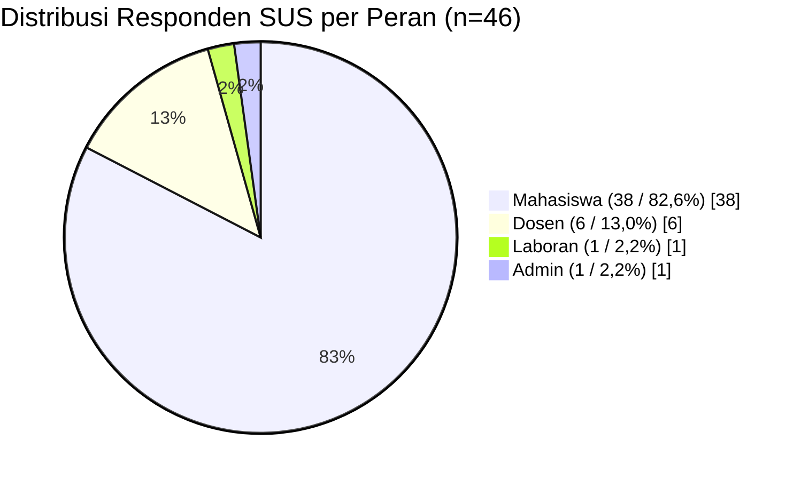

# Gambar 40. Diagram Distribusi Responden SUS per Peran

## Data Responden

| Peran | Jumlah | Persentase |
|---|---:|---:|
| Mahasiswa | 38 | 82,6% |
| Dosen | 6 | 13,0% |
| Laboran | 1 | 2,2% |
| Admin | 1 | 2,2% |
| **Total** | **46** | **100%** |

## Diagram (Mermaid)

## Narasi Singkat

Berdasarkan diagram, komposisi responden didominasi oleh mahasiswa (82,6%), diikuti dosen (13,0%), serta laboran dan admin masing-masing 2,2%. Distribusi ini menunjukkan bahwa evaluasi usability terutama merepresentasikan pengalaman pengguna utama sistem, namun tetap mencakup peran pendukung untuk menjaga representativitas penilaian.
