# Data Flow Diagram (DFD)
## Sistem Praktikum PWA - All Levels

---

## 1. NOTASI & SIMBOL

### Simbol DFD yang Digunakan:

```
┌─────────────┐
│  PROCESS    │  = Proses/Transformasi (circle/rounded rectangle)
└─────────────┘

┌─────────────┐
│   ENTITY    │  = Entity External (terminator)
└─────────────┘

┌─────────────┐
│  DATA STORE │  = Data Storage (database)
└─────────────┘

──────→        = Data Flow (panah)
```

---

## 2. DFD LEVEL 0 - CONTEXT DIAGRAM

### 2.1 Context Diagram (Mermaid)

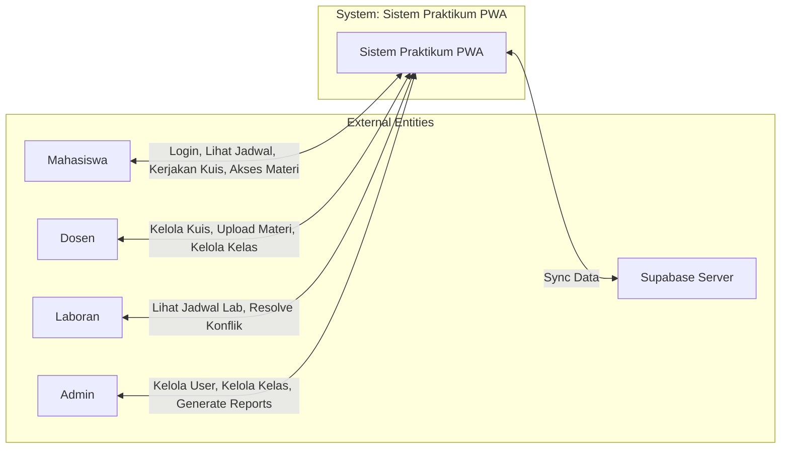

### 2.2 Deskripsi Context Diagram

**Sistem**: Sistem Praktikum PWA
**External Entities**: 5 entities
- Mahasiswa
- Dosen
- Laboran
- Admin
- Supabase Server

**Data Flows**:
- Mahasiswa → Sistem: Login request, lihat jadwal, kerjakan kuis
- Sistem → Mahasiswa: Jadwal praktikum, kuis, materi, notifikasi
- Dosen → Sistem: Buat kuis, upload materi, kelola kelas
- Sistem → Dosen: Daftar kuis, kelas, rekap nilai
- Laboran → Sistem: Lihat jadwal lab, resolve konflik
- Sistem → Laboran: Jadwal lab, conflict alerts
- Admin → Sistem: Manage users, manage kelas, generate reports
- Sistem → Admin: User lists, statistics, reports
- Sistem ↔ Supabase: Sync data online/offline

---

## 3. DFD LEVEL 1

### 3.1 Level 1 Diagram (Mermaid)

```mermaid
graph TB
    subgraph "External Entities"
        Mahasiswa
        Dosen
        Laboran
        Admin
        Supabase
    end

    subgraph "Processes"
        P1(Authentication)
        P2(Kelola Jadwal)
        P3(Kelola Kuis & Bank Soal)
        P4(Kelola Materi)
        P5(Kelola Kelas)
        P6(Kelola User)
        P7(Notification System)
        P8(Offline Sync & Cache)
    end

    subgraph "Data Stores"
        D1[(Database Supabase)]
        D2[(IndexedDB Cache)]
        D3[(Offline Queue)]
    end

    %% Authentication Flow
    Mahasiswa -->|Login Credentials| P1
    Dosen -->|Login Credentials| P1
    Laboran -->|Login Credentials| P1
    Admin -->|Login Credentials| P1
    P1 <-->|Validate User| D1
    P1 -->|Session Token| Mahasiswa
    P1 -->|Session Token| Dosen
    P1 -->|Session Token| Laboran
    P1 -->|Session Token| Admin

    %% Jadwal Flow
    Mahasiswa -->|Request Jadwal| P2
    Laboran -->|Request Jadwal Lab| P2
    P2 <-->|Query Jadwal| D1
    P2 <-->|Cache Jadwal| D2
    P2 -->|Display Jadwal| Mahasiswa
    P2 -->|Display Jadwal| Laboran

    %% Kuis Flow
    Mahasiswa -->|Kerjakan Kuis| P3
    Dosen -->|Kelola Kuis/Bank Soal| P3
    P3 <-->|CRUD Kuis| D1
    P3 <-->|Cache Data| D2
    P3 -->|Kuis & Nilai| Mahasiswa
    P3 -->|Bank Soal Management| Dosen

    %% Materi Flow
    Dosen -->|Upload Materi| P4
    Mahasiswa -->|Download Materi| P4
    P4 <-->|CRUD Materi| D1
    P4 <-->|Cache Materi| D2
    P4 -->|Materi List| Mahasiswa

    %% Kelas Flow
    Dosen -->|Manage Kelas| P5
    Admin -->|Manage Kelas| P5
    Mahasiswa -->|Lihat Kelas| P5
    P5 <-->|CRUD Kelas| D1
    P5 <-->|Cache Kelas| D2
    P5 -->|Kelas Info| Dosen
    P5 -->|Kelas Info| Mahasiswa
    P5 -->|Kelas Info| Admin

    %% User Management Flow
    Admin -->|CRUD Users| P6
    P6 <-->|Manage Users| D1
    P6 -->|User Lists| Admin

    %% Notification Flow
    P3 -->|Trigger Event| P7
    P4 -->|Trigger Event| P7
    P5 -->|Trigger Event| P7
    P7 <-->|Store Notifications| D1
    P7 <-->|Cache Notifications| D2
    P7 -->|Push Notification| Mahasiswa
    P7 -->|Push Notification| Dosen

    %% Offline Sync Flow
    P2 -->|Sync Data| P8
    P3 -->|Sync Data| P8
    P4 -->|Sync Data| P8
    P5 -->|Sync Data| P8
    P8 <-->|Queue Operations| D3
    P8 <-->|Manage Cache| D2
    P8 <-->|Sync Database| D1
    P8 <-->|Resolve Conflicts| Supabase
```

### 3.2 Deskripsi Proses Level 1

| Process ID | Nama Proses | Deskripsi |
|------------|-------------|-----------|
| **P1** | Authentication | Validasi login/logout, manage session |
| **P2** | Kelola Jadwal | CRUD jadwal praktikum & jadwal lab |
| **P3** | Kelola Kuis & Bank Soal | CRUD kuis, bank soal, penilaian |
| **P4** | Kelola Materi | Upload/download materi perkuliahan |
| **P5** | Kelola Kelas | CRUD kelas, enrollment mahasiswa |
| **P6** | Kelola User | Manage users, roles, permissions |
| **P7** | Notification System | Auto-notification untuk events |
| **P8** | Offline Sync & Cache | Cache management, offline queue, sync, conflict resolution |

### 3.3 Deskripsi Data Store Level 1

| Data Store ID | Nama | Deskripsi |
|---------------|------|-----------|
| **D1** | Database Supabase | Database utama (PostgreSQL) |
| **D2** | IndexedDB Cache | Browser cache untuk offline |
| **D3** | Offline Queue | Queue untuk write operations saat offline |

---

## 4. DFD LEVEL 2

### 4.1 Process 1: Authentication (Detailed)

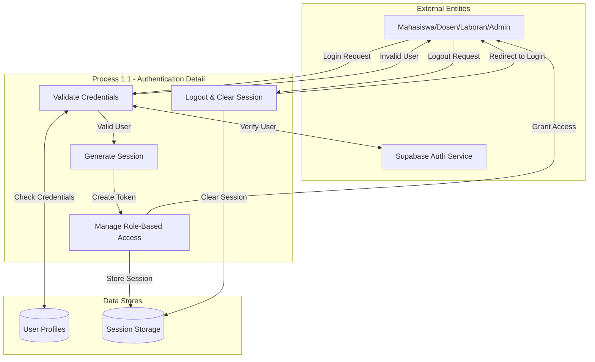

**Deskripsi**:
- **P1.1**: Validasi email/password ke Supabase Auth
- **P1.2**: Generate JWT session token
- **P1.3**: Cek role (admin/dosen/mahasiswa/laboran) dan grant permissions
- **P1.4**: Clear session saat logout

---

### 4.2 Process 2: Kelola Jadwal (Detailed)

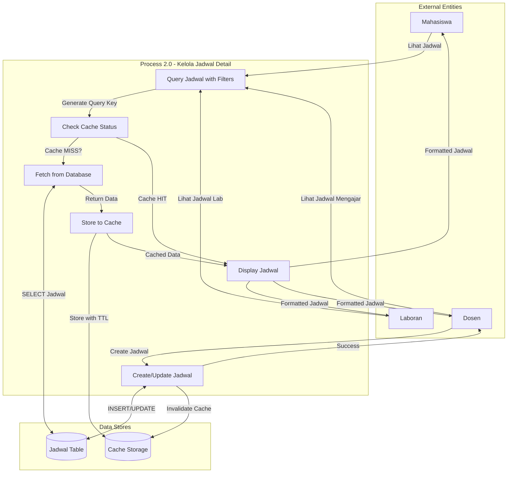

**Deskripsi**:
- **P2.1**: Proses request jadwal dengan filters (hari, lab, kelas)
- **P2.2**: Cek cache - apakah data ada di IndexedDB?
- **P2.3**: Jika cache miss, fetch dari Supabase
- **P2.4**: Simpan ke cache dengan TTL (5 menit)
- **P2.5**: Tampilkan jadwal ke user
- **P2.6**: Create/update jadwal (admin/dosen only), invalidate cache

---

### 4.3 Process 3: Kelola Kuis & Bank Soal (Detailed)

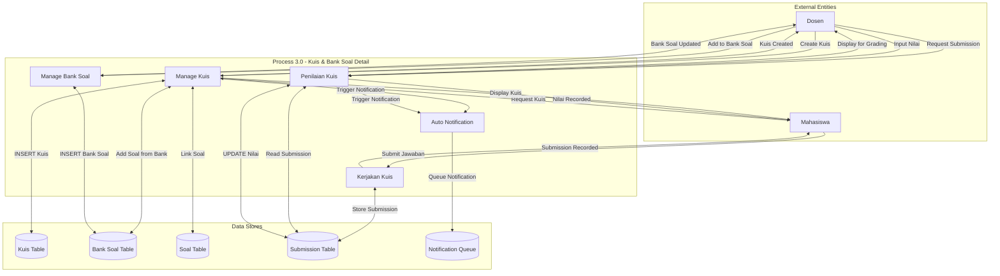

**Deskripsi**:
- **P3.1**: CRUD kuis (create, read, update, delete)
- **P3.2**: CRUD bank soal untuk reuse pertanyaan
- **P3.3**: Mahasiswa kerjakan kuis, simpan jawaban
- **P3.4**: Dosen nilai kuis, simpan nilai
- **P3.5**: Trigger notification saat kuis dibuat/dinilai

---

### 4.4 Process 4: Kelola Materi (Detailed)

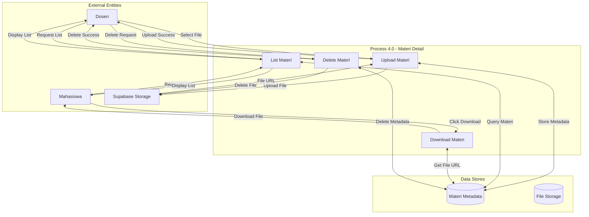

**Deskripsi**:
- **P4.1**: Upload materi ke Supabase Storage, simpan metadata di database
- **P4.2**: Download materi dari Supabase Storage URL
- **P4.3**: List materi berdasarkan kelas/user access
- **P4.4**: Delete materi & file dari storage

---

### 4.5 Process 5: Kelola Kelas (Detailed)

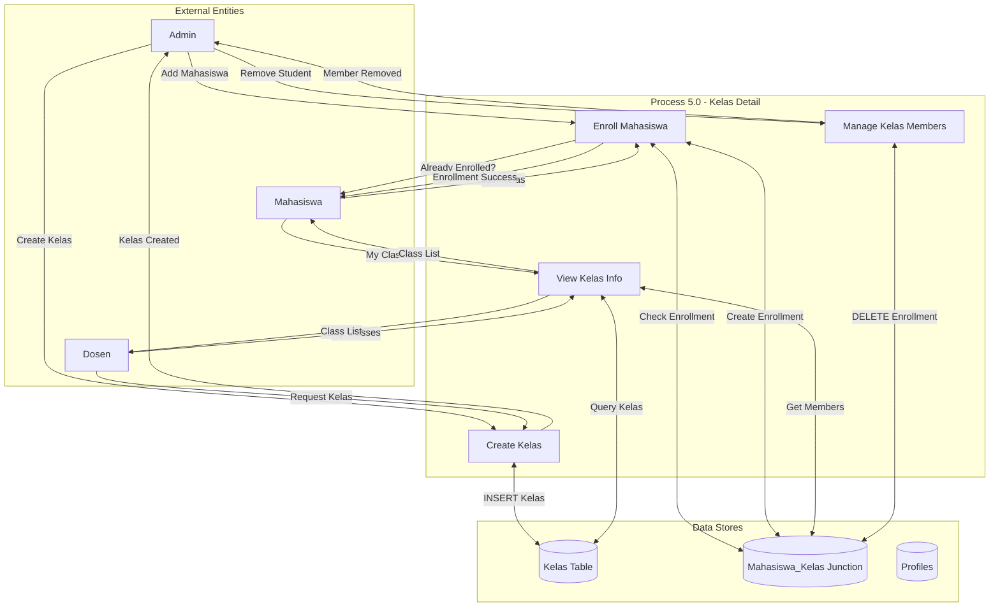

**Deskripsi**:
- **P5.1**: Create kelas dengan dosen, mata kuliah, jadwal
- **P5.2**: Enroll mahasiswa ke kelas (junction table)
- **P5.3**: View kelas info & members
- **P5.4**: Add/remove mahasiswa dari kelas

---

### 4.6 Process 6: Kelola User (Detailed)

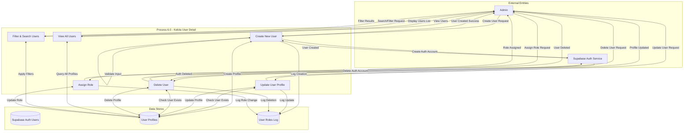

**Deskripsi**:
- **P6.1**: Create new user - membuat auth account di Supabase & profile
- **P6.2**: Update user profile - update nama, email, role, dll
- **P6.3**: Delete user - hapus auth account & profile (soft delete recommended)
- **P6.4**: View all users - list semua users dengan pagination
- **P6.5**: Filter & search users - filter berdasarkan role, nama, email, dll
- **P6.6**: Assign role - assign/ubah user role (admin/dosen/mahasiswa/laboran)

**Data Flows**:
| Data Flow | Deskripsi |
|-----------|-----------|
| User Data | Data user baru (email, password, role, nama) |
| Validation Result | Hasil validasi input |
| Auth Account ID | ID dari Supabase Auth |
| Profile Data | Data profile (nama_lengkap, nim_nip, dll) |
| Update Confirmation | Konfirmasi update berhasil |
| Deletion Confirmation | Konfirmasi delete berhasil |
| Users List | List semua users |
| Filtered Users | Hasil filter/search |
| Role Assignment | Role yang diassign ke user |

---

### 4.7 Process 7: Notification System (Detailed)

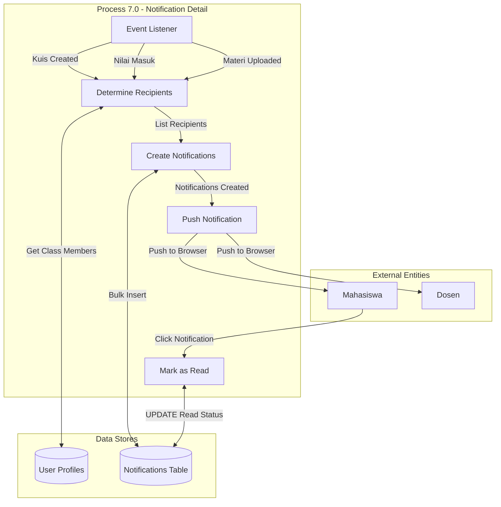

**Deskripsi**:
- **P7.1**: Listen untuk events (kuis_created, nilai_input, materi_uploaded)
- **P7.2**: Determine recipients berdasarkan event
- **P7.3**: Bulk create notifications untuk semua recipients
- **P7.4**: Push notification ke browser (PWA)
- **P7.5**: Mark notification as read saat user click

---

### 4.7 Process 8: Offline Sync & Cache (Detailed) ✨

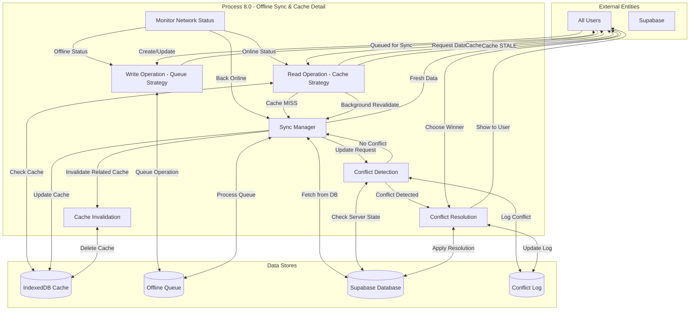

**Deskripsi**:
- **P8.1**: Monitor `navigator.onLine` status
- **P8.2**: Handle read operations dengan stale-while-revalidate:
  - Cache HIT → Return immediately
  - Cache STALE → Return stale, revalidate di background
  - Cache MISS → Fetch from DB, cache it
- **P8.3**: Handle write operations saat offline:
  - Queue ke IndexedDB
  - Return "Queued for sync"
- **P8.4**: Sync manager yang:
  - Process queue saat online
  - Retry failed operations
  - Handle sync errors
- **P8.5**: Conflict detection:
  - Compare local vs server version
  - Check if record modified since queued
- **P8.6**: Conflict resolution:
  - Show ke user untuk pilih winner (local/remote)
  - Apply resolution
  - Log ke conflict_log table
- **P8.7**: Cache invalidation:
  - Invalidate related cache setelah write
  - Pattern-based invalidation (e.g., invalidate all "kelas_*" keys)

---

## 5. DATA DICTIONARY

### 5.1 Data Flows

| Data Flow ID | Nama | Source | Destination | Deskripsi |
|--------------|------|--------|-------------|-----------|
| DF1 | Login Credentials | User | P1 | Email & password |
| DF2 | Session Token | P1 | User | JWT token |
| DF3 | Jadwal Request | Mahasiswa | P2 | Request jadwal dengan filters |
| DF4 | Jadwal Data | P2 | Mahasiswa | List jadwal praktikum |
| DF5 | Kuis Data | Dosen | P3 | Kuis yang akan dibuat/diedit |
| DF6 | Bank Soal Data | P3 | Dosen | Soal dari bank untuk ditambahkan |
| DF7 | Submission Data | Mahasiswa | P3 | Jawaban kuis |
| DF8 | Nilai Data | P3 | Mahasiswa | Nilai kuis |
| DF9 | Materi File | Dosen | P4 | File materi yang diupload |
| DF10 | Materi URL | P4 | Mahasiswa | URL untuk download materi |
| DF11 | Enrollment Data | Admin | P5 | Data enroll mahasiswa ke kelas |
| DF12 | Kelas List | P5 | Mahasiswa | Kelas yang diikuti mahasiswa |
| DF13 | Notification | P7 | User | Push notification |
| DF14 | Read Status | User | P7 | Notification read ack |
| DF15 | Sync Data | P8 | Supabase | Data untuk sync |
| DF16 | Conflict Data | P8 | User | Conflict yang perlu resolution |

---

### 5.2 Data Elements

| Element | Tipe | Deskripsi | Contoh |
|---------|------|-----------|--------|
| user_id | UUID | Unique identifier user | "550e8400-e29b-41d4-a716-446655440000" |
| email | string | Email user | "mahasiswa@univ.ac.id" |
| role | enum | Role user | "mahasiswa", "dosen", "laboran", "admin" |
| kelas_id | UUID | ID kelas | "..." |
| kuis_id | UUID | ID kuis | "..." |
| jadwal_id | UUID | ID jadwal | "..." |
| tanggal_praktikum | date | Tanggal praktikum | "2025-01-15" |
| jam_mulai | time | Jam mulai | "08:00:00" |
| jam_selesai | time | Jam selesai | "10:00:00" |
| nilai | integer | Nilai kuis | 0-100 |
| status | enum | Status record | "pending", "active", "completed" |
| cache_key | string | Key untuk cache | "query_jadwal_{filters}" |
| ttl | integer | Cache TTL | 300000 (5 minutes) |
| conflict_type | enum | Tipe conflict | "local_vs_remote", "duplicate" |

---

## 6. SUMMARY DFD LEVELS

| Level | Jumlah Process | Jumlah Entity | Jumlah Data Store | Deskripsi | Status |
|-------|----------------|---------------|-------------------|-----------|--------|
| **Level 0** | 1 (sistem) | 5 | 1 | Context diagram - high level view | ✅ 100% |
| **Level 1** | 8 | 5 | 3 | Major processes dalam sistem | ✅ 100% |
| **Level 2** | 36 | 5 | 15+ | Detail setiap proses | ✅ 100% |

**Level 2 Breakdown**:
- P1: Authentication (4 sub-processes)
- P2: Kelola Jadwal (6 sub-processes)
- P3: Kelola Kuis & Bank Soal (5 sub-processes)
- P4: Kelola Materi (4 sub-processes)
- P5: Kelola Kelas (4 sub-processes)
- **P6: Kelola User (6 sub-processes)** ✨ NEW
- P7: Notification System (5 sub-processes)
- P8: Offline Sync & Cache (7 sub-processes)

---

## 7. SPESIAL: OFFLINE FIRST FLOW

### 7.1 Complete Offline First Scenario (Mermaid)

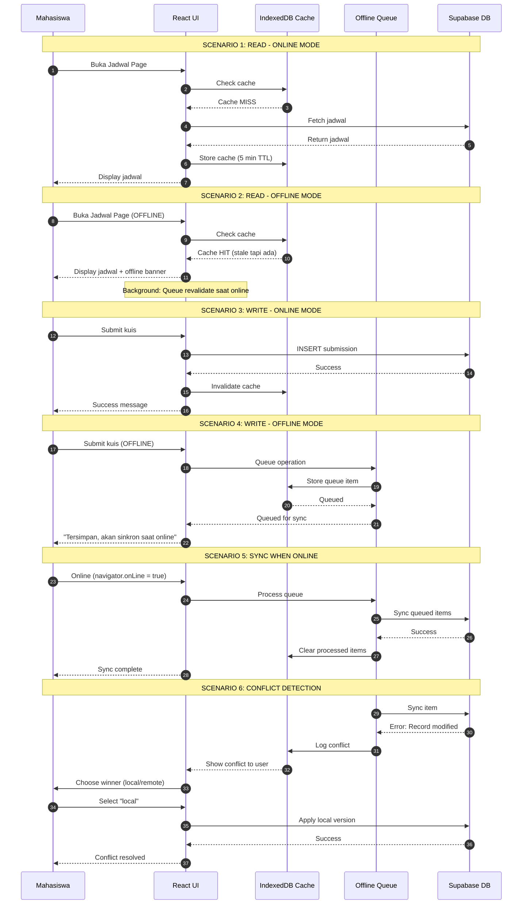

---

## 8. IMPLEMENTATION MAPPING

### 8.1 Process to Code Mapping

| Process | File/Function | Description |
|---------|---------------|-------------|
| P1 | `src/lib/hooks/useAuth.ts` | Authentication hook |
| P2 | `src/lib/api/jadwal.api.ts` | Jadwal API |
| P3 | `src/lib/api/kuis.api.ts`, `bank-soal.api.ts` | Kuis & Bank Soal APIs |
| P4 | `src/lib/api/materi.api.ts` | Materi API |
| P5 | `src/lib/api/kelas.api.ts` | Kelas API |
| P6 | `src/lib/api/auth.api.ts` | User management |
| P7 | `src/lib/api/notification.api.ts` | Notification API |
| P8 | `src/lib/offline/api-cache.ts`, `sync.ts` | Offline sync & cache |

### 8.2 Data Store to Database Mapping

| Data Store | Database | Table/Store |
|------------|----------|-------------|
| D1 | Supabase PostgreSQL | All tables |
| D2 | IndexedDB | `cache`, `offline_queue`, `conflicts` |
| D3 | IndexedDB | `offline_queue` (client) |

---

## 9. ANALISIS

### 9.1 Kelebihan Arsitektur

1. **Offline First**: App tetap bisa digunakan saat offline
2. **Stale-While-Revalidate**: Response cepat dari cache, data tetap fresh
3. **Conflict Resolution**: User control saat ada conflict
4. **Scalable**: DFD menunjukkan sistem siap untuk scale
5. **Modular**: Setiap proses independent, mudah maintain

### 9.2 Kompleksitas

| Aspect | Complexity Level | Catatan |
|--------|------------------|---------|
| Authentication | Low | Standard Supabase Auth |
| CRUD Operations | Low | Straightforward |
| Offline Cache | Medium | Perlu cache management strategy |
| Offline Queue | Medium | Perlu retry mechanism |
| Conflict Resolution | High | Perlu user intervention logic |
| Notification | Medium | Event-driven architecture |

---

## 10. REKOMENDASI

### 10.1 Pengembangan Lanjut

1. **E2E Testing**: Test flow offline → online → sync
2. **Monitoring**: Monitor cache hit rate, queue size
3. **Analytics**: Track user behavior patterns
4. **Performance**: Optimize cache TTL berdasarkan usage

### 10.2 Best Practices Applied

✅ **Separation of Concerns**: Setiap proses fokus ke satu tanggung jawab
✅ **Single Source of Truth**: Supabase sebagai master data
✅ **Cache Strategy**: Stale-while-revalidate untuk UX optimal
✅ **Error Handling**: Graceful degradation saat offline
✅ **Security**: Role-based access control di setiap proses

---

## SUMMARY

Total Diagrams:
- **DFD Level 0**: 1 Context Diagram
- **DFD Level 1**: 1 Diagram (8 processes)
- **DFD Level 2**: 8 Diagrams (detail per process) ✅ 100% COMPLETE

Total Entities: 5 (Mahasiswa, Dosen, Laboran, Admin, Supabase)

Total Processes: 36 (semua level)
- Level 0: 1 process (sistem)
- Level 1: 8 processes
- Level 2: 27 sub-processes

Total Data Stores: 15 (tables) + 3 (IndexedDB)

DFD ini mencakup:
✅ Authentication & Authorization (P1)
✅ Kelola Jadwal (P2)
✅ Kelola Kuis & Bank Soal (P3)
✅ Kelola Materi (P4)
✅ Kelola Kelas (P5)
✅ Kelola User (P6) ✨ NEW
✅ Notification System (P7)
✅ Offline Sync & Cache (P8)

**Status: 100% COMPLETE** - Semua 8 processes memiliki Level 2 diagrams!
