# Data Flow Diagram (DFD)
## Sistem Informasi Praktikum PWA - AKBID Mega Buana

---

## 1. NOTASI & SIMBOL

### Simbol DFD yang Digunakan:

```
[ ENTITAS ]  = Entity External (persegi panjang)
( PROSES  )  = Proses/Transformasi (lingkaran)
[= STORE =]  = Data Store (dua garis horizontal)
   ──────→   = Aliran Data (panah)
```

---

## 2. DFD LEVEL 0 — CONTEXT DIAGRAM

### 2.1 Diagram

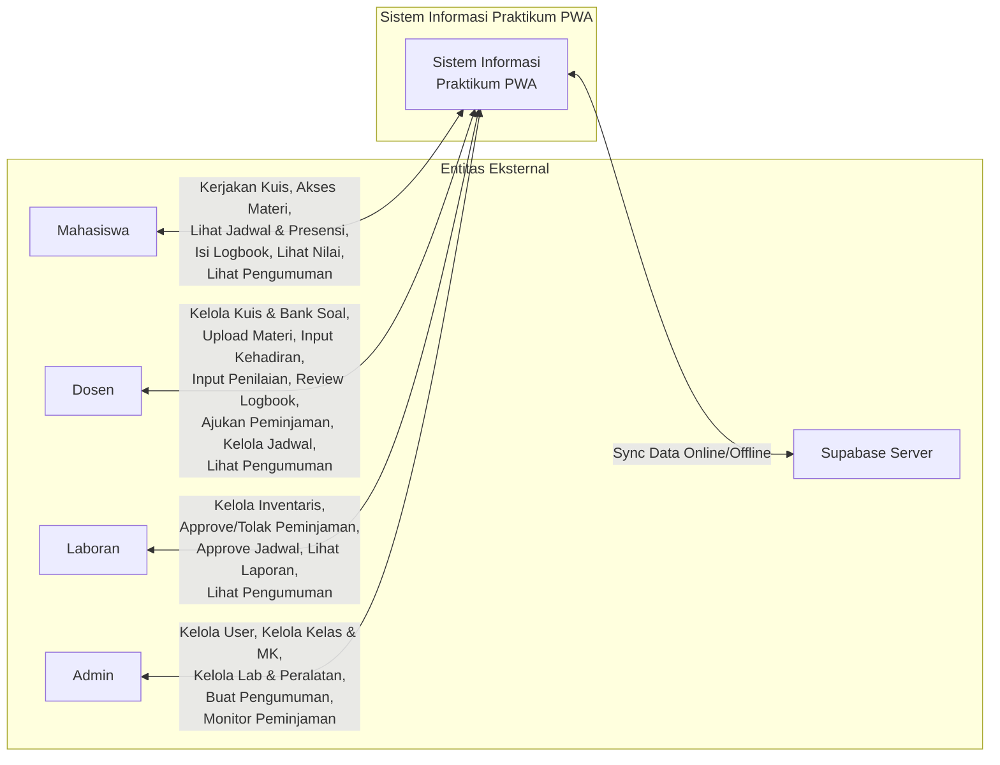

### 2.2 Deskripsi Context Diagram

**Sistem**: Sistem Informasi Praktikum PWA — AKBID Mega Buana

**Entitas Eksternal**: 5 entitas
- Mahasiswa
- Dosen
- Laboran
- Admin
- Supabase Server

**Aliran Data Per Entitas**:

| Entitas | Input ke Sistem | Output dari Sistem |
|---------|-----------------|-------------------|
| Mahasiswa | Jawaban kuis, entri logbook, request materi & jadwal | Kuis, materi, jadwal, presensi, nilai, logbook, pengumuman |
| Dosen | Data kuis, bank soal, materi, kehadiran, nilai, logbook review, jadwal, peminjaman | Daftar kuis, rekap kehadiran, hasil penilaian, logbook mahasiswa, status peminjaman |
| Laboran | Data inventaris, keputusan peminjaman, approve jadwal | Daftar inventaris, permohonan peminjaman, jadwal, laporan |
| Admin | Data user, kelas, mata kuliah, lab, peralatan, pengumuman | Statistik sistem, daftar user, rekap peminjaman |
| Supabase | Data tersinkron dari server | Data sinkron ke browser (offline cache) |

---

## 3. DFD LEVEL 1

### 3.1 Diagram Level 1

```mermaid
graph TB
    subgraph "Entitas Eksternal"
        Mahasiswa
        Dosen
        Laboran
        Admin
        Supabase
    end

    subgraph "Proses Utama"
        P1(P1\nAutentikasi)
        P2(P2\nKelola Jadwal)
        P3(P3\nKelola Kuis\n& Bank Soal)
        P4(P4\nKelola Materi)
        P5(P5\nKelola Kelas\n& Mata Kuliah)
        P6(P6\nKelola User)
        P7(P7\nKehadiran\n& Penilaian)
        P8(P8\nLogbook Digital)
        P9(P9\nPeminjaman Alat\n& Inventaris)
        P10(P10\nPengumuman)
        P11(P11\nSinkronisasi\nOffline PWA)
    end

    subgraph "Data Store"
        D1[(D1\nDatabase\nSupabase)]
        D2[(D2\nIndexedDB\nCache)]
        D3[(D3\nOffline\nQueue)]
    end

    %% P1 - Autentikasi
    Mahasiswa -->|Kredensial login| P1
    Dosen -->|Kredensial login| P1
    Laboran -->|Kredensial login| P1
    Admin -->|Kredensial login| P1
    P1 <-->|Validasi user| D1
    P1 -->|Session token + role| Mahasiswa
    P1 -->|Session token + role| Dosen
    P1 -->|Session token + role| Laboran
    P1 -->|Session token + role| Admin

    %% P2 - Kelola Jadwal
    Dosen -->|Data jadwal| P2
    Laboran -->|Approve jadwal| P2
    Mahasiswa -->|Request jadwal| P2
    P2 <-->|CRUD jadwal| D1
    P2 <-->|Cache jadwal| D2
    P2 -->|Jadwal aktif| Mahasiswa
    P2 -->|Jadwal mengajar| Dosen
    P2 -->|Jadwal lab| Laboran

    %% P3 - Kelola Kuis & Bank Soal
    Dosen -->|Data kuis, soal, bank soal| P3
    Mahasiswa -->|Jawaban kuis| P3
    P3 <-->|CRUD kuis & soal| D1
    P3 <-->|Cache kuis offline| D2
    P3 <-->|Antrian jawaban offline| D3
    P3 -->|Kuis & hasil nilai| Mahasiswa
    P3 -->|Statistik & rekap nilai| Dosen

    %% P4 - Kelola Materi
    Dosen -->|File materi| P4
    Mahasiswa -->|Request materi| P4
    P4 <-->|CRUD materi| D1
    P4 <-->|Cache materi offline| D2
    P4 -->|Daftar & file materi| Mahasiswa

    %% P5 - Kelola Kelas & Mata Kuliah
    Admin -->|Data kelas, MK, enrollment| P5
    P5 <-->|CRUD kelas & MK| D1
    P5 -->|Info kelas| Dosen
    P5 -->|Info kelas & MK| Mahasiswa
    P5 -->|Rekap kelas| Admin

    %% P6 - Kelola User
    Admin -->|Data user baru, edit, nonaktif| P6
    P6 <-->|CRUD user & profil| D1
    P6 -->|Daftar & statistik user| Admin

    %% P7 - Kehadiran & Penilaian
    Dosen -->|Data kehadiran & nilai| P7
    Mahasiswa -->|Request presensi & nilai| P7
    P7 <-->|CRUD kehadiran & nilai| D1
    P7 -->|Rekap kehadiran| Dosen
    P7 -->|Presensi & nilai| Mahasiswa

    %% P8 - Logbook Digital
    Mahasiswa -->|Entri logbook| P8
    Dosen -->|Review & feedback| P8
    P8 <-->|CRUD logbook| D1
    P8 -->|Logbook mahasiswa| Dosen
    P8 -->|Logbook & feedback| Mahasiswa

    %% P9 - Peminjaman & Inventaris
    Dosen -->|Permohonan peminjaman| P9
    Laboran -->|Data inventaris, keputusan| P9
    Admin -->|Keputusan peminjaman| P9
    P9 <-->|CRUD inventaris & peminjaman| D1
    P9 -->|Status peminjaman| Dosen
    P9 -->|Daftar inventaris & laporan| Laboran
    P9 -->|Rekap peminjaman| Admin

    %% P10 - Pengumuman
    Admin -->|Data pengumuman| P10
    P10 <-->|CRUD pengumuman| D1
    P10 <-->|Cache pengumuman| D2
    P10 -->|Pengumuman| Mahasiswa
    P10 -->|Pengumuman| Dosen
    P10 -->|Pengumuman| Laboran

    %% P11 - Sinkronisasi Offline
    P2 -->|Data jadwal| P11
    P3 -->|Jawaban kuis offline| P11
    P4 -->|Cache materi| P11
    P7 -->|Data kehadiran offline| P11
    P8 -->|Entri logbook offline| P11
    P11 <-->|Antrian operasi| D3
    P11 <-->|Kelola cache| D2
    P11 <-->|Sync database| D1
    P11 <-->|Resolve konflik| Supabase
```

### 3.2 Deskripsi Proses Level 1

| ID | Nama Proses | Deskripsi | Entitas Terlibat |
|----|-------------|-----------|-----------------|
| P1 | Autentikasi | Validasi login, generate session, RBAC, logout | Admin, Dosen, Laboran, Mahasiswa |
| P2 | Kelola Jadwal | Buat jadwal (Dosen), approve (Laboran), lihat jadwal | Dosen, Laboran, Mahasiswa |
| P3 | Kelola Kuis & Bank Soal | Buat kuis, bank soal, kerjakan kuis online/offline, auto-grading | Dosen, Mahasiswa |
| P4 | Kelola Materi | Upload, list, download materi, cache offline | Dosen, Mahasiswa |
| P5 | Kelola Kelas & Mata Kuliah | CRUD kelas, MK, assignment, enrollment mahasiswa | Admin |
| P6 | Kelola User | CRUD user 4 role, edit profil | Admin |
| P7 | Kehadiran & Penilaian | Input kehadiran, rekap absensi, input & lihat nilai | Dosen, Mahasiswa |
| P8 | Logbook Digital | Buat entri logbook, review & feedback dosen | Mahasiswa, Dosen |
| P9 | Peminjaman Alat & Inventaris | Kelola inventaris, ajukan & approve peminjaman, laporan | Dosen, Laboran, Admin |
| P10 | Pengumuman | Buat pengumuman (Admin), distribusi & lihat semua role | Admin, Dosen, Laboran, Mahasiswa |
| P11 | Sinkronisasi Offline (PWA) | Deteksi jaringan, cache, antrian offline, background sync, resolusi konflik | Semua, Supabase |

### 3.3 Deskripsi Data Store Level 1

| ID | Nama | Teknologi | Isi |
|----|------|-----------|-----|
| D1 | Database Supabase | PostgreSQL | Semua data utama (15 tabel) |
| D2 | IndexedDB Cache | Browser IndexedDB | Cache data untuk akses offline |
| D3 | Offline Queue | Browser IndexedDB | Antrian operasi saat offline |

---

## 4. DFD LEVEL 2

### 4.1 P1 — Autentikasi (Detail)

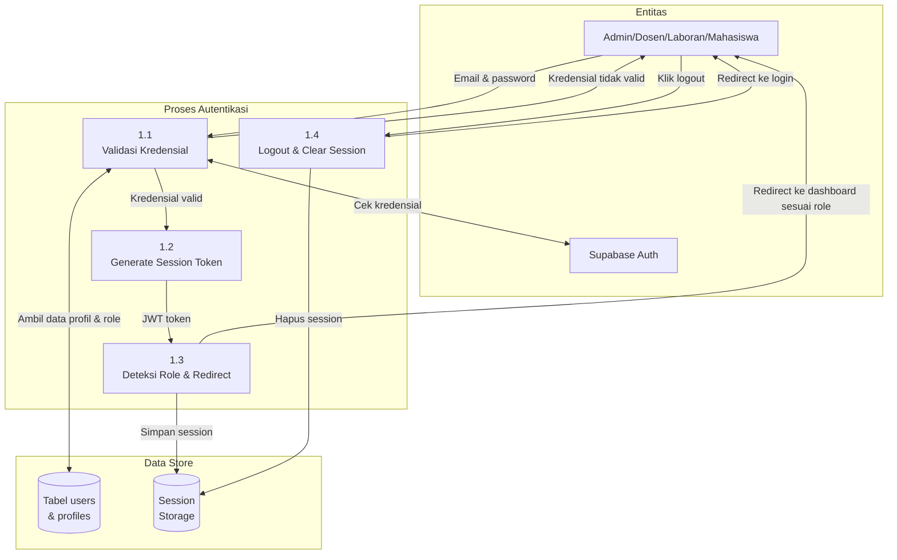

**Sub-proses:**
| Sub-ID | Nama | Deskripsi |
|--------|------|-----------|
| 1.1 | Validasi Kredensial | Kirim email & password ke Supabase Auth untuk diverifikasi |
| 1.2 | Generate Session Token | Buat JWT token setelah login berhasil |
| 1.3 | Deteksi Role & Redirect | Cek role user, redirect ke dashboard yang sesuai |
| 1.4 | Logout & Clear Session | Hapus session token, redirect ke halaman login |

---

### 4.2 P2 — Kelola Jadwal (Detail)

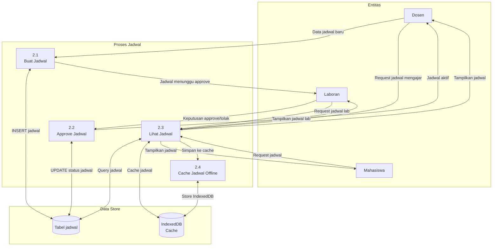

**Sub-proses:**
| Sub-ID | Nama | Deskripsi |
|--------|------|-----------|
| 2.1 | Buat Jadwal | Dosen buat jadwal praktikum (hari, jam, lab, kelas) |
| 2.2 | Approve Jadwal | Laboran approve atau tolak jadwal yang diajukan |
| 2.3 | Lihat Jadwal | Semua role melihat jadwal sesuai akses masing-masing |
| 2.4 | Cache Jadwal Offline | Simpan jadwal ke IndexedDB untuk akses offline |

---

### 4.3 P3 — Kelola Kuis & Bank Soal (Detail)

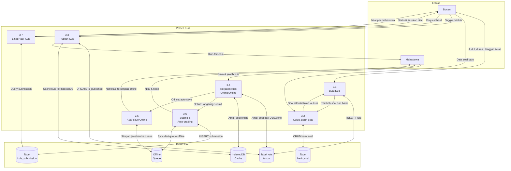

**Sub-proses:**
| Sub-ID | Nama | Deskripsi |
|--------|------|-----------|
| 3.1 | Buat Kuis | Dosen buat kuis dengan judul, durasi, tanggal, assign ke kelas |
| 3.2 | Kelola Bank Soal | Dosen tambah/edit/hapus soal di bank soal, bisa digunakan ulang |
| 3.3 | Publish Kuis | Kuis diaktifkan, cache ke IndexedDB agar mahasiswa bisa akses offline |
| 3.4 | Kerjakan Kuis | Mahasiswa jawab soal, deteksi online/offline otomatis |
| 3.5 | Auto-save Offline | Jawaban disimpan ke IndexedDB saat offline, sync otomatis saat online |
| 3.6 | Submit & Auto-grading | Jawaban disubmit, nilai dihitung otomatis berdasarkan kunci jawaban |
| 3.7 | Lihat Hasil Kuis | Dosen lihat statistik, rekap nilai, dan jawaban per mahasiswa |

---

### 4.4 P4 — Kelola Materi (Detail)

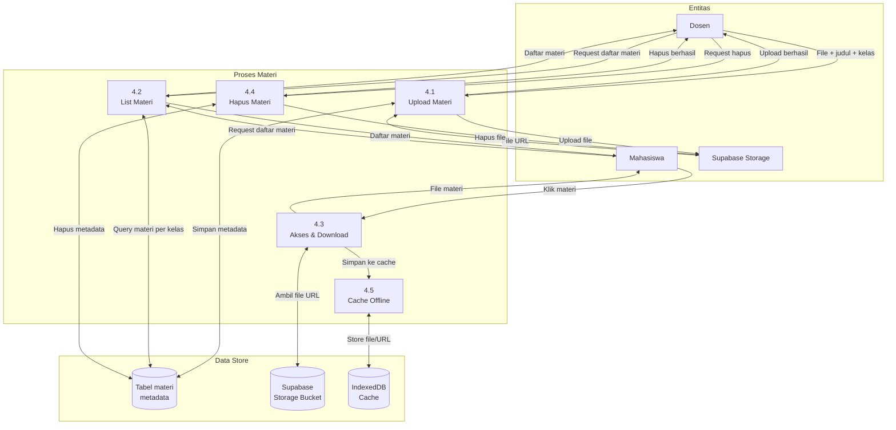

**Sub-proses:**
| Sub-ID | Nama | Deskripsi |
|--------|------|-----------|
| 4.1 | Upload Materi | Dosen upload file (PDF, video, dll) ke Supabase Storage, simpan metadata |
| 4.2 | List Materi | Tampilkan daftar materi berdasarkan kelas yang diikuti |
| 4.3 | Akses & Download | Mahasiswa buka atau download file materi |
| 4.4 | Hapus Materi | Dosen hapus materi dari storage dan database |
| 4.5 | Cache Offline | File/URL materi di-cache ke IndexedDB untuk akses offline |

---

### 4.5 P5 — Kelola Kelas & Mata Kuliah (Detail)

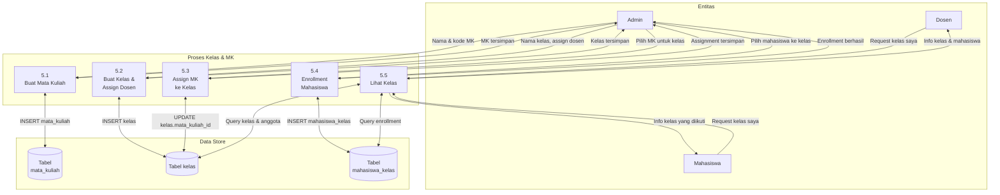

**Sub-proses:**
| Sub-ID | Nama | Deskripsi |
|--------|------|-----------|
| 5.1 | Buat Mata Kuliah | Admin tambah mata kuliah dengan nama, kode, SKS |
| 5.2 | Buat Kelas & Assign Dosen | Admin buat kelas dan assign dosen pengampu |
| 5.3 | Assign MK ke Kelas | Admin assign mata kuliah ke kelas |
| 5.4 | Enrollment Mahasiswa | Admin daftarkan mahasiswa ke kelas tertentu |
| 5.5 | Lihat Kelas | Dosen & mahasiswa lihat kelas yang terlibat |

---

### 4.6 P6 — Kelola User (Detail)

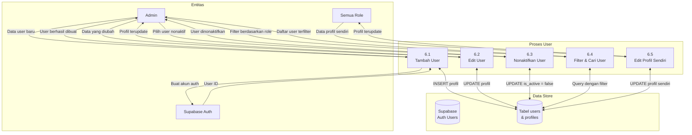

**Sub-proses:**
| Sub-ID | Nama | Deskripsi |
|--------|------|-----------|
| 6.1 | Tambah User | Admin buat akun baru (auth + profil) untuk semua role |
| 6.2 | Edit User | Admin ubah data profil user |
| 6.3 | Nonaktifkan User | Admin nonaktifkan akun (is_active = false) |
| 6.4 | Filter & Cari User | Admin filter user berdasarkan role, nama, atau email |
| 6.5 | Edit Profil Sendiri | Semua role dapat edit profil masing-masing |

---

### 4.7 P7 — Kehadiran & Penilaian (Detail)

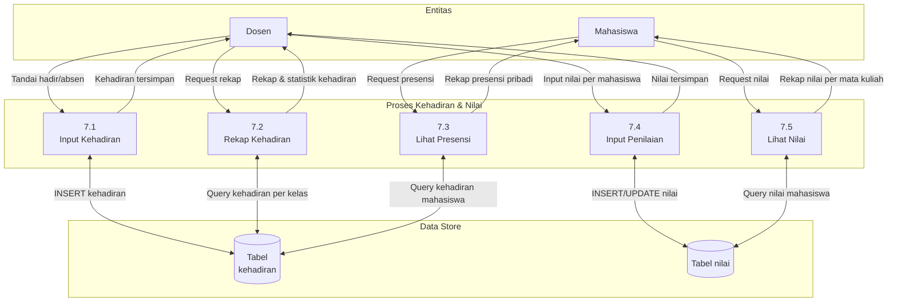

**Sub-proses:**
| Sub-ID | Nama | Deskripsi |
|--------|------|-----------|
| 7.1 | Input Kehadiran | Dosen tandai hadir/tidak hadir per mahasiswa per pertemuan |
| 7.2 | Rekap Kehadiran | Dosen lihat rekap & statistik kehadiran per kelas |
| 7.3 | Lihat Presensi | Mahasiswa lihat rekap kehadiran pribadi |
| 7.4 | Input Penilaian | Dosen input nilai per mahasiswa per mata kuliah |
| 7.5 | Lihat Nilai | Mahasiswa lihat rekap nilai per mata kuliah |

---

### 4.8 P8 — Logbook Digital (Detail)

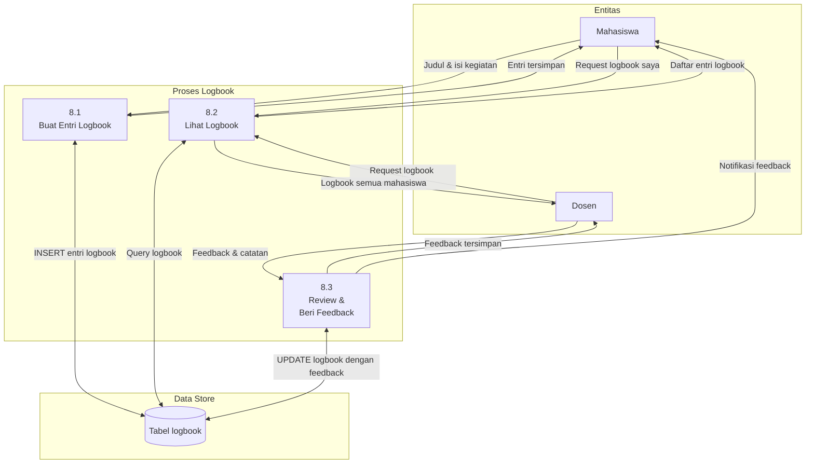

**Sub-proses:**
| Sub-ID | Nama | Deskripsi |
|--------|------|-----------|
| 8.1 | Buat Entri Logbook | Mahasiswa catat kegiatan praktikum harian |
| 8.2 | Lihat Logbook | Mahasiswa lihat logbook sendiri, Dosen lihat logbook semua mahasiswa |
| 8.3 | Review & Beri Feedback | Dosen beri catatan/feedback pada entri logbook mahasiswa |

---

### 4.9 P9 — Peminjaman Alat & Inventaris (Detail)

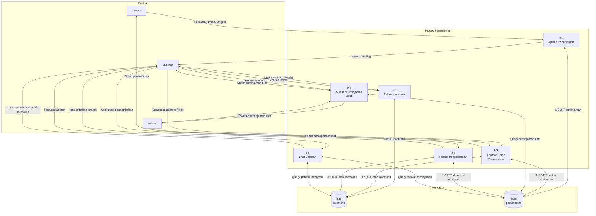

**Sub-proses:**
| Sub-ID | Nama | Deskripsi |
|--------|------|-----------|
| 9.1 | Kelola Inventaris | Laboran CRUD alat: nama, stok, kondisi, kategori, foto |
| 9.2 | Ajukan Peminjaman | Dosen ajukan permohonan peminjaman alat dengan tanggal |
| 9.3 | Approve/Tolak | Laboran/Admin approve atau tolak permohonan peminjaman |
| 9.4 | Monitor Aktif | Laboran & Admin pantau semua peminjaman yang sedang berjalan |
| 9.5 | Proses Pengembalian | Laboran konfirmasi alat dikembalikan, stok terupdate |
| 9.6 | Lihat Laporan | Laporan statistik peminjaman dan penggunaan inventaris |

---

### 4.10 P10 — Pengumuman (Detail)

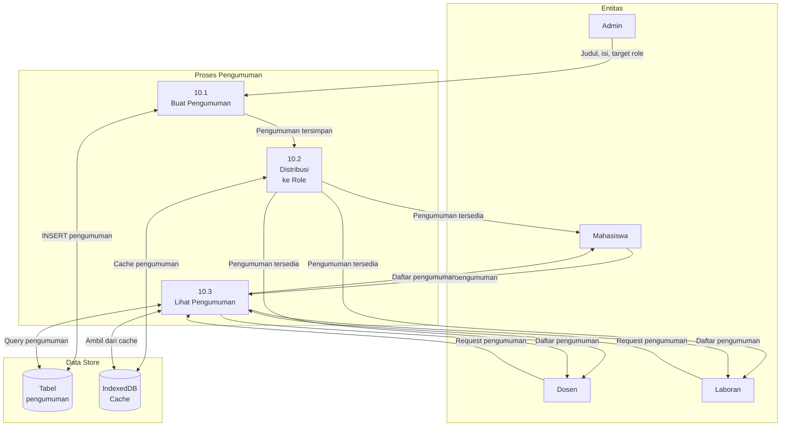

**Sub-proses:**
| Sub-ID | Nama | Deskripsi |
|--------|------|-----------|
| 10.1 | Buat Pengumuman | Admin buat pengumuman dengan judul, isi, target role |
| 10.2 | Distribusi ke Role | Pengumuman otomatis tersedia untuk role yang dituju |
| 10.3 | Lihat Pengumuman | Semua role dapat melihat pengumuman yang ditujukan untuk mereka |

---

### 4.11 P11 — Sinkronisasi Offline / PWA (Detail)

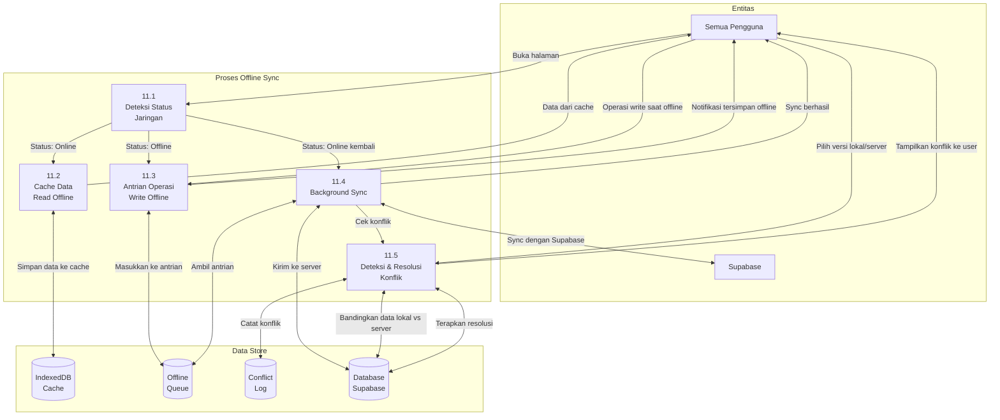

**Sub-proses:**
| Sub-ID | Nama | Deskripsi |
|--------|------|-----------|
| 11.1 | Deteksi Status Jaringan | Monitor status online/offline/unstable secara real-time |
| 11.2 | Cache Data Read Offline | Simpan data ke IndexedDB saat online agar bisa dibaca offline |
| 11.3 | Antrian Write Offline | Operasi insert/update saat offline masuk ke antrian IndexedDB |
| 11.4 | Background Sync | Proses antrian secara otomatis saat koneksi kembali online |
| 11.5 | Deteksi & Resolusi Konflik | Deteksi data konflik antara lokal dan server, user pilih versi yang benar |

---

## 5. DATA DICTIONARY

### 5.1 Aliran Data Utama

| ID | Nama Aliran | Dari | Ke | Deskripsi |
|----|-------------|------|----|-----------|
| DF1 | Kredensial Login | User | P1 | Email & password untuk autentikasi |
| DF2 | Session Token | P1 | User | JWT token + role setelah login berhasil |
| DF3 | Data Jadwal | Dosen | P2 | Hari, jam, lab, kelas praktikum |
| DF4 | Jadwal Aktif | P2 | Mahasiswa/Dosen | Jadwal yang sudah diapprove |
| DF5 | Data Kuis | Dosen | P3 | Judul, durasi, soal, kunci jawaban |
| DF6 | Jawaban Kuis | Mahasiswa | P3 | Pilihan jawaban per soal |
| DF7 | Nilai Kuis | P3 | Mahasiswa | Skor hasil pengerjaan kuis |
| DF8 | File Materi | Dosen | P4 | File PDF/video materi pembelajaran |
| DF9 | Data Kehadiran | Dosen | P7 | Status hadir/tidak per mahasiswa |
| DF10 | Rekap Presensi | P7 | Mahasiswa | Persentase kehadiran |
| DF11 | Entri Logbook | Mahasiswa | P8 | Catatan kegiatan praktikum harian |
| DF12 | Feedback Logbook | Dosen | P8 | Catatan/penilaian dari dosen |
| DF13 | Permohonan Peminjaman | Dosen | P9 | Nama alat, jumlah, tanggal |
| DF14 | Status Peminjaman | P9 | Dosen | Approved/rejected/returned |
| DF15 | Data Pengumuman | Admin | P10 | Judul, isi, target role |
| DF16 | Data Offline | P11 | Supabase | Data tersinkron saat online kembali |

### 5.2 Elemen Data

| Elemen | Tipe | Contoh |
|--------|------|--------|
| user_id | UUID | "550e8400-..." |
| role | enum | admin / dosen / laboran / mahasiswa |
| kelas_id | UUID | "..." |
| kuis_id | UUID | "..." |
| durasi_menit | integer | 60 |
| status_peminjaman | enum | pending / approved / rejected / returned |
| status_kehadiran | enum | hadir / absen / izin / sakit |
| nilai | integer | 0–100 |
| is_published | boolean | true / false |
| cache_ttl | integer | 300000 (5 menit) |

---

## 6. RINGKASAN DFD

| Level | Jumlah Proses | Jumlah Entitas | Jumlah Data Store |
|-------|--------------|----------------|-------------------|
| Level 0 | 1 (sistem) | 5 | 1 |
| Level 1 | 11 | 5 | 3 |
| Level 2 | 47 sub-proses | 5 | 15+ |

**Level 2 Breakdown:**
- P1 Autentikasi: 4 sub-proses
- P2 Kelola Jadwal: 4 sub-proses
- P3 Kelola Kuis & Bank Soal: 7 sub-proses
- P4 Kelola Materi: 5 sub-proses
- P5 Kelola Kelas & MK: 5 sub-proses
- P6 Kelola User: 5 sub-proses
- P7 Kehadiran & Penilaian: 5 sub-proses
- P8 Logbook Digital: 3 sub-proses
- P9 Peminjaman & Inventaris: 6 sub-proses
- P10 Pengumuman: 3 sub-proses
- P11 Sinkronisasi Offline: 5 sub-proses

---

**Dibuat**: Februari 2026
**Versi**: 2.0 (Disesuaikan dengan fitur aktual aplikasi)
**Status**: ✅ Lengkap & Sesuai Aplikasi
