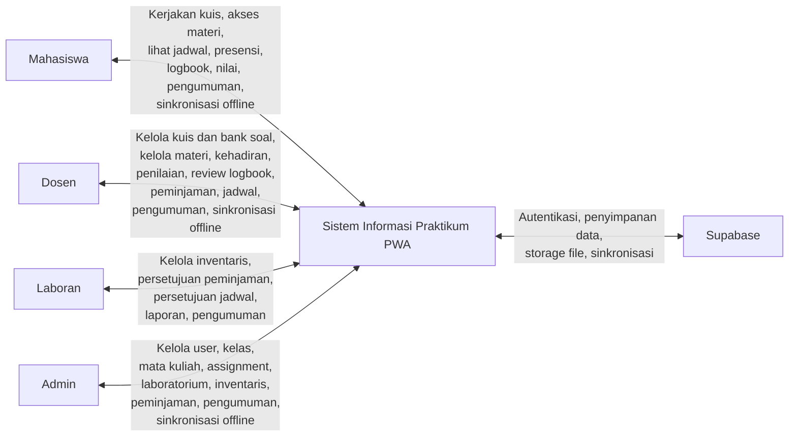
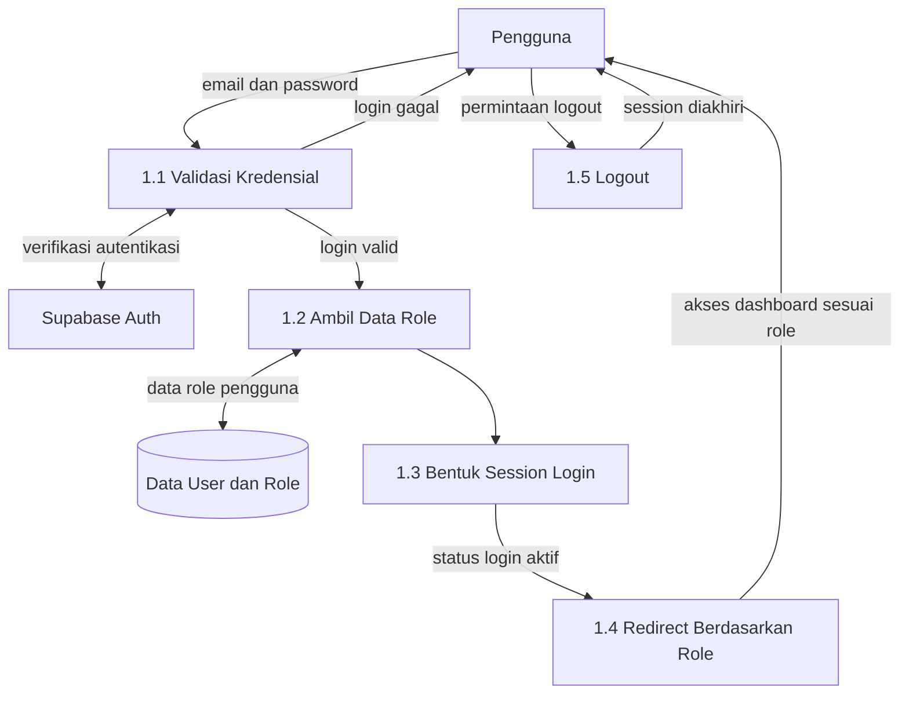
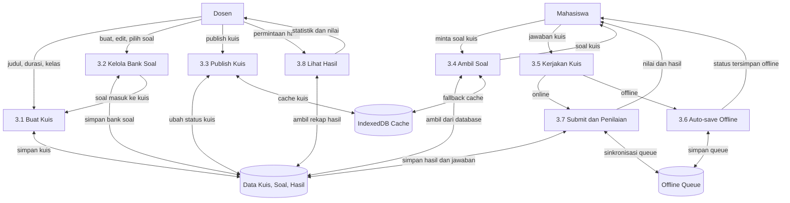
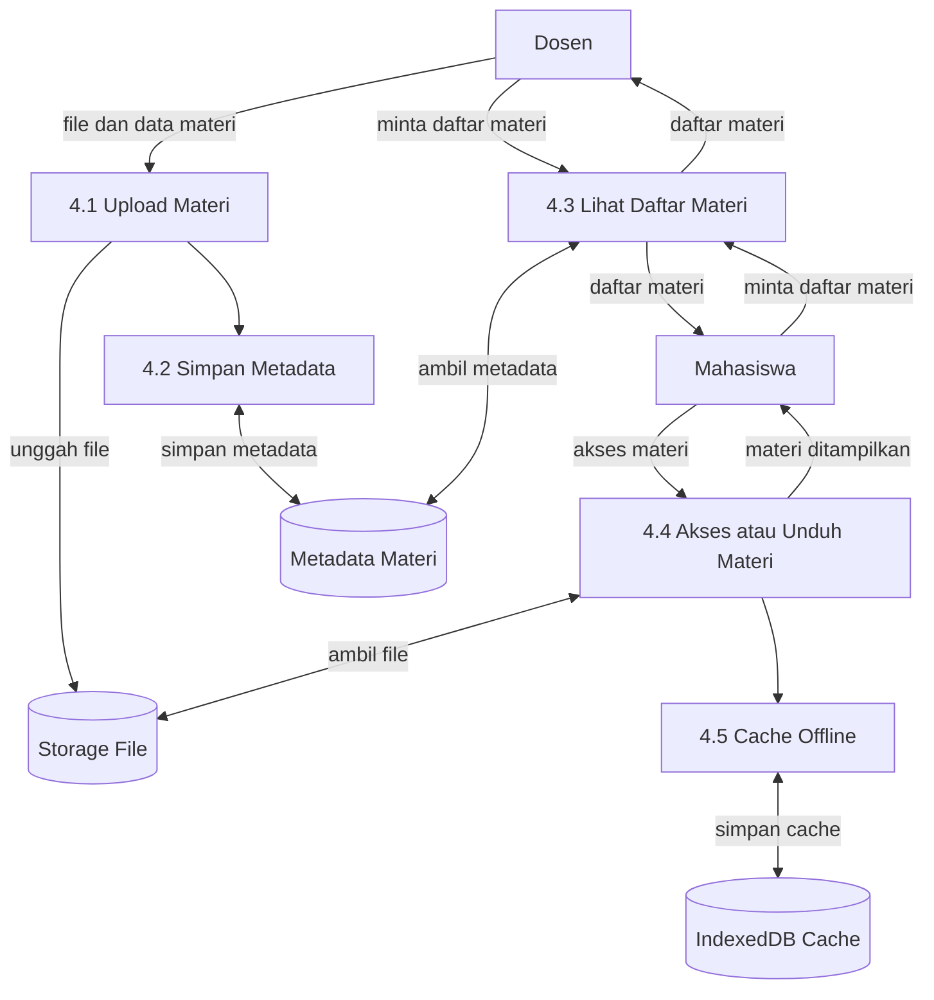
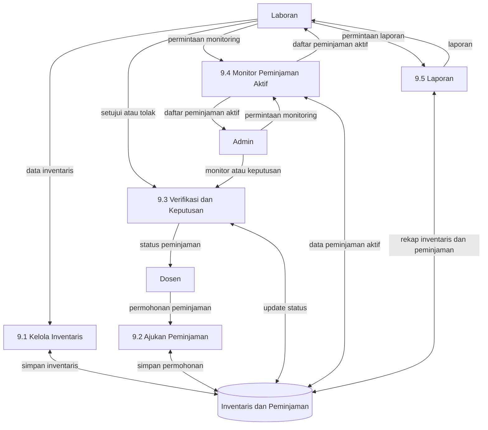
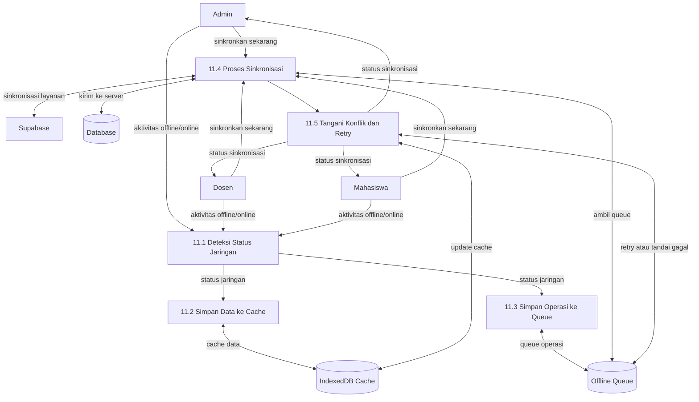

# Data Flow Diagram (DFD)
## Sistem Informasi Praktikum PWA

Dokumen ini disusun sebagai versi yang telah diselaraskan dengan implementasi aplikasi yang aktif, sehingga lebih aman digunakan sebagai dasar pembahasan pada bagian hasil dan pembahasan skripsi. Penyajian DFD tetap bersifat konseptual, tetapi istilah proses, aktor, dan penyimpanan data telah disesuaikan dengan fitur riil aplikasi.

---

## 1. Notasi dan Simbol

### Simbol DFD yang Digunakan

```text
[ ENTITAS ]  = Entitas eksternal
( PROSES )   = Proses / transformasi data
[= STORE =]  = Data store
──────→      = Aliran data
```

---

## 2. DFD Level 0 — Context Diagram

### 2.1 Diagram


```mermaid
graph LR
    Mahasiswa[Mahasiswa]
    Dosen[Dosen]
    Laboran[Laboran]
    Admin[Admin]
    Supabase[Supabase]

    SPWA[Sistem Informasi Praktikum PWA]

    Mahasiswa <-->|"Kerjakan kuis, akses materi,
lihat jadwal, presensi,
logbook, nilai, pengumuman,
sinkronisasi offline"| SPWA

    Dosen <-->|"Kelola kuis dan bank soal,
kelola materi, kehadiran,
penilaian, review logbook,
peminjaman, jadwal,
pengumuman, sinkronisasi offline"| SPWA

    Laboran <-->|"Kelola inventaris,
persetujuan peminjaman,
persetujuan jadwal,
laporan, pengumuman"| SPWA

    Admin <-->|"Kelola user, kelas,
mata kuliah, assignment,
laboratorium, inventaris,
peminjaman, pengumuman,
sinkronisasi offline"| SPWA

    SPWA <-->|"Autentikasi, penyimpanan data,
storage file, sinkronisasi"| Supabase
```

### 2.2 Deskripsi Context Diagram

**Sistem**: Sistem Informasi Praktikum PWA.

**Entitas eksternal utama**:
- Mahasiswa
- Dosen
- Laboran
- Admin
- Supabase

**Makna diagram konteks**: seluruh interaksi pengguna dilakukan melalui satu sistem terpusat yang melayani proses akademik, praktikum, inventaris, dan sinkronisasi data. Pada level konteks, Supabase diperlakukan sebagai layanan eksternal yang mendukung autentikasi, basis data, penyimpanan file, dan sinkronisasi data aplikasi.

### 2.3 Ringkasan Aliran Data per Entitas

| Entitas | Input ke Sistem | Output dari Sistem |
|---|---|---|
| Mahasiswa | jawaban kuis, entri logbook, permintaan data materi, jadwal, nilai, dan sinkronisasi | kuis, hasil kuis, materi, jadwal, presensi, nilai, pengumuman, status sinkronisasi |
| Dosen | data kuis, bank soal, materi, kehadiran, penilaian, review logbook, pengajuan peminjaman, permintaan data jadwal | rekap kuis, statistik hasil, data materi, data kehadiran, data nilai, logbook mahasiswa, status peminjaman |
| Laboran | data inventaris, keputusan persetujuan peminjaman, keputusan persetujuan jadwal | data inventaris, daftar pengajuan, jadwal laboratorium, laporan |
| Admin | data user, kelas, mata kuliah, assignment, laboratorium, inventaris, keputusan peminjaman, data pengumuman | rekap data sistem, daftar pengguna, daftar kelas, daftar inventaris, status peminjaman, distribusi pengumuman |
| Supabase | layanan autentikasi, database, storage, sinkronisasi | data aplikasi tersimpan, file materi tersimpan, status sinkronisasi |

---

## 3. DFD Level 1

### 3.1 Diagram Level 1


```mermaid
graph TB
    Mahasiswa[Mahasiswa]
    Dosen[Dosen]
    Laboran[Laboran]
    Admin[Admin]
    Supabase[Supabase]

    P1(P1\nAutentikasi)
    P2(P2\nKelola Jadwal)
    P3(P3\nKelola Kuis\ndan Bank Soal)
    P4(P4\nKelola Materi)
    P5(P5\nKelola Kelas,\nMata Kuliah, dan Assignment)
    P6(P6\nKelola User)
    P7(P7\nKehadiran\ndan Penilaian)
    P8(P8\nLogbook Digital)
    P9(P9\nPeminjaman Alat\ndan Inventaris)
    P10(P10\nPengumuman)
    P11(P11\nSinkronisasi\nOffline PWA)

    D1[(D1\nDatabase\nSupabase)]
    D2[(D2\nIndexedDB\nCache)]
    D3[(D3\nOffline\nQueue)]
    D4[(D4\nStorage\nFile)]

    Mahasiswa -->|kredensial| P1
    Dosen -->|kredensial| P1
    Laboran -->|kredensial| P1
    Admin -->|kredensial| P1
    P1 <-->|validasi akun dan role| D1
    P1 -->|status login dan hak akses| Mahasiswa
    P1 -->|status login dan hak akses| Dosen
    P1 -->|status login dan hak akses| Laboran
    P1 -->|status login dan hak akses| Admin

    Dosen -->|data jadwal| P2
    Laboran -->|approve/tolak jadwal| P2
    Mahasiswa -->|permintaan jadwal| P2
    P2 <-->|data jadwal| D1
    P2 <-->|cache jadwal| D2
    P2 -->|jadwal praktikum| Mahasiswa
    P2 -->|jadwal mengajar| Dosen
    P2 -->|jadwal laboratorium| Laboran

    Dosen -->|data kuis dan bank soal| P3
    Mahasiswa -->|jawaban kuis| P3
    P3 <-->|data kuis, soal, hasil| D1
    P3 <-->|cache kuis| D2
    P3 <-->|antrian jawaban offline| D3
    P3 -->|kuis dan hasil| Mahasiswa
    P3 -->|rekap dan statistik| Dosen

    Dosen -->|file dan metadata materi| P4
    Mahasiswa -->|permintaan materi| P4
    P4 <-->|metadata materi| D1
    P4 <-->|cache materi| D2
    P4 <-->|file materi| D4
    P4 -->|materi pembelajaran| Mahasiswa
    P4 -->|status unggah dan daftar materi| Dosen

    Admin -->|data kelas, mata kuliah, assignment, enrollment| P5
    P5 <-->|kelas, mata kuliah, relasi assignment| D1
    P5 -->|informasi kelas| Admin
    P5 -->|kelas yang diajar| Dosen
    P5 -->|kelas yang diikuti| Mahasiswa

    Admin -->|data user dan perubahan role| P6
    P6 <-->|data user| D1
    P6 -->|daftar dan status user| Admin

    Dosen -->|data kehadiran dan nilai| P7
    Mahasiswa -->|permintaan presensi dan nilai| P7
    P7 <-->|kehadiran dan nilai| D1
    P7 -->|rekap kehadiran dan nilai| Dosen
    P7 -->|presensi dan nilai| Mahasiswa

    Mahasiswa -->|entri logbook| P8
    Dosen -->|review dan umpan balik| P8
    P8 <-->|data logbook| D1
    P8 -->|logbook dan feedback| Mahasiswa
    P8 -->|logbook mahasiswa| Dosen

    Dosen -->|permohonan peminjaman| P9
    Laboran -->|data inventaris dan keputusan| P9
    Admin -->|monitoring dan keputusan peminjaman| P9
    P9 <-->|inventaris dan peminjaman| D1
    P9 -->|status peminjaman| Dosen
    P9 -->|rekap inventaris dan peminjaman| Laboran
    P9 -->|rekap peminjaman| Admin

    Admin -->|data pengumuman| P10
    P10 <-->|pengumuman| D1
    P10 <-->|cache pengumuman| D2
    P10 -->|pengumuman| Mahasiswa
    P10 -->|pengumuman| Dosen
    P10 -->|pengumuman| Laboran
    P10 -->|status distribusi pengumuman| Admin

    P2 -->|data jadwal untuk cache/sync| P11
    P3 -->|jawaban kuis offline| P11
    P4 -->|data materi untuk cache| P11
    P7 -->|data akademik yang perlu sync| P11
    P8 -->|entri logbook offline| P11
    Admin -->|permintaan sinkronisasi| P11
    Dosen -->|permintaan sinkronisasi| P11
    Mahasiswa -->|permintaan sinkronisasi| P11
    P11 <-->|sinkronisasi database| D1
    P11 <-->|kelola cache| D2
    P11 <-->|kelola antrian operasi| D3
    P11 -->|status sinkronisasi| Admin
    P11 -->|status sinkronisasi| Dosen
    P11 -->|status sinkronisasi| Mahasiswa
    P11 <-->|sinkronisasi layanan| Supabase
```

### 3.2 Deskripsi Proses Level 1

| ID | Nama Proses | Deskripsi | Entitas Terlibat |
|---|---|---|---|
| P1 | Autentikasi | memvalidasi login, menentukan role, dan mengatur akses pengguna | Admin, Dosen, Laboran, Mahasiswa |
| P2 | Kelola Jadwal | pengajuan, persetujuan, dan akses jadwal praktikum | Dosen, Laboran, Mahasiswa |
| P3 | Kelola Kuis dan Bank Soal | pembuatan kuis, pengelolaan soal, pengerjaan kuis, hasil, dan statistik | Dosen, Mahasiswa |
| P4 | Kelola Materi | unggah, lihat, unduh, dan cache materi pembelajaran | Dosen, Mahasiswa |
| P5 | Kelola Kelas, Mata Kuliah, dan Assignment | pengelolaan kelas, mata kuliah, relasi kelas-mata kuliah, dan enrollment | Admin, Dosen, Mahasiswa |
| P6 | Kelola User | pengelolaan akun dan data pengguna | Admin |
| P7 | Kehadiran dan Penilaian | pengelolaan presensi dan nilai mahasiswa | Dosen, Mahasiswa |
| P8 | Logbook Digital | pencatatan logbook dan pemberian umpan balik | Mahasiswa, Dosen |
| P9 | Peminjaman Alat dan Inventaris | pengelolaan inventaris, pengajuan, persetujuan, dan pelaporan peminjaman | Dosen, Laboran, Admin |
| P10 | Pengumuman | pembuatan dan distribusi pengumuman ke seluruh role pengguna | Admin, Mahasiswa, Dosen, Laboran |
| P11 | Sinkronisasi Offline PWA | pengelolaan cache, queue, retry, dan sinkronisasi data saat koneksi tersedia | Admin, Dosen, Mahasiswa, Supabase |

### 3.3 Deskripsi Data Store Level 1

| ID | Nama | Implementasi Konseptual | Fungsi |
|---|---|---|---|
| D1 | Database Supabase | database utama | menyimpan data user, akademik, kuis, inventaris, pengumuman, dan sinkronisasi |
| D2 | IndexedDB Cache | penyimpanan lokal browser | menyimpan cache data untuk akses offline |
| D3 | Offline Queue | penyimpanan lokal browser | menyimpan antrian operasi saat offline |
| D4 | Storage File | object storage | menyimpan file materi atau berkas pendukung |

---

## 4. DFD Level 2

Pada level ini, proses yang paling penting dan paling kompleks dijabarkan lebih rinci agar dapat menunjukkan alur data internal sistem.

### 4.1 P1 — Autentikasi


```mermaid
graph TB
    User[Pengguna]
    SupabaseAuth[Supabase Auth]
    D1[(Data User dan Role)]
    P1_1[1.1 Validasi Kredensial]
    P1_2[1.2 Ambil Data Role]
    P1_3[1.3 Bentuk Session Login]
    P1_4[1.4 Redirect Berdasarkan Role]
    P1_5[1.5 Logout]

    User -->|email dan password| P1_1
    P1_1 <-->|verifikasi autentikasi| SupabaseAuth
    P1_1 -->|login valid| P1_2
    P1_1 -->|login gagal| User
    P1_2 <-->|data role pengguna| D1
    P1_2 --> P1_3
    P1_3 -->|status login aktif| P1_4
    P1_4 -->|akses dashboard sesuai role| User
    User -->|permintaan logout| P1_5
    P1_5 -->|session diakhiri| User
```

| Sub-ID | Nama | Deskripsi |
|---|---|---|
| 1.1 | Validasi Kredensial | memverifikasi email dan password pengguna |
| 1.2 | Ambil Data Role | mengambil data peran pengguna setelah autentikasi berhasil |
| 1.3 | Bentuk Session Login | membentuk status login aktif pada aplikasi |
| 1.4 | Redirect Berdasarkan Role | mengarahkan pengguna ke dashboard sesuai hak akses |
| 1.5 | Logout | mengakhiri sesi login pengguna |

---

### 4.2 P3 — Kelola Kuis dan Bank Soal


```mermaid
graph TB
    Dosen[Dosen]
    Mahasiswa[Mahasiswa]
    D1[(Data Kuis, Soal, Hasil)]
    D2[(IndexedDB Cache)]
    D3[(Offline Queue)]

    P3_1[3.1 Buat Kuis]
    P3_2[3.2 Kelola Bank Soal]
    P3_3[3.3 Publish Kuis]
    P3_4[3.4 Ambil Soal]
    P3_5[3.5 Kerjakan Kuis]
    P3_6[3.6 Auto-save Offline]
    P3_7[3.7 Submit dan Penilaian]
    P3_8[3.8 Lihat Hasil]

    Dosen -->|judul, durasi, kelas| P3_1
    P3_1 <-->|simpan kuis| D1
    Dosen -->|buat, edit, pilih soal| P3_2
    P3_2 <-->|simpan bank soal| D1
    P3_2 -->|soal masuk ke kuis| P3_1
    Dosen -->|publish kuis| P3_3
    P3_3 <-->|ubah status kuis| D1
    P3_3 <-->|cache kuis| D2
    Mahasiswa -->|minta soal kuis| P3_4
    P3_4 <-->|ambil dari database| D1
    P3_4 <-->|fallback cache| D2
    P3_4 -->|soal kuis| Mahasiswa
    Mahasiswa -->|jawaban kuis| P3_5
    P3_5 -->|online| P3_7
    P3_5 -->|offline| P3_6
    P3_6 <-->|simpan queue| D3
    P3_6 -->|status tersimpan offline| Mahasiswa
    P3_7 <-->|simpan hasil dan jawaban| D1
    P3_7 <-->|sinkronisasi queue| D3
    P3_7 -->|nilai dan hasil| Mahasiswa
    Dosen -->|permintaan hasil| P3_8
    P3_8 <-->|ambil rekap hasil| D1
    P3_8 -->|statistik dan nilai| Dosen
```

| Sub-ID | Nama | Deskripsi |
|---|---|---|
| 3.1 | Buat Kuis | dosen membuat kuis baru |
| 3.2 | Kelola Bank Soal | dosen mengelola soal reusable untuk kuis |
| 3.3 | Publish Kuis | kuis diaktifkan agar dapat diakses mahasiswa |
| 3.4 | Ambil Soal | sistem mengambil soal dari database atau cache |
| 3.5 | Kerjakan Kuis | mahasiswa mengerjakan kuis |
| 3.6 | Auto-save Offline | jawaban disimpan lokal saat offline |
| 3.7 | Submit dan Penilaian | jawaban dikirim dan hasil dihitung |
| 3.8 | Lihat Hasil | dosen melihat statistik dan hasil pengerjaan |

---

### 4.3 P4 — Kelola Materi


```mermaid
graph TB
    Dosen[Dosen]
    Mahasiswa[Mahasiswa]
    D1[(Metadata Materi)]
    D2[(IndexedDB Cache)]
    D4[(Storage File)]

    P4_1[4.1 Upload Materi]
    P4_2[4.2 Simpan Metadata]
    P4_3[4.3 Lihat Daftar Materi]
    P4_4[4.4 Akses atau Unduh Materi]
    P4_5[4.5 Cache Offline]

    Dosen -->|file dan data materi| P4_1
    P4_1 -->|unggah file| D4
    P4_1 --> P4_2
    P4_2 <-->|simpan metadata| D1
    Mahasiswa -->|minta daftar materi| P4_3
    Dosen -->|minta daftar materi| P4_3
    P4_3 <-->|ambil metadata| D1
    P4_3 -->|daftar materi| Mahasiswa
    P4_3 -->|daftar materi| Dosen
    Mahasiswa -->|akses materi| P4_4
    P4_4 <-->|ambil file| D4
    P4_4 --> P4_5
    P4_5 <-->|simpan cache| D2
    P4_4 -->|materi ditampilkan| Mahasiswa
```

| Sub-ID | Nama | Deskripsi |
|---|---|---|
| 4.1 | Upload Materi | dosen mengunggah file materi |
| 4.2 | Simpan Metadata | sistem menyimpan judul, kelas, dan referensi file |
| 4.3 | Lihat Daftar Materi | dosen dan mahasiswa melihat daftar materi |
| 4.4 | Akses atau Unduh Materi | mahasiswa membuka atau mengunduh materi |
| 4.5 | Cache Offline | sistem menyimpan materi atau referensinya untuk akses offline |

---

### 4.4 P9 — Peminjaman Alat dan Inventaris


```mermaid
graph TB
    Dosen[Dosen]
    Laboran[Laboran]
    Admin[Admin]
    D1[(Inventaris dan Peminjaman)]

    P9_1[9.1 Kelola Inventaris]
    P9_2[9.2 Ajukan Peminjaman]
    P9_3[9.3 Verifikasi dan Keputusan]
    P9_4[9.4 Monitor Peminjaman Aktif]
    P9_5[9.5 Laporan]

    Laboran -->|data inventaris| P9_1
    P9_1 <-->|simpan inventaris| D1
    Dosen -->|permohonan peminjaman| P9_2
    P9_2 <-->|simpan permohonan| D1
    Laboran -->|setujui atau tolak| P9_3
    Admin -->|monitor atau keputusan| P9_3
    P9_3 <-->|update status| D1
    P9_3 -->|status peminjaman| Dosen
    Laboran -->|permintaan monitoring| P9_4
    Admin -->|permintaan monitoring| P9_4
    P9_4 <-->|data peminjaman aktif| D1
    P9_4 -->|daftar peminjaman aktif| Laboran
    P9_4 -->|daftar peminjaman aktif| Admin
    Laboran -->|permintaan laporan| P9_5
    P9_5 <-->|rekap inventaris dan peminjaman| D1
    P9_5 -->|laporan| Laboran
```

| Sub-ID | Nama | Deskripsi |
|---|---|---|
| 9.1 | Kelola Inventaris | laboran mengelola data inventaris |
| 9.2 | Ajukan Peminjaman | dosen mengajukan peminjaman alat |
| 9.3 | Verifikasi dan Keputusan | laboran dan admin memproses status peminjaman |
| 9.4 | Monitor Peminjaman Aktif | sistem menampilkan transaksi yang sedang berjalan |
| 9.5 | Laporan | sistem menghasilkan rekap inventaris dan peminjaman |

---

### 4.5 P11 — Sinkronisasi Offline PWA


```mermaid
graph TB
    Admin[Admin]
    Dosen[Dosen]
    Mahasiswa[Mahasiswa]
    Supabase[Supabase]
    D1[(Database)]
    D2[(IndexedDB Cache)]
    D3[(Offline Queue)]

    P11_1[11.1 Deteksi Status Jaringan]
    P11_2[11.2 Simpan Data ke Cache]
    P11_3[11.3 Simpan Operasi ke Queue]
    P11_4[11.4 Proses Sinkronisasi]
    P11_5[11.5 Tangani Konflik dan Retry]

    Admin -->|aktivitas offline/online| P11_1
    Dosen -->|aktivitas offline/online| P11_1
    Mahasiswa -->|aktivitas offline/online| P11_1
    P11_1 -->|status jaringan| P11_2
    P11_1 -->|status jaringan| P11_3
    P11_2 <-->|cache data| D2
    P11_3 <-->|queue operasi| D3
    Admin -->|sinkronkan sekarang| P11_4
    Dosen -->|sinkronkan sekarang| P11_4
    Mahasiswa -->|sinkronkan sekarang| P11_4
    P11_4 <-->|ambil queue| D3
    P11_4 <-->|kirim ke server| D1
    P11_4 <-->|sinkronisasi layanan| Supabase
    P11_4 --> P11_5
    P11_5 <-->|update cache| D2
    P11_5 <-->|retry atau tandai gagal| D3
    P11_5 -->|status sinkronisasi| Admin
    P11_5 -->|status sinkronisasi| Dosen
    P11_5 -->|status sinkronisasi| Mahasiswa
```

| Sub-ID | Nama | Deskripsi |
|---|---|---|
| 11.1 | Deteksi Status Jaringan | sistem mendeteksi kondisi online atau offline |
| 11.2 | Simpan Data ke Cache | data penting disimpan lokal untuk akses offline |
| 11.3 | Simpan Operasi ke Queue | operasi tulis ditahan sementara saat offline |
| 11.4 | Proses Sinkronisasi | queue dikirim kembali saat koneksi tersedia |
| 11.5 | Tangani Konflik dan Retry | sistem mengelola konflik, retry, dan status hasil sinkronisasi |

---

## 5. Catatan Akademik Penggunaan DFD

Dokumen ini **bukan pemetaan satu per satu terhadap nama file, route, atau nama tabel fisik**, melainkan representasi alur data pada level analisis dan perancangan. Namun, istilah proses dan ruang lingkupnya telah diselaraskan dengan implementasi aplikasi aktif agar tetap konsisten saat digunakan pada Bab IV bagian hasil dan pembahasan.

## 6. Status Dokumen

- Versi: **revisi sinkron dengan aplikasi aktif**
- Status: **siap digunakan sebagai dasar penjelasan DFD pada hasil dan pembahasan skripsi**
