# Data Flow Diagram (DFD)
## Sistem Informasi Praktikum PWA

Dokumen ini disusun sebagai versi yang telah diselaraskan dengan implementasi aplikasi yang aktif, sehingga lebih aman digunakan sebagai dasar pembahasan pada bagian hasil dan pembahasan skripsi. Penyajian DFD tetap bersifat konseptual, tetapi istilah proses, aktor, dan penyimpanan data telah disesuaikan dengan fitur riil aplikasi.

---

## 1. Notasi dan Simbol

### Simbol DFD yang Digunakan

```text
[ ENTITAS ]  = Entitas eksternal
( PROSES )   = Proses / transformasi data
[= STORE =]  = Data store
──────→      = Aliran data
```

---
 
## 2. DFD Level 1

### 2.1 Diagram Level 1

DFD level 1 berikut telah **disesuaikan ulang dengan ruang lingkup proposal** dan fitur inti aplikasi, sehingga lebih aman digunakan pada naskah skripsi. Fokus utamanya dibatasi pada autentikasi, pengelolaan akademik praktikum, operasional laboratorium, serta dukungan PWA/offline.

Penyesuaian utama pada versi ini adalah sebagai berikut:

1. Proses dibuat tetap 4 bagian besar agar konsisten sebagai DFD Level 1, bukan rincian halaman aplikasi.
2. Alur data diprioritaskan pada fitur inti proposal: jadwal, materi, logbook, nilai, peminjaman, pengumuman, dan sinkronisasi offline.
3. D4 dipertahankan sebagai storage file yang paling relevan dengan materi pembelajaran.
4. Hubungan dengan layanan Supabase tidak lagi ditonjolkan sebagai proses realtime terpisah, tetapi sebagai layanan data eksternal pendukung autentikasi dan sinkronisasi.
5. Label aliran dibuat singkat agar tetap terbaca saat dicetak.

Representasi `mermaid` berikut dirapikan agar susunan entitas, proses, data store, dan layanan eksternal lebih seimbang secara visual serta tetap konsisten dengan dekomposisi Level 2.


```mermaid
flowchart TB
    %% ENTITAS EKSTERNAL
    Mhs[Mahasiswa]
    Dosen[Dosen]
    Laboran[Laboran]
    Admin[Admin]

    %% PROSES UTAMA LEVEL 1
    P1([1.0 Manajemen Akun dan Akses])
    P2([2.0 Manajemen Akademik Praktikum])
    P3([3.0 Operasional dan Layanan Laboratorium])
    P4([4.0 Layanan PWA dan Sinkronisasi Offline])

    %% DATA STORE DAN LAYANAN EKSTERNAL
    D1[(D1 Database Utama / Supabase)]
    D2[(D2 Cache Lokal / IndexedDB)]
    D3[(D3 Offline Queue)]
    D4[(D4 Storage File)]
    EXT[Supabase/Auth Service]

    %% ENTITAS -> PROSES
    Mhs -->|login, akses akun| P1
    Dosen -->|login, akses role| P1
    Laboran -->|login, akses role| P1
    Admin -->|akun, role, hak akses| P1

    Mhs -->|jadwal, materi, kuis, presensi, nilai| P2
    Dosen -->|jadwal, materi, kuis, penilaian| P2
    Laboran -->|jadwal laboratorium| P2
    Admin -->|kelas, mata kuliah, assignment| P2

    Mhs -->|logbook, pengumuman, notifikasi| P3
    Dosen -->|review logbook, peminjaman| P3
    Laboran -->|inventaris, persetujuan, laporan| P3
    Admin -->|pengumuman, monitoring| P3

    Mhs -->|akses offline, sinkronisasi| P4
    Dosen -->|sinkronisasi data| P4
    Laboran -->|sinkronisasi data| P4
    Admin -->|sinkronisasi, monitoring| P4

    %% PROSES <-> DATA STORE / EKSTERNAL
    P1 <--> |data akun, role, session| D1
    P1 <--> |autentikasi| EXT

    P2 <--> |data akademik| D1
    P2 <--> |cache akademik| D2
    P2 <--> |file materi| D4

    P3 <--> |logbook, inventaris, peminjaman, pengumuman, notifikasi| D1
    P3 <--> |cache informasi| D2

    P4 <--> |cache offline| D2
    P4 <--> |antrian operasi| D3
    P4 <--> |sinkronisasi utama| D1
    P4 <--> |layanan autentikasi dan sinkronisasi| EXT
```

Catatan penyelarasan isi:
- `1.0` difokuskan pada autentikasi, akun, role, dan hak akses.
- `2.0` difokuskan pada jadwal, materi, kelas, mata kuliah, kuis, presensi, dan nilai.
- `3.0` difokuskan pada logbook, inventaris, peminjaman, pengumuman, notifikasi, dan layanan operasional laboratorium.
- `4.0` difokuskan pada cache, queue, retry, konflik sinkronisasi, dan sinkronisasi offline sebagai karakteristik PWA.
- `D1` diposisikan sebagai basis data utama sistem yang secara implementatif menggunakan Supabase.
- `D4` diposisikan sebagai penyimpanan berkas materi dan dokumen pendukung pembelajaran.

Catatan: kode `mermaid` ini disusun agar lebih mudah dipindahkan ke gambar akhir skripsi, menjaga konsistensi antara Level 1 dan rincian Level 2, serta lebih rapi ketika dirender ke diagram visual.

Versi ini menekankan keterbacaan visual, konsistensi hirarki proses, dan kesesuaian dengan implementasi aplikasi yang aktif.

### 2.2 Deskripsi Proses Level 1

| ID | Nama Proses | Didekomposisi Menjadi | Deskripsi | Entitas Terlibat |
|---|---|---|---|---|
| 1.0 | Manajemen Akun dan Akses | 1.1 Autentikasi, 1.2 Kelola User | mengelola autentikasi, data akun, role, dan hak akses pengguna | Admin, Dosen, Laboran, Mahasiswa |
| 2.0 | Manajemen Akademik Praktikum | 2.1 Kelola Jadwal, 2.2 Kelola Kuis dan Bank Soal, 2.3 Kelola Materi, 2.4 Kelola Kelas Mata Kuliah dan Assignment, 2.5 Kehadiran dan Penilaian | mengelola jadwal, kelas, mata kuliah, materi, kuis, presensi, dan penilaian praktikum | Admin, Dosen, Laboran, Mahasiswa |
| 3.0 | Operasional dan Layanan Laboratorium | 3.1 Logbook Digital, 3.2 Peminjaman Alat dan Inventaris, 3.3 Pengumuman dan Notifikasi | mengelola logbook digital, peminjaman alat, inventaris, pengumuman, notifikasi, dan layanan operasional laboratorium | Admin, Dosen, Laboran, Mahasiswa |
| 4.0 | Layanan PWA dan Sinkronisasi Offline | 4.1 Sinkronisasi Offline PWA | mengelola cache, queue, retry, konflik sinkronisasi, dan sinkronisasi data saat koneksi tersedia | Admin, Dosen, Laboran, Mahasiswa, Supabase |

### 2.3 Deskripsi Data Store Level 1

| ID | Nama | Implementasi Konseptual | Fungsi |
|---|---|---|---|
| D1 | Database Utama / Supabase | database utama | menyimpan data user, akademik, kuis, inventaris, pengumuman, notifikasi, konflik sinkronisasi, dan sinkronisasi |
| D2 | IndexedDB Cache | penyimpanan lokal browser | menyimpan cache data untuk akses offline |
| D3 | Offline Queue | penyimpanan lokal browser | menyimpan antrian operasi saat offline |
| D4 | Storage File | object storage | menyimpan file materi atau berkas pendukung |

---

## 3. DFD Level 2

Pada level ini, setiap proses utama pada Level 1 dijabarkan menjadi proses yang lebih rinci. Perbaikan utama pada revisi ini adalah bahwa **satu proses Level 2 disajikan dalam satu diagram tersendiri**, sehingga pembacaan alur data menjadi lebih fokus, tidak terlalu padat, dan lebih sesuai dengan kaidah penyajian DFD pada naskah skripsi.

Agar konsisten secara akademik, pembacaan Level 2 pada dokumen ini adalah sebagai berikut:

- proses `1.0` didekomposisi menjadi **1.1 Autentikasi** dan **1.2 Kelola User**;
- proses `2.0` didekomposisi menjadi **2.1 Kelola Jadwal**, **2.2 Kelola Kuis dan Bank Soal**, **2.3 Kelola Materi**, **2.4 Kelola Kelas Mata Kuliah dan Assignment**, dan **2.5 Kehadiran dan Penilaian**;
- proses `3.0` didekomposisi menjadi **3.1 Logbook Digital**, **3.2 Peminjaman Alat dan Inventaris**, dan **3.3 Pengumuman dan Notifikasi**;
- proses `4.0` didekomposisi menjadi **4.1 Sinkronisasi Offline PWA**.

Diagram dekomposisi umum yang dapat dipakai sebagai gambar penghubung antara Level 1 dan Level 2 adalah sebagai berikut.

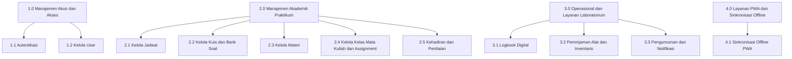
```mermaid
flowchart TD
    A[1.0 Manajemen Akun dan Akses]
    B[2.0 Manajemen Akademik Praktikum]
    C[3.0 Operasional dan Layanan Laboratorium]
    D[4.0 Layanan PWA dan Sinkronisasi Offline]

    A --> A1[1.1 Autentikasi]
    A --> A2[1.2 Kelola User]

    B --> B1[2.1 Kelola Jadwal]
    B --> B2[2.2 Kelola Kuis dan Bank Soal]
    B --> B3[2.3 Kelola Materi]
    B --> B4[2.4 Kelola Kelas Mata Kuliah dan Assignment]
    B --> B5[2.5 Kehadiran dan Penilaian]

    C --> C1[3.1 Logbook Digital]
    C --> C2[3.2 Peminjaman Alat dan Inventaris]
    C --> C3[3.3 Pengumuman dan Notifikasi]

    D --> D1[4.1 Sinkronisasi Offline PWA]
```

Dengan pendekatan tersebut, dokumen ini menghasilkan **11 diagram Level 2** yang masing-masing berdiri sendiri.

Agar dokumen ini tetap berhenti pada **Level 2**, proses-proses di dalam setiap gambar **tidak lagi dibaca sebagai dekomposisi level berikutnya**, melainkan sebagai **aktivitas internal di dalam satu proses Level 2**. Karena itu, label internal pada setiap gambar menggunakan kode lokal seperti **A1, A2, A3** dan seterusnya. Kode lokal tersebut dipakai hanya untuk membantu pembacaan urutan aktivitas dalam satu diagram, **bukan** untuk menandai DFD Level 3.

### 3.0.1 Peta Diagram Level 2

| No. Diagram | Proses Level 2 | Asal Dekomposisi | Fokus Alur |
|---|---|---|---|
| Level 2.1 | 1.1 Autentikasi | 1.0 Manajemen Akun dan Akses | login, role, session, logout |
| Level 2.2 | 1.2 Kelola User | 1.0 Manajemen Akun dan Akses | akun, role, status user |
| Level 2.3 | 2.1 Kelola Jadwal | 2.0 Manajemen Akademik Praktikum | usulan, validasi, persetujuan, publikasi jadwal |
| Level 2.4 | 2.2 Kelola Kuis dan Bank Soal | 2.0 Manajemen Akademik Praktikum | kuis, bank soal, pengerjaan, hasil |
| Level 2.5 | 2.3 Kelola Materi | 2.0 Manajemen Akademik Praktikum | upload, metadata, akses materi, cache |
| Level 2.6 | 2.4 Kelola Kelas, Mata Kuliah, dan Assignment | 2.0 Manajemen Akademik Praktikum | data master akademik dan relasi |
| Level 2.7 | 2.5 Kehadiran dan Penilaian | 2.0 Manajemen Akademik Praktikum | presensi, nilai, rekap hasil |
| Level 2.8 | 3.1 Logbook Digital | 3.0 Operasional dan Layanan Laboratorium | entri logbook, review, umpan balik |
| Level 2.9 | 3.2 Peminjaman Alat dan Inventaris | 3.0 Operasional dan Layanan Laboratorium | inventaris, peminjaman, verifikasi, laporan |
| Level 2.10 | 3.3 Pengumuman dan Notifikasi | 3.0 Operasional dan Layanan Laboratorium | publikasi informasi dan distribusi role |
| Level 2.11 | 4.1 Sinkronisasi Offline PWA | 4.0 Layanan PWA dan Sinkronisasi Offline | cache, queue, sinkronisasi, konflik |

Subbagian di bawah ini menyajikan **diagram rinci untuk setiap proses Level 2** yang berasal dari empat proses utama pada Level 1. Setiap diagram hanya memuat satu proses Level 2 beserta aktivitas internalnya, entitas eksternal yang relevan, dan data store konseptual yang benar-benar terlibat.

Agar lebih jelas dibaca pada bab skripsi, urutan penyajian diagram pada dokumen ini disusun **sesuai nomor Diagram Level 2**, bukan semata-mata mengikuti urutan edit sebelumnya. Dengan demikian, pembaca dapat langsung melihat hubungan antara nomor diagram, nama proses, dan proses induknya tanpa kebingungan.

Catatan penyelarasan dengan aplikasi aktif:

- nama data store pada Level 2 ditulis secara **konseptual**, misalnya data user dan role, data jadwal, metadata materi, data kehadiran dan nilai, serta offline queue;
- istilah proses disusun mengikuti alur fitur yang benar-benar dipakai pada aplikasi, bukan sekadar nama halaman;
- aliran data difokuskan pada input, validasi, penyimpanan, distribusi hasil, cache, dan sinkronisasi agar tetap representatif terhadap implementasi PWA yang aktif;
- setiap diagram dibuat sesederhana mungkin agar tidak terlalu penuh, tetapi tetap cukup detail untuk menjelaskan perilaku sistem.

### 3.1 Diagram Level 2.1 — Proses 1.1 Autentikasi

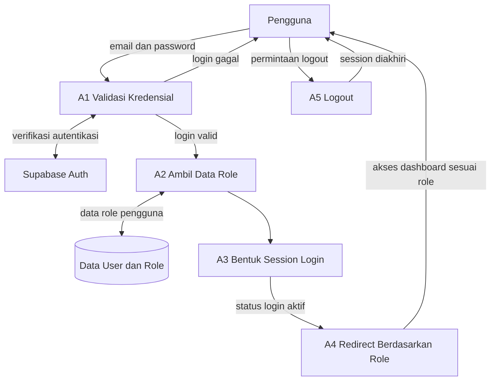
```mermaid
graph TB
    User[Pengguna]
    SupabaseAuth[Supabase Auth]
    D1[(Data User dan Role)]
    P1_1[A1 Validasi Kredensial]
    P1_2[A2 Ambil Data Role]
    P1_3[A3 Bentuk Session Login]
    P1_4[A4 Redirect Berdasarkan Role]
    P1_5[A5 Logout]

    User -->|email dan password| P1_1
    P1_1 <-->|verifikasi autentikasi| SupabaseAuth
    P1_1 -->|login valid| P1_2
    P1_1 -->|login gagal| User
    P1_2 <-->|data role pengguna| D1
    P1_2 --> P1_3
    P1_3 -->|status login aktif| P1_4
    P1_4 -->|akses dashboard sesuai role| User
    User -->|permintaan logout| P1_5
    P1_5 -->|session diakhiri| User
```

| Kode Aktivitas | Nama | Deskripsi |
|---|---|---|
| A1 | Validasi Kredensial | memverifikasi email dan password pengguna |
| A2 | Ambil Data Role | mengambil data peran pengguna setelah autentikasi berhasil |
| A3 | Bentuk Session Login | membentuk status login aktif pada aplikasi |
| A4 | Redirect Berdasarkan Role | mengarahkan pengguna ke dashboard sesuai hak akses |
| A5 | Logout | mengakhiri sesi login pengguna |

---
 
### 3.2 Diagram Level 2.2 — Proses 1.2 Kelola User
 
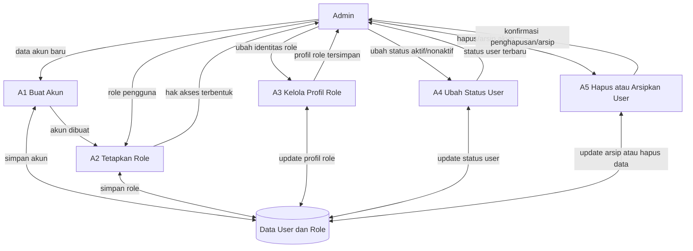
```mermaid
graph TB
    Admin[Admin]
    D1[(Data User dan Role)]
 
    P2_1[A1 Buat Akun]
    P2_2[A2 Tetapkan Role]
    P2_3[A3 Kelola Profil Role]
    P2_4[A4 Ubah Status User]
    P2_5[A5 Hapus atau Arsipkan User]
 
    Admin -->|data akun baru| P2_1
    P2_1 -->|akun dibuat| P2_2
    P2_1 <-->|simpan akun| D1
    Admin -->|role pengguna| P2_2
    P2_2 <-->|simpan role| D1
    Admin -->|ubah identitas role| P2_3
    P2_3 <-->|update profil role| D1
    Admin -->|ubah status aktif/nonaktif| P2_4
    P2_4 <-->|update status user| D1
    Admin -->|hapus/arsip akun| P2_5
    P2_5 <-->|update arsip atau hapus data| D1
    P2_2 -->|hak akses terbentuk| Admin
    P2_3 -->|profil role tersimpan| Admin
    P2_4 -->|status user terbaru| Admin
    P2_5 -->|konfirmasi penghapusan/arsip| Admin
```
 
| Kode Aktivitas | Nama | Deskripsi |
|---|---|---|
| A1 | Buat Akun | admin membuat akun pengguna baru |
| A2 | Tetapkan Role | sistem menetapkan role pengguna |
| A3 | Kelola Profil Role | data identitas per role disimpan dan diperbarui |
| A4 | Ubah Status User | admin mengaktifkan atau menonaktifkan user |
| A5 | Hapus atau Arsipkan User | admin menghapus atau mengarsipkan akun yang tidak digunakan |
 
---
 
### 3.3 Diagram Level 2.3 — Proses 2.1 Kelola Jadwal

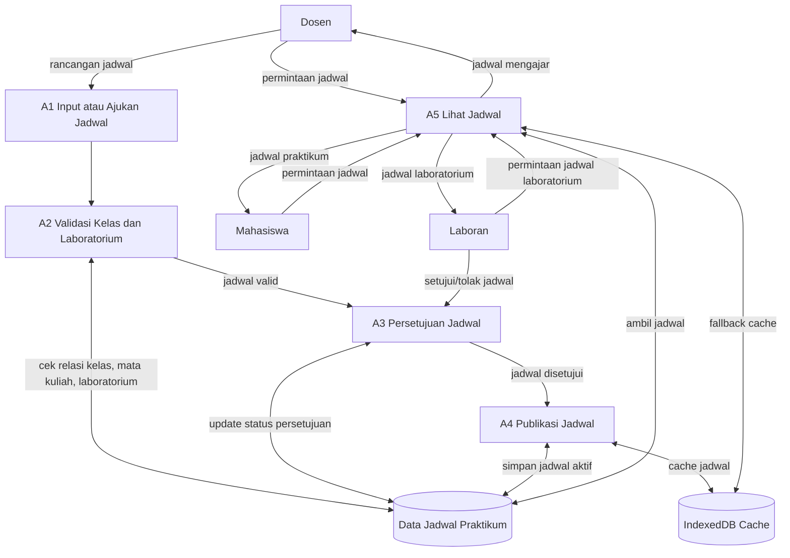
```mermaid
graph TB
    Dosen[Dosen]
    Laboran[Laboran]
    Mahasiswa[Mahasiswa]
    D1[(Data Jadwal Praktikum)]
    D2[(IndexedDB Cache)]

    P3_1[A1 Input atau Ajukan Jadwal]
    P3_2[A2 Validasi Kelas dan Laboratorium]
    P3_3[A3 Persetujuan Jadwal]
    P3_4[A4 Publikasi Jadwal]
    P3_5[A5 Lihat Jadwal]

    Dosen -->|rancangan jadwal| P3_1
    P3_1 --> P3_2
    P3_2 <-->|cek relasi kelas, mata kuliah, laboratorium| D1
    P3_2 -->|jadwal valid| P3_3
    Laboran -->|setujui/tolak jadwal| P3_3
    P3_3 <-->|update status persetujuan| D1
    P3_3 -->|jadwal disetujui| P3_4
    P3_4 <-->|simpan jadwal aktif| D1
    P3_4 <-->|cache jadwal| D2
    Mahasiswa -->|permintaan jadwal| P3_5
    Dosen -->|permintaan jadwal| P3_5
    Laboran -->|permintaan jadwal laboratorium| P3_5
    P3_5 <-->|ambil jadwal| D1
    P3_5 <-->|fallback cache| D2
    P3_5 -->|jadwal praktikum| Mahasiswa
    P3_5 -->|jadwal mengajar| Dosen
    P3_5 -->|jadwal laboratorium| Laboran
```

| Kode Aktivitas | Nama | Deskripsi |
|---|---|---|
| A1 | Input atau Ajukan Jadwal | dosen memasukkan atau mengajukan rancangan jadwal praktikum |
| A2 | Validasi Kelas dan Laboratorium | sistem memeriksa relasi kelas, mata kuliah, waktu, dan laboratorium |
| A3 | Persetujuan Jadwal | laboran meninjau dan memutuskan status jadwal |
| A4 | Publikasi Jadwal | jadwal yang valid dipublikasikan ke pengguna terkait |
| A5 | Lihat Jadwal | pengguna melihat jadwal dari database atau cache |

---

### 3.4 Diagram Level 2.4 — Proses 2.2 Kelola Kuis dan Bank Soal

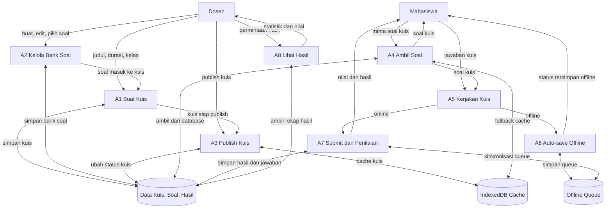
```mermaid
graph TB
    Dosen[Dosen]
    Mahasiswa[Mahasiswa]
    D1[(Data Kuis, Soal, Hasil)]
    D2[(IndexedDB Cache)]
    D3[(Offline Queue)]

    P4_1[A1 Buat Kuis]
    P4_2[A2 Kelola Bank Soal]
    P4_3[A3 Publish Kuis]
    P4_4[A4 Ambil Soal]
    P4_5[A5 Kerjakan Kuis]
    P4_6[A6 Auto-save Offline]
    P4_7[A7 Submit dan Penilaian]
    P4_8[A8 Lihat Hasil]

    Dosen -->|judul, durasi, kelas| P4_1
    Dosen -->|buat, edit, pilih soal| P4_2
    Dosen -->|publish kuis| P4_3
    Dosen -->|permintaan hasil| P4_8

    Mahasiswa -->|minta soal kuis| P4_4
    Mahasiswa -->|jawaban kuis| P4_5

    P4_2 -->|soal masuk ke kuis| P4_1
    P4_1 -->|kuis siap publish| P4_3
    P4_4 -->|soal kuis| P4_5
    P4_5 -->|online| P4_7
    P4_5 -->|offline| P4_6

    P4_1 <-->|simpan kuis| D1
    P4_2 <-->|simpan bank soal| D1
    P4_3 <-->|ubah status kuis| D1
    P4_3 <-->|cache kuis| D2
    P4_4 <-->|ambil dari database| D1
    P4_4 <-->|fallback cache| D2
    P4_6 <-->|simpan queue| D3
    P4_7 <-->|simpan hasil dan jawaban| D1
    P4_7 <-->|sinkronisasi queue| D3
    P4_8 <-->|ambil rekap hasil| D1

    P4_4 -->|soal kuis| Mahasiswa
    P4_6 -->|status tersimpan offline| Mahasiswa
    P4_7 -->|nilai dan hasil| Mahasiswa
    P4_8 -->|statistik dan nilai| Dosen
```

| Kode Aktivitas | Nama | Deskripsi |
|---|---|---|
| A1 | Buat Kuis | dosen membuat kuis beserta parameter utamanya |
| A2 | Kelola Bank Soal | dosen menambah, memilih, atau memperbarui soal |
| A3 | Publish Kuis | sistem mempublikasikan kuis ke kelas target |
| A4 | Ambil Soal | mahasiswa mengambil paket soal dari database atau cache |
| A5 | Kerjakan Kuis | mahasiswa mengerjakan kuis dan menghasilkan jawaban |
| A6 | Auto-save Offline | sistem menyimpan jawaban sementara ke antrean lokal saat offline |
| A7 | Submit dan Penilaian | sistem menerima jawaban, menyimpan hasil, dan memproses penilaian |
| A8 | Lihat Hasil | dosen melihat statistik dan hasil kuis yang tersimpan |

---

### 3.5 Diagram Level 2.5 — Proses 2.3 Kelola Materi

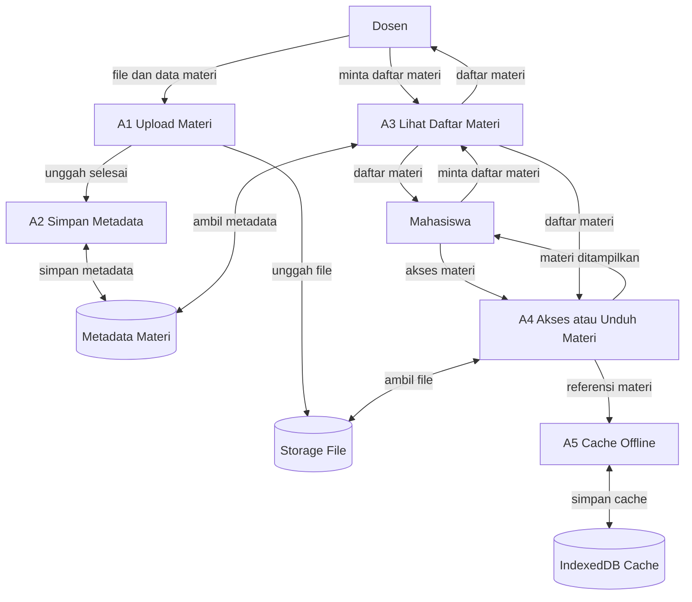
```mermaid
graph TB
    Dosen[Dosen]
    Mahasiswa[Mahasiswa]
    D1[(Metadata Materi)]
    D2[(IndexedDB Cache)]
    D4[(Storage File)]

    P5_1[A1 Upload Materi]
    P5_2[A2 Simpan Metadata]
    P5_3[A3 Lihat Daftar Materi]
    P5_4[A4 Akses atau Unduh Materi]
    P5_5[A5 Cache Offline]

    Dosen -->|file dan data materi| P5_1
    P5_1 -->|unggah selesai| P5_2
    P5_1 -->|unggah file| D4
    P5_2 <-->|simpan metadata| D1
    Mahasiswa -->|minta daftar materi| P5_3
    Dosen -->|minta daftar materi| P5_3
    P5_3 <-->|ambil metadata| D1
    P5_3 -->|daftar materi| Mahasiswa
    P5_3 -->|daftar materi| Dosen
    Mahasiswa -->|akses materi| P5_4
    P5_3 -->|daftar materi| P5_4
    P5_4 <-->|ambil file| D4
    P5_4 -->|referensi materi| P5_5
    P5_5 <-->|simpan cache| D2
    P5_4 -->|materi ditampilkan| Mahasiswa
```

| Kode Aktivitas | Nama | Deskripsi |
|---|---|---|
| A1 | Upload Materi | dosen mengunggah file materi |
| A2 | Simpan Metadata | sistem menyimpan judul, kelas, dan referensi file |
| A3 | Lihat Daftar Materi | dosen dan mahasiswa melihat daftar materi |
| A4 | Akses atau Unduh Materi | mahasiswa membuka atau mengunduh materi |
| A5 | Cache Offline | sistem menyimpan materi atau referensinya untuk akses offline |

---
 
### 3.6 Diagram Level 2.6 — Proses 2.4 Kelola Kelas, Mata Kuliah, dan Assignment
 
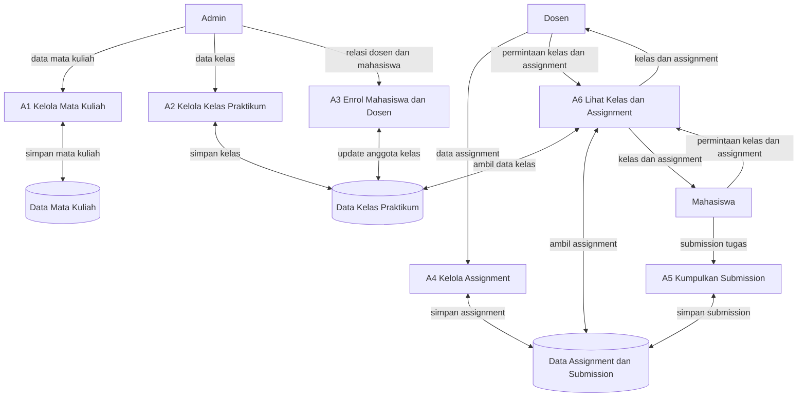
```mermaid
graph TB
    Admin[Admin]
    Dosen[Dosen]
    Mahasiswa[Mahasiswa]
    D1[(Data Mata Kuliah)]
    D2[(Data Kelas Praktikum)]
    D3[(Data Assignment dan Submission)]
 
    P6_1[A1 Kelola Mata Kuliah]
    P6_2[A2 Kelola Kelas Praktikum]
    P6_3[A3 Enrol Mahasiswa dan Dosen]
    P6_4[A4 Kelola Assignment]
    P6_5[A5 Kumpulkan Submission]
    P6_6[A6 Lihat Kelas dan Assignment]
 
    Admin -->|data mata kuliah| P6_1
    P6_1 <-->|simpan mata kuliah| D1
    Admin -->|data kelas| P6_2
    P6_2 <-->|simpan kelas| D2
    Admin -->|relasi dosen dan mahasiswa| P6_3
    P6_3 <-->|update anggota kelas| D2
    Dosen -->|data assignment| P6_4
    P6_4 <-->|simpan assignment| D3
    Mahasiswa -->|submission tugas| P6_5
    P6_5 <-->|simpan submission| D3
    Dosen -->|permintaan kelas dan assignment| P6_6
    Mahasiswa -->|permintaan kelas dan assignment| P6_6
    P6_6 <-->|ambil data kelas| D2
    P6_6 <-->|ambil assignment| D3
    P6_6 -->|kelas dan assignment| Dosen
    P6_6 -->|kelas dan assignment| Mahasiswa
```
 
| Kode Aktivitas | Nama | Deskripsi |
|---|---|---|
| A1 | Kelola Mata Kuliah | admin mengelola data master mata kuliah |
| A2 | Kelola Kelas Praktikum | admin membentuk kelas praktikum yang aktif |
| A3 | Enrol Mahasiswa dan Dosen | admin menetapkan dosen dan mahasiswa ke kelas praktikum |
| A4 | Kelola Assignment | dosen membuat dan mengatur assignment pada kelas |
| A5 | Kumpulkan Submission | mahasiswa mengirim jawaban atau file tugas |
| A6 | Lihat Kelas dan Assignment | dosen dan mahasiswa melihat struktur kelas serta daftar assignment |
 
---
 
### 3.7 Diagram Level 2.7 — Proses 2.5 Kehadiran dan Penilaian
 
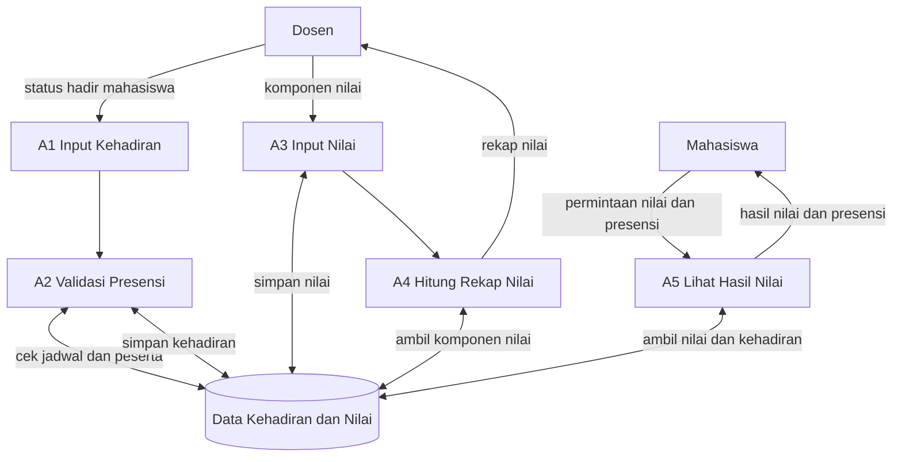
```mermaid
graph TB
    Dosen[Dosen]
    Mahasiswa[Mahasiswa]
    D1[(Data Kehadiran dan Nilai)]
 
    P7_1[A1 Input Kehadiran]
    P7_2[A2 Validasi Presensi]
    P7_3[A3 Input Nilai]
    P7_4[A4 Hitung Rekap Nilai]
    P7_5[A5 Lihat Hasil Nilai]
 
    Dosen -->|status hadir mahasiswa| P7_1
    P7_1 --> P7_2
    P7_2 <-->|cek jadwal dan peserta| D1
    P7_2 <-->|simpan kehadiran| D1
    Dosen -->|komponen nilai| P7_3
    P7_3 <-->|simpan nilai| D1
    P7_3 --> P7_4
    P7_4 <-->|ambil komponen nilai| D1
    P7_4 -->|rekap nilai| Dosen
    Mahasiswa -->|permintaan nilai dan presensi| P7_5
    P7_5 <-->|ambil nilai dan kehadiran| D1
    P7_5 -->|hasil nilai dan presensi| Mahasiswa
```
 
| Kode Aktivitas | Nama | Deskripsi |
|---|---|---|
| A1 | Input Kehadiran | dosen mencatat kehadiran mahasiswa |
| A2 | Validasi Presensi | sistem memvalidasi kehadiran terhadap jadwal dan peserta |
| A3 | Input Nilai | dosen memasukkan komponen penilaian |
| A4 | Hitung Rekap Nilai | sistem menyusun rekap atau nilai akhir |
| A5 | Lihat Hasil Nilai | mahasiswa melihat hasil presensi dan nilai |
 
---
 
### 3.8 Diagram Level 2.8 — Proses 3.1 Logbook Digital
 
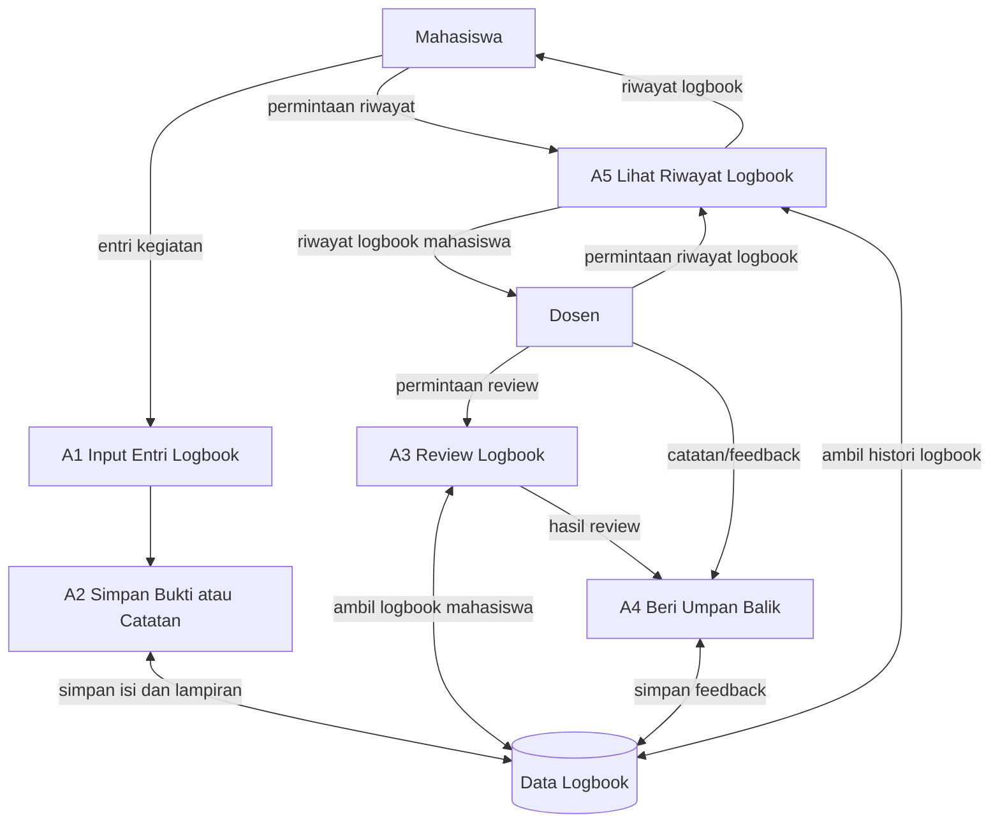
```mermaid
graph TB
    Mahasiswa[Mahasiswa]
    Dosen[Dosen]
    D1[(Data Logbook)]
 
    P8_1[A1 Input Entri Logbook]
    P8_2[A2 Simpan Bukti atau Catatan]
    P8_3[A3 Review Logbook]
    P8_4[A4 Beri Umpan Balik]
    P8_5[A5 Lihat Riwayat Logbook]
 
    Mahasiswa -->|entri kegiatan| P8_1
    P8_1 --> P8_2
    P8_2 <-->|simpan isi dan lampiran| D1
    Dosen -->|permintaan review| P8_3
    P8_3 <-->|ambil logbook mahasiswa| D1
    P8_3 -->|hasil review| P8_4
    Dosen -->|catatan/feedback| P8_4
    P8_4 <-->|simpan feedback| D1
    Mahasiswa -->|permintaan riwayat| P8_5
    Dosen -->|permintaan riwayat logbook| P8_5
    P8_5 <-->|ambil histori logbook| D1
    P8_5 -->|riwayat logbook| Mahasiswa
    P8_5 -->|riwayat logbook mahasiswa| Dosen
```
 
| Kode Aktivitas | Nama | Deskripsi |
|---|---|---|
| A1 | Input Entri Logbook | mahasiswa menulis entri kegiatan praktikum |
| A2 | Simpan Bukti atau Catatan | sistem menyimpan isi logbook dan lampiran pendukung |
| A3 | Review Logbook | dosen memeriksa logbook mahasiswa |
| A4 | Beri Umpan Balik | dosen memberi catatan atau status review |
| A5 | Lihat Riwayat Logbook | pengguna melihat histori logbook yang tersimpan |
 
---
 
### 3.9 Diagram Level 2.9 — Proses 3.2 Peminjaman Alat dan Inventaris

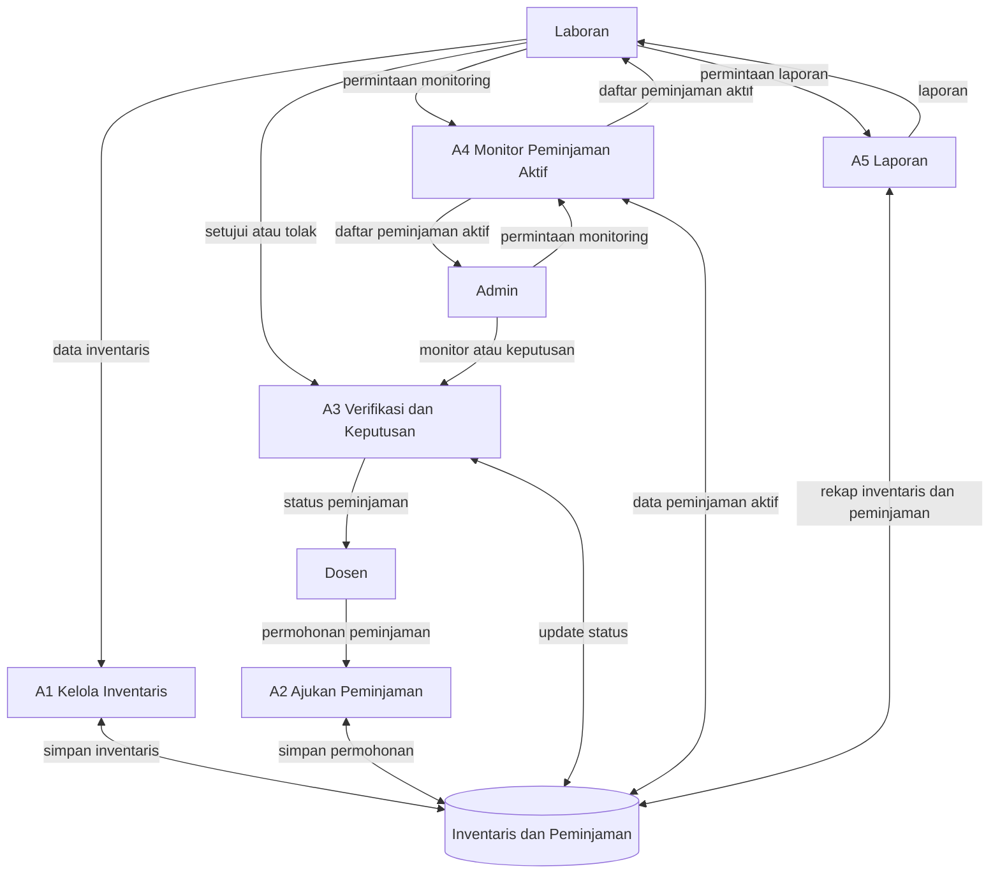
```mermaid
graph TB
    Dosen[Dosen]
    Laboran[Laboran]
    Admin[Admin]
    D1[(Inventaris dan Peminjaman)]

    P9_1[A1 Kelola Inventaris]
    P9_2[A2 Ajukan Peminjaman]
    P9_3[A3 Verifikasi dan Keputusan]
    P9_4[A4 Monitor Peminjaman Aktif]
    P9_5[A5 Laporan]

    Laboran -->|data inventaris| P9_1
    P9_1 <-->|simpan inventaris| D1
    Dosen -->|permohonan peminjaman| P9_2
    P9_2 <-->|simpan permohonan| D1
    Laboran -->|setujui atau tolak| P9_3
    Admin -->|monitor atau keputusan| P9_3
    P9_3 <-->|update status| D1
    P9_3 -->|status peminjaman| Dosen
    Laboran -->|permintaan monitoring| P9_4
    Admin -->|permintaan monitoring| P9_4
    P9_4 <-->|data peminjaman aktif| D1
    P9_4 -->|daftar peminjaman aktif| Laboran
    P9_4 -->|daftar peminjaman aktif| Admin
    Laboran -->|permintaan laporan| P9_5
    P9_5 <-->|rekap inventaris dan peminjaman| D1
    P9_5 -->|laporan| Laboran
```

| Kode Aktivitas | Nama | Deskripsi |
|---|---|---|
| A1 | Kelola Inventaris | laboran mengelola data inventaris |
| A2 | Ajukan Peminjaman | dosen mengajukan peminjaman alat |
| A3 | Verifikasi dan Keputusan | laboran dan admin memproses status peminjaman |
| A4 | Monitor Peminjaman Aktif | sistem menampilkan transaksi yang sedang berjalan |
| A5 | Laporan | sistem menghasilkan rekap inventaris dan peminjaman |

---

### 3.10 Diagram Level 2.10 — Proses 3.3 Pengumuman dan Notifikasi

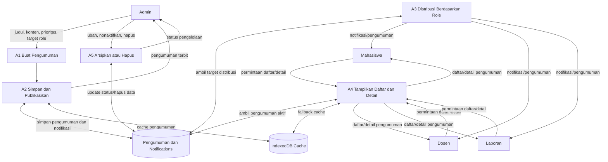
```mermaid
graph TB
    Admin[Admin]
    Mahasiswa[Mahasiswa]
    Dosen[Dosen]
    Laboran[Laboran]
    D1[(Pengumuman dan Notifications)]
    D2[(IndexedDB Cache)]

    P10_1[A1 Buat Pengumuman]
    P10_2[A2 Simpan dan Publikasikan]
    P10_3[A3 Distribusi Berdasarkan Role]
    P10_4[A4 Tampilkan Daftar dan Detail]
    P10_5[A5 Arsipkan atau Hapus]

    Admin -->|judul, konten, prioritas, target role| P10_1
    P10_1 --> P10_2
    P10_2 <-->|simpan pengumuman dan notifikasi| D1
    P10_2 <-->|cache pengumuman| D2
    P10_2 -->|pengumuman terbit| Admin
    P10_3 <-->|ambil target distribusi| D1
    P10_3 -->|notifikasi/pengumuman| Mahasiswa
    P10_3 -->|notifikasi/pengumuman| Dosen
    P10_3 -->|notifikasi/pengumuman| Laboran
    Mahasiswa -->|permintaan daftar/detail| P10_4
    Dosen -->|permintaan daftar/detail| P10_4
    Laboran -->|permintaan daftar/detail| P10_4
    P10_4 <-->|ambil pengumuman aktif| D1
    P10_4 <-->|fallback cache| D2
    P10_4 -->|daftar/detail pengumuman| Mahasiswa
    P10_4 -->|daftar/detail pengumuman| Dosen
    P10_4 -->|daftar/detail pengumuman| Laboran
    Admin -->|ubah, nonaktifkan, hapus| P10_5
    P10_5 <-->|update status/hapus data| D1
    P10_5 -->|status pengelolaan| Admin
```

| Kode Aktivitas | Nama | Deskripsi |
|---|---|---|
| A1 | Buat Pengumuman | admin menyusun judul, konten, prioritas, dan target role |
| A2 | Simpan dan Publikasikan | sistem menyimpan pengumuman lalu mempublikasikannya |
| A3 | Distribusi Berdasarkan Role | sistem membentuk distribusi pengumuman/notifikasi ke role tujuan |
| A4 | Tampilkan Daftar dan Detail | pengguna melihat pengumuman aktif dari database atau cache |
| A5 | Arsipkan atau Hapus | admin memperbarui, menonaktifkan, atau menghapus pengumuman |

---

### 3.11 Diagram Level 2.11 — Proses 4.1 Sinkronisasi Offline PWA

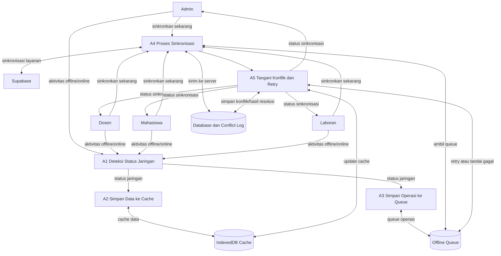
```mermaid
graph TB
    Admin[Admin]
    Dosen[Dosen]
    Mahasiswa[Mahasiswa]
    Laboran[Laboran]
    Supabase[Supabase]
    D1[(Database dan Conflict Log)]
    D2[(IndexedDB Cache)]
    D3[(Offline Queue)]

    P11_1[A1 Deteksi Status Jaringan]
    P11_2[A2 Simpan Data ke Cache]
    P11_3[A3 Simpan Operasi ke Queue]
    P11_4[A4 Proses Sinkronisasi]
    P11_5[A5 Tangani Konflik dan Retry]

    Admin -->|aktivitas offline/online| P11_1
    Dosen -->|aktivitas offline/online| P11_1
    Mahasiswa -->|aktivitas offline/online| P11_1
    Laboran -->|aktivitas offline/online| P11_1
    P11_1 -->|status jaringan| P11_2
    P11_1 -->|status jaringan| P11_3
    P11_2 <-->|cache data| D2
    P11_3 <-->|queue operasi| D3
    Admin -->|sinkronkan sekarang| P11_4
    Dosen -->|sinkronkan sekarang| P11_4
    Mahasiswa -->|sinkronkan sekarang| P11_4
    Laboran -->|sinkronkan sekarang| P11_4
    P11_4 <-->|ambil queue| D3
    P11_4 <-->|kirim ke server| D1
    P11_4 <-->|sinkronisasi layanan| Supabase
    P11_4 --> P11_5
    P11_5 <-->|update cache| D2
    P11_5 <-->|retry atau tandai gagal| D3
    P11_5 <-->|simpan konflik/hasil resolusi| D1
    P11_5 -->|status sinkronisasi| Admin
    P11_5 -->|status sinkronisasi| Dosen
    P11_5 -->|status sinkronisasi| Mahasiswa
    P11_5 -->|status sinkronisasi| Laboran
```

| Kode Aktivitas | Nama | Deskripsi |
|---|---|---|
| A1 | Deteksi Status Jaringan | sistem mendeteksi kondisi online atau offline |
| A2 | Simpan Data ke Cache | data penting disimpan lokal untuk akses offline |
| A3 | Simpan Operasi ke Queue | operasi tulis ditahan sementara saat offline |
| A4 | Proses Sinkronisasi | queue dikirim kembali saat koneksi tersedia |
| A5 | Tangani Konflik dan Retry | sistem mengelola konflik, retry, resolusi, dan status hasil sinkronisasi |

---

## 4. Catatan Akademik Penggunaan DFD

Dokumen ini **bukan pemetaan satu per satu terhadap nama file, route, atau nama tabel fisik**, melainkan representasi alur data pada level analisis dan perancangan. Namun, istilah proses dan ruang lingkupnya telah diselaraskan dengan implementasi aplikasi aktif agar tetap konsisten saat digunakan pada Bab IV bagian hasil dan pembahasan.

Pada revisi ini, prinsip yang dipakai adalah **satu proses Level 2 = satu diagram**. Prinsip tersebut dipilih agar:

- visual diagram lebih rapi dan tidak terlalu padat;
- aliran data setiap proses lebih mudah diikuti oleh pembaca dan penguji;
- hubungan antara proses, entitas eksternal, dan data store tidak bercampur berlebihan dalam satu gambar;
- isi diagram tetap selaras dengan fitur aktif aplikasi tanpa kehilangan ketelitian akademik.

Selain itu, untuk menjaga konsistensi bahwa model berhenti sampai **DFD Level 2**, aktivitas internal pada setiap diagram hanya diperlakukan sebagai rincian alur dalam proses Level 2, bukan sebagai level dekomposisi baru. Oleh karena itu, kode seperti **A1, A2, A3** dipakai sebagai penanda lokal aktivitas, bukan nomor proses Level 3.

## 6. Status Dokumen

- Versi: **revisi sinkron dengan aplikasi aktif dan konsisten sampai Level 2**
- Status: **siap digunakan sebagai dasar penjelasan DFD pada hasil dan pembahasan skripsi**