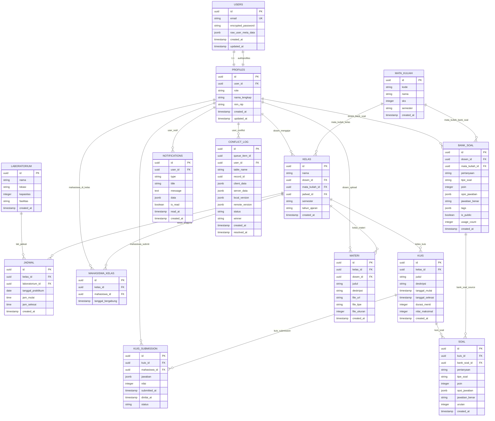

# Entity Relationship Diagram (ERD)
## Sistem Praktikum PWA

---

## 1. ERD DIAGRAM (Mermaid)



---

## 2. ENTITY DETAIL

### 2.1 User Management

#### USERS (Supabase Auth)
| Column | Type | Constraints | Description |
|--------|------|-------------|-------------|
| id | uuid | PK | Unique user ID |
| email | text | UNIQUE, NOT NULL | User email |
| encrypted_password | text | NOT NULL | Hashed password |
| raw_user_meta_data | jsonb | | {role, name, avatar_url} |
| created_at | timestamptz | DEFAULT NOW() | Account created time |
| updated_at | timestamptz | | Last update |

**Relationships**:
- 1:1 with PROFILES

#### PROFILES
| Column | Type | Constraints | Description |
|--------|------|-------------|-------------|
| id | uuid | PK, FK → USERS.id | Profile ID |
| user_id | uuid | UNIQUE, NOT NULL | Link to USERS |
| role | text | CHECK (role in ('admin','dosen','mahasiswa','laboran')) | User role |
| nama_lengkap | text | NOT NULL | Full name |
| nim_nip | text | UNIQUE | NIM (mahasiswa) or NIP (dosen/laboran) |
| no_hp | text | | Phone number |
| avatar_url | text | | Profile picture URL |
| created_at | timestamptz | DEFAULT NOW() | Profile created |
| updated_at | timestamptz | | Last update |

**Relationships**:
- Belongs to USERS
- Has many KELAS (as dosen)
- Has many MAHASISWA_KELAS (as mahasiswa)
- Has many BANK_SOAL (as dosen)
- Has many MATERI (as dosen)
- Has many KUIS_SUBMISSION (as mahasiswa)
- Has many NOTIFICATIONS
- Has many CONFLICT_LOG

---

### 2.2 Master Data

#### MATA_KULIAH
| Column | Type | Constraints | Description |
|--------|------|-------------|-------------|
| id | uuid | PK | Mata kuliah ID |
| kode | text | UNIQUE, NOT NULL | Course code (e.g., "IF2341") |
| nama | text | NOT NULL | Course name |
| sks | integer | NOT NULL | Credit units |
| semester | text | | Semester (1-8) |
| created_at | timestamptz | DEFAULT NOW() | |

**Relationships**:
- Has many KELAS
- Has many BANK_SOAL

#### LABORATORIUM
| Column | Type | Constraints | Description |
|--------|------|-------------|-------------|
| id | uuid | PK | Lab ID |
| nama | text | NOT NULL | Lab name (e.g., "Lab Komputer 1") |
| lokasi | text | | Location |
| kapasitas | integer | | Max capacity |
| fasilitas | text[] | | Facilities list |
| created_at | timestamptz | DEFAULT NOW() | |

**Relationships**:
- Has many JADWAL

---

### 2.3 Jadwal & Kelas

#### KELAS
| Column | Type | Constraints | Description |
|--------|------|-------------|-------------|
| id | uuid | PK | Class ID |
| nama | text | NOT NULL | Class name (e.g., "Kelas Pemrograman Web A") |
| dosen_id | uuid | FK → PROFILES.id | Dosen pengajar |
| mata_kuliah_id | uuid | FK → MATA_KULIAH.id | Mata kuliah |
| jadwal_id | uuid | FK → JADWAL.id | Jadwal praktikum |
| semester | text | NOT NULL | Semester (Ganjil/Genap) |
| tahun_ajaran | text | NOT NULL | Tahun ajaran (e.g., "2024/2025") |
| kuota | integer | DEFAULT 30 | Max mahasiswa |
| created_at | timestamptz | DEFAULT NOW() | |

**Relationships**:
- Belongs to PROFILES (as dosen)
- Belongs to MATA_KULIAH
- Belongs to JADWAL
- Has many MAHASISWA_KELAS
- Has many KUIS
- Has many MATERI

#### JADWAL
| Column | Type | Constraints | Description |
|--------|------|-------------|-------------|
| id | uuid | PK | Schedule ID |
| kelas_id | uuid | FK → KELAS.id | Related class |
| laboratorium_id | uuid | FK → LABORATORIUM.id | Lab location |
| tanggal_praktikum | date | NOT NULL | Practice date |
| jam_mulai | time | NOT NULL | Start time |
| jam_selesai | time | NOT NULL | End time |
| created_at | timestamptz | DEFAULT NOW() | |

**Relationships**:
- Belongs to KELAS
- Belongs to LABORATORIUM

#### MAHASISWA_KELAS (Junction Table)
| Column | Type | Constraints | Description |
|--------|------|-------------|-------------|
| id | uuid | PK | Enrollment ID |
| kelas_id | uuid | FK → KELAS.id | Class |
| mahasiswa_id | uuid | FK → PROFILES.id | Mahasiswa |
| tanggal_bergabung | timestamptz | DEFAULT NOW() | Enrollment date |
| status | text | DEFAULT 'aktif' | Status (aktif/non-aktif) |

**Relationships**:
- Belongs to KELAS
- Belongs to PROFILES (as mahasiswa)

**Unique Constraint**: (kelas_id, mahasiswa_id)

---

### 2.4 Kuis & Bank Soal

#### KUIS
| Column | Type | Constraints | Description |
|--------|------|-------------|-------------|
| id | uuid | PK | Quiz ID |
| kelas_id | uuid | FK → KELAS.id | Target class |
| judul | text | NOT NULL | Quiz title |
| deskripsi | text | | Description |
| tanggal_mulai | timestamptz | NOT NULL | Start datetime |
| tanggal_selesai | timestamptz | NOT NULL | End datetime |
| durasi_menit | integer | DEFAULT 60 | Duration in minutes |
| nilai_maksimal | integer | DEFAULT 100 | Max score |
| acak_soal | boolean | DEFAULT false | Randomize questions |
| created_at | timestamptz | DEFAULT NOW() | |

**Relationships**:
- Belongs to KELAS
- Has many SOAL
- Has many KUIS_SUBMISSION

#### BANK_SOAL
| Column | Type | Constraints | Description |
|--------|------|-------------|-------------|
| id | uuid | PK | Question ID |
| dosen_id | uuid | FK → PROFILES.id | Creator |
| mata_kuliah_id | uuid | FK → MATA_KULIAH.id | Related course |
| pertanyaan | text | NOT NULL | Question text |
| tipe_soal | text | NOT NULL | Type (essay/multiple_choice/true_false) |
| poin | integer | DEFAULT 5 | Point value |
| opsi_jawaban | jsonb | | Options for MCQ |
| jawaban_benar | text | | Correct answer |
| pembahasan | text | | Explanation |
| tags | text[] | | Searchable tags |
| is_public | boolean | DEFAULT false | Share with other dosens |
| usage_count | integer | DEFAULT 0 | Times used |
| created_at | timestamptz | DEFAULT NOW() | |
| updated_at | timestamptz | | |

**Relationships**:
- Belongs to PROFILES (as dosen)
- Belongs to MATA_KULIAH
- Has many SOAL (via bank_soal_id)

#### SOAL
| Column | Type | Constraints | Description |
|--------|------|-------------|-------------|
| id | uuid | PK | Question ID in quiz |
| kuis_id | uuid | FK → KUIS.id | Quiz |
| bank_soal_id | uuid | FK → BANK_SOAL.id | Source (optional) |
| pertanyaan | text | NOT NULL | Question text |
| tipe_soal | text | NOT NULL | Type |
| poin | integer | NOT NULL | Point value |
| opsi_jawaban | jsonb | | MCQ options |
| jawaban_benar | text | | Answer key |
| urutan | integer | | Order in quiz |
| created_at | timestamptz | DEFAULT NOW() | |

**Relationships**:
- Belongs to KUIS
- Belongs to BANK_SOAL (optional, if reused)

#### KUIS_SUBMISSION
| Column | Type | Constraints | Description |
|--------|------|-------------|-------------|
| id | uuid | PK | Submission ID |
| kuis_id | uuid | FK → KUIS.id | Quiz |
| mahasiswa_id | uuid | FK → PROFILES.id | Student |
| jawaban | jsonb | NOT NULL | Answers {soal_id: jawaban} |
| nilai | integer | | Score (nullable until graded) |
| submitted_at | timestamptz | DEFAULT NOW() | Submission time |
| dinilai_at | timestamptz | | Graded time |
| status | text | DEFAULT 'submitted' | Status (draft/submitted/graded) |
| created_at | timestamptz | DEFAULT NOW() | |

**Relationships**:
- Belongs to KUIS
- Belongs to PROFILES (as mahasiswa)

**Unique Constraint**: (kuis_id, mahasiswa_id)

---

### 2.5 Materi

#### MATERI
| Column | Type | Constraints | Description |
|--------|------|-------------|-------------|
| id | uuid | PK | Material ID |
| kelas_id | uuid | FK → KELAS.id | Target class |
| dosen_id | uuid | FK → PROFILES.id | Uploader |
| judul | text | NOT NULL | Title |
| deskripsi | text | | Description |
| file_url | text | NOT NULL | Storage URL |
| file_tipe | text | | File type (pdf/ppt/etc) |
| file_ukuran | integer | | Size in bytes |
| download_count | integer | DEFAULT 0 | Download counter |
| created_at | timestamptz | DEFAULT NOW() | |

**Relationships**:
- Belongs to KELAS
- Belongs to PROFILES (as dosen)

---

### 2.6 Notifications

#### NOTIFICATIONS
| Column | Type | Constraints | Description |
|--------|------|-------------|-------------|
| id | uuid | PK | Notification ID |
| user_id | uuid | FK → PROFILES.id | Recipient |
| type | text | NOT NULL | Type (tugas_baru/nilai_kelas/announcement) |
| title | text | NOT NULL | Notification title |
| message | text | NOT NULL | Message content |
| data | jsonb | | Additional data |
| is_read | boolean | DEFAULT false | Read status |
| read_at | timestamptz | | Read timestamp |
| created_at | timestamptz | DEFAULT NOW() | |

**Relationships**:
- Belongs to PROFILES

---

### 2.7 Conflict Log (Offline Sync)

#### CONFLICT_LOG
| Column | Type | Constraints | Description |
|--------|------|-------------|-------------|
| id | uuid | PK | Conflict ID |
| queue_item_id | uuid | | Related queue item |
| user_id | uuid | FK → PROFILES.id | User with conflict |
| table_name | text | NOT NULL | Table with conflict |
| record_id | uuid | NOT NULL | Conflicting record |
| client_data | jsonb | NOT NULL | Local changes |
| server_data | jsonb | NOT NULL | Server data |
| local_version | jsonb | | Local version metadata |
| remote_version | jsonb | | Remote version metadata |
| status | text | DEFAULT 'pending' | Resolution status |
| winner | text | | 'local' or 'remote' |
| resolved_at | timestamptz | | Resolution time |
| created_at | timestamptz | DEFAULT NOW() | |

**Relationships**:
- Belongs to PROFILES

---

### 2.8 Offline Queue (Client-Side Only)

#### OFFLINE_QUEUE (IndexedDB)
| Property | Type | Description |
|----------|------|-------------|
| id | string | Unique queue item ID |
| action | string | Action type (createKuis, updateMateri, etc) |
| table | string | Target table |
| data | object | Payload data |
| timestamp | number | Queue time |
| attempts | number | Retry count |
| status | string | 'pending'/'processing'/'completed'/'failed' |

---

## 3. RELATIONSHIP SUMMARY

### 3.1 One-to-One (1:1)
| Entity A | Entity B | Description |
|----------|----------|-------------|
| USERS | PROFILES | Each user has one profile |

### 3.2 One-to-Many (1:N)
| Parent | Child | Relationship | Description |
|--------|-------|--------------|-------------|
| PROFILES | KELAS | Dosen → Kelas | One dosen teaches many classes |
| PROFILES | MAHASISWA_KELAS | Mahasiswa → Kelas | One mahasiswa enrolls in many classes |
| PROFILES | BANK_SOAL | Dosen → Bank Soal | One dosen creates many questions |
| PROFILES | MATERI | Dosen → Materi | One dosen uploads many materials |
| PROFILES | KUIS_SUBMISSION | Mahasiswa → Submission | One mahasiswa submits many quizzes |
| PROFILES | NOTIFICATIONS | User → Notif | One user receives many notifications |
| PROFILES | CONFLICT_LOG | User → Conflict | One user has many conflicts |
| MATA_KULIAH | KELAS | MK → Kelas | One MK has many classes |
| MATA_KULIAH | BANK_SOAL | MK → Bank Soal | One MK has many questions |
| LABORATORIUM | JADWAL | Lab → Jadwal | One lab has many schedules |
| KELAS | JADWAL | Kelas → Jadwal | One class has schedule |
| KELAS | MAHASISWA_KELAS | Kelas → Enrollments | One class has many students |
| KELAS | KUIS | Kelas → Kuis | One class has many quizzes |
| KELAS | MATERI | Kelas → Materi | One class has many materials |
| KUIS | SOAL | Kuis → Soal | One quiz has many questions |
| KUIS | KUIS_SUBMISSION | Kuis → Submission | One quiz has many submissions |

### 3.3 Many-to-Many (N:M)
| Entity A | Entity B | Junction Table | Description |
|----------|----------|----------------|-------------|
| KELAS | PROFILES | MAHASISWA_KELAS | Students in classes |

---

## 4. INDEXES

### 4.1 Performance Indexes

```sql
-- USERS
CREATE INDEX idx_users_email ON users(email);

-- PROFILES
CREATE INDEX idx_profiles_role ON profiles(role);
CREATE INDEX idx_profiles_nim_nip ON profiles(nim_nip);

-- KELAS
CREATE INDEX idx_kelas_dosen ON kelas(dosen_id);
CREATE INDEX idx_kelas_mk ON kelas(mata_kuliah_id);
CREATE INDEX idx_kelas_semester ON kelas(semester, tahun_ajaran);

-- JADWAL
CREATE INDEX idx_jadwal_tanggal ON jadwal(tanggal_praktikum);
CREATE INDEX idx_jadwal_lab ON jadwal(laboratorium_id);
CREATE INDEX idx_jadwal_kelas ON jadwal(kelas_id);

-- MAHASISWA_KELAS
CREATE INDEX idx_mahasiswa_kelas_mahasiswa ON mahasiswa_kelas(mahasiswa_id);
CREATE INDEX idx_mahasiswa_kelas_kelas ON mahasiswa_kelas(kelas_id);
CREATE UNIQUE INDEX idx_mahasiswa_kelas_unique ON mahasiswa_kelas(kelas_id, mahasiswa_id);

-- KUIS
CREATE INDEX idx_kuis_kelas ON kuis(kelas_id);
CREATE INDEX idx_kuis_tanggal ON kuis(tanggal_mulai, tanggal_selesai);

-- BANK_SOAL
CREATE INDEX idx_bank_soal_dosen ON bank_soal(dosen_id);
CREATE INDEX idx_bank_soal_mk ON bank_soal(mata_kuliah_id);
CREATE INDEX idx_bank_soal_tags ON bank_soal USING GIN(tags);
CREATE INDEX idx_bank_soal_public ON bank_soal(is_public) WHERE is_public = true;

-- SOAL
CREATE INDEX idx_soal_kuis ON soal(kuis_id);
CREATE INDEX idx_soal_bank ON soal(bank_soal_id);

-- KUIS_SUBMISSION
CREATE INDEX idx_submission_kuis ON kuis_submission(kuis_id);
CREATE INDEX idx_submission_mahasiswa ON kuis_submission(mahasiswa_id);
CREATE UNIQUE INDEX idx_submission_unique ON kuis_submission(kuis_id, mahasiswa_id);

-- MATERI
CREATE INDEX idx_materi_kelas ON materi(kelas_id);
CREATE INDEX idx_materi_dosen ON materi(dosen_id);

-- NOTIFICATIONS
CREATE INDEX idx_notif_user ON notifications(user_id);
CREATE INDEX idx_notif_read ON notifications(is_read);
CREATE INDEX idx_notif_created ON notifications(created_at DESC);

-- CONFLICT_LOG
CREATE INDEX idx_conflict_user ON conflict_log(user_id);
CREATE INDEX idx_conflict_status ON conflict_log(status);
```

---

## 5. ROW LEVEL SECURITY (RLS)

### 5.1 RLS Policies

```sql
-- PROFILES
-- All users can read profiles
CREATE POLICY "Public profiles are viewable by everyone"
ON profiles FOR SELECT USING (true);

-- Users can only update their own profile
CREATE POLICY "Users can update own profile"
ON profiles FOR UPDATE USING (auth.uid() = id);

-- KELAS
-- Dosen can see their own classes
CREATE POLICY "Dosen can see own classes"
ON kelas FOR SELECT
USING (
    auth.uid() IN (
        SELECT dosen_id FROM kelas WHERE id = kelas.id
    )
);

-- Mahasiswa can see their enrolled classes
CREATE POLICY "Mahasiswa can see enrolled classes"
ON kelas FOR SELECT
USING (
    auth.uid() IN (
        SELECT mahasiswa_id FROM mahasiswa_kelas WHERE kelas_id = kelas.id
    )
);

-- KUIS
-- Students can see quizzes for their classes
CREATE POLICY "Mahasiswa can see class quizzes"
ON kuis FOR SELECT
USING (
    auth.uid() IN (
        SELECT mahasiswa_id FROM mahasiswa_kelas WHERE kelas_id = kuis.kelas_id
    )
);

-- BANK_SOAL
-- Dosen can manage their own questions
CREATE POLICY "Dosen can manage own bank soal"
ON bank_soal FOR ALL
USING (auth.uid() = dosen_id);

-- All dosen can see public questions
CREATE POLICY "Dosen can see public bank soal"
ON bank_soal FOR SELECT
USING (is_public = true OR auth.uid() = dosen_id);

-- NOTIFICATIONS
-- Users can only see their own notifications
CREATE POLICY "Users can see own notifications"
ON notifications FOR SELECT
USING (auth.uid() = user_id);
```

---

## 6. DATA VOLUME ESTIMATES

| Table | Estimated Rows | Growth Rate | Storage (1 year) |
|-------|----------------|-------------|------------------|
| USERS | 500 | 10% | ~50 KB |
| PROFILES | 500 | 10% | ~100 KB |
| MATA_KULIAH | 50 | 5% | ~10 KB |
| LABORATORIUM | 10 | 0% | ~5 KB |
| KELAS | 100 | 20% | ~50 KB |
| MAHASISWA_KELAS | 2000 | 20% | ~200 KB |
| JADWAL | 100 | 20% | ~50 KB |
| KUIS | 300 | 30% | ~100 KB |
| BANK_SOAL | 1500 | 40% | ~500 KB |
| SOAL | 3000 | 30% | ~1 MB |
| KUIS_SUBMISSION | 4500 | 30% | ~2 MB |
| MATERI | 600 | 30% | ~100 KB (files not counted) |
| NOTIFICATIONS | 15000 | 50% | ~3 MB |
| CONFLICT_LOG | 50 | 10% | ~20 KB |
| **TOTAL** | | | **~7.6 MB** (DB only, files in storage) |

---

## 7. MIGRATION PLAN

### 7.1 Supabase Setup

```bash
# 1. Create project
supabase init

# 2. Generate types
supabase gen types typescript --local > src/types/database.types.ts

# 3. Apply migrations
supabase db push

# 4. Seed data (optional)
supabase db seed
```

### 7.2 Initial Seed Data

```sql
-- Create admin user
INSERT INTO profiles (id, role, nama_lengkap, nim_nip)
VALUES (
    (gen_random_uuid()),
    'admin',
    'Administrator',
    'ADMIN001'
);

-- Create sample dosen
INSERT INTO profiles (id, role, nama_lengkap, nim_nip)
VALUES
    (gen_random_uuid(), 'dosen', 'Dr. Budi Santoso', 'NIP001'),
    (gen_random_uuid(), 'dosen', 'Prof. Siti Aminah', 'NIP002');

-- Create sample mahasiswa
INSERT INTO profiles (id, role, nama_lengkap, nim_nip)
VALUES
    (gen_random_uuid(), 'mahasiswa', 'Ahmad Dani', 'M12345678'),
    (gen_random_uuid(), 'mahasiswa', 'Dewi Lestari', 'M87654321');
```

---

## 8. BACKUP & RESTORE

### 8.1 Backup Strategy

```bash
# Daily backup
pg_dump -h db.xxx.supabase.co -U postgres -d postgres > backup_$(date +%Y%m%d).sql

# Backup to storage
aws s3 cp backup_$(date +%Y%m%d).sql s3://backups/praktikum-pwa/
```

### 8.2 Restore

```bash
# Restore from backup
psql -h db.xxx.supabase.co -U postgres -d postgres < backup_20241201.sql
```

---

## 9. MONITORING QUERIES

### 9.1 Table Sizes
```sql
SELECT
    schemaname,
    tablename,
    pg_size_pretty(pg_total_relation_size(schemaname||'.'||tablename)) AS size
FROM pg_tables
WHERE schemaname = 'public'
ORDER BY pg_total_relation_size(schemaname||'.'||tablename) DESC;
```

### 9.2 Row Counts
```sql
SELECT
    'profiles' AS table_name, COUNT(*) FROM profiles
UNION ALL SELECT 'kelas', COUNT(*) FROM kelas
UNION ALL SELECT 'kuis', COUNT(*) FROM kuis
UNION ALL SELECT 'bank_soal', COUNT(*) FROM bank_soal
UNION ALL SELECT 'notifications', COUNT(*) FROM notifications;
```

### 9.3 Slow Queries
```sql
SELECT
    query,
    mean_exec_time,
    calls
FROM pg_stat_statements
ORDER BY mean_exec_time DESC
LIMIT 10;
```

---

## 10. SUMMARY

### 10.1 Total Tables: 15

| Category | Tables |
|----------|--------|
| User Management | 2 (USERS, PROFILES) |
| Master Data | 2 (MATA_KULIAH, LABORATORIUM) |
| Class & Schedule | 3 (KELAS, JADWAL, MAHASISWA_KELAS) |
| Quiz & Bank Soal | 4 (KUIS, BANK_SOAL, SOAL, KUIS_SUBMISSION) |
| Materials | 1 (MATERI) |
| Notifications | 1 (NOTIFICATIONS) |
| Offline Sync | 1 (CONFLICT_LOG) |
| Client Queue | 1 (OFFLINE_QUEUE in IndexedDB) |

### 10.2 Key Features
✅ Multi-role RBAC (Admin, Dosen, Mahasiswa, Laboran)
✅ Flexible quiz system with reusable bank soal
✅ Offline-first architecture with conflict resolution
✅ Auto-notification system
✅ Comprehensive audit trail (created_at, updated_at)
✅ Row Level Security for data isolation
✅ Optimized indexes for performance
