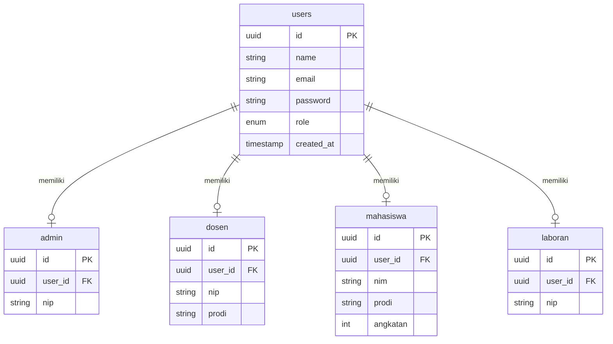
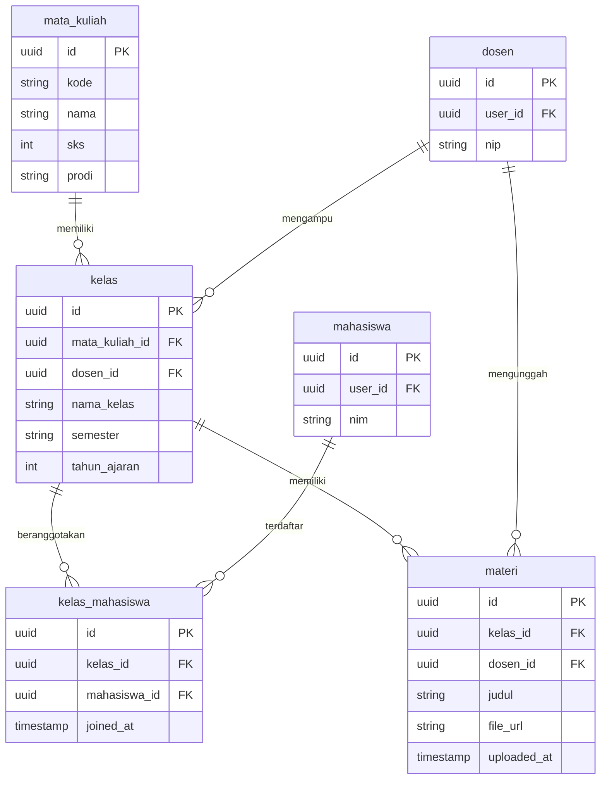
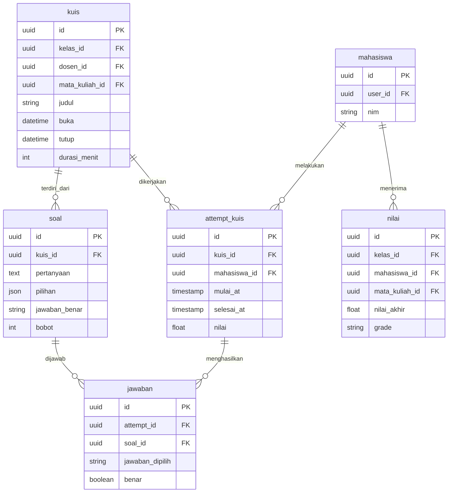
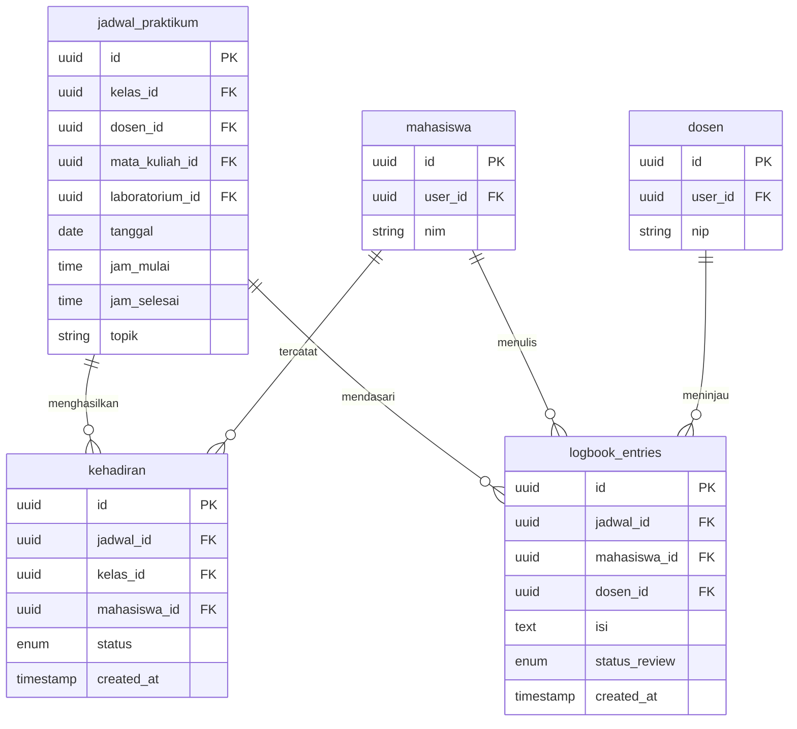
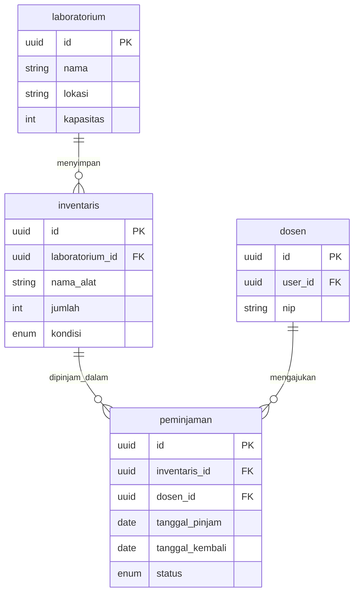
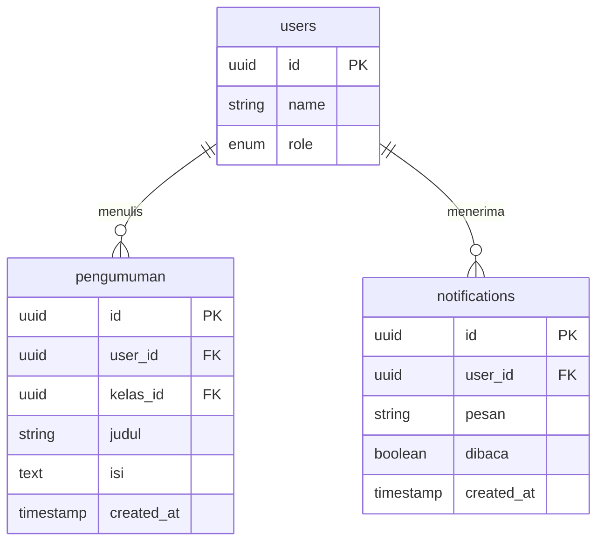
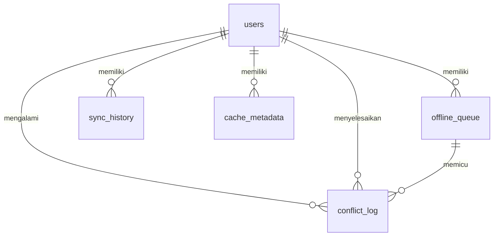

# ERD Backend per Domain dan Diagram Sinkronisasi Offline

Dokumen ini berisi diagram backend dalam format Mermaid yang dibagi **per domain** agar lebih rapi saat dirender dan lebih mudah dipakai sebagai dasar visual untuk Bab V pada [`docs/BAB4.md`](docs/BAB4.md).

Pendekatan per domain dipilih karena ERD dengan jumlah entitas besar cenderung menghasilkan tata letak otomatis yang kurang stabil pada Mermaid. Dengan memecah diagram berdasarkan domain data, setiap relasi inti tetap dapat ditampilkan tanpa menimbulkan garis yang saling bertumpuk secara berlebihan.

## 1. ERD Domain Pengguna dan Peran

### Caption yang disarankan

**Gambar X. ERD Domain Pengguna dan Peran pada Sistem Praktikum PWA**

### Narasi singkat yang disarankan

Gambar X menunjukkan domain identitas pengguna yang menjadi fondasi autentikasi dan otorisasi sistem. Tabel [`users`](docs/ERD_BACKEND_MERMAID.md) berfungsi sebagai pusat identitas akun, sedangkan tabel [`admin`](docs/ERD_BACKEND_MERMAID.md), [`dosen`](docs/ERD_BACKEND_MERMAID.md), [`mahasiswa`](docs/ERD_BACKEND_MERMAID.md), dan [`laboran`](docs/ERD_BACKEND_MERMAID.md) menyimpan profil spesifik berdasarkan role. Struktur ini menegaskan bahwa sistem mengimplementasikan arsitektur multi-role sebagai dasar pengendalian akses dan personalisasi layanan.

## 2. ERD Domain Akademik: Kelas dan Materi

### Caption yang disarankan

**Gambar X+1. ERD Domain Akademik: Kelas dan Materi pada Sistem Praktikum PWA**

### Narasi singkat yang disarankan

Diagram ini memperlihatkan struktur data akademik dasar yang menghubungkan mata kuliah, kelas praktikum, peserta kelas, dan materi pembelajaran. Tabel [`kelas`](docs/ERD_BACKEND_MERMAID.md) menjadi simpul utama karena berelasi dengan [`mata_kuliah`](docs/ERD_BACKEND_MERMAID.md), [`dosen`](docs/ERD_BACKEND_MERMAID.md), [`kelas_mahasiswa`](docs/ERD_BACKEND_MERMAID.md), dan [`materi`](docs/ERD_BACKEND_MERMAID.md). Dengan struktur tersebut, distribusi materi tidak berdiri sendiri, tetapi terikat langsung pada konteks kelas dan pengampu yang sah.

## 3. ERD Domain Penilaian: Kuis dan Nilai

### Caption yang disarankan

**Gambar X+2. ERD Domain Penilaian: Kuis dan Nilai pada Sistem Praktikum PWA**

### Narasi singkat yang disarankan

Diagram ini menunjukkan alur data evaluasi pembelajaran yang dimulai dari penyusunan kuis, pembentukan soal, pengerjaan oleh mahasiswa, penyimpanan jawaban, hingga pembentukan nilai akhir. Relasi antara [`kuis`](docs/ERD_BACKEND_MERMAID.md), [`soal`](docs/ERD_BACKEND_MERMAID.md), [`attempt_kuis`](docs/ERD_BACKEND_MERMAID.md), dan [`jawaban`](docs/ERD_BACKEND_MERMAID.md) menegaskan bahwa sistem evaluasi tidak hanya menampilkan soal, tetapi juga merekam proses pengerjaan secara terstruktur. Tabel [`nilai`](docs/ERD_BACKEND_MERMAID.md) melengkapi domain ini sebagai keluaran formal evaluasi akademik.

## 4. ERD Domain Praktikum: Jadwal, Kehadiran, dan Logbook

### Caption yang disarankan

**Gambar X+3. ERD Domain Praktikum: Jadwal, Kehadiran, dan Logbook pada Sistem Praktikum PWA**

### Narasi singkat yang disarankan

Gambar ini memperlihatkan bahwa aktivitas praktikum direpresentasikan secara terstruktur melalui tabel [`jadwal_praktikum`](docs/ERD_BACKEND_MERMAID.md), [`kehadiran`](docs/ERD_BACKEND_MERMAID.md), dan [`logbook_entries`](docs/ERD_BACKEND_MERMAID.md). Tabel jadwal menjadi dasar bagi pencatatan kehadiran dan penulisan logbook, sehingga setiap aktivitas mahasiswa dapat ditelusuri berdasarkan sesi praktikum yang sah. Struktur ini mendukung monitoring kegiatan, evaluasi proses belajar, dan dokumentasi aktivitas praktikum secara sistematis.

## 5. ERD Domain Laboratorium dan Inventaris

### Caption yang disarankan

**Gambar X+4. ERD Domain Laboratorium dan Inventaris pada Sistem Praktikum PWA**

### Narasi singkat yang disarankan

Diagram ini menunjukkan bahwa aspek operasional laboratorium dikelola melalui relasi antara [`laboratorium`](docs/ERD_BACKEND_MERMAID.md), [`inventaris`](docs/ERD_BACKEND_MERMAID.md), dan [`peminjaman`](docs/ERD_BACKEND_MERMAID.md). Kehadiran domain ini memperkuat bahwa sistem yang dibangun tidak hanya menangani aktivitas akademik, tetapi juga mengintegrasikan pengelolaan sarana laboratorium ke dalam basis data yang sama. Dengan demikian, kebutuhan pembelajaran dan operasional dapat dikelola secara terpadu.

## 6. ERD Domain Komunikasi

### Caption yang disarankan

**Gambar X+5. ERD Domain Komunikasi pada Sistem Praktikum PWA**

### Narasi singkat yang disarankan

Domain komunikasi memperlihatkan bahwa sistem menyediakan mekanisme penyampaian informasi melalui tabel [`pengumuman`](docs/ERD_BACKEND_MERMAID.md) dan [`notifications`](docs/ERD_BACKEND_MERMAID.md) yang terhubung dengan [`users`](docs/ERD_BACKEND_MERMAID.md). Struktur ini menunjukkan bahwa distribusi informasi dalam sistem tidak bersifat informal, tetapi dikelola sebagai bagian dari data aplikasi yang dapat diakses, ditelusuri, dan dikendalikan sesuai kebutuhan pengguna.

## 7. Diagram Relasi Sinkronisasi Offline

### Caption yang disarankan

**Gambar Y. Diagram Relasi Data Sinkronisasi Offline pada Sistem Praktikum PWA**

### Narasi singkat yang disarankan

Gambar Y menunjukkan bahwa mekanisme sinkronisasi offline pada aplikasi tidak hanya bergantung pada cache di sisi klien, tetapi juga didukung oleh struktur data yang mencatat antrean operasi, metadata cache, riwayat sinkronisasi, dan log konflik. Tabel [`offline_queue`](docs/ERD_BACKEND_MERMAID.md), [`sync_history`](docs/ERD_BACKEND_MERMAID.md), [`cache_metadata`](docs/ERD_BACKEND_MERMAID.md), dan [`conflict_log`](docs/ERD_BACKEND_MERMAID.md) memperlihatkan bahwa proses offline-first diimplementasikan secara sistematis. Ketika koneksi internet tidak tersedia, operasi tulis dapat ditahan sementara pada antrean lokal, lalu disinkronkan kembali saat koneksi pulih. Jika terjadi konflik, sistem mencatatnya agar dapat ditangani secara terkendali.

## 8. Saran pemakaian dalam Bab V

- Gunakan diagram per domain sebagai dasar visual ERD agar keterbacaan tetap tinggi pada [`docs/BAB4.md`](docs/BAB4.md).
- Jika jumlah gambar perlu dibatasi, prioritaskan domain [`Pengguna dan Peran`](docs/ERD_BACKEND_MERMAID.md), [`Akademik: Kelas dan Materi`](docs/ERD_BACKEND_MERMAID.md), [`Penilaian: Kuis dan Nilai`](docs/ERD_BACKEND_MERMAID.md), dan [`Sinkronisasi Offline`](docs/ERD_BACKEND_MERMAID.md).
- Domain lain dapat ditempatkan sebagai gambar pelengkap atau dijelaskan melalui tabel ringkasan dan narasi.
- Jika ingin hasil akhir lebih rapi untuk skripsi, salin kode Mermaid ini ke editor Mermaid atau alat diagram lain lalu ekspor ke PNG atau SVG.
