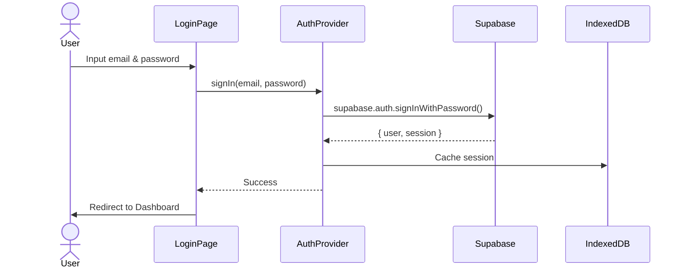
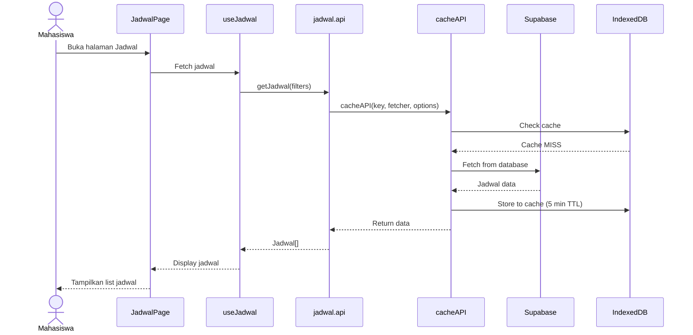
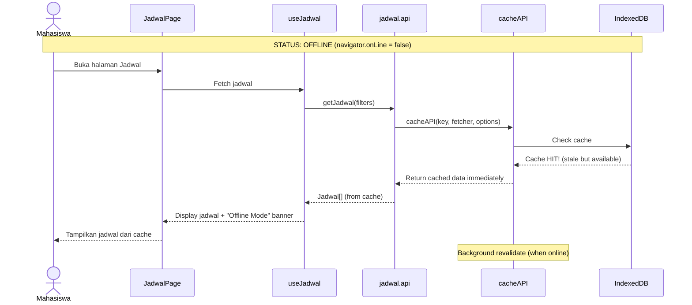
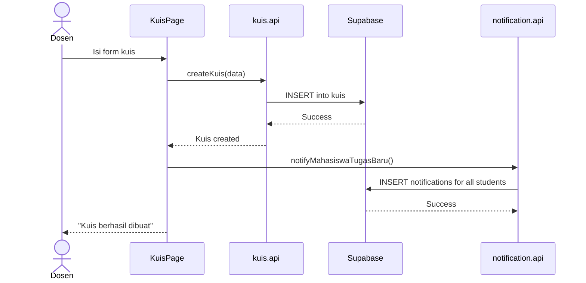
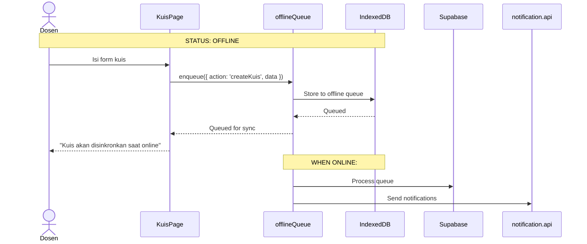
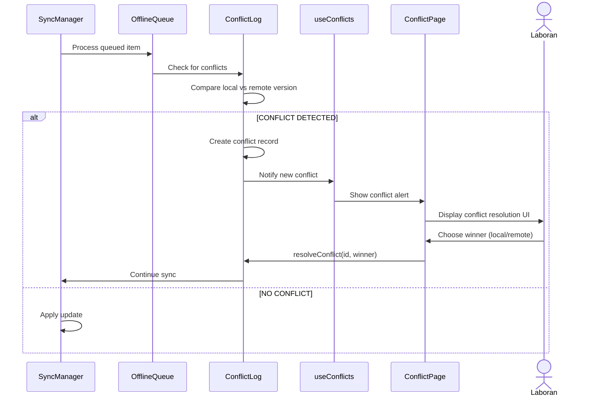

# Use Case & Arsitektur Sistem
## Sistem Praktikum PWA

---

## 1. USE CASE DIAGRAM

### 1.1 Actors

| Actor | Deskripsi |
|-------|-----------|
| **Mahasiswa** | User yang mengikuti praktikum, melihat jadwal, mengerjakan tugas |
| **Dosen** | Pengajar yang membuat kuis, materi, mengelola kelas |
| **Laboran** | Staff yang mengelola laboratorium dan jadwal penggunaan lab |
| **Admin** | Administrator yang mengelola user, kelas, dan system |
| **System** | Aplikasi PWA yang mengelola caching, offline mode, notifications |

---

### 1.2 Use Case Diagram (Mermaid)

```mermaid
graph TB
    subgraph "Mahasiswa"
        UC1[Lihat Jadwal Praktikum]
        UC2[Kerjakan Kuis]
        UC3[Lihat Materi]
        UC4[Lihat Notifikasi]
        UC5[Lihat Dashboard]
    end

    subgraph "Dosen"
        UC6[Kelola Kuis]
        UC7[Kelola Bank Soal]
        UC8[Kelola Materi]
        UC9[Kelola Kelas]
        UC10[Lihat Dashboard]
    end

    subgraph "Laboran"
        UC11[Lihat Jadwal Lab]
        UC12[Kelola Konflik Jadwal]
        UC13[Lihat Dashboard]
    end

    subgraph "Admin"
        UC14[Kelola User]
        UC15[Kelola Kelas]
        UC16[Generate Reports]
        UC17[Lihat Dashboard]
    end

    subgraph "System Features"
        UC18[Login/Logout]
        UC19[Offline Mode]
        UC20[Auto Notifications]
        UC21[Cache Management]
    end

    Mahasiswa --> UC1
    Mahasiswa --> UC2
    Mahasiswa --> UC3
    Mahasiswa --> UC4
    Mahasiswa --> UC5
    Mahasiswa --> UC18
    Mahasiswa --> UC19

    Dosen --> UC6
    Dosen --> UC7
    Dosen --> UC8
    Dosen --> UC9
    Dosen --> UC10
    Dosen --> UC18
    Dosen --> UC19

    Laboran --> UC11
    Laboran --> UC12
    Laboran --> UC13
    Laboran --> UC18
    Laboran --> UC19

    Admin --> UC14
    Admin --> UC15
    Admin --> UC16
    Admin --> UC17
    Admin --> UC18

    System --> UC19
    System --> UC20
    System --> UC21

    style Mahasiswa fill:#e1f5fe
    style Dosen fill:#fff3e0
    style Laboran fill:#f3e5f5
    style Admin fill:#ffebee
    style System fill:#e8f5e9
```



---

### 1.3 Daftar Use Case Per Role

#### MAHASISWA
| ID | Use Case | Deskripsi |
|----|----------|-----------|
| UC-M-01 | Lihat Jadwal Praktikum | Melihat jadwal praktikum dengan filter hari/lab |
| UC-M-02 | Kerjakan Kuis | Mengerjakan kuis dan melihat nilai |
| UC-M-03 | Akses Materi | Mendownload materi perkuliahan |
| UC-M-04 | Lihat Notifikasi | Melihat notifikasi tugas/nilai baru |
| UC-M-05 | Lihat Dashboard | Melihat summary jadwal & tugas |

#### DOSEN
| ID | Use Case | Deskripsi |
|----|----------|-----------|
| UC-D-01 | Kelola Kuis | CRUD kuis, tambah soal, nilai |
| UC-D-02 | Kelola Bank Soal | CRUD bank soal untuk reuse |
| UC-D-03 | Kelola Materi | Upload/download materi perkuliahan |
| UC-D-04 | Kelola Kelas | Manage anggota kelas |
| UC-D-05 | Lihat Dashboard | Summary kelas, kuis, materi |

#### LABORAN
| ID | Use Case | Deskripsi |
|----|----------|-----------|
| UC-L-01 | Lihat Jadwal Lab | Melihat penggunaan lab harian |
| UC-L-02 | Kelola Konflik | Resolve konflik jadwal |
| UC-L-03 | Lihat Dashboard | Summary lab & jadwal |

#### ADMIN
| ID | Use Case | Deskripsi |
|----|----------|-----------|
| UC-A-01 | Kelola User | CRUD users semua role |
| UC-A-02 | Kelola Kelas | Manage semua kelas |
| UC-A-03 | Generate Reports | Export laporan |
| UC-A-04 | Lihat Dashboard | Summary system |

---

## 2. ARSITEKTUR APLIKASI

### 2.1 High-Level Architecture

```
┌─────────────────────────────────────────────────────────────────┐
│                        PRESENTATION LAYER                       │
├─────────────────────────────────────────────────────────────────┤
│  React Components (tsx)                                        │
│  ┌──────────┐  ┌──────────┐  ┌──────────┐  ┌──────────┐       │
│  │  Pages   │  │ Components│ │  Hooks   │  │ Providers│       │
│  └──────────┘  └──────────┘  └──────────┘  └──────────┘       │
│                                                                  │
│  - Mahasiswa: JadwalPage, KuisPage, MateriPage                 │
│  - Dosen: KuisManagePage, BankSoalPage, KelasPage              │
│  - Laboran: LabSchedulePage, ConflictPage                      │
│  - Admin: UserManagePage, ReportPage                           │
└─────────────────────────────────────────────────────────────────┘
                                  ↓
┌─────────────────────────────────────────────────────────────────┐
│                      BUSINESS LOGIC LAYER                       │
├─────────────────────────────────────────────────────────────────┤
│  Custom Hooks (ts)                                             │
│  ┌──────────────────┐  ┌──────────────────┐                    │
│  │  useAuth         │  │  useNotification │                    │
│  │  useJadwal       │  │  useKuis         │                    │
│  │  useConflicts    │  │  useMateri       │                    │
│  └──────────────────┘  └──────────────────┘                    │
│                                                                  │
│  State Management: React Context (AuthProvider)                 │
└─────────────────────────────────────────────────────────────────┘
                                  ↓
┌─────────────────────────────────────────────────────────────────┐
│                       DATA ACCESS LAYER                          │
├─────────────────────────────────────────────────────────────────┤
│  API Modules (api/*.ts)                                         │
│  ┌──────────────────┐  ┌──────────────────┐                    │
│  │  base.api.ts     │  │  jadwal.api.ts   │                    │
│  │  kuis.api.ts     │  │  materi.api.ts   │                    │
│  │  bank-soal.api.ts│  │  kelas.api.ts    │                    │
│  │  notification... │  │  auth.api.ts     │                    │
│  └──────────────────┘  └──────────────────┘                    │
└─────────────────────────────────────────────────────────────────┘
                                  ↓
┌─────────────────────────────────────────────────────────────────┐
│                    OFFLINE/CACHE LAYER ✨                       │
├─────────────────────────────────────────────────────────────────┤
│  Offline Services (offline/*.ts)                                │
│  ┌──────────────────┐  ┌──────────────────┐                    │
│  │  api-cache.ts    │  │  indexeddb.ts    │                    │
│  │  queue.ts        │  │  sync.ts         │                    │
│  └──────────────────┘  └──────────────────┘                    │
│                                                                  │
│  Features:                                                      │
│  - Stale-while-revalidate caching                               │
│  - Offline queue untuk write operations                         │
│  - Auto-sync saat online                                       │
│  - Conflict detection & resolution                              │
└─────────────────────────────────────────────────────────────────┘
                                  ↓
┌─────────────────────────────────────────────────────────────────┐
│                    EXTERNAL DATA SOURCES                         │
├─────────────────────────────────────────────────────────────────┤
│  ┌──────────────────┐  ┌──────────────────┐                    │
│  │  Supabase        │  │  IndexedDB       │                    │
│  │  (PostgreSQL)    │  │  (Browser Cache) │                    │
│  └──────────────────┘  └──────────────────┘                    │
└─────────────────────────────────────────────────────────────────┘
```

---

### 2.2 Layered Architecture (Detail)

#### Layer 1: Presentation Layer
```
src/
├── pages/
│   ├── mahasiswa/
│   │   ├── DashboardPage.tsx
│   │   ├── JadwalPage.tsx
│   │   ├── KuisPage.tsx
│   │   └── MateriPage.tsx
│   ├── dosen/
│   │   ├── DashboardPage.tsx
│   │   ├── KuisManagePage.tsx
│   │   ├── BankSoalPage.tsx
│   │   ├── MateriPage.tsx
│   │   └── KelasPage.tsx
│   ├── laboran/
│   │   ├── DashboardPage.tsx
│   │   └── LabSchedulePage.tsx
│   └── admin/
│       ├── DashboardPage.tsx
│       └── UserManagePage.tsx
└── components/
    ├── ui/          # Reusable UI components
    └── forms/       # Form components
```

#### Layer 2: Business Logic Layer
```
src/lib/hooks/
├── useAuth.ts              # Authentication logic
├── useJadwal.ts            # Jadwal fetching & filtering
├── useKuis.ts              # Kuis CRUD logic
├── useMateri.ts            # Materi CRUD logic
├── useConflicts.ts         # Conflict resolution ✨
└── useNotificationPolling.ts # Auto-notification ✨
```

#### Layer 3: Data Access Layer
```
src/lib/api/
├── base.api.ts             # Generic CRUD operations ✨
├── auth.api.ts             # Authentication API
├── jadwal.api.ts           # Jadwal API ✨
├── kuis.api.ts             # Kuis API ✨
├── materi.api.ts           # Materi API ✨
├── bank-soal.api.ts        # Bank Soal API ✨
├── kelas.api.ts            # Kelas API ✨
└── notification.api.ts     # Notification API ✨
```
✨ = Enhanced with offline caching support

#### Layer 4: Offline/Cache Layer
```
src/lib/offline/
├── api-cache.ts            # CacheAPI wrapper (stale-while-revalidate) ✨
├── indexeddb.ts            # IndexedDB manager
├── queue.ts                # Offline write queue
└── sync.ts                 # Sync manager
```

---

### 2.3 Technology Stack

| Layer | Technology |
|-------|-----------|
| **Frontend** | React 18 + TypeScript + Vite |
| **Styling** | Tailwind CSS + shadcn/ui |
| **State Management** | React Context + Hooks |
| **Database (Online)** | Supabase (PostgreSQL) |
| **Database (Offline)** | IndexedDB |
| **Authentication** | Supabase Auth |
| **PWA** | Service Worker + Web App Manifest |
| **Testing** | Vitest (Unit Tests) |
| **Build** | Vite |

---

## 3. DATA FLOW DIAGRAMS

### 3.1 Flow: Login & Authentication



---

### 3.2 Flow: Lihat Jadwal (Mahasiswa) - Online Mode



---

### 3.3 Flow: Lihat Jadwal (Mahasiswa) - OFFLINE Mode ✨



---

### 3.4 Flow: Buat Kuis (Dosen) - Online



---

### 3.5 Flow: Buat Kuis (Dosen) - OFFLINE Mode ✨



---

### 3.6 Flow: Conflict Detection & Resolution ✨



---

## 4. DATABASE SCHEMA

### 4.1 Supabase (PostgreSQL)

```sql
-- Users (Supabase Auth)
auth.users (
    id uuid PRIMARY KEY,
    email text UNIQUE,
    raw_user_meta_data jsonb -- {role, name, ...}
)

-- Profiles
public.profiles (
    id uuid REFERENCES auth.users(id),
    role text CHECK (role in ('admin', 'dosen', 'mahasiswa', 'laboran')),
    nama_lengkap text,
    ...
)

-- Kelas
public.kelas (
    id uuid PRIMARY KEY,
    nama text,
    dosen_id uuid REFERENCES profiles(id),
    mata_kuliah_id uuid REFERENCES mata_kuliah(id),
    jadwal_id uuid REFERENCES jadwal(id)
)

-- Kuis
public.kuis (
    id uuid PRIMARY KEY,
    kelas_id uuid REFERENCES kelas(id),
    judul text,
    tanggal_mulai timestamptz,
    tanggal_selesai timestamptz,
    ...
)

-- Bank Soal
public.bank_soal (
    id uuid PRIMARY KEY,
    dosen_id uuid REFERENCES profiles(id),
    pertanyaan text,
    tipe_soal text,
    poin int,
    ...
)

-- Materi
public.materi (
    id uuid PRIMARY KEY,
    kelas_id uuid REFERENCES kelas(id),
    dosen_id uuid REFERENCES profiles(id),
    judul text,
    file_url text,
    ...
)

-- Jadwal
public.jadwal (
    id uuid PRIMARY KEY,
    kelas_id uuid REFERENCES kelas(id),
    laboratorium_id uuid REFERENCES laboratorium(id),
    tanggal_praktikum date,
    jam_mulai time,
    jam_selesai time,
    ...
)

-- Notifications
public.notifications (
    id uuid PRIMARY KEY,
    user_id uuid REFERENCES profiles(id),
    type text,
    title text,
    message text,
    is_read boolean DEFAULT false,
    ...
)

-- Conflict Log (Offline Sync) ✨
public.conflict_log (
    id uuid PRIMARY KEY,
    queue_item_id uuid,
    user_id uuid REFERENCES profiles(id),
    table_name text,
    record_id uuid,
    client_data jsonb,
    server_data jsonb,
    status text CHECK (status in ('pending', 'resolved')),
    winner text CHECK (winner in ('local', 'remote')),
    ...
)

-- Offline Queue (Client-side only, di IndexedDB)
```

---

### 4.2 IndexedDB Schema (Browser Cache)

```javascript
// Database: praktikum_pwa_db
// Version: 1

ObjectStore: 'cache'
- Key: cache key (e.g., "query_jadwal_{...}")
- Value: {
    key: string,
    data: any,
    timestamp: number,
    expiresAt: number
  }

ObjectStore: 'offline_queue'
- Key: queue item id
- Value: {
    id: string,
    action: string, // 'createKuis', 'updateMateri', etc.
    data: any,
    timestamp: number
  }

ObjectStore: 'conflicts'
- Key: conflict id
- Value: {
    id: string,
    table_name: string,
    record_id: string,
    client_data: any,
    server_data: any,
    status: 'pending' | 'resolved'
  }
```

---

## 5. API ENDPOINTS

### 5.1 Authentication
| Method | Endpoint | Deskripsi |
|--------|----------|-----------|
| POST | `/auth/v1/signin` | Login |
| POST | `/auth/v1/signout` | Logout |
| GET | `/auth/v1/user` | Get current user |

### 5.2 Kuis
| Method | Endpoint | Deskripsi | Caching |
|--------|----------|-----------|---------|
| GET | `/rest/v1/kuis` | Get all kuis | ✅ 5 min |
| GET | `/rest/v1/kuis?id=eq.{id}` | Get kuis by ID | ✅ 10 min |
| POST | `/rest/v1/kuis` | Create kuis | - |
| PATCH | `/rest/v1/kuis?id=eq.{id}` | Update kuis | - |
| DELETE | `/rest/v1/kuis?id=eq.{id}` | Delete kuis | - |

### 5.3 Jadwal
| Method | Endpoint | Deskripsi | Caching |
|--------|----------|-----------|---------|
| GET | `/rest/v1/jadwal` | Get all jadwal | ✅ 5 min |
| GET | `/rest/v1/jadwal?id=eq.{id}` | Get jadwal by ID | ✅ 10 min |

### 5.4 Materi
| Method | Endpoint | Deskripsi | Caching |
|--------|----------|-----------|---------|
| GET | `/rest/v1/materi` | Get all materi | ✅ 5 min |
| POST | `/rest/v1/materi` | Upload materi | - |

### 5.5 Bank Soal
| Method | Endpoint | Deskripsi | Caching |
|--------|----------|-----------|---------|
| GET | `/rest/v1/bank_soal` | Get all bank soal | ✅ 5 min |
| POST | `/rest/v1/bank_soal` | Create soal | - |

### 5.6 Notifications
| Method | Endpoint | Deskripsi | Caching |
|--------|----------|-----------|---------|
| GET | `/rest/v1/notifications` | Get notifications | ✅ 2 min |
| PATCH | `/rest/v1/notifications?id=eq.{id}` | Mark as read | - |

---

## 6. OFFLINE FIRST FEATURES ✨

### 6.1 Caching Strategy
- **Stale-While-Revalidate**: Tampilkan cache segera, revalidate di background
- **Cache TTL**: 2-10 menit tergantung tipe data
- **Cache Invalidation**: Manual invalidate setelah create/update/delete

### 6.2 Offline Queue
- Write operations di-queue saat offline
- Auto-sync saat kembali online
- Conflict detection jika data berubah di server

### 6.3 Conflict Resolution
- Manual conflict resolution oleh user
- Pilih winner: local version atau remote version
- Conflict log untuk audit

### 6.4 Notifications
- Real-time notifications saat online
- Polling dengan exponential backoff saat offline
- Auto-notification untuk events (tugas baru, nilai, dll)

---

## 7. SECURITY CONSIDERATIONS

### 7.1 Authentication
- Supabase Auth (JWT-based)
- Role-based access control (RBAC)
- Session management dengan refresh tokens

### 7.2 Authorization
- Row Level Security (RLS) di Supabase
- User hanya bisa akses data miliknya/role-nya
- Admin punya akses penuh

### 7.3 Data Protection
- HTTPS only
- Sensitive data tidak di-cache di IndexedDB
- Password hashing oleh Supabase

---

## 8. DEPLOYMENT ARCHITECTURE

```
┌─────────────────────────────────────────────────────────────────┐
│                         CLIENT SIDE                             │
│  Progressive Web App (PWA)                                     │
│  - Hosted di Vercel/Netlify                                     │
│  - Service Worker untuk offline capability                       │
│  - IndexedDB untuk local cache                                   │
└─────────────────────────────────────────────────────────────────┘
                                  ↓
┌─────────────────────────────────────────────────────────────────┐
│                         SERVER SIDE                             │
│  Supabase (Backend-as-a-Service)                               │
│  - PostgreSQL Database                                          │
│  - Auth Service                                                 │
│  - REST API (PostgREST)                                         │
│  - Real-time (Realtime)                                         │
└─────────────────────────────────────────────────────────────────┘
```

---

## 9. TESTING STRATEGY

### 9.1 White Box Testing (Unit Tests) ✅
- Test internal functions
- Test API modules dengan mocks
- Test hooks logic
- **Lokasi**: `src/__tests__/unit/`
- **Framework**: Vitest
- **Coverage**: API modules, cache layer

### 9.2 Black Box Testing (Manual Tests) ✅
- Test user flows tanpa lihat code
- Test input-output validation
- Test UI/UX behavior
- **Document**: `docs/BLACKBOX-TEST-PLAN.md`
- **Total Test Cases**: 30 scenarios

### 9.3 Integration Tests (Future)
- Test API + Supabase integration
- Test cache + IndexedDB integration
- Test offline sync flow

### 9.4 E2E Tests (Future)
- Test complete user flows
- Test offline scenarios
- **Framework**: Playwright/Cypress

---

## 10. SUMMARY

### 10.1 Key Features
1. **Multi-role System** (Admin, Dosen, Mahasiswa, Laboran)
2. **Offline-First PWA** ✨ (New feature yang diimplement)
3. **Auto-Notifications** untuk events penting
4. **Bank Soal** untuk reuse pertanyaan kuis
5. **Conflict Resolution** untuk offline sync
6. **Caching Strategy** (Stale-while-revalidate)

### 10.2 Technical Highlights
- **React 18 + TypeScript** untuk type safety
- **Supabase** untuk backend & database
- **IndexedDB** untuk offline cache
- **Service Worker** untuk PWA capability
- **Role-Based Access Control** untuk security
- **Modular Architecture** untuk maintainability

### 10.3 Files Modified untuk Offline Support
- `src/lib/api/base.api.ts` - Added caching support
- `src/lib/api/jadwal.api.ts` - Enabled cache
- `src/lib/api/kuis.api.ts` - Enabled cache
- `src/lib/api/materi.api.ts` - Enabled cache
- `src/lib/api/bank-soal.api.ts` - Wrapped with cacheAPI
- `src/lib/api/kelas.api.ts` - Enabled cache
- `src/lib/api/notification.api.ts` - Wrapped with cacheAPI
- `src/lib/hooks/useConflicts.ts` - Added cacheAPI + offline checks
- `src/lib/hooks/useNotificationPolling.ts` - Added offline checks
- `src/lib/offline/api-cache.ts` - Cache layer implementation
