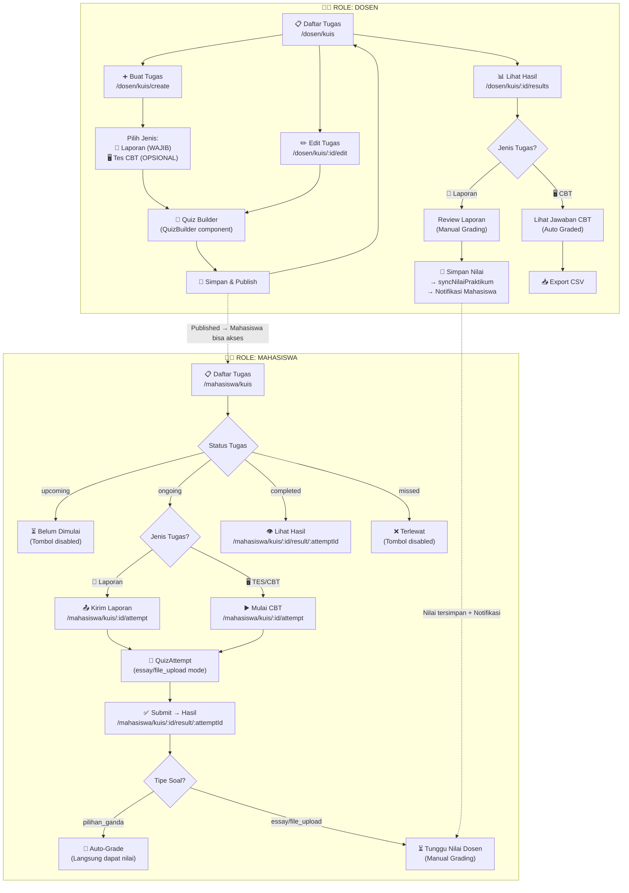
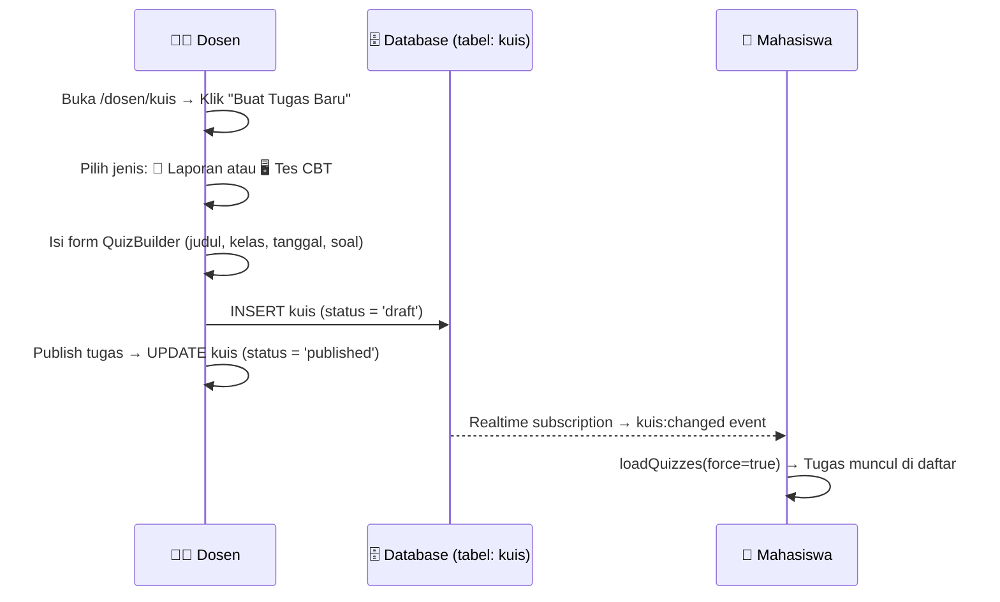
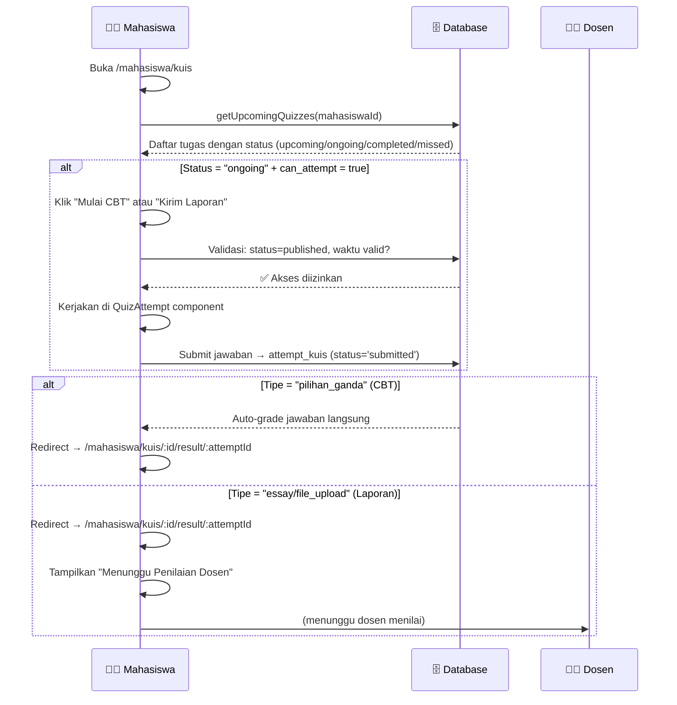
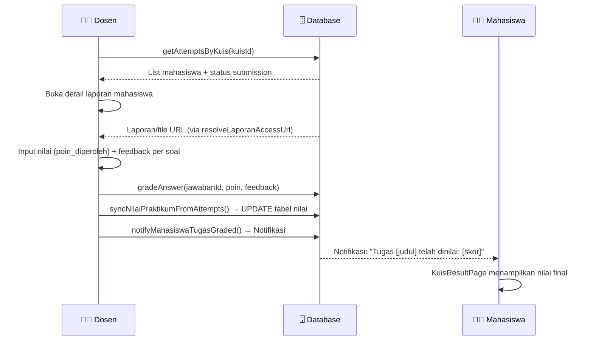
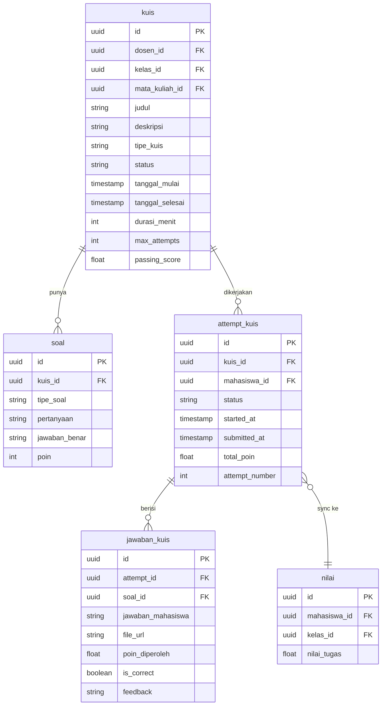

# Analisis Alur Fitur Tugas Praktikum — Dosen ↔ Mahasiswa

> **Catatan Teknis**: Fitur ini menggunakan tabel database `kuis` secara internal, namun seluruh label UI ditampilkan sebagai **"Tugas Praktikum"**.

---

## 🗺️ Peta Alur Keseluruhan (End-to-End)

---

## 📐 Struktur Route

| Route | Role | File | Fungsi |
|---|---|---|---|
| `/dosen/kuis` | Dosen | `dosen/kuis/KuisListPage.tsx` | Daftar semua tugas milik dosen |
| `/dosen/kuis/create` | Dosen | `dosen/kuis/KuisCreatePage.tsx` | Pilih jenis tugas + buat baru |
| `/dosen/kuis/:kuisId/edit` | Dosen | `dosen/kuis/KuisBuilderPage.tsx` (edit mode) | Edit tugas yang ada |
| `/dosen/kuis/:kuisId/results` | Dosen | `dosen/kuis/KuisResultsPage.tsx` | Lihat & nilai submission mahasiswa |
| `/dosen/kuis/:kuisId/attempt/:attemptId` | Dosen | `dosen/kuis/AttemptDetailPage.tsx` | Detail jawaban satu mahasiswa |
| `/mahasiswa/kuis` | Mahasiswa | `mahasiswa/kuis/KuisListPage.tsx` | Daftar tugas yang tersedia |
| `/mahasiswa/kuis/:kuisId/attempt` | Mahasiswa | `mahasiswa/kuis/KuisAttemptPage.tsx` | Mengerjakan / submit tugas |
| `/mahasiswa/kuis/:kuisId/result/:attemptId` | Mahasiswa | `mahasiswa/kuis/KuisResultPage.tsx` | Lihat hasil setelah submit |

---

## 🔄 Sinkronisasi Alur Dosen ↔ Mahasiswa

### Fase 1 — Dosen Membuat Tugas

### Fase 2 — Mahasiswa Mengerjakan Tugas

### Fase 3 — Dosen Menilai Laporan

---

## 🧩 Dua Jenis Tugas & Perbedaan Alurnya

| Aspek | 📄 Laporan (Essay/File Upload) | 🖥️ Tes CBT (Pilihan Ganda) |
|---|---|---|
| **Dibuat** | `tipe_kuis = 'essay'` / soal tipe `file_upload` | Soal tipe `pilihan_ganda` |
| **Durasi** | `durasi_menit = null/0` (tanpa timer) | Ada durasi timer |
| **Mahasiswa Submit** | Upload PDF/Word atau isian essay | Jawab soal pilihan ganda |
| **Penilaian** | **Manual** oleh Dosen | **Otomatis** (auto-grade) |
| **Notifikasi** | Dikirim setelah dosen grade | Tidak ada (langsung lihat) |
| **Status Laporan** | Dosen lihat badge: "Belum Upload / Sudah Upload / Sudah Dinilai" | Dosen lihat badge: "Belum Selesai / Lulus / Tidak Lulus" |
| **Sinkronisasi Nilai** | `syncNilaiPraktikumFromAttempts()` saat grade disimpan | Sync otomatis saat auto-grade |

---

## ⚠️ Gap / Ketidaksinkronan yang Terdeteksi

> [!WARNING]
> Beberapa potensi ketidaksinkronan ditemukan antara alur dosen dan mahasiswa.

### 1. Status Mahasiswa vs Kondisi di Dosen

| Kondisi Dosen | Dampak ke Mahasiswa |
|---|---|
| Dosen hapus tugas saat mahasiswa sedang mengerjakan | Mahasiswa mungkin mendapat error 404 saat submit |
| Dosen ubah tanggal selesai ke belakang (diperpanjang) | Mahasiswa yang sudah `completed` tidak bisa mengulang (max_attempts) |
| Dosen belum menilai laporan | Mahasiswa di halaman result melihat "Menunggu Penilaian" tanpa estimasi waktu |

### 2. `KuisBuilderPage` vs `KuisCreatePage` — Duplikasi

> [!NOTE]
> Ada **dua file berbeda** dengan fungsi serupa:
> - `KuisCreatePage.tsx` — digunakan untuk buat baru (dengan pilih jenis laporan/CBT terlebih dulu)
> - `KuisBuilderPage.tsx` — digunakan untuk edit (langsung ke `QuizBuilder`)
>
> Keduanya menggunakan `QuizBuilder` component yang sama. `KuisCreatePage` memiliki step pilih tipe yang tidak ada di `KuisBuilderPage`.

### 3. Status Filter Berbeda antara Dosen dan Mahasiswa

| Status di Dosen (`KuisListPage`) | Status di Mahasiswa (`KuisListPage`) |
|---|---|
| `draft` | - (tidak terlihat oleh mahasiswa) |
| `active` (= published) | `upcoming` / `ongoing` / `completed` / `missed` |
| `ended` (= archived) | `missed` |

> [!IMPORTANT]
> **Status "ended" vs "missed"**: Di dosen, tugas yang diarsipkan tampil sebagai "Diarsipkan". Di mahasiswa, tugas yang sudah melewati deadline tetapi belum dikerjakan tampil sebagai "Terlewat". Keduanya berbeda konsep — bisa membingungkan jika dosen mengarsipkan tugas yang masih ada mahasiswa yang belum selesai.

### 4. `can_attempt` vs Realtime Refresh

> [!NOTE]
> Mahasiswa: `KuisListPage` menggunakan `getUpcomingQuizzes()` yang mengembalikan field `can_attempt`. Field ini dikontrol server-side. Namun jika dosen meng-unpublish tugas di tengah jalan, mahasiswa perlu refresh manual agar status terupdate (walaupun ada realtime subscription via Supabase).

### 5. Notifikasi Hanya untuk Laporan

Notifikasi (`notifyMahasiswaTugasGraded`) hanya dipanggil saat dosen menyimpan nilai laporan. Untuk tugas CBT, tidak ada notifikasi ke mahasiswa bahwa nilainya sudah otomatis dinilai.

---

## 🗄️ Tabel Database yang Terlibat

---

## ✅ Ringkasan Sinkronisasi yang Sudah Berjalan dengan Baik

| Mekanisme | Keterangan |
|---|---|
| **Realtime Supabase** | `KuisListPage` (dosen & mahasiswa) subscribe ke perubahan tabel `kuis` |
| **Cache invalidation** | Setelah create/update/delete, cache di-invalidate + event `kuis:changed` ditrigger |
| **Offline support** | Mahasiswa bisa akses daftar tugas & kerjakan soal offline (dengan `cacheAPI` + `staleWhileRevalidate`) |
| **syncNilaiPraktikum** | Nilai otomatis sync ke tabel `nilai` setelah dosen menyimpan penilaian laporan |
| **Notifikasi** | Mahasiswa diberitahu via notifikasi ketika laporan selesai dinilai |
