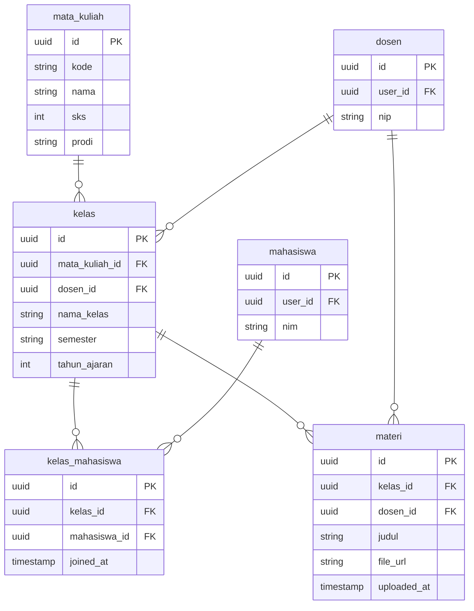

# ERD Domain Akademik: Kelas dan Materi

```mermaid
erDiagram
    mata_kuliah {
        uuid id PK
        string kode
        string nama
        int sks
        string prodi
    }
    kelas {
        uuid id PK
        uuid mata_kuliah_id FK
        uuid dosen_id FK
        string nama_kelas
        string semester
        int tahun_ajaran
    }
    kelas_mahasiswa {
        uuid id PK
        uuid kelas_id FK
        uuid mahasiswa_id FK
        timestamp joined_at
    }
    materi {
        uuid id PK
        uuid kelas_id FK
        uuid dosen_id FK
        string judul
        string file_url
        timestamp uploaded_at
    }
    dosen {
        uuid id PK
        uuid user_id FK
        string nip
    }
    mahasiswa {
        uuid id PK
        uuid user_id FK
        string nim
    }

    mata_kuliah ||--o{ kelas : ""
    dosen ||--o{ kelas : ""
    kelas ||--o{ kelas_mahasiswa : ""
    mahasiswa ||--o{ kelas_mahasiswa : ""
    kelas ||--o{ materi : ""
    dosen ||--o{ materi : ""
```
