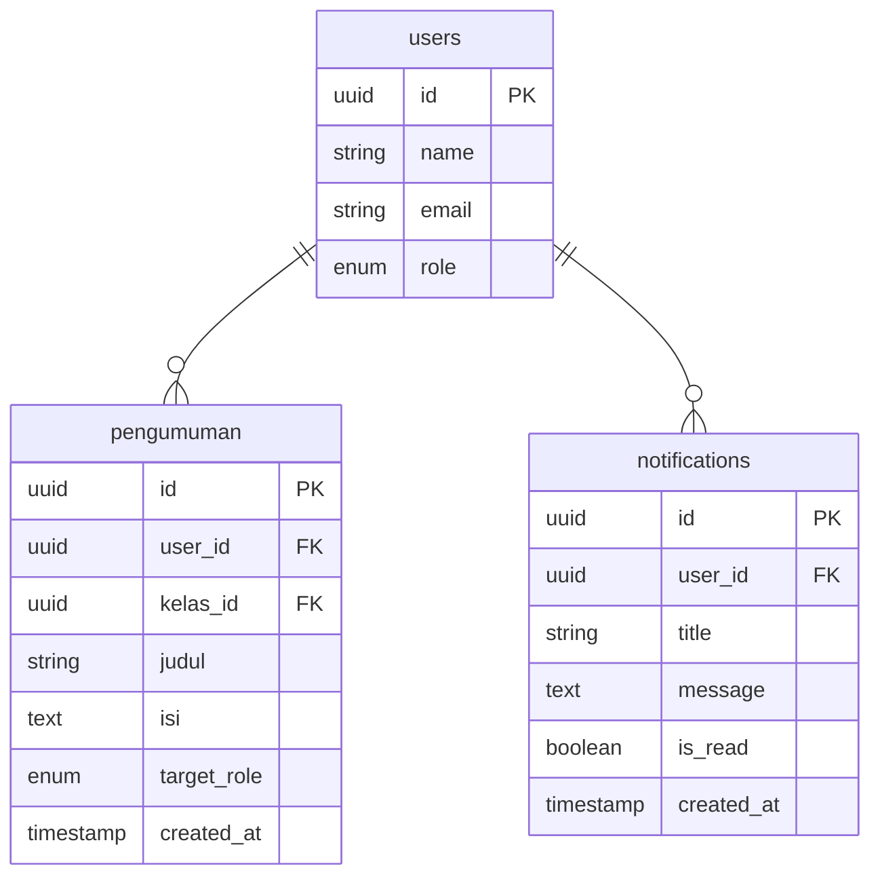

# ERD Domain Komunikasi

```mermaid
erDiagram
    users {
        uuid id PK
        string name
        string email
        enum role
    }
    pengumuman {
        uuid id PK
        uuid user_id FK
        uuid kelas_id FK
        string judul
        text isi
        enum target_role
        timestamp created_at
    }
    notifications {
        uuid id PK
        uuid user_id FK
        string title
        text message
        boolean is_read
        timestamp created_at
    }

    users ||--o{ pengumuman : ""
    users ||--o{ notifications : ""
```
