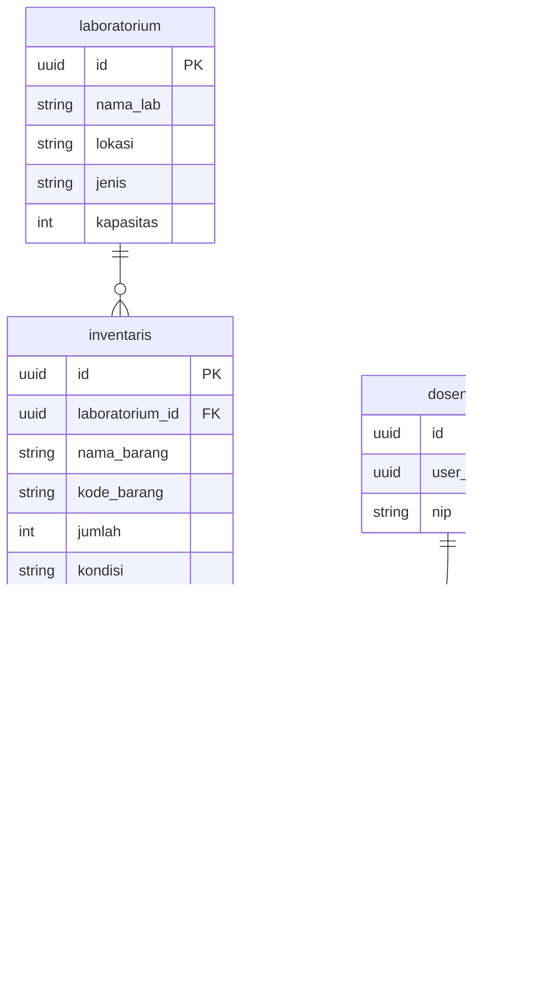

# ERD Domain Laboratorium dan Inventaris

```mermaid
erDiagram
    laboratorium {
        uuid id PK
        string nama_lab
        string lokasi
        string jenis
        int kapasitas
    }
    inventaris {
        uuid id PK
        uuid laboratorium_id FK
        string nama_barang
        string kode_barang
        int jumlah
        string kondisi
    }
    peminjaman {
        uuid id PK
        uuid inventaris_id FK
        uuid dosen_id FK
        date tanggal_pinjam
        date tanggal_kembali
        int jumlah_pinjam
        enum status
    }
    dosen {
        uuid id PK
        uuid user_id FK
        string nip
    }

    laboratorium ||--o{ inventaris : ""
    inventaris ||--o{ peminjaman : ""
    dosen ||--o{ peminjaman : ""
```
