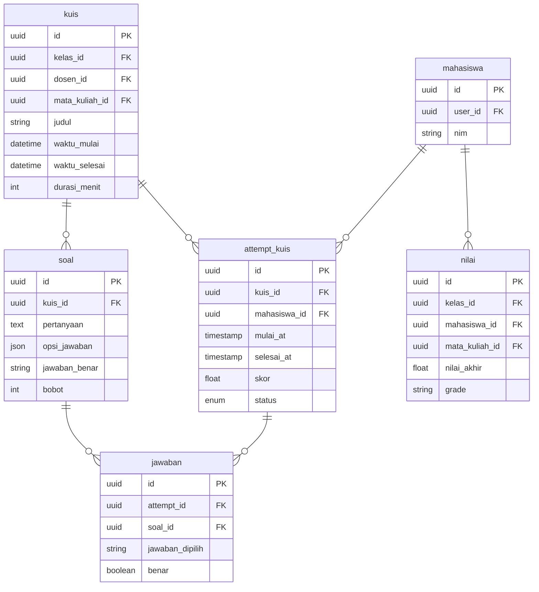

# ERD Domain Penilaian: Kuis dan Nilai

```mermaid
erDiagram
    kuis {
        uuid id PK
        uuid kelas_id FK
        uuid dosen_id FK
        uuid mata_kuliah_id FK
        string judul
        datetime waktu_mulai
        datetime waktu_selesai
        int durasi_menit
    }
    soal {
        uuid id PK
        uuid kuis_id FK
        text pertanyaan
        json opsi_jawaban
        string jawaban_benar
        int bobot
    }
    attempt_kuis {
        uuid id PK
        uuid kuis_id FK
        uuid mahasiswa_id FK
        timestamp mulai_at
        timestamp selesai_at
        float skor
        enum status
    }
    jawaban {
        uuid id PK
        uuid attempt_id FK
        uuid soal_id FK
        string jawaban_dipilih
        boolean benar
    }
    nilai {
        uuid id PK
        uuid kelas_id FK
        uuid mahasiswa_id FK
        uuid mata_kuliah_id FK
        float nilai_akhir
        string grade
    }
    mahasiswa {
        uuid id PK
        uuid user_id FK
        string nim
    }

    kuis ||--o{ soal : ""
    kuis ||--o{ attempt_kuis : ""
    mahasiswa ||--o{ attempt_kuis : ""
    attempt_kuis ||--o{ jawaban : ""
    soal ||--o{ jawaban : ""
    mahasiswa ||--o{ nilai : ""
```
