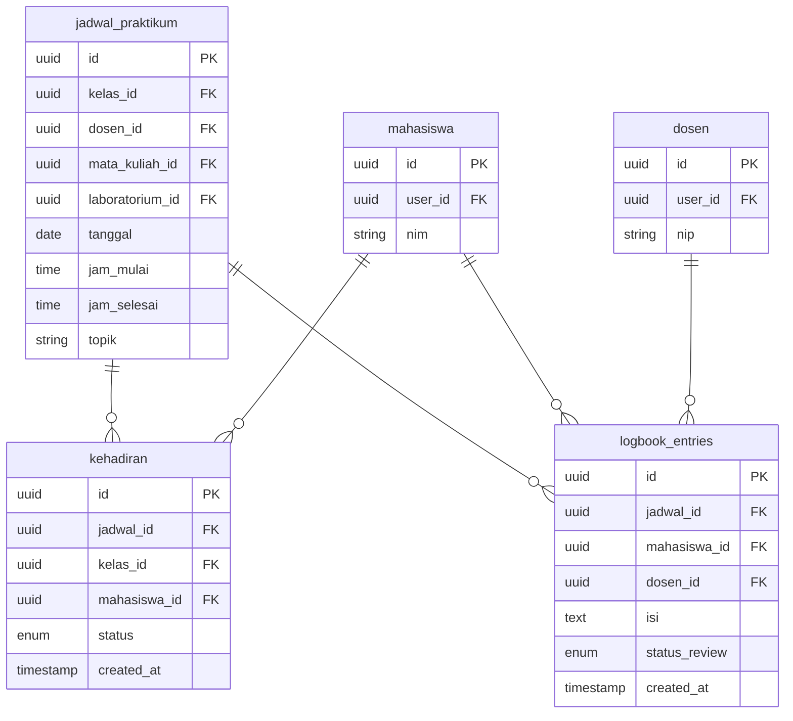

# ERD Domain Praktikum: Jadwal, Kehadiran, dan Logbook

```mermaid
erDiagram
    jadwal_praktikum {
        uuid id PK
        uuid kelas_id FK
        uuid dosen_id FK
        uuid mata_kuliah_id FK
        uuid laboratorium_id FK
        date tanggal
        time jam_mulai
        time jam_selesai
        string topik
    }
    kehadiran {
        uuid id PK
        uuid jadwal_id FK
        uuid kelas_id FK
        uuid mahasiswa_id FK
        enum status
        timestamp created_at
    }
    logbook_entries {
        uuid id PK
        uuid jadwal_id FK
        uuid mahasiswa_id FK
        uuid dosen_id FK
        text isi
        enum status_review
        timestamp created_at
    }
    mahasiswa {
        uuid id PK
        uuid user_id FK
        string nim
    }
    dosen {
        uuid id PK
        uuid user_id FK
        string nip
    }

    jadwal_praktikum ||--o{ kehadiran : ""
    mahasiswa ||--o{ kehadiran : ""
    jadwal_praktikum ||--o{ logbook_entries : ""
    mahasiswa ||--o{ logbook_entries : ""
    dosen ||--o{ logbook_entries : ""
```
