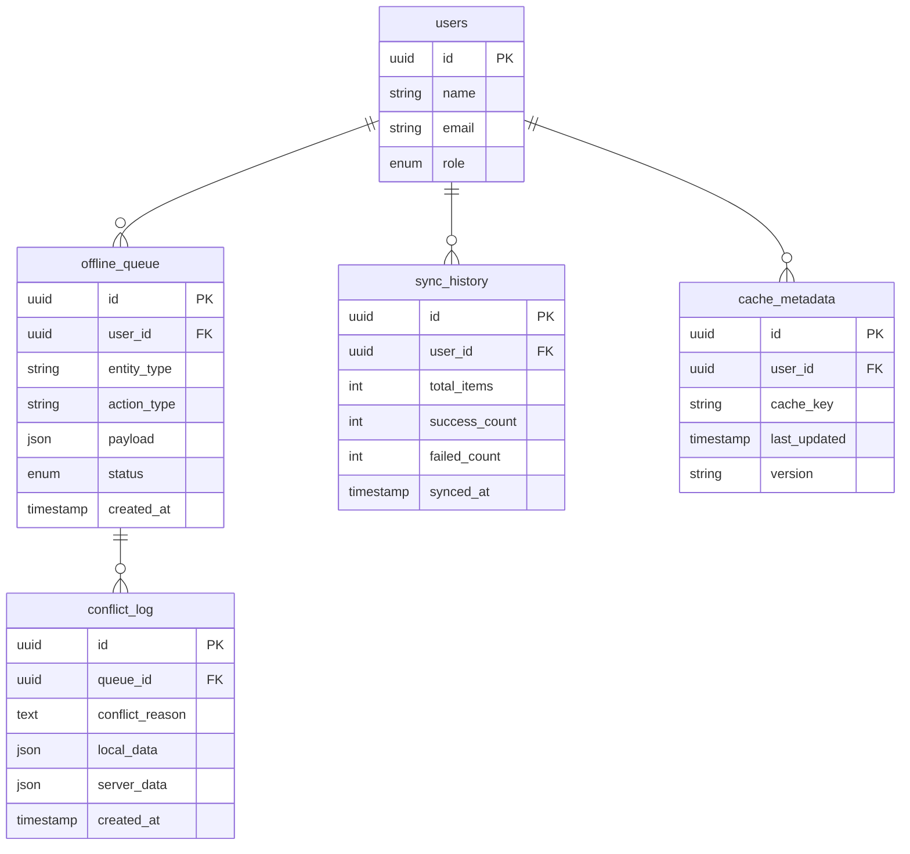

# ERD Domain Sinkronisasi Offline

```mermaid
erDiagram
    users {
        uuid id PK
        string name
        string email
        enum role
    }
    offline_queue {
        uuid id PK
        uuid user_id FK
        string entity_type
        string action_type
        json payload
        enum status
        timestamp created_at
    }
    sync_history {
        uuid id PK
        uuid user_id FK
        int total_items
        int success_count
        int failed_count
        timestamp synced_at
    }
    conflict_log {
        uuid id PK
        uuid queue_id FK
        text conflict_reason
        json local_data
        json server_data
        timestamp created_at
    }
    cache_metadata {
        uuid id PK
        uuid user_id FK
        string cache_key
        timestamp last_updated
        string version
    }

    users ||--o{ offline_queue : ""
    users ||--o{ sync_history : ""
    users ||--o{ cache_metadata : ""
    offline_queue ||--o{ conflict_log : ""
```
