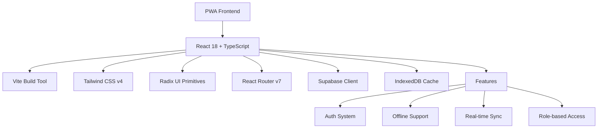

# Analisis Desain UI/UX - Sistem Praktikum PWA

## 📋 Ringkasan Eksekutif

Dokumen ini berisi analisis komprehensif terhadap desain UI/UX aplikasi Sistem Praktikum PWA, termasuk evaluasi tech stack, color scheme, komponen UI, dan rekomendasi perbaikan untuk meningkatkan pengalaman pengguna.

---

## 🏗️ 1. Analisis Struktur Aplikasi & Tech Stack

### 1.1 Arsitektur Aplikasi



### 1.2 Tech Stack Detail

| Kategori | Teknologi | Versi | Fungsi |
|----------|-----------|-------|--------|
| **Framework** | React | 18.3.1 | UI Library |
| **Language** | TypeScript | 5.9.3 | Type Safety |
| **Build Tool** | Vite | 7.1.7 | Fast Development |
| **Styling** | Tailwind CSS | 4.1.14 | Utility-first CSS |
| **UI Components** | Radix UI | Latest | Accessible Primitives |
| **State Management** | React Query | 5.90.8 | Server State |
| **Routing** | React Router | 7.9.4 | Client-side Routing |
| **Backend** | Supabase | 2.74.0 | BaaS Platform |
| **PWA** | Vite PWA Plugin | 1.2.0 | Service Worker |
| **Testing** | Vitest | 3.2.4 | Unit Testing |
| **Icons** | Lucide React | 0.545.0 | Icon Library |
| **Charts** | Recharts | 2.15.0 | Data Visualization |

### 1.3 Struktur Folder

```
src/
├── components/ui/          # Reusable UI components (shadcn/ui style)
├── pages/                  # Page components by role
│   ├── auth/              # Login, Register, Forgot Password
│   ├── admin/             # Admin dashboard & management
│   ├── dosen/             # Lecturer features
│   ├── laboran/           # Lab assistant features
│   └── mahasiswa/         # Student features
├── lib/                   # Utilities, hooks, API clients
├── context/               # React Context providers
├── providers/             # App-level providers
├── config/                # Configuration files
└── __tests__/             # Test suites
```

---

## 🎨 2. Analisis Color Scheme Saat Ini

### 2.1 Warna Dasar (CSS Variables)

| Token | Light Mode | Dark Mode | Keterangan |
|-------|------------|-----------|------------|
| `--background` | `oklch(0.985 0.01 85)` | `oklch(0.19 0.025 258)` | Latar belakang utama |
| `--foreground` | `oklch(0.23 0.03 258)` | `oklch(0.96 0.008 85)` | Teks utama |
| `--primary` | `oklch(0.34 0.17 263)` | `oklch(0.78 0.08 82)` | Warna primer (biru) |
| `--primary-foreground` | `oklch(0.99 0.005 85)` | `oklch(0.22 0.03 258)` | Teks di atas primer |
| `--secondary` | `oklch(0.95 0.025 240)` | `oklch(0.28 0.03 257)` | Warna sekunder |
| `--accent` | `oklch(0.83 0.11 82)` | `oklch(0.4 0.08 82)` | Aksen/emphasis |
| `--destructive` | `oklch(0.6 0.22 24)` | `oklch(0.7 0.18 24)` | Error/danger |
| `--muted` | `oklch(0.965 0.014 85)` | `oklch(0.28 0.02 257)` | Background muted |
| `--border` | `oklch(0.9 0.015 255)` | `oklch(1 0 0 / 12%)` | Border color |
| `--ring` | `oklch(0.56 0.12 263)` | `oklch(0.75 0.09 82)` | Focus ring |

### 2.2 Warna Chart/Data Visualization

```css
--chart-1: oklch(0.34 0.17 263);  /* Primary Blue */
--chart-2: oklch(0.72 0.13 167);  /* Teal/Green */
--chart-3: oklch(0.83 0.11 82);   /* Amber/Gold */
--chart-4: oklch(0.62 0.2 16);    /* Orange */
--chart-5: oklch(0.54 0.16 305);  /* Purple */
```

### 2.3 Brand Colors (Custom)

```css
/* Brand Gradient */
.brand-gradient {
  background-image: linear-gradient(135deg, #1c367a 0%, #3154b4 55%, #c6a05a 100%);
}

/* Background Pattern */
body {
  background-image: 
    radial-gradient(circle at 10% 12%, rgba(28, 54, 122, 0.08), transparent 30%),
    radial-gradient(circle at 88% 10%, rgba(198, 160, 90, 0.1), transparent 24%),
    radial-gradient(circle at 50% 92%, rgba(219, 39, 119, 0.05), transparent 28%),
    linear-gradient(180deg, rgba(255, 251, 245, 0.95), rgba(244, 247, 251, 1));
}
```

### 2.4 Evaluasi Color Scheme Saat Ini

#### ✅ Kelebihan:
1. **Menggunakan OKLCH** - Warna lebih perceptually uniform
2. **Kontras yang baik** - Memenuhi standar aksesibilitas WCAG
3. **Dukungan dark mode** - Tersedia variabel untuk kedua tema
4. **Konsistensi** - Sistem variabel CSS yang terstruktur

#### ⚠️ Area Perbaikan:
1. **Warna terlalu konvensional** - Biru standar, kurga identitas unik
2. **Aksen emas kurang dimanfaatkan** - Hanya di gradient, tidak di komponen
3. **Warna status tidak konsisten** - Success/warning belum terdefinisi dengan baik
4. **Kurangnya warna semantik** - Tidak ada warna khusus untuk info, warning states

---

## 🧩 3. Analisis Komponen UI

### 3.1 Komponen Tersedia (shadcn/ui style)

| Komponen | File | Status | Keterangan |
|----------|------|--------|------------|
| Button | `button.tsx` | ✅ Complete | 6 variant, 4 size |
| Card | `card.tsx` | ✅ Complete | Card, Header, Title, Content, Footer |
| Badge | `badge.tsx` | ✅ Complete | 6 variant (default, secondary, destructive, success, warning, outline) |
| Alert | `alert.tsx` | ✅ Complete | Alert dengan description |
| Alert Dialog | `alert-dialog.tsx` | ✅ Complete | Konfirmasi modal |
| Avatar | `avatar.tsx` | ✅ Complete | Image, Fallback |
| Calendar | `calendar.tsx` | ✅ Complete | Date picker |
| Checkbox | `checkbox.tsx` | ✅ Complete | Checked state |
| Command | `command.tsx` | ✅ Complete | Command palette |
| Dialog | `dialog.tsx` | ✅ Complete | Modal dialog |
| Dropdown Menu | `dropdown-menu.tsx` | ✅ Complete | Context menu |
| Form | `form.tsx` | ✅ Complete | Form dengan validation |
| Input | `input.tsx` | ✅ Complete | Text input |
| Label | `label.tsx` | ✅ Complete | Form label |
| Popover | `popover.tsx` | ✅ Complete | Floating content |
| Progress | `progress.tsx` | ✅ Complete | Progress bar |
| Radio Group | `radio-group.tsx` | ✅ Complete | Radio buttons |
| Scroll Area | `scroll-area.tsx` | ✅ Complete | Custom scrollbar |
| Select | `select.tsx` | ✅ Complete | Dropdown select |
| Separator | `separator.tsx` | ✅ Complete | Divider |
| Skeleton | `skeleton.tsx` | ✅ Complete | Loading placeholder |
| Sonner | `sonner.tsx` | ✅ Complete | Toast notifications |
| Spinner | `spinner.tsx` | ✅ Complete | Loading indicator |
| Switch | `switch.tsx` | ✅ Complete | Toggle switch |
| Table | `table.tsx` | ✅ Complete | Data table |
| Tabs | `tabs.tsx` | ✅ Complete | Tab navigation |
| Textarea | `textarea.tsx` | ✅ Complete | Multi-line input |
| Tooltip | `tooltip.tsx` | ✅ Complete | Hover tooltip |

### 3.2 Pola Desain yang Teridentifikasi

#### Layout Pattern:
- **Container**: `max-width: 1280px`, padding responsive
- **Card-based**: Komponen utama dibungkus Card
- **Glassmorphism**: `backdrop-blur`, transparansi pada beberapa elemen
- **Gradient backgrounds**: Radial gradients untuk depth

#### Spacing Pattern:
- **Base unit**: 0.25rem (4px)
- **Card padding**: 1.5rem (24px)
- **Section gap**: 1.5rem - 2rem
- **Border radius**: 0.9rem (14.4px) - cukup rounded

#### Typography Pattern:
- **Font**: System font stack (Inter/sans-serif)
- **Heading**: `font-semibold`, tracking normal
- **Body**: `text-sm` (14px) untuk komponen UI
- **Muted**: `text-muted-foreground` untuk teks sekunder

---

## 🎯 4. Rekomendasi Tema Warna yang Lebih Menarik

### 4.1 Tema Rekomendasi: "Academic Modern"

Konsep: Menggabungkan profesionalisme akademik dengan sentuhan modern yang segar.

```css
/* Primary Palette - Deep Academic Blue */
--primary-50: #eff6ff;
--primary-100: #dbeafe;
--primary-200: #bfdbfe;
--primary-300: #93c5fd;
--primary-400: #60a5fa;
--primary-500: #3b82f6;  /* Main primary */
--primary-600: #2563eb;
--primary-700: #1d4ed8;
--primary-800: #1e40af;
--primary-900: #1e3a8a;
--primary-950: #172554;

/* Secondary Palette - Warm Gold */
--secondary-50: #fffbeb;
--secondary-100: #fef3c7;
--secondary-200: #fde68a;
--secondary-300: #fcd34d;
--secondary-400: #fbbf24;
--secondary-500: #f59e0b;  /* Main secondary */
--secondary-600: #d97706;
--secondary-700: #b45309;
--secondary-800: #92400e;
--secondary-900: #78350f;
--secondary-950: #451a03;

/* Accent Palette - Teal */
--accent-50: #f0fdfa;
--accent-100: #ccfbf1;
--accent-200: #99f6e4;
--accent-300: #5eead4;
--accent-400: #2dd4bf;
--accent-500: #14b8a6;  /* Main accent */
--accent-600: #0d9488;
--accent-700: #0f766e;
--accent-800: #115e59;
--accent-900: #134e4a;
--accent-950: #042f2e;

/* Semantic Colors */
--success-50: #f0fdf4;
--success-500: #22c55e;
--success-600: #16a34a;
--success-900: #14532d;

--warning-50: #fffbeb;
--warning-500: #f59e0b;
--warning-600: #d97706;
--warning-900: #78350f;

--error-50: #fef2f2;
--error-500: #ef4444;
--error-600: #dc2626;
--error-900: #7f1d1d;

--info-50: #eff6ff;
--info-500: #3b82f6;
--info-600: #2563eb;
--info-900: #1e3a8a;
```

### 4.2 Tema Alternatif: "Medical Fresh"

Konsep: Warna-warna yang terinspirasi dari bidang kesehatan/kebidanan dengan nuansa segar.

```css
/* Primary - Medical Teal */
--primary: #0d9488;
--primary-foreground: #ffffff;

/* Secondary - Soft Coral */
--secondary: #fda4af;
--secondary-foreground: #881337;

/* Accent - Mint Green */
--accent: #6ee7b7;
--accent-foreground: #064e3b;

/* Background - Soft Cream */
--background: #fafaf9;
--foreground: #1c1917;

/* Card - Pure White */
--card: #ffffff;
--card-foreground: #1c1917;
```

### 4.3 Implementasi CSS Variables Baru

```css
:root {
  /* Base Colors */
  --radius: 0.75rem;
  
  /* Background & Foreground */
  --background: #fafaf9;
  --foreground: #1c1917;
  
  /* Card & Popover */
  --card: #ffffff;
  --card-foreground: #1c1917;
  --popover: #ffffff;
  --popover-foreground: #1c1917;
  
  /* Primary - Academic Blue */
  --primary: #1e40af;
  --primary-foreground: #ffffff;
  
  /* Secondary - Warm Gold */
  --secondary: #fef3c7;
  --secondary-foreground: #78350f;
  
  /* Muted */
  --muted: #f5f5f4;
  --muted-foreground: #78716c;
  
  /* Accent - Teal */
  --accent: #0d9488;
  --accent-foreground: #ffffff;
  
  /* Destructive */
  --destructive: #dc2626;
  --destructive-foreground: #ffffff;
  
  /* Border & Input */
  --border: #e7e5e4;
  --input: #e7e5e4;
  --ring: #1e40af;
  
  /* Chart Colors */
  --chart-1: #1e40af;  /* Primary Blue */
  --chart-2: #0d9488;  /* Teal */
  --chart-3: #f59e0b;  /* Gold */
  --chart-4: #dc2626;  /* Coral */
  --chart-5: #7c3aed;  /* Purple */
  
  /* Sidebar */
  --sidebar: #f5f5f4;
  --sidebar-foreground: #44403c;
  --sidebar-primary: #1e40af;
  --sidebar-primary-foreground: #ffffff;
  --sidebar-accent: #e7e5e4;
  --sidebar-accent-foreground: #44403c;
  --sidebar-border: #d6d3d1;
  --sidebar-ring: #1e40af;
}

.dark {
  --background: #0c0a09;
  --foreground: #fafaf9;
  
  --card: #1c1917;
  --card-foreground: #fafaf9;
  --popover: #1c1917;
  --popover-foreground: #fafaf9;
  
  --primary: #60a5fa;
  --primary-foreground: #0c0a09;
  
  --secondary: #292524;
  --secondary-foreground: #e7e5e4;
  
  --muted: #292524;
  --muted-foreground: #a8a29e;
  
  --accent: #14b8a6;
  --accent-foreground: #0c0a09;
  
  --destructive: #f87171;
  --destructive-foreground: #0c0a09;
  
  --border: #292524;
  --input: #292524;
  --ring: #60a5fa;
  
  --chart-1: #60a5fa;
  --chart-2: #2dd4bf;
  --chart-3: #fbbf24;
  --chart-4: #f87171;
  --chart-5: #a78bfa;
  
  --sidebar: #0c0a09;
  --sidebar-foreground: #fafaf9;
  --sidebar-primary: #60a5fa;
  --sidebar-primary-foreground: #0c0a09;
  --sidebar-accent: #292524;
  --sidebar-accent-foreground: #fafaf9;
  --sidebar-border: #292524;
  --sidebar-ring: #60a5fa;
}
```

---

## ✨ 5. Rekomendasi Komponen Visual & Animasi

### 5.1 Animasi yang Direkomendasikan

#### A. Micro-interactions

```css
/* Button Hover Effect */
.btn-hover-lift {
  transition: transform 0.2s ease, box-shadow 0.2s ease;
}
.btn-hover-lift:hover {
  transform: translateY(-2px);
  box-shadow: 0 4px 12px rgba(0, 0, 0, 0.15);
}

/* Card Hover Effect */
.card-hover {
  transition: transform 0.3s ease, box-shadow 0.3s ease;
}
.card-hover:hover {
  transform: translateY(-4px);
  box-shadow: 0 12px 24px rgba(0, 0, 0, 0.1);
}

/* Focus Ring Animation */
.focus-ring {
  transition: ring 0.2s ease;
}
.focus-ring:focus {
  ring: 2px solid var(--ring);
  ring-offset: 2px;
}

/* Loading Skeleton Shimmer */
@keyframes shimmer {
  0% { background-position: -200% 0; }
  100% { background-position: 200% 0; }
}
.skeleton-shimmer {
  background: linear-gradient(
    90deg,
    var(--muted) 25%,
    var(--muted-foreground) 50%,
    var(--muted) 75%
  );
  background-size: 200% 100%;
  animation: shimmer 1.5s infinite;
}

/* Pulse Animation for Live Indicators */
@keyframes pulse-ring {
  0% { transform: scale(0.8); opacity: 1; }
  100% { transform: scale(2); opacity: 0; }
}
.live-indicator::before {
  content: '';
  position: absolute;
  width: 100%;
  height: 100%;
  border-radius: 50%;
  background: var(--success-500);
  animation: pulse-ring 1.5s cubic-bezier(0.215, 0.61, 0.355, 1) infinite;
}

/* Stagger Animation for Lists */
@keyframes fadeInUp {
  from {
    opacity: 0;
    transform: translateY(20px);
  }
  to {
    opacity: 1;
    transform: translateY(0);
  }
}
.stagger-item {
  animation: fadeInUp 0.5s ease forwards;
  opacity: 0;
}
.stagger-item:nth-child(1) { animation-delay: 0.1s; }
.stagger-item:nth-child(2) { animation-delay: 0.2s; }
.stagger-item:nth-child(3) { animation-delay: 0.3s; }
.stagger-item:nth-child(4) { animation-delay: 0.4s; }
.stagger-item:nth-child(5) { animation-delay: 0.5s; }
```

#### B. Page Transitions

```css
/* Page Fade In */
@keyframes pageEnter {
  from {
    opacity: 0;
    transform: translateY(10px);
  }
  to {
    opacity: 1;
    transform: translateY(0);
  }
}
.page-transition {
  animation: pageEnter 0.4s ease-out;
}

/* Slide In from Right (for navigation) */
@keyframes slideInRight {
  from {
    transform: translateX(100%);
    opacity: 0;
  }
  to {
    transform: translateX(0);
    opacity: 1;
  }
}
.slide-in-right {
  animation: slideInRight 0.3s ease-out;
}

/* Scale In (for modals) */
@keyframes scaleIn {
  from {
    transform: scale(0.95);
    opacity: 0;
  }
  to {
    transform: scale(1);
    opacity: 1;
  }
}
.modal-enter {
  animation: scaleIn 0.2s ease-out;
}
```

#### C. Background Animations

```css
/* Floating Gradient Orbs */
@keyframes float {
  0%, 100% {
    transform: translate(0, 0) scale(1);
  }
  33% {
    transform: translate(30px, -30px) scale(1.05);
  }
  66% {
    transform: translate(-20px, 20px) scale(0.95);
  }
}
.gradient-orb {
  position: absolute;
  border-radius: 50%;
  filter: blur(80px);
  opacity: 0.5;
  animation: float 20s ease-in-out infinite;
}
.gradient-orb-1 {
  width: 400px;
  height: 400px;
  background: linear-gradient(135deg, var(--primary-300), var(--accent-300));
  top: -100px;
  right: -100px;
  animation-delay: 0s;
}
.gradient-orb-2 {
  width: 300px;
  height: 300px;
  background: linear-gradient(135deg, var(--secondary-300), var(--primary-200));
  bottom: -50px;
  left: -50px;
  animation-delay: -7s;
}
.gradient-orb-3 {
  width: 250px;
  height: 250px;
  background: linear-gradient(135deg, var(--accent-200), var(--secondary-200));
  top: 50%;
  left: 50%;
  animation-delay: -14s;
}
```

### 5.2 Komponen Visual Baru yang Direkomendasikan

#### A. Glass Card Component

```tsx
// components/ui/glass-card.tsx
import * as React from "react";
import { cn } from "@/lib/utils";

interface GlassCardProps extends React.ComponentProps<"div"> {
  intensity?: "low" | "medium" | "high";
  hover?: boolean;
}

const GlassCard = React.forwardRef<HTMLDivElement, GlassCardProps>(
  ({ className, intensity = "medium", hover = true, ...props }, ref) => {
    const intensityStyles = {
      low: "bg-white/40 backdrop-blur-sm",
      medium: "bg-white/60 backdrop-blur-md",
      high: "bg-white/80 backdrop-blur-xl",
    };

    return (
      <div
        ref={ref}
        className={cn(
          "rounded-xl border border-white/20 shadow-lg",
          intensityStyles[intensity],
          hover && "transition-all duration-300 hover:shadow-xl hover:-translate-y-1",
          className
        )}
        {...props}
      />
    );
  }
);
GlassCard.displayName = "GlassCard";

export { GlassCard };
```

#### B. Animated Counter

```tsx
// components/ui/animated-counter.tsx
import { useEffect, useState } from "react";
import { cn } from "@/lib/utils";

interface AnimatedCounterProps {
  value: number;
  duration?: number;
  className?: string;
  prefix?: string;
  suffix?: string;
}

export function AnimatedCounter({
  value,
  duration = 1000,
  className,
  prefix = "",
  suffix = "",
}: AnimatedCounterProps) {
  const [count, setCount] = useState(0);

  useEffect(() => {
    let startTime: number;
    let animationFrame: number;

    const animate = (timestamp: number) => {
      if (!startTime) startTime = timestamp;
      const progress = Math.min((timestamp - startTime) / duration, 1);
      
      // Easing function (ease-out)
      const easeOut = 1 - Math.pow(1 - progress, 3);
      setCount(Math.floor(easeOut * value));

      if (progress < 1) {
        animationFrame = requestAnimationFrame(animate);
      }
    };

    animationFrame = requestAnimationFrame(animate);
    return () => cancelAnimationFrame(animationFrame);
  }, [value, duration]);

  return (
    <span className={cn("tabular-nums", className)}>
      {prefix}{count.toLocaleString()}{suffix}
    </span>
  );
}
```

#### C. Status Badge dengan Animasi

```tsx
// components/ui/status-badge.tsx
import * as React from "react";
import { cn } from "@/lib/utils";
import { Badge } from "./badge";

type StatusType = "online" | "offline" | "busy" | "away" | "success" | "warning" | "error" | "info";

interface StatusBadgeProps extends React.ComponentProps<typeof Badge> {
  status: StatusType;
  pulse?: boolean;
}

const statusConfig: Record<StatusType, { color: string; label: string; pulseColor: string }> = {
  online: { color: "bg-green-500", label: "Online", pulseColor: "bg-green-400" },
  offline: { color: "bg-gray-400", label: "Offline", pulseColor: "bg-gray-300" },
  busy: { color: "bg-red-500", label: "Busy", pulseColor: "bg-red-400" },
  away: { color: "bg-yellow-500", label: "Away", pulseColor: "bg-yellow-400" },
  success: { color: "bg-green-500", label: "Success", pulseColor: "bg-green-400" },
  warning: { color: "bg-yellow-500", label: "Warning", pulseColor: "bg-yellow-400" },
  error: { color: "bg-red-500", label: "Error", pulseColor: "bg-red-400" },
  info: { color: "bg-blue-500", label: "Info", pulseColor: "bg-blue-400" },
};

const StatusBadge = React.forwardRef<HTMLSpanElement, StatusBadgeProps>(
  ({ status, pulse = true, className, children, ...props }, ref) => {
    const config = statusConfig[status];

    return (
      <Badge
        ref={ref}
        variant="outline"
        className={cn(
          "relative pl-6",
          className
        )}
        {...props}
      >
        <span className="absolute left-2 flex h-2 w-2">
          {pulse && (
            <span
              className={cn(
                "animate-ping absolute inline-flex h-full w-full rounded-full opacity-75",
                config.pulseColor
              )}
            />
          )}
          <span
            className={cn(
              "relative inline-flex rounded-full h-2 w-2",
              config.color
            )}
          />
        </span>
        {children || config.label}
      </Badge>
    );
  }
);
StatusBadge.displayName = "StatusBadge";

export { StatusBadge, type StatusType };
```

#### D. Progress Stepper

```tsx
// components/ui/stepper.tsx
import * as React from "react";
import { cn } from "@/lib/utils";
import { Check } from "lucide-react";

interface Step {
  id: string;
  label: string;
  description?: string;
}

interface StepperProps {
  steps: Step[];
  currentStep: number;
  className?: string;
}

export function Stepper({ steps, currentStep, className }: StepperProps) {
  return (
    <div className={cn("w-full", className)}>
      <div className="flex items-center justify-between">
        {steps.map((step, index) => {
          const isCompleted = index < currentStep;
          const isCurrent = index === currentStep;
          const isPending = index > currentStep;

          return (
            <React.Fragment key={step.id}>
              {/* Step Circle */}
              <div className="flex flex-col items-center">
                <div
                  className={cn(
                    "w-10 h-10 rounded-full flex items-center justify-center text-sm font-medium transition-all duration-300",
                    isCompleted && "bg-green-500 text-white",
                    isCurrent && "bg-primary text-primary-foreground ring-4 ring-primary/20",
                    isPending && "bg-muted text-muted-foreground border-2 border-muted"
                  )}
                >
                  {isCompleted ? (
                    <Check className="w-5 h-5" />
                  ) : (
                    index + 1
                  )}
                </div>
                <div className="mt-2 text-center">
                  <p
                    className={cn(
                      "text-sm font-medium",
                      isCompleted && "text-green-600",
                      isCurrent && "text-primary",
                      isPending && "text-muted-foreground"
                    )}
                  >
                    {step.label}
                  </p>
                  {step.description && (
                    <p className="text-xs text-muted-foreground mt-1">
                      {step.description}
                    </p>
                  )}
                </div>
              </div>

              {/* Connector Line */}
              {index < steps.length - 1 && (
                <div
                  className={cn(
                    "flex-1 h-0.5 mx-4 transition-all duration-500",
                    index < currentStep ? "bg-green-500" : "bg-muted"
                  )}
                />
              )}
            </React.Fragment>
          );
        })}
      </div>
    </div>
  );
}
```

---

## 📐 6. Panduan Konsistensi Desain

### 6.1 Design Tokens

#### Spacing Scale

| Token | Value | Usage |
|-------|-------|-------|
| `space-1` | 0.25rem (4px) | Tight spacing, icon gaps |
| `space-2` | 0.5rem (8px) | Small gaps, inline spacing |
| `space-3` | 0.75rem (12px) | Default component padding |
| `space-4` | 1rem (16px) | Card padding, section gaps |
| `space-6` | 1.5rem (24px) | Large card padding |
| `space-8` | 2rem (32px) | Section padding |
| `space-12` | 3rem (48px) | Page padding |

#### Border Radius Scale

| Token | Value | Usage |
|-------|-------|-------|
| `radius-sm` | 0.375rem (6px) | Small buttons, tags |
| `radius-md` | 0.5rem (8px) | Inputs, small cards |
| `radius-lg` | 0.75rem (12px) | Cards, modals |
| `radius-xl` | 1rem (16px) | Large cards, containers |
| `radius-2xl` | 1.5rem (24px) | Feature cards |
| `radius-full` | 9999px | Pills, avatars |

#### Typography Scale

| Token | Size | Line Height | Weight | Usage |
|-------|------|-------------|--------|-------|
| `text-xs` | 0.75rem | 1rem | 400 | Captions, labels |
| `text-sm` | 0.875rem | 1.25rem | 400 | Body text, descriptions |
| `text-base` | 1rem | 1.5rem | 400 | Default body |
| `text-lg` | 1.125rem | 1.75rem | 500 | Lead text |
| `text-xl` | 1.25rem | 1.75rem | 600 | Card titles |
| `text-2xl` | 1.5rem | 2rem | 600 | Section titles |
| `text-3xl` | 1.875rem | 2.25rem | 700 | Page titles |
| `text-4xl` | 2.25rem | 2.5rem | 700 | Hero titles |

#### Shadow Scale

| Token | Value | Usage |
|-------|-------|-------|
| `shadow-sm` | 0 1px 2px rgba(0,0,0,0.05) | Subtle elevation |
| `shadow` | 0 1px 3px rgba(0,0,0,0.1) | Default cards |
| `shadow-md` | 0 4px 6px rgba(0,0,0,0.1) | Elevated cards |
| `shadow-lg` | 0 10px 15px rgba(0,0,0,0.1) | Modals, dropdowns |
| `shadow-xl` | 0 20px 25px rgba(0,0,0,0.15) | Dialogs, popovers |

### 6.2 Komponen Pattern Library

#### Button Patterns

```tsx
// Primary Action
<Button size="lg">Simpan Perubahan</Button>

// Secondary Action
<Button variant="secondary">Batal</Button>

// Destructive Action
<Button variant="destructive">Hapus Data</Button>

// Ghost Action (for subtle actions)
<Button variant="ghost">Lihat Detail</Button>

// Icon Button
<Button size="icon" variant="outline">
  <Pencil className="h-4 w-4" />
</Button>

// Loading State
<Button disabled>
  <Loader2 className="mr-2 h-4 w-4 animate-spin" />
  Memuat...
</Button>
```

#### Card Patterns

```tsx
// Standard Card
<Card>
  <CardHeader>
    <CardTitle>Judul Card</CardTitle>
    <CardDescription>Deskripsi card</CardDescription>
  </CardHeader>
  <CardContent>
    {/* Content */}
  </CardContent>
  <CardFooter className="flex justify-end gap-2">
    <Button variant="ghost">Batal</Button>
    <Button>Simpan</Button>
  </CardFooter>
</Card>

// Stats Card
<Card className="hover:shadow-lg transition-shadow">
  <CardContent className="p-6">
    <div className="flex items-center justify-between">
      <div>
        <p className="text-sm text-muted-foreground">Total Mahasiswa</p>
        <p className="text-3xl font-bold">1,234</p>
      </div>
      <div className="p-3 bg-primary/10 rounded-full">
        <Users className="h-6 w-6 text-primary" />
      </div>
    </div>
  </CardContent>
</Card>
```

#### Form Patterns

```tsx
// Standard Form Field
<div className="space-y-2">
  <Label htmlFor="email">Email</Label>
  <Input
    id="email"
    type="email"
    placeholder="nama@email.com"
  />
  <p className="text-sm text-muted-foreground">
    Masukkan email aktif Anda
  </p>
</div>

// Form with Validation
<FormField
  control={form.control}
  name="nama"
  render={({ field }) => (
    <FormItem>
      <FormLabel>Nama Lengkap</FormLabel>
      <FormControl>
        <Input placeholder="Masukkan nama" {...field} />
      </FormControl>
      <FormDescription>Nama sesuai KTP</FormDescription>
      <FormMessage />
    </FormItem>
  )}
/>
```

### 6.3 Layout Guidelines

#### Page Structure

```tsx
// Standard Page Layout
<div className="min-h-screen bg-background">
  {/* Header/Navigation */}
  <header className="sticky top-0 z-50 border-b bg-background/95 backdrop-blur">
    {/* Navigation content */}
  </header>

  {/* Main Content */}
  <main className="container mx-auto py-6 px-4 sm:px-6 lg:px-8">
    {/* Page content */}
  </main>

  {/* Footer */}
  <footer className="border-t py-6">
    {/* Footer content */}
  </footer>
</div>
```

#### Grid Layouts

```tsx
// Dashboard Grid
<div className="grid gap-4 md:grid-cols-2 lg:grid-cols-4">
  <StatsCard />
  <StatsCard />
  <StatsCard />
  <StatsCard />
</div>

// Content with Sidebar
<div className="grid gap-6 lg:grid-cols-[280px_1fr]">
  <aside className="hidden lg:block">
    {/* Sidebar */}
  </aside>
  <main>
    {/* Main content */}
  </main>
</div>

// Card Grid
<div className="grid gap-4 sm:grid-cols-2 lg:grid-cols-3">
  {items.map((item) => (
    <Card key={item.id}>
      {/* Card content */}
    </Card>
  ))}
</div>
```

### 6.4 Responsive Breakpoints

| Breakpoint | Width | Usage |
|------------|-------|-------|
| `sm` | 640px | Mobile landscape |
| `md` | 768px | Tablet |
| `lg` | 1024px | Desktop |
| `xl` | 1280px | Large desktop |
| `2xl` | 1536px | Extra large |

#### Responsive Patterns

```tsx
// Responsive Typography
<h1 className="text-2xl md:text-3xl lg:text-4xl font-bold">
  Judul Halaman
</h1>

// Responsive Padding
<div className="p-4 md:p-6 lg:p-8">
  {/* Content */}
</div>

// Responsive Grid
<div className="grid grid-cols-1 sm:grid-cols-2 lg:grid-cols-3 xl:grid-cols-4 gap-4">
  {/* Grid items */}
</div>

// Responsive Visibility
<aside className="hidden lg:block">
  {/* Desktop only sidebar */}
</aside>

<Sheet>
  <SheetTrigger className="lg:hidden">
    <Menu className="h-6 w-6" />
  </SheetTrigger>
  {/* Mobile navigation */}
</Sheet>
```

---

## 💻 7. Contoh Implementasi Kode

### 7.1 Custom Theme Provider

```tsx
// providers/theme-provider.tsx
import { ThemeProvider as NextThemesProvider } from "next-themes";
import { type ReactNode } from "react";

interface ThemeProviderProps {
  children: ReactNode;
}

export function ThemeProvider({ children }: ThemeProviderProps) {
  return (
    <NextThemesProvider
      attribute="class"
      defaultTheme="system"
      enableSystem
      disableTransitionOnChange={false}
    >
      {children}
    </NextThemesProvider>
  );
}
```

### 7.2 Enhanced Button dengan Loading State

```tsx
// components/ui/button-enhanced.tsx
import * as React from "react";
import { Slot } from "@radix-ui/react-slot";
import { cva, type VariantProps } from "class-variance-authority";
import { Loader2 } from "lucide-react";
import { cn } from "@/lib/utils";

const buttonVariants = cva(
  "inline-flex items-center justify-center gap-2 whitespace-nowrap rounded-md text-sm font-medium transition-all duration-200 disabled:pointer-events-none disabled:opacity-50 [&_svg]:pointer-events-none [&_svg:not([class*='size-'])]:size-4 shrink-0 [&_svg]:shrink-0 outline-none focus-visible:ring-2 focus-visible:ring-ring focus-visible:ring-offset-2",
  {
    variants: {
      variant: {
        default: "bg-primary text-primary-foreground hover:bg-primary/90 hover:shadow-md hover:-translate-y-0.5",
        destructive: "bg-destructive text-white hover:bg-destructive/90",
        outline: "border border-input bg-background hover:bg-accent hover:text-accent-foreground",
        secondary: "bg-secondary text-secondary-foreground hover:bg-secondary/80",
        ghost: "hover:bg-accent hover:text-accent-foreground",
        link: "text-primary underline-offset-4 hover:underline",
        gradient: "bg-gradient-to-r from-primary to-accent text-white hover:opacity-90 hover:shadow-lg hover:-translate-y-0.5",
      },
      size: {
        default: "h-10 px-4 py-2",
        sm: "h-9 rounded-md px-3",
        lg: "h-11 rounded-md px-8",
        icon: "h-10 w-10",
      },
    },
    defaultVariants: {
      variant: "default",
      size: "default",
    },
  }
);

export interface ButtonProps
  extends React.ButtonHTMLAttributes<HTMLButtonElement>,
    VariantProps<typeof buttonVariants> {
  asChild?: boolean;
  loading?: boolean;
  loadingText?: string;
}

const ButtonEnhanced = React.forwardRef<HTMLButtonElement, ButtonProps>(
  ({ className, variant, size, asChild = false, loading, loadingText, children, disabled, ...props }, ref) => {
    const Comp = asChild ? Slot : "button";
    const isDisabled = disabled || loading;

    return (
      <Comp
        className={cn(buttonVariants({ variant, size, className }))}
        ref={ref}
        disabled={isDisabled}
        {...props}
      >
        {loading && (
          <Loader2 className="mr-2 h-4 w-4 animate-spin" />
        )}
        {loading && loadingText ? loadingText : children}
      </Comp>
    );
  }
);
ButtonEnhanced.displayName = "ButtonEnhanced";

export { ButtonEnhanced, buttonVariants };
```

### 7.3 Dashboard Card dengan Animasi

```tsx
// components/dashboard/dashboard-card.tsx
import * as React from "react";
import { Card, CardContent } from "@/components/ui/card";
import { AnimatedCounter } from "@/components/ui/animated-counter";
import { cn } from "@/lib/utils";
import { LucideIcon } from "lucide-react";

interface DashboardCardProps {
  title: string;
  value: number;
  icon: LucideIcon;
  trend?: {
    value: number;
    isPositive: boolean;
  };
  color?: "blue" | "green" | "amber" | "purple" | "red";
  className?: string;
}

const colorStyles = {
  blue: { bg: "bg-blue-500/10", text: "text-blue-600", icon: "text-blue-500" },
  green: { bg: "bg-green-500/10", text: "text-green-600", icon: "text-green-500" },
  amber: { bg: "bg-amber-500/10", text: "text-amber-600", icon: "text-amber-500" },
  purple: { bg: "bg-purple-500/10", text: "text-purple-600", icon: "text-purple-500" },
  red: { bg: "bg-red-500/10", text: "text-red-600", icon: "text-red-500" },
};

export function DashboardCard({
  title,
  value,
  icon: Icon,
  trend,
  color = "blue",
  className,
}: DashboardCardProps) {
  const styles = colorStyles[color];

  return (
    <Card
      className={cn(
        "group overflow-hidden transition-all duration-300 hover:shadow-lg hover:-translate-y-1",
        className
      )}
    >
      <CardContent className="p-6">
        <div className="flex items-center justify-between">
          <div className="space-y-2">
            <p className="text-sm font-medium text-muted-foreground">
              {title}
            </p>
            <div className="flex items-baseline gap-2">
              <AnimatedCounter
                value={value}
                className="text-3xl font-bold tracking-tight"
              />
              {trend && (
                <span
                  className={cn(
                    "text-xs font-medium",
                    trend.isPositive ? "text-green-600" : "text-red-600"
                  )}
                >
                  {trend.isPositive ? "+" : ""}{trend.value}%
                </span>
              )}
            </div>
          </div>
          <div
            className={cn(
              "p-3 rounded-xl transition-transform duration-300 group-hover:scale-110",
              styles.bg
            )}
          >
            <Icon className={cn("h-6 w-6", styles.icon)} />
          </div>
        </div>
      </CardContent>
    </Card>
  );
}
```

### 7.4 Toast Notification System

```tsx
// lib/toast-config.ts
import { toast } from "sonner";

export const toastConfig = {
  success: (message: string, description?: string) => {
    toast.success(message, {
      description,
      duration: 4000,
      icon: "✅",
    });
  },
  error: (message: string, description?: string) => {
    toast.error(message, {
      description,
      duration: 5000,
      icon: "❌",
    });
  },
  warning: (message: string, description?: string) => {
    toast.warning(message, {
      description,
      duration: 4000,
      icon: "⚠️",
    });
  },
  info: (message: string, description?: string) => {
    toast.info(message, {
      description,
      duration: 4000,
      icon: "ℹ️",
    });
  },
  loading: (message: string) => {
    return toast.loading(message, {
      duration: Infinity,
    });
  },
  promise: <T>(
    promise: Promise<T>,
    messages: {
      loading: string;
      success: string;
      error: string;
    }
  ) => {
    return toast.promise(promise, {
      loading: messages.loading,
      success: messages.success,
      error: messages.error,
    });
  },
};

// Usage example:
// toastConfig.success("Data berhasil disimpan", "Perubahan telah tersimpan");
// toastConfig.error("Gagal menyimpan data", "Silakan coba lagi");
```

### 7.5 Loading Skeleton untuk Dashboard

```tsx
// components/ui/dashboard-skeleton.tsx
import { Card, CardContent, CardHeader } from "@/components/ui/card";
import { Skeleton } from "@/components/ui/skeleton";

export function DashboardSkeleton() {
  return (
    <div className="space-y-6">
      {/* Stats Row */}
      <div className="grid gap-4 md:grid-cols-2 lg:grid-cols-4">
        {Array.from({ length: 4 }).map((_, i) => (
          <Card key={i}>
            <CardContent className="p-6">
              <div className="flex items-center justify-between">
                <div className="space-y-2">
                  <Skeleton className="h-4 w-24" />
                  <Skeleton className="h-8 w-16" />
                </div>
                <Skeleton className="h-12 w-12 rounded-xl" />
              </div>
            </CardContent>
          </Card>
        ))}
      </div>

      {/* Charts Row */}
      <div className="grid gap-4 md:grid-cols-2 lg:grid-cols-7">
        <Card className="lg:col-span-4">
          <CardHeader>
            <Skeleton className="h-6 w-32" />
            <Skeleton className="h-4 w-48" />
          </CardHeader>
          <CardContent>
            <Skeleton className="h-75 w-full" />
          </CardContent>
        </Card>
        <Card className="lg:col-span-3">
          <CardHeader>
            <Skeleton className="h-6 w-32" />
            <Skeleton className="h-4 w-48" />
          </CardHeader>
          <CardContent className="space-y-4">
            {Array.from({ length: 5 }).map((_, i) => (
              <div key={i} className="flex items-center gap-4">
                <Skeleton className="h-10 w-10 rounded-full" />
                <div className="flex-1 space-y-2">
                  <Skeleton className="h-4 w-full" />
                  <Skeleton className="h-3 w-2/3" />
                </div>
              </div>
            ))}
          </CardContent>
        </Card>
      </div>
    </div>
  );
}
```

### 7.6 Custom Hook untuk Animasi

```tsx
// lib/hooks/use-animation.ts
import { useEffect, useRef, useState } from "react";

interface UseIntersectionAnimationOptions {
  threshold?: number;
  rootMargin?: string;
  triggerOnce?: boolean;
}

export function useIntersectionAnimation({
  threshold = 0.1,
  rootMargin = "0px",
  triggerOnce = true,
}: UseIntersectionAnimationOptions = {}) {
  const ref = useRef<HTMLDivElement>(null);
  const [isVisible, setIsVisible] = useState(false);

  useEffect(() => {
    const element = ref.current;
    if (!element) return;

    const observer = new IntersectionObserver(
      ([entry]) => {
        if (entry.isIntersecting) {
          setIsVisible(true);
          if (triggerOnce) {
            observer.unobserve(element);
          }
        } else if (!triggerOnce) {
          setIsVisible(false);
        }
      },
      { threshold, rootMargin }
    );

    observer.observe(element);

    return () => {
      observer.disconnect();
    };
  }, [threshold, rootMargin, triggerOnce]);

  return { ref, isVisible };
}

// Hook for staggered children animation
export function useStaggerAnimation(itemCount: number, baseDelay: number = 100) {
  const [visibleItems, setVisibleItems] = useState<Set<number>>(new Set());

  useEffect(() => {
    const timeouts: NodeJS.Timeout[] = [];

    for (let i = 0; i < itemCount; i++) {
      const timeout = setTimeout(() => {
        setVisibleItems((prev) => new Set([...prev, i]));
      }, i * baseDelay);
      timeouts.push(timeout);
    }

    return () => {
      timeouts.forEach(clearTimeout);
    };
  }, [itemCount, baseDelay]);

  return { visibleItems };
}

// Usage example:
// const { ref, isVisible } = useIntersectionAnimation();
// <div ref={ref} className={cn("transition-all duration-500", isVisible ? "opacity-100 translate-y-0" : "opacity-0 translate-y-4")}>
```

---

## 🎯 Kesimpulan & Rekomendasi Prioritas

### Prioritas Tinggi (Implementasi Segera)

1. **Update Color Scheme**
   - Implementasi tema "Academic Modern" yang lebih fresh
   - Tambahkan warna semantik yang lebih jelas (success, warning, error, info)
   - Pastikan kontras memenuhi WCAG AA

2. **Standardisasi Komponen**
   - Buat komponen `GlassCard` untuk efek modern
   - Implementasi `StatusBadge` dengan animasi pulse
   - Tambahkan `AnimatedCounter` untuk statistik

3. **Loading States**
   - Buat skeleton components untuk semua halaman utama
   - Implementasi shimmer effect yang konsisten
   - Tambahkan loading indicators pada tombol aksi

### Prioritas Menengah (Implementasi Bertahap)

4. **Micro-interactions**
   - Tambahkan hover effects pada cards dan buttons
   - Implementasi focus ring animations
   - Tambahkan stagger animations untuk lists

5. **Page Transitions**
   - Implementasi smooth page transitions
   - Tambahkan loading states antara navigasi
   - Buat transition untuk modal/dialog

6. **Responsive Improvements**
   - Audit semua halaman untuk mobile responsiveness
   - Implementasi mobile-first navigation patterns
   - Optimasi touch targets untuk mobile

### Prioritas Rendah (Nice to Have)

7. **Advanced Animations**
   - Background gradient animations
   - Parallax effects pada hero sections
   - Advanced scroll-triggered animations

8. **Accessibility Enhancements**
   - Implementasi reduced-motion preferences
   - Audit keyboard navigation
   - Tambahkan ARIA labels yang komprehensif

---

## 📚 Referensi

- [Tailwind CSS Documentation](https://tailwindcss.com/docs)
- [Radix UI Primitives](https://www.radix-ui.com/primitives)
- [shadcn/ui Components](https://ui.shadcn.com)
- [WCAG 2.1 Guidelines](https://www.w3.org/WAI/WCAG21/quickref/)
- [OKLCH Color Picker](https://oklch.com)
- [Framer Motion](https://www.framer.com/motion/) - Untuk animasi React

---

*Dokumen ini dibuat untuk analisis dan perencanaan perbaikan UI/UX Sistem Praktikum PWA. Terakhir diperbarui: 7 Maret 2026*
